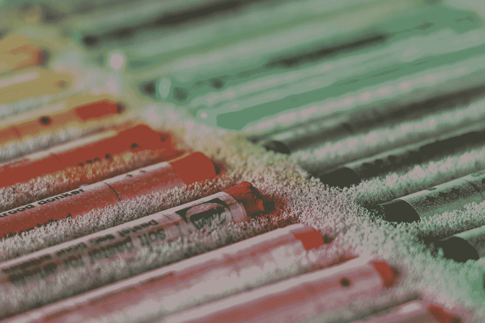

# 十月版:人工智能艺术新时代

> 原文：<https://towardsdatascience.com/october-edition-a-new-age-of-ai-art-1dfb1c823bde>

## [月刊](https://towardsdatascience.com/tagged/monthly-edition)

## 面对强大的新工具，我们对创造力的理解是如何变化的？

由 [Pierre Bamin](https://unsplash.com/@bamin?utm_source=medium&utm_medium=referral) 在 [Unsplash](https://unsplash.com?utm_source=medium&utm_medium=referral) 上拍摄的照片

人工智能生成的图像已经存在了很长时间，但多年来，它们巨大的创造潜力仍然超出了大多数人的能力。进入的门槛很高:你需要获得访问专有模型的邀请和使它们工作的编码技能，以及大量的计算能力。

然后，短短几个月，一切都变了。从今年春天开始，新的发展使这个领域变得更广阔，更容易接近，并且作为一种小众消遣更难忽视或摒弃。基于云的工具降低了成本，而开源模型和文本到图像的界面将每个人都变成了潜在的创作者，每个创作者都变成了潜在的艺术家。

伴随着无处不在和流行而来的是许多新的、紧迫的问题。当一串精心制作的文字可以产生令人惊叹的视觉效果时，艺术家的角色会发生怎样的变化？基于从数十亿数字图像中提取的元素的组合和操作，原创性仍然是艺术的指导原则吗？

还有其他潜在的后果需要考虑。受过专业训练的插画师和设计师的职业前景如何，他们的手艺既贵又费时？每当一个强大的工具被大规模(有时甚至是混乱的)采用时，它可能带来的潜在危害——尤其是对边缘化的人群和社区——又是如何呢？然后，围绕版权和所有权，还有一大堆我们尚未解开的问题:当一幅图像通过人类与人工智能的合作产生时，它到底是谁的创作？

这些问题都需要时间来解决，但开始思考这些问题永远不会太早。为了帮助你学习和探索，我们选择了几篇最近的文章，从不同角度处理人工智能生成的图像。我们希望你喜欢我们下面的选择，并希望它能激发你阅读更多关于这个话题的文章。

对于我们[中会员](https://bit.ly/tds-membership)的读者:感谢你们的支持。

[TDS 编辑器](https://medium.com/u/7e12c71dfa81?source=post_page-----1dfb1c823bde--------------------------------)

## TDS 编辑亮点

*   [**人工智能生成的艺术:如何开始生成自己的图像**](/ai-generated-art-how-to-get-started-with-generating-your-own-images-821bc130fef4)**(2022 年 9 月，9 分钟)
    [**文本到图像生成模型的提示设计初学者指南**](/a-beginners-guide-to-prompt-design-for-text-to-image-generative-models-8242e1361580)**(2022 年 9 月，9 分钟)如果你是一个想要在对人工智能图像生成器提出的更广泛的问题形成看法之前了解它们是如何工作的实践型学习者，这份双它们涵盖了选择模型的基础，讨论了一些重要的后勤细节，并介绍了迅速工程的新兴学科。****
*   ****[**【DALL E 2】解释道:一个革命性 AI 的承诺与局限**](/dall-e-2-explained-the-promise-and-limitations-of-a-revolutionary-ai-3faf691be220)**(2022 年 6 月 23 分钟)
    [**稳定扩散是有史以来最重要的 AI 艺术模式**](/stable-diffusion-is-the-most-important-ai-art-model-ever-9f822c01f88e)**(2022 年 8 月 9 分钟)
    [阿尔韦托·罗梅罗](https://medium.com/u/7ba6be8a3022?source=post_page-----1dfb1c823bde--------------------------------)长期以来一直在报道 AI 艺术节拍，在这些创新激发的敬畏和如果你想退一步了解今年最轰动的两篇文章——DALL E 2 和 Stable Diffusion——把这两篇文章加入你的阅读清单；他们提供了大量的背景和细微差别。********
*   ******[**融合 AI 的力量与诗意的细腻**](/blending-the-power-of-ai-with-the-delicacy-of-poetry-3671f82d2e1)(2022 年 6 月 7 分)
    AI 的创造力当然不仅限于图像；在许多方面，围绕语言模型如 GPT-3 的讨论为我们当前对文本到图像工具的痴迷奠定了基础。Salvatore Raieli 将文字和图像结合在一起，进行了一项有趣的实验:他不再使用偶尔没有灵魂的图像提示语言，而是转向俳句，以测试模特将诗歌转化为绘画作品的能力。******
*   ****[**基于相似性的图像搜索视觉艺术**](/similarity-based-image-search-for-visual-art-750c038283c7)(2022 年 5 月，6 分钟)
    AI 艺术围绕风格和影响力提出了很多问题。Catherine Yeo 探讨了一个相关的话题，这个话题可能在未来围绕原创性和所有权的辩论中至关重要:我们如何确定图像之间的相似程度？也许不出所料，这是一个非常复杂的问题。****

## ******原始功能******

****我们最新精选的问答、播客和阅读推荐。****

*   ****[**合适的技能是让你追求自己兴趣的技能**](/the-right-skill-set-is-the-one-that-allows-you-to-pursue-your-interests-e49d7cfa1cc8) 。都柏林大学计算机科学教授 Barry Smyth 反思了他在学术界和工业界的双重职业生涯，以及年轻数据科学家不断变化的前景。****
*   ****[**ML 传感器的新兴世界**](/the-emerging-world-of-ml-sensors-7b6801a054c5) 。在 TDS 播客上， [Jeremie Harris](https://medium.com/u/59564831d1eb?source=post_page-----1dfb1c823bde--------------------------------) 和 [Matthew Stewart](https://medium.com/u/b89dbc0712c4?source=post_page-----1dfb1c823bde--------------------------------) 讨论了边缘设备感应的新模式。****
*   ****[**旧原则，新方法:实践中的贝叶斯**](/old-principles-new-approaches-bayes-in-practice-f0c3714a68d3) 。这是一份给任何想探索古老贝叶斯统计的实用、前沿应用的人的阅读清单。****

## ****热门帖子****

****如果你错过了它们，这里有一些 9 月份 TDS 上阅读量最大的帖子。****

*   ****[**忘掉算法和模型——先学会如何解决问题**](/forget-about-algorithms-and-models-learn-how-to-solve-problems-first-c791fde5842e) 作者 [Ari Joury，博士](https://medium.com/u/593908e0206?source=post_page-----1dfb1c823bde--------------------------------)****
*   ****[**是的，Python 有内置的数据库。以下是使用方法。**](/yes-python-has-a-built-in-database-heres-how-to-use-it-b3c033f172d3) 作者[弗兰克·安德拉德](https://medium.com/u/fb44e21903f3?source=post_page-----1dfb1c823bde--------------------------------)****
*   ****[**全栈数据科学家现在是趋势:下面是你如何成为一个**](/full-stack-data-scientists-are-trending-right-now-heres-how-you-can-become-one-d5398dff60e7) 作者[麦迪森·亨特](https://medium.com/u/6a8c6841e521?source=post_page-----1dfb1c823bde--------------------------------)****
*   ****[**通过**](/probability-for-machine-learning-b4150953df09) **[Ajay Halthor](https://medium.com/u/b0a3e7e495ca?source=post_page-----1dfb1c823bde--------------------------------) 进行机器学习** 的概率****
*   ****[**使用 Sklearn、Pandas 和 Numpy**](/the-complete-guide-to-time-series-forecasting-using-sklearn-pandas-and-numpy-7694c90e45c1) 进行时间序列预测的完整指南****
*   ****[**D3 blocks:Python 库创建交互式和独立的 D3js 图表**](/d3blocks-the-python-library-to-create-interactive-and-standalone-d3js-charts-3dda98ce97d4) 作者[埃尔多安·塔克森](https://medium.com/u/4e636e2ef813?source=post_page-----1dfb1c823bde--------------------------------)****

****We welcomed a fantastic cohort of new contributors last month — including [Anton Rubert](https://medium.com/u/9dee50b0374b?source=post_page-----1dfb1c823bde--------------------------------), [Meysam](https://medium.com/u/eb4a2e2f734a?source=post_page-----1dfb1c823bde--------------------------------), [Alessandro Paticchio](https://medium.com/u/5b2ea6fc6a71?source=post_page-----1dfb1c823bde--------------------------------), [Daniel Furman](https://medium.com/u/e745b504e837?source=post_page-----1dfb1c823bde--------------------------------), [Francesca Argenziano](https://medium.com/u/7e6208a5c0ac?source=post_page-----1dfb1c823bde--------------------------------), [Gabriel Furnieles](https://medium.com/u/e77c10fd9715?source=post_page-----1dfb1c823bde--------------------------------), [Alex Roberts](https://medium.com/u/abde408ba98d?source=post_page-----1dfb1c823bde--------------------------------), [Thomas Bury](https://medium.com/u/718b461960e5?source=post_page-----1dfb1c823bde--------------------------------), [Yunchao "Lance" Liu (刘运超)](https://medium.com/u/1f97428bc509?source=post_page-----1dfb1c823bde--------------------------------), [Ayoub Omari](https://medium.com/u/bfea420babb9?source=post_page-----1dfb1c823bde--------------------------------), [Patrick Staehli](https://medium.com/u/63e0889147c?source=post_page-----1dfb1c823bde--------------------------------), [Carlos Costa](https://medium.com/u/c1d045b63ee9?source=post_page-----1dfb1c823bde--------------------------------), [Steve Dennis](https://medium.com/u/150c3b7f6784?source=post_page-----1dfb1c823bde--------------------------------), [Mathias Grønne](https://medium.com/u/1379b0fd8db9?source=post_page-----1dfb1c823bde--------------------------------), [Taimur Ijlal](https://medium.com/u/6ce09626f2c0?source=post_page-----1dfb1c823bde--------------------------------), [Kenneth Joel](https://medium.com/u/ef203aa6d638?source=post_page-----1dfb1c823bde--------------------------------), [Tim de Boer](https://medium.com/u/439feeef0483?source=post_page-----1dfb1c823bde--------------------------------), [Thomas Reinecke](https://medium.com/u/286199bbb1eb?source=post_page-----1dfb1c823bde--------------------------------), [Jordan G.](https://medium.com/u/bd72dcfe2a5a?source=post_page-----1dfb1c823bde--------------------------------), [Siddarth Ramesh](https://medium.com/u/cf4e627f4995?source=post_page-----1dfb1c823bde--------------------------------), [Finn-Ole Höner](https://medium.com/u/1b6deec127f3?source=post_page-----1dfb1c823bde--------------------------------), [Morgan Lynch](https://medium.com/u/4b5483121384?source=post_page-----1dfb1c823bde--------------------------------), [M. Rake Linggar A.](https://medium.com/u/6ad2c1beb234?source=post_page-----1dfb1c823bde--------------------------------), [Sanjay Adhikesaven](https://medium.com/u/4d6b4b817b73?source=post_page-----1dfb1c823bde--------------------------------) (with [Abyan Das](https://medium.com/u/fb1577cb212b?source=post_page-----1dfb1c823bde--------------------------------) and [Monish Muralicharan](https://medium.com/u/3ea3355bd7dc?source=post_page-----1dfb1c823bde--------------------------------)), [Paul Kinsvater](https://medium.com/u/8ae6dbd4c80b?source=post_page-----1dfb1c823bde--------------------------------), [Sam Minot](https://medium.com/u/deb42c3b0ce1?source=post_page-----1dfb1c823bde--------------------------------), [Ido Leshem](https://medium.com/u/64b979a03bf7?source=post_page-----1dfb1c823bde--------------------------------), [Dmitrijs Trizna](https://medium.com/u/2fbea2ebee7a?source=post_page-----1dfb1c823bde--------------------------------), [Lucy Dickinson](https://medium.com/u/243c7ff13cc2?source=post_page-----1dfb1c823bde--------------------------------), [Benjamin Marie](https://medium.com/u/ad2a414578b3?source=post_page-----1dfb1c823bde--------------------------------), [Gael Close](https://medium.com/u/dae2a867923e?source=post_page-----1dfb1c823bde--------------------------------), [Claire Longo](https://medium.com/u/1f6936fe85bb?source=post_page-----1dfb1c823bde--------------------------------), [Dimitre Oliveira](https://medium.com/u/c00ad499bcc1?source=post_page-----1dfb1c823bde--------------------------------), [Mohammad Vali](https://medium.com/u/840f2c687344?source=post_page-----1dfb1c823bde--------------------------------), [Marcin Kozak](https://medium.com/u/4762f0cff9b2?source=post_page-----1dfb1c823bde--------------------------------), [James Scott Cardinal](https://medium.com/u/47cc46088f93?source=post_page-----1dfb1c823bde--------------------------------), [Alexandre Allouin](https://medium.com/u/c5380bd2d1fe?source=post_page-----1dfb1c823bde--------------------------------), [Janna](https://medium.com/u/f215f8e427a2?source=post_page-----1dfb1c823bde--------------------------------), [Gabriel Pastorello](https://medium.com/u/d0fbeabd7791?source=post_page-----1dfb1c823bde--------------------------------), and [Marian Nodine](https://medium.com/u/929a3612398a?source=post_page-----1dfb1c823bde--------------------------------), among others. If you’d like to become a TDS author, take the plunge and [share your work with us](http://bit.ly/write-for-tds).****

****下个月见！****