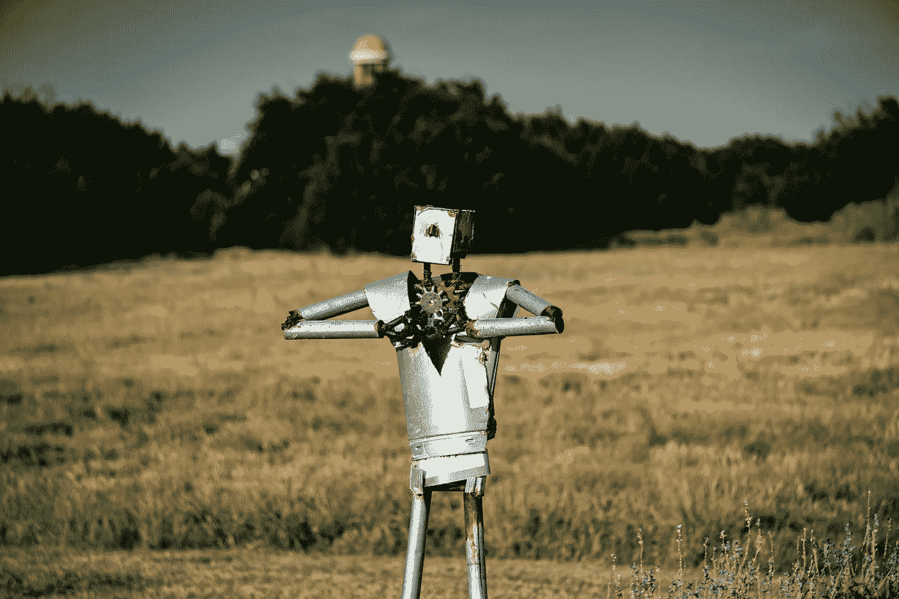
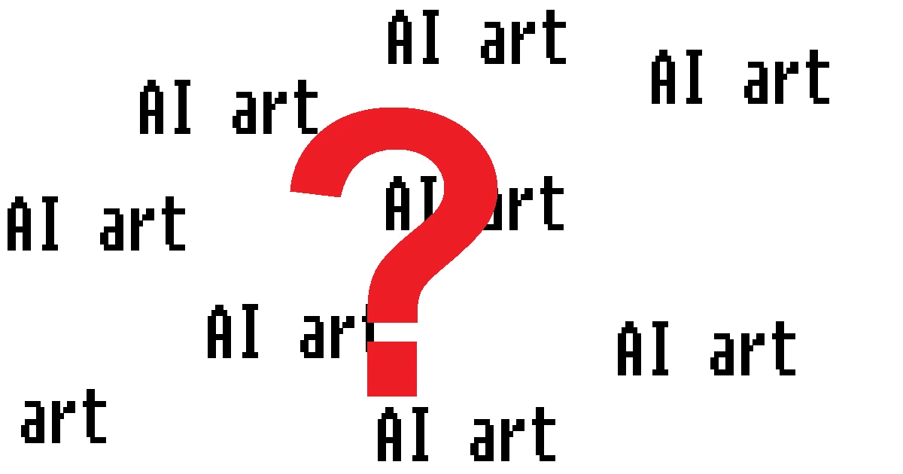

# 论人工智能艺术

> 原文：<https://towardsdatascience.com/on-ai-art-531a4506c518>

## 意见

## AI 是艺术，艺术吗？是的。该不该卖 AI 艺术？大概不会。

迪伦·亨特在 [Unsplash](https://unsplash.com?utm_source=medium&utm_medium=referral) 上的照片

人工智能艺术，即很大一部分由机器学习模型生成的艺术，已经存在多年了。[它的根源可以追溯到](https://mymodernmet.com/ai-art-2022/#When_did_AI_art_begin)，但它真正出现是在 2010 年代深度学习爆炸之后，尤其是在 [DeepDream](https://deepdreamgenerator.com/) 之后。在过去几年中，扩散模型的改进，大型生成模型如 [DALL E](https://openai.com/blog/dall-e/) 和 [StableDiffusion](https://stability.ai/blog/stable-diffusion-v2-release) 的培养，以及[midway](https://www.midjourney.com/)以艺术为中心的商业化，将 AI 艺术推向了前沿。结果是惊人的，但这些新的发展也提出了许多关于这些工具的使用以及它们对艺术家意味着什么的问题。

我将对三个主要问题发表我的看法:

1.  *AI 艺术是艺术吗？*是的。
2.  *AI 艺术是否不道德？*目前，大概。
3.  事情会如何发展？ AI 工具会留下来，美工会采用。

免责声明:当我谈论艺术家时，我指的是工匠，比如插画师、角色设计师、概念艺术家、3D 建模师、UI 设计师、作家等等。此外，我使用术语人工智能相当宽松。

我不是艺术史学家，也没有其他资格。另一方面，我也不是在出售艺术品，也不是在开发生成模型，所以希望我能提供一个稍微中立的视角。我自己的职业与编码有关，我意识到技术离给我自己带来类似的情况只有几步之遥。我认为，在这种情况下，所有适用的要点仍然有效。

# 人工智能艺术就是艺术

人工智能艺术会一直存在。有些人痛苦地声称它不是艺术。我认为这个论点站不住脚。艺术总是扩展它所包含的媒体和技术，并且总是采用新的技术，即使是在艺术界一些人的抵制下。只看生成艺术，数字艺术，或者摄影。这就是艺术的本质。这种流动性和适应性使艺术成为不可定义、不可理解、不断进化的魅力。

过去有数不清的艺术运动，其中也有一些(像达达主义和许多生成艺术)拥抱了随机性和无意的。在某种程度上，人工智能艺术采取了类似的路线，因为艺术家必须对他们的提示进行随机解释。

此外，即使你相信创造艺术是人类独有的特权，也不得不说人工智能艺术并非没有人类的参与:人类提示、提供输入、策划、提炼、重新排列、修饰和“合作”。他们与人工智能合作，就像摄影师与相机和他们周围的世界合作一样。互动的水平因作品和艺术家而异，但可以肯定地说，就像你需要技巧来制作一张精湛的照片一样，你需要技巧来制作一件真正好的人工智能艺术作品。

非艾非艺术形象，由作者提供。

另一个证据是人们在网上多次重复的说法，即生成性人工智能模型让他们表达自己，即使缺乏艺术工艺方面的技能。即使大多数人目前使用人工智能模型的方式只允许有限的控制，但它似乎是细粒度的，交互式的，表达能力足够让人们*表达自己*。并且越来越多的高级工作流必然会发展起来。直觉上，这听起来像是艺术。

你不必相信我的话。世界各地的画廊已经开始展示人工智能艺术(例如纽约的 [*HG 当代*](https://medium.com/abovethefold/the-ai-art-gold-rush-is-here-a3dda143563) ，汉堡的 [*伍兹艺术学院*](https://www.creativebloq.com/news/twitter-ai-art-exhibition) ，新德里的[*Nature Morte*](https://news.artnet.com/art-world/ai-generated-art-gallery-show-1339445)*和[更多](https://delightfuldesignstudio.com/ai-art-exhibition/))。)到目前为止，这些作品可能大多被视为新奇的东西，我不认为它们会在任何可预见的未来取代优秀的艺术家。我们大多数人倾向于只在涉及大量人类创作的作品中寻找意义，至少在概念层面上是如此。*

*我相信对于整个艺术来说，人工智能工具是令人兴奋的。他们开辟了新的途径——尤其是对于那些想要艺术地表达自己，但由于这样或那样的原因而无法花费年复一年的时间来学习一门手艺的人。更重要的是，对于艺术家来说，人工智能工具打开了通向新美学、新风格、新工作流程的大门，毫无疑问，它们将拓宽视觉和其他艺术的范围。*

*总之，我认为人工智能模型是艺术创作者的工具箱中一个有艺术价值的附加物。我认为，对人工智能艺术的艺术价值的攻击忽视了其创作中的人的因素，也许是由一种(合理的)不公正感驱动的。如果你想批评当前的人工智能艺术，我相信还有其他更有效的途径，我将在下一节讨论它们。*

# *人工智能艺术的当前问题*

*对人工智能艺术的批评最尖锐的表现是，人们花费数年，如果不是数十年，来掌握一门手艺，以便在已经紧张的市场中与许多地方的剥削性劳动行为竞争。他们在艺术界辛辛苦苦赢得的地位和谋生的能力现在受到部分依赖于他们自己作品的技术的威胁，这是一个悲剧，不应该掉以轻心，即使随后的辩论自然充满情绪。*

*最明显的问题是版权:目前最好的模型是建立在大量有版权的材料上的，他们可能不应该利用这些材料，尤其是不应该用于商业目的。如果没有这些大量的训练数据，人工智能模型将无法像当前模型那样创造出质量惊人的艺术品。*

*这种做法尤其残忍，因为从人工智能艺术的进步中受害最深的人是那些不情愿地提供了让模型如此强大的艺术的艺术家。*

*将樱桃放在最上面的是，使用最流行的模型，您可以故意模仿训练数据集中一些艺术家的风格。虽然这是一个有趣的学术实践，但在向公众发布具有这种功能的工具之前，征求艺术家的许可似乎是合理的——特别是当需要钱的时候。*

*除了未经请求就在艺术家作品上训练模型的道德问题之外，还有许多其他问题我不会涉及，例如:*

*   *那些模型学到了什么种族主义、性别歧视或其他偏见，如何修正它们？*
*   *不同文化及其风格的表现呢？*
*   *那些大 AI 模型是谁在训练，又是出于什么动机？*
*   *当新的人工智能模型越来越多地根据已经遍布互联网的其前身模型的输出进行训练时，将会发生什么？*

# *人工智能艺术是不可阻挡的*

*人工智能艺术会一直存在。从现在开始，总会有模型使用他们不应该使用的数据——数据就在那里，访问很难监管。在大多数情况下，如果不明显，甚至不可能证明你的艺术被用于培训[。这是我们必须面对的新现实。我相信艺术界已经有了足够的骚动和关注，关于艺术使用的更好的规则和实践将会被制定和执行。然而，合法的事情和已经做的事情并不总是一致的，在国际层面上，在不同的文化中，就相同的法规达成一致也可能并不容易。](https://edition.cnn.com/2022/10/21/tech/artists-ai-images/index.html)*

*我还可以设想一种情景，一旦尘埃落定，大型科技公司将与艺术和图像托管网站达成协议，以获得处理其用户数据的权利。这是我的推测。*

*即使人工智能模型只使用未经许可的图像，更有效的模型，委托艺术家建立合法数据集的努力，以及艺术家愿意免费贡献他们的工作，都将不断增加这些模型的能力。此外，据[稳定扩散](https://stability.ai/) [背后的 CEO 称，不到 0.1%的数据集是 art](https://edition.cnn.com/2022/10/21/tech/artists-ai-images/index.html) 。*

# *人工智能艺术还没有出现*

*当前的模型非常有效，可以产生惊人的结果，但它们远没有非人工智能艺术家所需的灵活性、一致性、质量、可靠性或适应性，特别是如果他们在行业中工作或与客户打交道。*

*不幸的是，人工智能人因高估他们领域的进步速度而出名。在任何有意义的规模上，我们可能离取代艺术家还有一段距离(尤其是一旦版权问题出现)。然而，我们不应该低估人工智能艺术对非人工智能艺术家的影响。例如，如果你在密码驱动的艺术品拍卖网站上寻找，就不难找到人工智能生成的艺术品，这些艺术品可能会与艺术家直接竞争，这些艺术家的作品被用来训练用于创作它们的模型。*

# *艺术家仍然有一席之地*

*这听起来可能像是一种安慰奖，但艺术家仍然会受到欢迎，即使有强大的人工智能模型作为工具。艺术家不应该降低他们创造漂亮作品的能力。概念和构图工作，确保艺术品符合虚拟世界的整体故事或游戏的机制，跨跨学科团队工作，策展，以及手动微调，纠正和精炼人工智能生成的输出仍然需要艺术家的技能。最重要的是，经验仍然是有价值的，这就是为什么资深艺术家、艺术总监或艺术经理可能没有什么可担心的。我相信人-人工智能协作工作流程将在未来几年或几十年内大大推进，允许更多的控制，从而对训练有素的艺术家的技能有更多的需求。能够快速适应和采用的艺术家可能会发现人工智能工具是一个福音而不是一个祸害。*

*然而，人工智能辅助的工作流程永远不会完全取代传统艺术家。正如艺术中任何新媒介或新技术的引入一样，它的前身不会被完全取代。我们甚至有著名的(超)现实主义艺术家，尽管今天每部手机都配有令人惊叹的(人工智能支持的)摄像头。*

*非人工智能艺术家的市场可能会变得更加紧张。虽然，具体在什么时间范围，到什么程度还不清楚。从好的方面来看，也可能会有“反弹效应”:随着艺术家通过使用人工智能工具提高工作效率，委托的工作量也会增加，因为对艺术品的需求存在弹性。随着它们的生产成本越来越低，客户可以增加项目或每个项目的艺术品数量。*

# *含义*

*我目前的收获如下。*

1.  *不要使用人工智能模型*使用受版权保护的数据*用于你出售的艺术或以任何方式用于与非人工智能艺术家竞争(例如，在线竞争注意力)。*
2.  *不要为使用版权数据的模特*付费*。*
3.  *也许这不是暗示，而是一个诚实的问题:给人工智能产生的艺术贴上这样的标签。*
4.  *如果你是一名艺术家，不希望你的作品被包含在未来的数据集中，[请求将你的作品从未来的黑貂扩散模型中排除](https://haveibeentrained.com/)可能是你能做的最好的事情。*

*为了结束这篇文章，我还想提一下，关于人工智能艺术的辩论并不是视觉艺术所独有的。大型语言模型早就被宣布为新的[报纸专栏作家](https://www.forbes.com/sites/martinrand/2022/12/21/exploring-the-potential-and-limitations-of-large-language-models-in-the-corporate-world/?sh=8bcf3adb268b)、[对冲基金](https://www.bnymellon.com/us/en/insights/all-insights/artificial-intelligence-sweeps-hedge-funds.html)已经在大量使用人工智能，甚至程序员也可能成为被人工智能工具取代的[。卡车司机和放射科医生在很大程度上幸免于难，因为我们不放心把生死决定权交给一台机器(这是理所当然的！).](https://github.com/features/copilot)*

*作为一个社会，我们不得不考虑这样一个事实，尤其是基于信息的工作越来越自动化。具有讽刺意味的是，许多体力劳动似乎是最难自动化的，因为机器人技术仍然落后于人工智能的快速进步。*

*感谢您的阅读！我希望你学到了新东西。如果您不同意或有见解想要分享，请参与进来！我愿意改变我的想法和文章。*

*包含相似和不同镜头的一些附加资源:*

*   *[AI 是艺术品盗窃吗？一个技术人员的好视频文章。]](https://www.youtube.com/watch?v=Tbtj0aL1inQ)*
*   *人工智能艺术的根本问题。]*
*   *[AI 艺术是艺术家的终结吗？](https://open.spotify.com/episode/3kXkfsoINutJBQxtzfJhKd?si=ecc19aa971984918)【一个技术人员和一个艺术家非常有见地的播客。]*
*   *人工智能创造“艺术”是一场伦理和版权的噩梦。]*
*   *[2022 年艺术趋势:人工智能艺术如何出现并分化艺术界](https://mymodernmet.com/ai-art-2022/#Why_is_AI_artwork_controversial)【一位艺术家/艺术记者的综合文章。]*