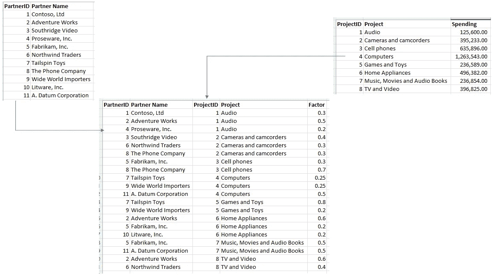
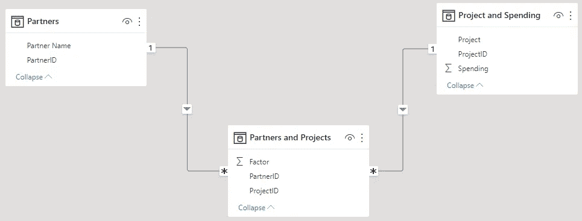
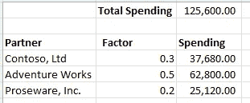
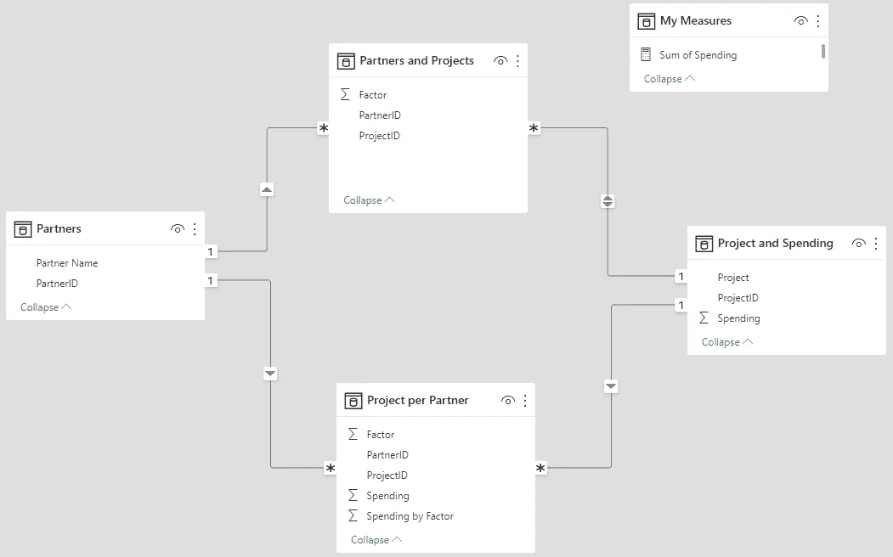
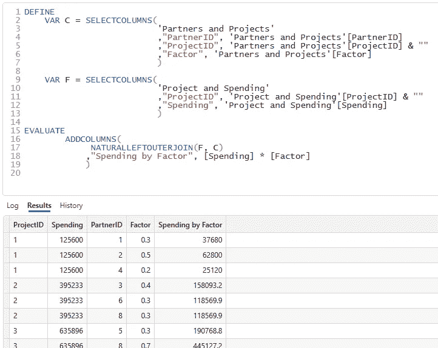

# 关于用 DAX 分布带因子的值

> 原文：<https://towardsdatascience.com/on-distributing-values-with-a-factor-with-dax-d0d81a9dc30a>

## 有几种分配价值的方法。一种方法是使用映射到表中行的因子来相应地分布它们。让我们深入了解如何在 DAX 的 Power BI 中实现这一点。


照片由[罗伯特·林德](https://unsplash.com/ja/@rwlinder?utm_source=medium&utm_medium=referral)在 [Unsplash](https://unsplash.com?utm_source=medium&utm_medium=referral) 上拍摄

# 这个问题

我的一个客户有以下问题:

我有关于商业伙伴项目的数据。我可以让多个合作伙伴参与一个或多个项目。

我如何创建一个 Power BI 报告来查看我的合作伙伴每期的支出金额？

# 数据模型

我创建了一个小型数据集来演示这种情况:



图 1 —样本数据集(作者提供的图片)

Power BI 中的数据模型类似于上图:



图 Power BI 中的数据模型(由作者提供)

项目和支出以及合作伙伴和项目之间的关系必须是双向的，因为我必须双向过滤数据。例如，当我需要按合作伙伴过滤项目时。

# 计划好的结果

让我们看一个项目，看看结果应该是什么:

我们在“音频”项目上有 125，600 英镑的支出。

三个合作伙伴积极参与该项目:

*   康托索有限公司
*   冒险作品
*   Proseware 公司。

当我们将该因子映射到每个合作伙伴的支出时，我们会得到以下结果:



图 3 —示例结果(作者提供的图)

主要目标是查看每个合作伙伴在一个项目上总共花了多少钱。

# 想法和解决方案

首先想到的是创造一种方法。当然，我做到了。

我会考虑我为另一个客户实现的另一个解决方案，我在下面的文章中记录了它:

[](/when-a-count-goes-mad-or-how-to-count-orders-over-time-in-dax-850b55145f3)  

但是我很快意识到这不是一个可行的选择。

我需要一个度量来计算结果，因为我没有任何分组或类别可以用来将我的结果分成多个度量。

我的第一个衡量方法是使用关系来乘以每个合作伙伴在每个项目上的花费。

第一批结果既复杂又相对缓慢。

因此，我改变了我的方法，开始创建一个表格，将每个项目的支出乘以每个合作伙伴的相应系数。

目标表应该如下所示:


图 4 —每个合作伙伴的项目表(由作者提供)

然后，我将能够向数据模型添加关系:



图 5 —完整的数据模型，包括每个合作伙伴的项目表(由作者提供)

有了这个表，我就可以添加一个简单的度量来对“按因素的支出”列求和。

为了创建目标表，我使用了 DAX Studio。

我创建的第一个表是获取每个项目的支出:

```
DEFINE
VAR F =
SELECTCOLUMNS(
    ‘Project and Spending’
    ,”ProjectID”, ‘Project and Spending’[ProjectID] & “”
    ,”Spending”, ‘Project and Spending’[Spending]
    )

EVALUATE
 F
```

查询结果如下所示:


图 6 —查询项目和支出结果(作者提供的数据)

第二个查询是获取每个合作伙伴和项目的工厂:

```
DEFINE
VAR C =
SELECTCOLUMNS(
    ‘Partners and Projects’
    ,”PartnerID”, ‘Partners and Projects’[PartnerID]
    ,”ProjectID”, ‘Partners and Projects’[ProjectID] & “”
    ,”Factor”, ‘Partners and Projects’[Factor]
    )

EVALUATE
 C
```

该查询的结果如下:


图 7 —查询每个合作伙伴和项目的因子和结果(作者提供的图)

最后一步是合并这两个表，并将每个项目的支出乘以每个合作伙伴的系数。

为了实现这一点，我使用了[naturaleftouterjoin()](https://dax.guide/naturalleftouterjoin/)函数。

使用这个函数，第一个表的每一行都通过同名的列与第二个表的每一行匹配。

然后，我使用 [ADDCOLUMNS()](https://dax.guide/addcolumns/) 函数来计算支出乘以每个合作伙伴/项目组合的系数。

以下是完整的查询:

```
DEFINE
 VAR C = SELECTCOLUMNS(
 ‘Partners and Projects’
 ,”PartnerID”, ‘Partners and Projects’[PartnerID]
 ,”ProjectID”, ‘Partners and Projects’[ProjectID] & “”
 ,”Factor”, ‘Partners and Projects’[Factor]
 )

 VAR F = SELECTCOLUMNS(
 ‘Project and Spending’
 ,”ProjectID”, ‘Project and Spending’[ProjectID] & “”
 ,”Spending”, ‘Project and Spending’[Spending]
 )

 EVALUATE
 ADDCOLUMNS(
 NATURALLEFTOUTERJOIN(F, C)
 ,”Spending by Factor”, [Spending] * [Factor]
 )
```

(截断的)结果如下:



图 8 —带有结果的完整查询(作者提供的图)

在对结果进行一些检查之后，我可以将这个查询转换成 Power BI 中目标表的 DAX 表达式:

```
Project per Partner =
VAR F =
SELECTCOLUMNS(
    ‘Project and Spending’
    ,”ProjectID”, ‘Project and Spending’[ProjectID] & “”
    ,”Spending”, ‘Project and Spending’[Spending]
    )VAR C =
SELECTCOLUMNS(
    ‘Partners and Projects’
    ,”PartnerID”, ‘Partners and Projects’[PartnerID]
    ,”ProjectID”, ‘Partners and Projects’[ProjectID] & “”
    ,”Factor”, ‘Partners and Projects’[Factor]
    )RETURN
    ADDCOLUMNS(
        NATURALLEFTOUTERJOIN(F, C)
        ,”Spending by Factor”, [Spending] * [Factor]
        )
```

现在，我可以创建关系，一切都完成了。

最后一项措施很简单:

```
Sum of Spending by Partner = SUM(‘Project per Partner’[Spending by Factor])
```

可以将此测量添加到视觉效果中以显示结果:


图 9 —功率 BI 的结果(由作者提供)

正如您所看到的，合作伙伴正确地分配了支出，总计数字如图 3 所示。

# 添加时间

你可能已经注意到了，我的客户的一个问题是:每期支出。

我的例子直到现在都没有时间轴。

我必须修改我的数据，以获得一个没有 m:n 关系的干净的数据模型。

为此，我创建了一个只包含项目的新表，并使用带有日期的支出列扩展了该表。

当然，我在模型中添加了一个日期表。

产生的数据模型如下所示:


图 10 —带有日期维度的修改后的数据模型(由作者提供)

创建每个合作伙伴的项目表的 DAX 表达式略有不同。

```
Project per Partner =VAR F =
SELECTCOLUMNS(
    **‘Spending’** ,”Date”, **‘Spending’**[Date]
    ,”ProjectID”, **‘Spending’**[ProjectID] & “”
    ,”Spending”, **‘Spending’**[Spending]
    )VAR C =
SELECTCOLUMNS(
    ‘Partners and Projects’
    ,”PartnerID”, ‘Partners and Projects’[PartnerID]
    ,”ProjectID”, ‘Partners and Projects’[ProjectID] & “”
    ,”Factor”, ‘Partners and Projects’[Factor]
    )RETURN
    ADDCOLUMNS(
             NATURALLEFTOUTERJOIN(F, C)
             ,”Spending by Factor”, [Spending] * [Factor]
             )
```

我只需切换到支出表并将日期列添加到表达式中。

可以按月过滤数据以获得所需的结果:


图 11 —带有月切片器的报告(由作者提供)

“合作伙伴支出总额”这一指标不需要任何改变。

此外，数据模型现在更加清晰，因为合作伙伴和项目位于单独的表中，没有其他列。

这种清晰的数据模型对于构建更简单的解决方案至关重要。

# 结论

学习如何在 DAX 中使用表格是重要的一课。它为解决复杂的问题或挑战提供了许多可能性。

使用 [DAX Studio](https://www.sqlbi.com/tools/dax-studio/) 是解决这些挑战的一个重要因素。

我在这里学到的主要经验是不要试图使用以前的解决方案来解决挑战。

体验好。但只是为了学习我能做什么，什么是好什么是坏。

要知道我并没有写“我能做什么，不能做什么”。每一个挑战都提出了独特的问题，需要个性化和创新的解决方案。

有时您可以重用以前的解决方案。而这些都是“比较简单的挑战”。

所有其他的挑战都很有趣。


萨曼莎·索菲亚在 [Unsplash](https://unsplash.com?utm_source=medium&utm_medium=referral) 上的照片

# 参考

该数据来自 Contoso 数据集。

ContosoRetailDW 样本数据集可以从微软[这里](https://www.microsoft.com/en-us/download/details.aspx?id=18279)免费下载。

Contoso 数据可以在 MIT 许可下自由使用，如这里的[所述](https://github.com/microsoft/Power-BI-Embedded-Contoso-Sales-Demo)。

[](https://medium.com/@salvatorecagliari/membership) 