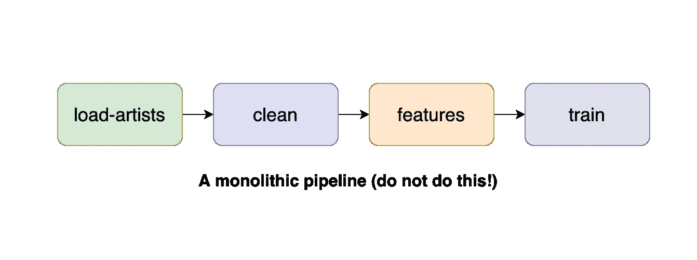
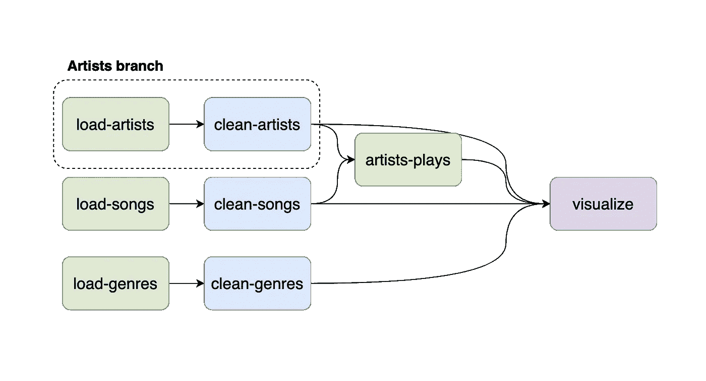

# 关于编写干净的数据管道

> 原文：<https://towardsdatascience.com/on-writing-clean-data-pipelines-f22ee95e13fa>

## 数据科学软件工程

## 组织数据分析逻辑的最佳实践

当帮助我们的[社区](https://ploomber.io/community)的成员做出关于他们的数据管道的架构决策时，一个反复出现的问题是如何将分析逻辑分组到任务中。这篇博文总结了我们给社区成员的关于编写干净的数据管道的建议。我们的目标是防止我们已经看到的反模式，其中管道包含巨大的任务:

整体管道。图片作者。

这些整体管道有许多问题:它们使得协作更加困难，因为大量的逻辑集中在同一任务上。其次，您需要浏览源代码以找到您需要的内容。整体管道也更难测试，因为对每个任务的输出没有任何明确的预期。最后，它们的计算效率很低，因为它们没有充分利用并行化。当实践者构建这种管道时，我们遇到的一个常见原因是，他们使用的框架非常复杂，以至于添加一个新任务需要大量的工作，因此他们将完成工作的任务数量减到最少。如果您遇到这个问题，请切换到另一个允许您快速创建粒度任务的框架( [Ploomber](https://github.com/ploomber/ploomber) 是一个很好的选择)。

在深入细节之前，让我们达成共识，明确定义*数据管道的概念。*

# 什么是数据管道？

数据管道表示应用于一个或多个数据集的计算，其中给定任务的输出成为下一个任务的输入。下面是一个最简单的管道示例:

管道是一组有序的任务。图片作者。

我们的示例管道加载一些数据，然后对其进行清理。请注意，管道也称为工作流。

# 什么是任务？

任务是管道中最小的组件。根据您使用的框架，任务可以有多种形式。比如 Luigi 中，每一个都是一个类中的方法。在 Airflow 中，它是一个操作符的实例。最后，在 [Ploomber](https://github.com/ploomber/ploomber) 中，任务可以是一个函数，一个(Python，R，SQL)脚本，或者一个笔记本。箭头表示数据如何从一个任务移动到另一个任务。但是请记住，不同框架的机制是不同的。在某些情况下，这可以通过文件或内存实现。

# 编写干净的数据管道

管道和任务的概念很简单，但是在将这个想法应用到现实世界的问题时，可能很难决定什么构成了一个任务。以下是我们的三点建议:

1.  ***为每个数据集创建一个管道分支***
2.  ***创建一个数据加载任务，一个清理任务***
3.  ***聚合数据集时，创建新任务***

这三个简单的规则将允许您构建更加健壮和可维护的管道；让我们做一个简单的例子来说明我们的观点。假设您正在处理音乐数据。您可能有一个`artists`表、`songs`表和`genres`表。根据这些建议，我们最终得到了这样一个管道:

遵循我们三项建议的管道。图片作者。

每个表包含一个`load-*`和一个`clean-*`任务，每个部分构成一个流水线分支。请注意，我们所说的*分支*是指您的管道中的一组任务(例如`load-artists`和`clean-artists`是一个分支)，不要与 *git 分支*混淆。一旦我们清理完数据，我们可能会意识到我们需要在艺术家层次上聚集歌曲来获得播放统计数据。因此，我们创建了`artist-plays`任务。最后，我们在`visualize`任务中可视化我们的数据。

遵循上面列出的规则可以让我们为每项任务定义一个清晰的责任。例如，我们知道`load-*`任务是加载数据，仅此而已。一个`clean-*`清理一个给定的数据集，而那个`artist-plays`聚集`artists`和`songs`。此外，假设我们发现给定的数据集对我们的分析是不必要的。我们可以快速地*修剪*我们的流水线，因为我们只需要删除与这样的数据集对应的*分支*。

以这种方式组织管道简化了协作；例如，如果我们的同事想要探索`artists`数据，他们会知道最好的开始方式是`clean-artists`任务，因为它产生干净的`artists`数据。此外，如果任何人想参与数据清理部分，他们将知道根据他们希望清理的数据集修改什么任务。每个任务职责的清晰定义减少了重复工作:模糊的定义导致了分散在任务中的重复逻辑。

最后，每当我们想要聚合两个或更多数据集时，创建一个新任务是必不可少的，这个新任务的唯一目的是生成这个新的聚合数据集。本质上，这个新任务是创建一个*衍生数据集*；因为我们对它很明确，其他人可以用它来构建它。例如，我们可以让`visualize`任务包含数据聚合逻辑，但这将使人们无法知道我们已经有了艺术家级别的歌曲聚合逻辑。

# 编写干净的机器学习管道

如果你正在进行机器学习，我们还有几个建议:

1.  ***每组一个任务***
2.  ***巩固训练集的一个任务***
3.  ***每个实验类型一个分支，每个分支有两个任务:训练和评估***
4.  ***可选，任务选择最佳模式***

在为机器学习模型编写特征时，我们通常可以将它们分组。这种分组是主观的，但它有助于我们组织管道。对要素进行分组的最简单方法是根据其输入数据。例如，如果您使用`clean-artists`数据集作为输入，您可以创建一个生成要素的任务，并将其命名为`features-artists`。但是，如果您可以从相同的输入数据生成许多要素，您可能希望对它们进行更精细的分组。例如，有时，您可能拥有使用相同输入数据的要素。然而，每个特征列可能使用不同的变换来计算(例如，阈值或[仿射变换](https://en.wikipedia.org/wiki/Affine_transformation))。如果您可以根据转换的高级定义对功能进行分组，那么您可以定义一个功能组。

例如，您可能想要聚合艺术家级别的歌曲数据，然后基于*计数*聚合生成特征:艺术家有多少首歌曲，5 分钟内有多少首歌曲，2020 年之前发布了多少首歌曲，等等。这里， *count* 是转换，这样我们可以创建一个包含所有 count 特性的特性组。此外，我们建议在特性组中的所有列前添加前缀；这将允许您在训练模型时完全基于前缀轻松选择(或取消选择)组。

在特征任务之后，创建另一个任务来整合所有特征以生成训练集；然后，并行训练任务将此作为输入。为了找到最佳模型，您可能想要训练其中的许多模型，因此您可以将*训练任务*定义为训练特定模型类型(例如 XGBoost)的任务，并对其他模型(例如 Random Forest)重复相同的逻辑。注意:如果要优化参数*和*做模型选择，使用[嵌套交叉验证](https://ploomber.io/blog/nested-cv/)。

最后，对于每个培训任务，添加一个评估任务，并使用这个评估任务来生成度量和图表，以帮助您详细理解每个模型。最后，您可以添加一个最终任务，该任务将所有候选模型进行比较，并挑选出最佳模型。如果您遵循这些建议，您的管道将如下所示:

一个干净的机器学习管道。图片作者。

提示:保持培训和评估阶段简单的一个好方法是创建*任务模板*。例如，您可能有一个`tasks.py`，它将模型类型作为输入参数，并通过简单地将不同的参数传递给`task.py`文件来重用同一个文件来创建`train-xgboost`、`train-random-forest`、`train-catbost`任务。[这里有一个关于如何用 Ploomber 实现这一点的例子](https://github.com/ploomber/projects/blob/40eaee399fd7ca2755c7b53c0606831c8fdc5a55/cookbook/grid/pipeline.yaml#L26)。最后，如果您让每个`train-*`任务以相同的格式返回它们的输出，您可以重用相同的`evaluate.py`脚本(例如:一个`model.pkl`文件和一个带有交叉验证预测的数据集)。

# 保持管道清洁

实际上，遵循这些规则需要纪律。例如，假设您正在添加艺术家级别的功能(即`features-artists`任务)。您可能会遇到数据不如您预期的那样干净，因此您可能会在`feature-artists`任务中添加一些额外的清理代码；*不要这样做*。相反，转到相应的清理任务(`clean-artists`，在那里添加新的清理代码，然后继续处理`feature artists`中的特征代码。将清理逻辑保存在一个地方还有另一个好处:所有下游任务都将受益于新的清理代码。在我们的案例中，`feature-artists`和`artist-plays`都依赖于`clean-artists`，因此我们通过将清洁逻辑集中在`clean-artists`上，确保所有消费者都能从最干净的版本中受益。

遵守规则使可维护性变得更容易，因为扩展管道变得很容易。您想在艺术家级别计算流派特征吗？抢`clean-artist`和`clean-genres`？你在歌曲数据集中发现问题了吗？打开一个拉取请求来修改`clean-songs`任务。

如果您认为您的用例不符合这些定义， [ping 我们](https://ploomber.io/community)，我们将很乐意帮助您设计一个干净的数据管道。

*最初发表于*[*ploomber . io*](https://ploomber.io/blog/clean-pipelines/)*。*