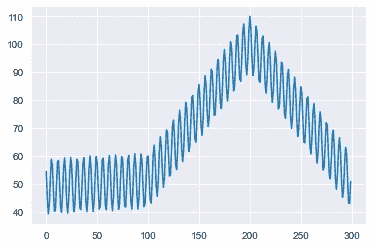
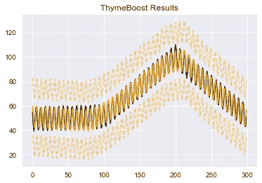
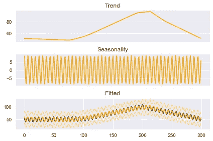
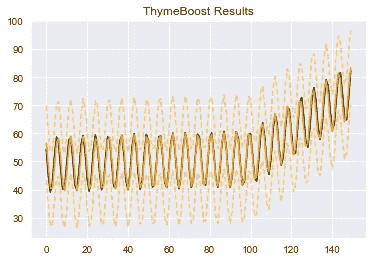
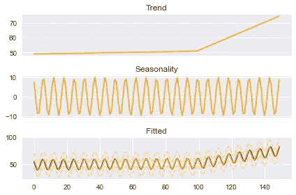
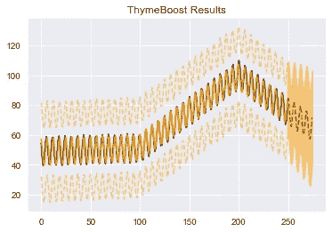
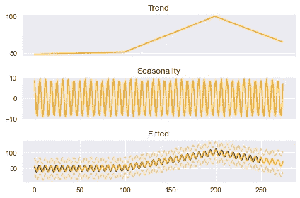

# Python 中基于流数据的时间序列预测

> 原文：<https://towardsdatascience.com/online-time-series-forecasting-in-python-12bada43b8bd>

## 百里香增强剂的例子


[张浩](https://unsplash.com/@haozlife?utm_source=unsplash&utm_medium=referral&utm_content=creditCopyText)在 [Unsplash](https://unsplash.com/s/photos/building-bridges?utm_source=unsplash&utm_medium=referral&utm_content=creditCopyText) 上拍照

在线学习包括用新数据更新参数，而无需重新调整整个过程。对于涉及增强的模型，如百里香增强，从我们停止的地方开始的能力将节省宝贵的计算时间。

对我们来说幸运的是，boosting 过程打开了一条在给定新数据的情况下更新参数的简单路径。这是因为整个系统是为了从残差中学习而构建的。一旦我们有了新的数据，我们只需要预测新的数据，并将这些残差注入到程序中。其余的从那里正常流出！

# 介绍

在本文中，我们将快速浏览一下[百里香增强](https://github.com/tblume1992/ThymeBoost)的新“更新”方法，它允许在线学习在我们接收新数据时更新模型。

对于我们的示例，我们将生成一个简单的序列，其中包含 2 个趋势变化点和一些季节性因素:

```
import numpy as np
import matplotlib.pyplot as plt
import seaborn as sns
import pandas as pd
sns.set_style('darkgrid')seasonality = ((np.cos(np.arange(1, 301))*10 + 50))
np.random.seed(100)
trend = np.linspace(-1, 1, 100)
trend = np.append(trend, np.linspace(1, 50, 100))
trend = np.append(trend, np.linspace(50, 1, 100))
y = trend + seasonality
plt.plot(y)
plt.show()
```



作者图片

有了我们的系列，让我们用百里香按正常方式安装它。如果你以前没有接触过百里香，我推荐你看看这篇文章，它给出了一个很好的概述:

[](/thymeboost-a0529353bf34) [## 用百里香增强进行时间序列预测

### 一种梯度增强的时间序列分解方法

towardsdatascience.com](/thymeboost-a0529353bf34) 

并确保从 pip 获得最新版本！

这样一来，我们就可以安装它了:

```
from ThymeBoost import ThymeBoost as tb
boosted_model = tb.ThymeBoost(verbose=0,
                           n_rounds=None,
                           split_strategy='gradient')
output = boosted_model.fit(y,
                           min_sample_pct=.2,
                           trend_estimator=['linear'],
                           seasonal_estimator='fourier',
                           seasonal_period=25,
                           additive=True,
                           global_cost='mse',
                           fit_type=['local'],
                           )
boosted_model.plot_results(output)
```



作者图片

```
boosted_model.plot_components(output)
```



作者图片

我不会在不同的参数上花太多时间，只要记住`fit_type='local'`意味着我们正在寻找变化点。

总的来说，看起来我们得到了合理的配合。可以通过增加建议拆分的数量来改善结果，但这在视觉上看起来*还好*。

既然我们已经看到了这个系列“完全”适合的样子，让我们试试新的“更新”方法——这是在线学习的一部分。

首先，我们将进行标准拟合，但只有 100 个值:

```
boosted_model = tb.ThymeBoost(verbose=0,
                           split_strategy='gradient')
output = boosted_model.fit(y[:100],
                           min_sample_pct=.2,
                           trend_estimator=['linear'],
                           seasonal_estimator='fourier',
                           seasonal_period=25,
                           additive=True,
                           global_cost='maicc',
                           fit_type=['global', 'local'],
                           )
```

接下来，让我们获取下一批数据来更新模型。出于显而易见的原因，我们将称之为“update_y ”!

```
update_y = y[100:150]
```

最后，让我们用“更新”方法更新模型。它所需要的只是 fit 函数的输出和更新后的序列。注意我是如何覆盖输出变量的。update 方法的输出与 fit 方法相同:

```
output = boosted_model.update(output, update_y)
boosted_model.plot_results(output)
```



作者图片

如上所述，更新方法允许我们使用 fit does 的所有标准方法，如“plot_results”、“plot_components”和“predict”。让我们看看组件:

```
boosted_model.plot_components(output)
```



作者图片

目前的结果看起来不错！我们通常不会得到完全符合的*相同的*结果。这是由于我们在进行变点检测时考虑的分裂，以及其他一些细微差别。**但是**，结果应该是*堪比*。

让我们用接下来的 100 个数据点再次更新模型:

```
update_y = y[150:250]
output = boosted_model.update(output, update_y)
```

最后，我们将用它来预测 25 个步骤:

```
predicted_output = boosted_model.predict(output, 25)
boosted_model.plot_results(output, predicted_output)
```



作者图片

和以前一样绘制组件:

```
boosted_model.plot_components(output, predicted_output)
```



作者图片

我们做到了！从几个更新和合理的展望预测很好的适合。

在你点击离开之前——在改变点的环境中使用它时，需要考虑一些重要的事情…

首先，`min_sample_pct=.2`适用于该系列，因此如果您*要求*模型更加**反应灵敏，然后将该值降低到适当的水平，例如 0.05。**

其次，并不是传递给 fit 方法的所有东西都可以在 update 方法中工作。其中最重要的是乘法拟合和传递外生变量。

最后，实际上我认为这些是唯一的考虑因素。至少，他们是我唯一知道的！但是，如果您遇到任何其他边缘案例或问题，一定要让我知道！

# 结论

在这篇文章中，我们刚刚介绍了使用百里香进行在线学习的基本用例。该功能仍在开发中，因此如果有任何问题，一定要在 [github](https://github.com/tblume1992/ThymeBoost) 上打开一个问题。如前所述，该特性不允许外生变量或乘法拟合，但它们在待办事项列表中！

如有任何问题，欢迎留言！

如果你喜欢这篇文章，你可能会喜欢其他一些关于百里香的文章:

[](/gradient-boosted-arima-for-time-series-forecasting-e093f80772f6) [## 时间序列预测的梯度增强 ARIMA

### 提升 PmdArima 的 Auto-Arima 性能

towardsdatascience.com](/gradient-boosted-arima-for-time-series-forecasting-e093f80772f6) [](/time-series-outlier-detection-with-thymeboost-ec2046e17458) [## 基于 ThymeBoost 的时间序列异常检测

### 用增压缩小极端点的影响

towardsdatascience.com](/time-series-outlier-detection-with-thymeboost-ec2046e17458) 

感谢阅读！