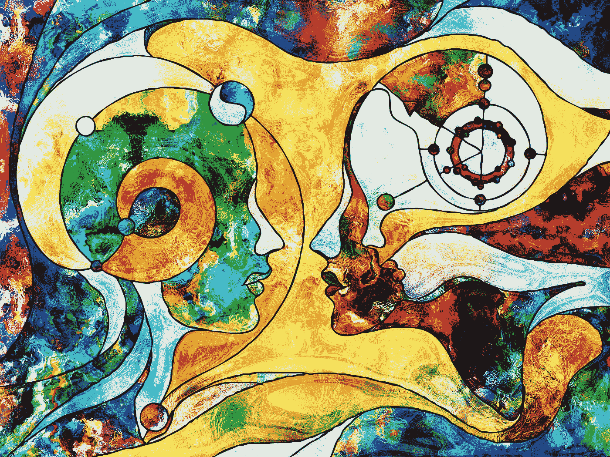

# OpenAI 的首席科学家声称 AI 可能是有意识的——并引发了一场激烈的辩论

> 原文：<https://towardsdatascience.com/openais-chief-scientist-claimed-ai-may-be-conscious-and-kicked-off-a-furious-debate-7338b95194e>

## 意见

## 我们甚至能定义意识吗？

由 Shutterstock 上的 [Agsandrew](https://www.shutterstock.com/es/g/agsandrew) 拍摄的

一个月前，伊利亚·苏茨基弗(Ilya Sutskever)在推特上写道，大型神经网络可能“略有意识”。他是 OpenAI 的联合创始人之一和首席科学家，也是引发深度学习革命的[里程碑式论文](https://proceedings.neurips.cc/paper/2012/file/c399862d3b9d6b76c8436e924a68c45b-Paper.pdf)的合著者。拥有这样的头衔，他当然知道他的大胆主张——既没有证据也没有解释——会吸引人工智能社区、认知科学家和哲学爱好者的注意。几天之内，这条推文得到了 400 多条回复和两倍的转发量。

[伊利亚·苏茨基弗的推特](https://twitter.com/ilyasut/status/1491554478243258368)

人工智能先锋圈子里的人喜欢思考人工智能的未来:我们什么时候才能实现人工通用智能(AGI)？像 GPT-3 这样的基于大型变压器的系统和 AlphaZero 这样的超人强化学习模型的能力和局限性是什么？人工智能何时——如果可能的话——会发展出意识？

对这些话题的看法各不相同。Gary Marcus 等坚定的怀疑论者因批评 AGI 的纯深度学习方法而闻名。他为结合基于数据和基于知识的模型——混合系统——的必要性辩护。在光谱的另一端，我们发现像雷·库兹韦尔这样充满希望的乐观主义者，他声称奇点(机器将不可避免地超越人类智能成为霸权物种的拐点)离我们只有几十年之遥。

在关于人工智能的对话中，意识有时会被提及。虽然在人类的情况下与智力密不可分，但还不清楚机器是否也是如此。那些不喜欢人工智能拟人化的人经常攻击“机器智能”的概念。意识更抽象，通常会更糟。这是正确的，因为意识——和智力一样——是一个模糊的概念，存在于哲学和认知科学的模糊交叉地带。

现代概念的起源可以追溯到约翰·洛克的作品。他将其描述为“对一个人内心想法的感知”然而，事实证明这是一个难以捉摸的概念。关于意识有多种模型和假设，这些年来或多或少引起了人们的兴趣，但科学界尚未达成一致的定义。例如，[泛灵论](https://plato.stanford.edu/entries/panpsychism/)——阅读苏茨基弗的思想时想到的——是一个独特的想法，最近得到了一些关注。它认为“心灵是现实中一个基本的、无处不在的特征。”简而言之，在泛心理学家看来，一切都是潜在的意识。

然而，这只是一个吸引人的假设。意识[仍然停留在模糊的前科学概念领域。大多数人同意它的基本基础:有意识不可避免地通过理解“我”的概念和对我们周围环境的感性认识。但是当我们试图给它下一个精确的定义时，它就变得难以捉摸了。用认知神经科学家安尼尔·塞斯的话说，“意识的主观本质甚至让它难以定义。”](https://en.wikipedia.org/wiki/Consciousness#The_problem_of_definition)

鉴于意识在科学上是未定义的，客观上是不可测量的，我想知道为什么 Sutskever 会做出这样的肯定。

我会走得更远。如果我们不能测量意识，他是对的对我们来说有什么关系吗？问一个人工智能是否有意识让我想起了迫使艾伦·图灵在他 1950 年的开创性论文“[计算机械和智能](https://www.csee.umbc.edu/courses/471/papers/turing.pdf)”中设计模仿游戏的原因——现在普遍称为图灵测试他知道问机器是否会思考是没有意义的，因为这个问题太模糊了，没有意义。(现在人们普遍认为，图灵测试也不足以评估人工智能的智能。)

但是不管 Sutskever 的主张的效用以及就意识的定义达成一致的可能性，这条推文吸引了人工智能和神经科学领域的知名人士。Meta 的首席人工智能科学家 Yann LeCun 给出了肯定的回答“不”

[Yann LeCun 的推文](https://twitter.com/ylecun/status/1492604977260412928)

他相当不具体地认为，神经网络需要一种特殊的架构——可能我们现在还无法构建——来实现某种程度的意识。著名认知心理学家斯塔尼斯拉斯·德阿纳同意勒村的观点。他引用了一篇他与人合著的科学论文，题为“[什么是意识，机器会有意识吗？](https://www.science.org/doi/10.1126/science.aan8871)“结论对他来说很明显，”我们认为答案是否定的:当前深度学习网络实现的计算大多对应于人脑中的无意识操作。”

关注人工智能伦理方面的专家也提到了 Sutskever 的推文。[Santa Fe Institute 的 Davis 教授 Melanie Mitchell](https://twitter.com/MelMitchell1/status/1492966598558294017) 、Washington 大学的语言学教授 Emily M. Bender 和其他人选择了一种嘲讽的语气来提供证据，证明声称 AI 可能有轻微意识而没有进一步的证据支持是多么荒谬。

加州大学伯克利分校的 CS 博士生 Deb Raji 强调了将人工智能视为有意识的存在所带来的问题:

[黛比·拉吉的推文](https://twitter.com/rajiinio/status/1493388989918629890)

其他人，如特斯拉人工智能总监 Andrej Karpathy 和 OpenAI 首席执行官 Sam Altman，似乎支持 Sutskever 的想法。奥特曼利用这种情况，在 LeCun 发起反击，这更像是一场精心策划的营销噱头，旨在雇用从 Meta 的行列中掉队的人工智能研究人员，而不是一场关于有意识人工智能的诚实辩论。

[山姆·奥特曼的推文](https://twitter.com/sama/status/1492644786133626882)

然后，他对自己的观点进行了限定，说“GPT-3 或-4 将非常非常可能不会像我们使用这个词的方式那样有意识……在这个问题上，我唯一可以肯定的是，我有意识。”

处于人工智能研究前沿的人，他们的声音听起来比大多数人都要响亮，如果我们不想让这些空洞——但危险地令人兴奋——的声明渗透到新闻渠道，填满那些不知道更多的人的渴望的头脑，他们应该保持理智的谦卑。OpenAI 的高管应该尽最大努力使他们的流行模型如 GPT-3 更安全，而不仅仅是更强大。他们的最新型号 instruct GPT——Altman 称之为比 GPT-3 更安全的型号——实际上更有毒，更有害，如果用户愿意的话。

作为关于探索人工智能意识的难度的最后一个论点，我认为人工智能最终可能会成为有意识的——如果有的话，最有可能是在遥远的未来——但即使我们就定义达成一致，我们如何证明这是真的还是假的？只要我们能够测量，现实对科学就很重要。超出我们认知能力的真相不是要解决的问题，而是谜团。就目前而言，而且似乎不会很快改变，“我感觉像我”这句话的主观本质使得意识无法用我们所拥有的工具来理解。

我的观点是，我们应该把对人类意识的神经认知和哲学研究与对人工智能的研究分开。我们如何科学地理解作为一个人工智能的感觉？我们应该按照图灵的步骤，不要再问 AI 有没有意识。我们应该定义与意识的模糊概念相关的更具体、可测量的属性——类似于图灵测试与思维机器的概念的关系——并设计工具、测试和技术来测量它们。然后，我们可以检查人工智能在这些方面与人类相比如何，并得出它们在多大程度上展示了这些特征的结论。

我想以积极的方式结束。除了这些天围绕 Sutskever 的不幸观点进行的对话，以及人工智能社区当前面临的问题——从工作场所的歧视到有毒的语言模型——以外，令人兴奋的是，人工智能研究人员与哲学家和神经科学家携手辩论一个需要这三个领域努力才能向前迈进的话题。看到越来越多的人在原本不应该相距如此之远的领域的交汇处找到智力动力，这将是一件大有希望的事情。

如果你已经读到这里，可以考虑订阅我的免费双周刊 [***【明天的思想】***](https://mindsoftomorrow.ck.page/) *！每两周一次关于人工智能和技术的新闻、研究和见解！*

*您也可以直接支持我的工作，使用我的推荐链接* [***这里***](https://albertoromgar.medium.com/membership) *成为中级会员，获得无限权限！:)*