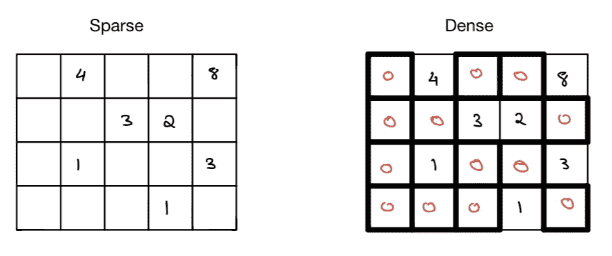

# 使用稀疏矩阵优化 Python 中 SK-Learn 模型的训练和预测

> 原文：<https://towardsdatascience.com/optimize-training-predicting-sk-learn-models-in-python-with-sparse-matrices-1612072a025d>

## 使用稀疏矩阵训练 SK-Learn 模型的速度提高了 40 倍


凯西·霍纳从 [Unsplash](https://unsplash.com/photos/RmoWqDCqN2E) 拍摄的图像

在处理大型数据集和使用 Python 时，一个常见的问题是时间和空间复杂度的效率问题。解决这些问题的常用方法是要么增加计算机的计算能力(这可能很昂贵)，要么在 Spark / PySpark 这样的分布式框架中继续你的管道(这可能很麻烦&建立起来很昂贵)。这类问题在行业环境中经常出现，尤其是在处理需要聚集大量用户数据的问题时，这些问题与聚类/推荐系统有关。将所有这些数据输入到效率低下的模型中可能很难处理，因为计算机很可能会耗尽内存，或者需要很长时间来执行。

我们可以通过优化我们训练和预测 sklearn 模型的方式来解决这个问题。我们传入的不是用于训练和预测的向量，而是稀疏向量。正如您将在下面看到的，这将极大地降低用于模型训练和预测的速度和内存。

**目录**

*   什么是稀疏矩阵？
*   实现
    -需求
    -生成数据
    -训练模型
    -预测模型
*   结束语
*   资源

# 什么是稀疏矩阵？

矩阵有两种形式，稀疏矩阵和密集矩阵。如果矩阵中的大多数元素具有零值，则矩阵是稀疏的，而如果矩阵中的大多数元素具有非零值，则矩阵是密集的。对于稀疏或密集的矩阵，没有严格确定的零值与非零值的比例。



稀疏矩阵更有效，因为 0 值被移除，而密集矩阵保持 0。图片由作者提供

在使用推荐引擎、编码(例如 1-hot 编码)、矢量化等时，您最常看到的是稀疏矩阵。在应用 ML 中使用稀疏矩阵是有益的，因为它在时间和空间复杂度上都更有效。它将减少存储对象所需的内存，同时提高计算效率。稍后您将看到，sci-kit learning 非常擅长使用稀疏矩阵，并将减少在大型模型上进行训练和预测所需内存和速度。

> 当应用于大型稀疏矩阵时，使用标准密集矩阵结构和算法的运算速度慢且效率低，因为处理和内存都浪费在零点上[1]。稀疏数据很容易压缩，并且需要较少的存储空间。一些非常大的稀疏矩阵使用标准的密集矩阵算法是不可行的[1]。
> 引自[维基百科](https://en.wikipedia.org/wiki/Sparse_matrix)


此图显示了稀疏矩阵数据类型是如何存储在 Scipy 中的，它保存了元素的坐标及其相应的非零值。图片由作者提供

矩阵通常存储为二维数组。数组中的每个条目代表一个元素，该元素可以映射到矩阵中的行和列索引，以对应于该元素中的值。一般来说，对于典型的`m x n`矩阵，存储该矩阵的内存量将与矩阵的维数成比例，但是对于稀疏矩阵，由于我们只存储非零值，因此导致内存减少。矩阵中非零条目的频率也会对节省内存和时间产生影响。

# 履行

## 要求

```
Python=3.8.8
pandas=1.2.4
scipy=1.6.2
matplotlib=3.3.4
sklearn=0.24.1
uuid=1.30
```

## 生成数据

我们将首先使用 random 和 pandas 库综合生成一个包含大量零值的数据集。通过使用 pandas 中可用的`pivot_table`函数，我们可以用零替换数据透视表中的所有 nan 值。出于本教程的目的，我们将创建一个具有 50，000 行和 1，001 列的数据帧。最后一列将与一个类别相关联，剩余的 1000 列将是训练分类器来预测该类别所必需的特征。

通过使用 scipy 库，我们可以轻松地将与我们要传递到模型中的特性相关联的值转换为稀疏矩阵。现在我们有了一个矩阵和一个稀疏矩阵，我们可以在这两个矩阵上训练一个模型，看看哪个性能更好。我将在 sci-kit learn 的 SVC 模型上对此进行研究，因为已知支持向量机基于其架构具有高训练和预测延迟。sci-kit learn 的文档在他们的实现中证实了这一点[这里](https://scikit-learn.org/stable/auto_examples/applications/plot_prediction_latency.html)【2】。

## 火车模型

从上面的结果可以看出，当使用稀疏向量代替常规向量时，SVC 的训练速度显著提高。根据时间性能，我们看到性能提高了大约 40 倍，这是相当可观的。这不仅减少了训练模型的运行时间，而且在基于稀疏矩阵的性质和结构的记忆上取得了实质性的改进。

## 预测模型

根据您在上面看到的性能，您可以看到，当在稀疏矩阵中传递时，该模型的预测速度几乎快了 4 倍。这是一个实质性的改进，尤其是考虑到与生产中的模型相关的运行时间和计算成本。这将使实时和批量预测在生产中更容易和有效地实施。

**注**

在观察上面的结果时，有几件事情要记住，首先，即使模型没有在稀疏数据上训练，也可以将稀疏向量发送到预测中，反之亦然。其次，速度和性能在我的电脑上，可能比你的慢，也可能比你的快。总的来说，当用稀疏矩阵而不是密集矩阵训练模型时，性能是显著的。如果你想在你自己的机器上重新运行整个管道，你可以下载我写的 Jupyter 笔记本来生成这些结果[这里](https://github.com/vatsal220/medium_articles/blob/main/efficient_ml/efficient_ml.ipynb)。我注意到的另一件事是，当你试图将稀疏矩阵传入 sklearn 的[朴素贝叶斯](https://scikit-learn.org/stable/modules/naive_bayes.html)模型时，会出现错误，这个模型需要密集矩阵作为输入。

# 结束语

正如您可能已经注意到的，如果您不处理大型稀疏数据集，这个解决方案很可能不会对您的应用程序产生大的影响。当数据集中没有很多零时，将其转换为稀疏矩阵并运行计算不会产生相同的影响(如果有的话)。在这种情况下，我的建议是尝试将您的代码并行化，以便在多个池/线程上运行。这将有助于减少与生成预测和训练相关的时间。

你可以在我的 [GitHub 这里](https://github.com/vatsal220/medium_articles/blob/main/efficient_ml/efficient_ml.ipynb)找到与本文相关的笔记本。

# 资源

*   [1][https://en.wikipedia.org/wiki/Sparse_matrix](https://en.wikipedia.org/wiki/Sparse_matrix)
*   [2][https://sci kit-learn . org/stable/auto _ examples/applications/plot _ prediction _ latency . html](https://scikit-learn.org/stable/auto_examples/applications/plot_prediction_latency.html)

如果你喜欢这篇文章，你可能也会喜欢我下面写的其他文章。

</recommendation-systems-explained-a42fc60591ed>  </bayesian-a-b-testing-explained-344a6df88c1a> [## 贝叶斯 A/B 测试解释

towardsdatascience.com](/bayesian-a-b-testing-explained-344a6df88c1a) </word2vec-explained-49c52b4ccb71>  <https://pub.towardsai.net/dynamic-time-warping-explained-fbb24c1e079b>  </mining-modelling-character-networks-part-i-e37e4878c467>  </random-walks-with-restart-explained-77c3fe216bca> 