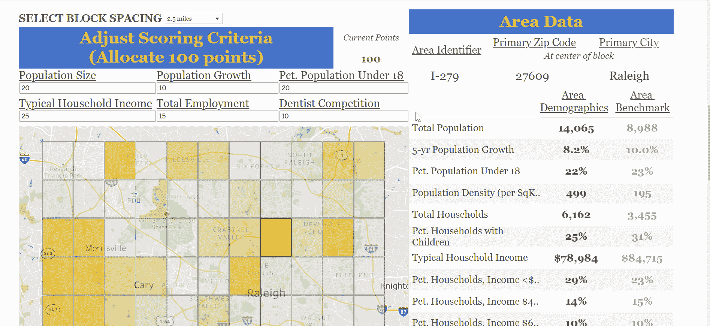
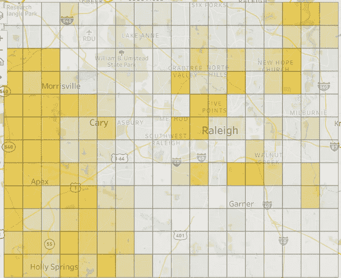
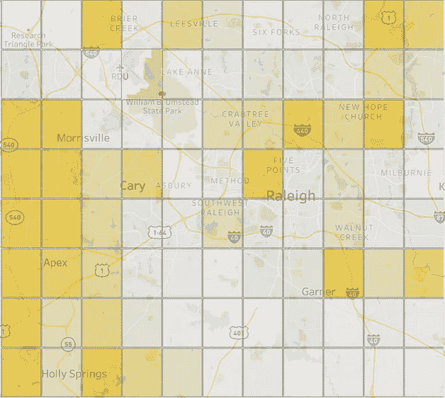

# 在新的增长市场中优化选址决策

> 原文：<https://towardsdatascience.com/optimizing-location-decisions-in-new-growth-markets-bf7b78f4c79>

## 企业在进入新市场时，超越传统地理位置进行选址决策的方法

佩德罗·拉斯特拉在 [Unsplash](https://unsplash.com?utm_source=medium&utm_medium=referral) 上的照片

*所表达的观点是我基于公开信息和工具的个人观点。*

对于处于增长模式的企业来说，缩小选择范围并找出他们下一步应该去的市场可能会非常困难…他们应该进入哪个 MSA、县或城市，是什么让他们对这一选择深信不疑？或者，在当前的市场中，他们应该在哪里加倍投资新的地点或市场？

在你选择了你的市场并需要采取*的下一步，你应该在那个市场的什么地方*定位之后会发生什么？

一种方法是提取市场内各地区的相关人口统计数据并进行比较——每个邮政编码或城市的人口和家庭收入是多少？千禧一代占人口的比例是多少？每个地区的商业活动是什么？

这种方法受益于数据访问和可识别性。这些地理位置的数据很容易获得，数据的可解释性也很明显，因为我们在日常生活中经常引用城市和邮政编码。

但是，对于一些企业来说，这种方法有局限性，因为:

1.  根据很久以前开发的城市或美国邮政编码分配，边界是任意的。
2.  这些边界内的信息*可能变化很大——城镇的一边可能呈现出与另一边截然不同的特征，这可能被更广泛的地理数据所掩盖。*

那么，当企业处于需要不同于预定义地理位置的信息的阶段时，他们会怎么做呢？特别是，对于希望开设物理位置的企业来说，存在的另一个限制是，他们不能只选择完美的位置；他们对可用的商业房地产充满兴趣。

这意味着我们需要在有限的范围内进行概率性思考——根据可用的人口统计数据和竞争数据，我们认为企业最有可能成功的领域在哪里，然后可以将这些数据作为搜索区域传递给商业房地产经纪人？

# 新方法

我们希望找到一种方法来解决这个问题，同时保持普通地理的可识别性和直观性。为了防止任意边界的偏差，我们创建了具有可定制间距选择的一致大小的框，然后将数据来源和属性分配给每个框。之后，我们在一个评分函数中分层，对一个区域内的地理位置进行排名和优先排序。

结果是一个区域网格，该网格在给定所提供的评分标准的情况下识别区域内的热点，此外还可以在每个框被单击时访问提供给该评分算法的数据。下面的区块可以间隔 1.25 英里、2.5 英里、5 英里或 10 英里(或者，实际上，任何距离，这些只是为了举例)。

作者图片

通过在得分下方使用半透明地图，我们仍然可以获得传统地理的可解释性。我们可以识别每个盒子的邻居、街道边界和/或公共地理。

在每张地图中，根据行业，我们可以将竞争数据分层，以确定竞争对手选择的位置，这可以帮助企业决定瞄准或避开该区块内的特定区域。

上面点击的方框中的每个点都是已知的牙医。气泡的大小表示多个牙医在同一地址。

# 用例:开设牙医诊所

考虑一下你打算开一家新的牙医诊所的情况。牙科和一般的医疗保健为位置智能工具提供了引人注目的机会，因为它们通常具有清晰可辨的目标市场和竞争。

面向家庭的儿科牙医将受益于 18 岁以下人口比例高、周围人口规模大、人口不断增长以及中等或低竞争的地区。这些都是我们可以从数据中提取出来的特征，然后调整评分函数以适当地反映这一点。

下面是一个示例，说明除了调整块间距之外，我们如何调整评分标准并让数据工具自动更新。

基于块的框架的一个例子。 [*自己尝试工具*](http://www.jordanbean.com/area-template) 。

然后，如前面的图片所示，对于每个区块，我们可以在被点击的框中及其周围映射竞争。在这种情况下，它将是在被点击的框附近操作的任何牙医(或者，在可能的范围内，具有相似目标市场/专业的牙医)。

我们还可以看到，我们的吸引力分数可能会根据所选区域的大小而有所不同。在下面的图片中，从左到右，盒子的间距分别为 1.25 英里、2.5 英里和 5 英里。每个人对吸引人的地方都有略微不同的解释。

例如，在 5 英里处，西北与*卡里*重叠的区域更有吸引力，但是在 2.5 英里处，我们可以看到吸引力是由重叠城市名称的方框驱动的，而不是它上面的两个方框。

自己尝试一下这个工具，看看如果由你来做决定，你会定位在哪里。

作者提供的图片

# 限制

像任何分析一样，使用这种方法时，我们需要知道一些限制。最突出的两个是:

*   小面积受小样本量的影响
*   在这个粒度级别上可以收集的数据是有限的

当考虑像 1.25 英里选项这样的小区域时，数据可能会有剧烈的波动或异常，需要进一步研究。例如，也许某个地区的大发展使这个小地区的人口增加了两倍，不相称地扭曲了一些指标和得分。因此，虽然我们可以显示这个级别的数据，但由于样本量小，它变得稍微不可靠和有偏差。

在数据限制方面，我们可以收集关于人口及其特征的粒度信息，如年龄或收入。我们还可以绘制兴趣点数据，如客户地址、当前位置或竞争对手位置。

然而，任何只发布到邮政编码级别的数据，如通过劳工统计局发布的一般商业活动和机构，都不能映射到邮政编码级别。大多数可以在邮政编码级别收集的已发布数据都无法翻译到这一详细级别。

尽管存在上述限制，但这种方法在各种业务中都有令人兴奋的应用。如上所述，医疗保健是一个拥有巨大潜力的领域。这也适用于商业房地产经纪人和健身房等消费服务。

许多中小型企业很难访问位置数据，特别是当他们没有分析员工来收集和整理所有信息时。然而，现代数据工具和方法可以使这些信息更容易被企业获取和操作，从而做出下一步发展的关键增长决策。

*有兴趣讨论位置分析吗？* [*在 LinkedIn 上联系我*](http://www.linkedin.com/in/jordanbean) *或在 jordan@jordanbean.com 给我发邮件。*