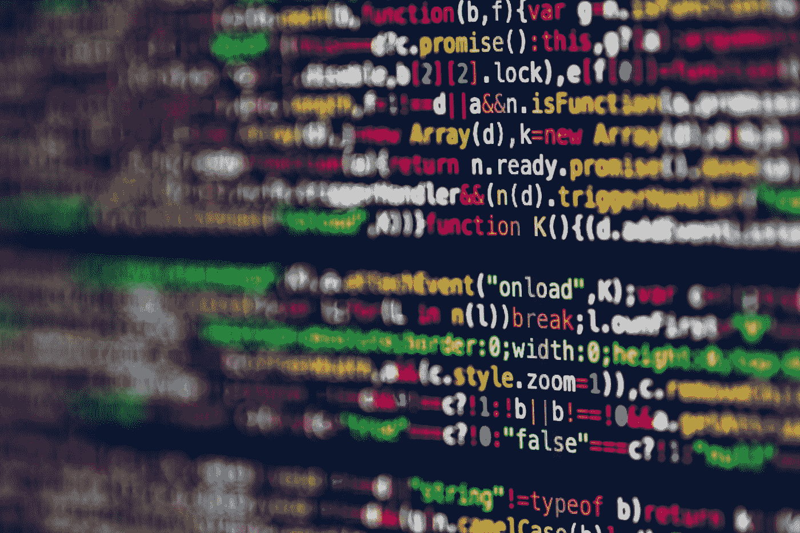

# 优化随机种子

> 原文：<https://towardsdatascience.com/optimizing-the-random-seed-99a90bd272e>

## 做那件事有意义吗？

乍一看，答案似乎显而易见。但是在深入挖掘之前，我们先不要急着下结论。

马库斯·斯皮斯克在 [Unsplash](https://unsplash.com?utm_source=medium&utm_medium=referral) 上的照片

我先讲一个小故事来创造背景。

## 实践中的随机种子优化

大约 7 年前，我开始学习数据科学，大约在同一时间，我也开始在 Kaggle 平台上参加机器学习比赛。我只知道一点点理论，但没有多少建立真实模型的经验。作为一名机器学习的初学者，当时我做了与 Kaggle 上许多初学者完全相同的事情——我拿了一些高分的公共示例脚本，并试图修改该脚本中的模型参数，希望改善结果。

这是一个 XGBoost 模型，有大约 10 个参数。那时候。我对每个参数的含义没有太多的了解，所以我只是开始在两个方向上改变它们——增加和减少原始参数值。每次更改后，我都会重新训练模型并提交新的结果，将分数与之前的进行比较。根据结果，我将参数值进一步更改为最佳方向，每次迭代都会略微提高分数。

该模型的参数之一是随机种子。很明显，通过改变随机种子，CV 值就改变了。它可以变得稍微低一点，或者稍微高一点——取决于运气。或者更准确地说，是随机的。这给了我们优化随机种子的可能性。我们可以找到种子值，对于这个值，CV 值是最好的。这正是我在那次比赛中所做的，发现对我来说最好的随机种子是 51。

但是现在，整篇文章的主要问题来了。

## 有意义吗？

优化随机种子有意义吗？或者，换句话说，一个种子具有更好的 CV 值是否意味着该模型总体上比用另一个随机种子训练的具有更低 CV 值的相同模型更好？

让我们试着找到这个问题的答案。

正如我已经提到的，乍一看，答案似乎是显而易见的。通过改变随机种子，我们简单地得到 CV 分数的随机变化。因此，我们可以假设这些 CV 变化并不意味着什么，纯粹基于不同随机种子的 CV 分数更好的模型并不比用原始种子训练的相同模型更好。

如果还没有被说服，有更多的论据证明随机种子优化不会有帮助。取任意一个模型，找到 CV 值最好的随机种子值。然后对模型做一些细微的改变，比如添加一个新的特性，改变一些其他的超参数，甚至只是简单地调整一下训练行。然后再次检查先前找到的最佳随机种子值是否仍然给出最佳 CV 分数。几乎可以肯定，不会。这意味着没有单一的最佳随机种子。

那么，我们完事了吗？优化随机种子没有任何意义？

纳丁·沙巴纳在 [Unsplash](https://unsplash.com?utm_source=medium&utm_medium=referral) 上拍摄的照片

不完全是。让我们再深入一点。

## 深入挖掘

首先，让我们了解一下，随机种子到底是干什么的。它被机器学习模型用于各种任务——在所有需要随机性的地方。对于基于树的模型，随机性是需要的，以确保所有的树不是相同的，有不同的分裂。基于树的模型中的树越多样化，结果应该越好。

我们可以使用各种技术使树木更加多样化。例如，我们可以通过删除一些行或一些特征(列)来使用子采样。在每次迭代中，删除一些行或列的子集。随机性确保了每次这个子集都是不同的。这反过来确保了模型将在每次迭代中创建不同的树。

因此，随机种子(以随机的方式)影响将被创建的树。现在的问题是——一棵树能比另一棵树更好吗？

是的，可以。例如，假设我们有两个特征。其中一个包含真实信号，但另一个主要包含噪声。可能发生的情况是，在一棵树中，真实特征被子采样移除，使得在考虑最佳可能分割时该特征对于模型不可用。因此，模型将首先根据噪声特征创建分割。但是在其他一些树中，噪声特征将被移除——这意味着第一次分割将由强特征完成。在这种情况下，基于真正强特征的第二棵树通常会更好。

现在，如果一颗随机的种子幸运地比其他种子长出更强壮的树会怎么样呢？在这种情况下，用第一个种子训练的模型将确实比用另一个种子训练的模型更好，具有更多在噪声特征上分裂的较弱的树。

## 把结论放在一起

所以，再一次，优化随机种子有意义吗？看情况。在大多数情况下，它不会。但是在某些情况下，在某些特殊的情况下，这可能会有所不同。例如，如果满足以下两个条件:

1)很少有特征具有显著不同的预测能力。

2)子采样或类似技术用于在每次迭代中随机丢弃特征的子集。

在满足这两个条件的数据集上([https://www . ka ggle . com/datasets/alijs 1/artificial-data-leaks](https://www.kaggle.com/datasets/alijs1/artificial-data-leaks))，我设法得到了仅在随机种子上有所不同，但在性能上表现出明显差异的模型。一个种子被选为针对验证集优化的最佳种子，而另一个种子被选为最差种子。并且所选的两个种子的最终性能是在不同的数据上测量的，而不是在优化种子的相同验证集上测量的。这个过程用不同的验证集重复了 100 次，以获得一些统计上显著的结果。

一个额外的观察是特征重要性分数。根据特定随机种子的幸运程度，具有真实信号的要素在要素重要性列表中的位置会略微靠前或靠后。

作为结论——存在随机种子优化可以产生更好的模型的情况(即使这个特殊的例子是人为创建的)。

## 一些最后的话

在现实世界的问题中，我从来没有优化过随机种子。就好像你有两个用不同种子训练的模型，最好的方法不是拿走其中一个，而是把两个融合在一起。在大多数情况下，混合(平均)结果对每个单独的结果都更好。

但是——如果出于某种原因，我只能从两个模型中选择一个，只是在使用的随机种子上有所不同，我会选择验证分数更高的那个。以防万一。

感谢阅读！希望你能有所启发。

以后如果有兴趣看更多数据科学和机器学习相关的文章，别忘了关注我。