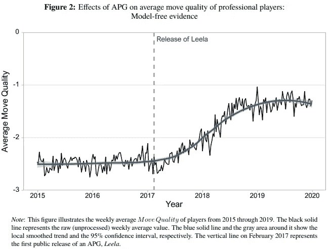

# 我们的下一个启蒙将是人工智能驱动的

> 原文：<https://towardsdatascience.com/our-next-enlightenment-will-be-ai-driven-970b88ebd818>

## 个人观点

## 人类和人工智能之间现实和共生的未来

纽约城市之光。作者图片

## 登上顶峰的启蒙运动

启蒙时代发生在 17 世纪和 18 世纪，被视为一个全球现象，我们集体“打开”我们头脑中的灯泡。这场运动是一股思想和哲学力量，见证了一些最杰出的思想家的崛起，如康德、伏尔泰和亚当·斯密。

启蒙运动在很大程度上是由笛卡尔和牛顿这样的哲学家和数学家推动的。这是因为在此之前的世界将知识和力量归于更高的力量——神、星星等等。这些宗教和精神存在被视为主要的权威，因此创造了人类生活的社会。

启蒙运动解决了个人自由、幸福、知识等复杂问题。在此之前，社会结构、法律和观点在很大程度上是由天主教会的教义所驱动的，而这个时代将焦点转移到了另一种更高的力量——理性。

科学革命结合了这种对理性的关注，这种关注紧接在启蒙运动之前。这两者的结合导致我们用对天主教会的忠诚来换取对经验主义和理性的忠诚。这个不可思议的重要时刻催生了哲学家、数学家和科学家之间的联姻，通过符号逻辑、摩尔定律以及现在处于顶峰的机器学习等思想刺激了计算时代。

第一次启蒙运动将我们的目光重新聚焦于科学和实验，以获得真知灼见。这导致我们几代人以数据的形式记录我们的经历，这样我们就可以以增长的名义进行科学和工程研究。这种增长最终让我们创造出了创新，彻底改变了从个人生活到全球社会的一切。互联网、iPhones、社交媒体等等在短短 50 年内改变了世界，现在我相信我们正处于第一次启蒙运动带给我们的旅程的顶点。

我们将何去何从？

## 机器的崛起

在几代人依靠理性做决定之后，我们根据我们在所做决定中看到的结果和经历的模式发展出了直觉。这就产生了一个循环，每次我们把技能传授给下一代时，这个循环都多了一点直觉，少了一点理性。本质上，我们以效率的名义削弱了我们的推理能力——对你肯定会无休止重复的事情做出“只是因为它一直在被做”的决定要比每次都采用批判性思维快得多，因为这一直在被做。

这对于包含的、局部的问题来说很好，这些问题变化很小，需要扩展。在我们今天生活的这个时代，当你试图在高度互联的世界中运用理性时，问题就出现了。不仅我们的推理能力有限，而且当我们处理大量的外部因素时，我们的直觉也会动摇。社会对此的解决方案是计算机编程。使用计算机，我们可以运行模拟，进行统计测试，自动化整个工作流程，以及以前任何一个人都无法管理的规模。学习编码可以让一个人拥有五个人的影响力。

我们都已经看到，随着人工智能和机器学习席卷全球，这种自然进化在最近的历史中变得多么受欢迎。我们记录和存储的所有这些经验已经成为世界各地机构的面包和黄油，因为我们可以训练统计模型来学习我们直觉应用于大规模全球范围的模式。这是一项如此具有变革性的技术，以至于我们看到技术专家、未来学家、哲学家和更多的人出来警告我们要创造一个类似终结者的未来。

从[山姆·哈里斯著名的 TED 演讲](https://www.ted.com/talks/sam_harris_can_we_build_ai_without_losing_control_over_it?language=en)到[尼克·博斯特罗姆讨论超级智能出现的书](https://www.amazon.com/Superintelligence-Dangers-Strategies-Nick-Bostrom/dp/1501227742)到[马克斯·泰格马克概述人工智能未来的书](https://www.amazon.com/Life-3-0-Being-Artificial-Intelligence/dp/1101946598)都向我们表明，人工智能融入人类社会不再是一个流行文化、科幻概念。在无数个小时阅读专栏、文章、书籍等之后。人们一致认为要极其谨慎地建造。几乎就像有人可以[在一夜之间]建造能够与人类抗衡并有可能超越人类的 AGI(人工通用智能)。时不时地，会有一位未来学家或哲学家认为，我们很可能在未来几代都不会看到 AGI 建成，尤其是考虑到今天的实现是多么天真和相对“简单”。

即使有所有的理论、猜测和担忧，我也很少看到有人认为人工智能会让我们成为更好的人。这是一个乐观的看法，我可能直到最近才写了一个故事。

让我们开始吧。

## 提高做人的标准

人工智能炒作周期已经持续了一段时间，但当[谷歌基于 DeepMind 构建的人工智能击败世界上最复杂的游戏之一的围棋世界冠军](https://www.bbc.com/news/technology-40042581)时，它才真正开始掀起波澜。最终，我们看到人工智能系统可以根据氨基酸序列确定蛋白质结构，建立一个只有文本输入的网站，用细微差别回答哲学问题，创造像梵高一样的艺术，等等。事实上，即使作为一名数据科学家，观察人工智能的进步也是令人惊讶的。

当看到这些创新几乎每年都在发生时，所有对未来的担忧和警示故事都完全有道理。然后，Choi 等人在 2021 年 7 月发表了一篇论文。艾尔。标题为[“人工智能如何提高人类的决策能力？来自人工智能围棋程序"](https://papers.ssrn.com/sol3/papers.cfm?abstract_id=3893835)的证据让我大吃一惊。

研究人员评估了人工智能围棋程序(Leela)建立之前和之后人类棋手的移动质量，以衡量差异。他们控制了可以表明玩家自己变得更好或更差的趋势，并通过诸如人为错误、最严重错误的大小以及在大量不确定性下(在游戏开始时)决策的质量等措施进行评估。

作者发现，在 Leela 被释放后的 3 年时间里，移动质量显著提高，人为错误减少，最严重错误的数量减少，在大量不确定性中决策质量提高。这张图表显示了人类表现和决策技能的巨大变化。

Choi，Sukwoong 和 Kim，Namil 和 Kim，Junsik 和 Kang，Hyo，人工智能如何改善人类的决策？来自人工智能围棋程序的证据(2021 年 7 月 26 日)。由 iORB 赞助的南加州大学马歇尔商学院研究论文，第号即将发表，可在 https://ssrn.com/abstract=3893835[或 http://dx.doi.org/10.2139/ssrn.3893835](https://ssrn.com/abstract=3893835)[SSRN](https://dx.doi.org/10.2139/ssrn.3893835)获得

这可能看起来相对无关紧要，因为它是基于一个游戏，但我保证它绝对不是。这项研究表明，当我们集体思考人工智能及其在社会中的作用时，我们认为人类学习、成长和提高的能力是理所当然的。我们忘记了人类社会在如此短的时间内所取得的巨大进步，而启蒙运动的顶峰让我们感觉到一次巨大的下滑即将到来。

我不同意。

我认为我们会看到由人工智能系统驱动的第二次启蒙。在第一种情况下，我们把天主教会的权威换成了理性的权威。几代人以来，这导致了对我们的直觉和批判性思考能力的过度依赖，如上所述，这有很多局限性。我想在第二次启蒙中我们会用理性的权威来换取人工智能的权威。

换句话说，我们将放弃人类智慧的自我，以更好地处理我们无法理解的复杂问题。这将如何使我们变得更好？这是我们想要的现实吗？就像每一个运动一样，它不会完全好或坏，但我确实认为它会迫使我们提高做人的标准。无知，或故意懒惰，将被视为你能做的最糟糕的事情之一，而不是“违约”。当你拥有全球知识、大规模模式识别，并且有机会变得更好时，选择留在自己的盒子里，不让自己超越偏见，这是“错误的”。

人工智能的一个大问题，也是我在工作中经常遇到的问题，是我们如何轻易地将人类的偏见融入人工智能模型中。这是真的，需要持续监控、控制和修复。这正是这能让我们变得更好的关键。理性曾被认为是不受我们的偏见和人为错误影响的绝对权威。理性是我们认知功能的产物，因此容易产生与我们自主系统相同的偏见。除了那些偏见是看不见的，需要几代人才能真正改变，如果有的话。随着人工智能模型中的偏见，它就在我们面前，由一个[理想的]多元化团队监控。我们也有办法修正这些偏见，因为它们都是我们自己写的代码和数学。人工智能中发现的偏差从识别到辩论再到修正到结果的周期比理性中的偏差快一百万倍。

在遥远的未来，我们可能会有一天不得不调和人类和人工智能之间的权力动态，但我相信我们会看到人工智能引导人类进化的漫长时代，同时使我们更加平等和高效。

## 这将如何开始？

当你从这些方面考虑我们的进化时，我相信我们仍然处于相当早期的阶段。到目前为止，人工智能的广泛采用实际上只出现在监管最少、技术得到大量资助的地方。像广告、营销或其他消费技术行业这样的领域已经在将人工智能部署到野外方面取得了巨大的成功(和问题)。

我认为，当我们看到人工智能在监管更严格的行业或技术资金不足的行业激增时，我们将看到人工智能的前景和使用方法发生巨大变化。气候变化或公共卫生的解决方案将保证政府和私营企业在监管监督下在全球范围内合作创建人工智能系统。这将开启一个人工智能共生的时代，大多数人将更容易欢迎这一时代。

随着我们看到人工智能主宰社会的各个方面，开源社区正在产生并成为默认，这是一件好事。如果我们要相信自主系统将进一步嵌入我们的生活，有效的透明度和用户控制的系统将是至关重要的特征。

最终，当领域专家开始将他们的直觉转化为代码，并允许他们超越自己的推理能力时，我们将开始看到人类进化的下一个阶段的形成。

> **来自《走向数据科学》编辑的提示:**虽然我们允许独立作者根据我们的[规则和指导方针](/questions-96667b06af5)发表文章，但我们并不认可每个作者的贡献。你不应该在没有寻求专业建议的情况下依赖一个作者的作品。详见我们的[读者术语](/readers-terms-b5d780a700a4)。