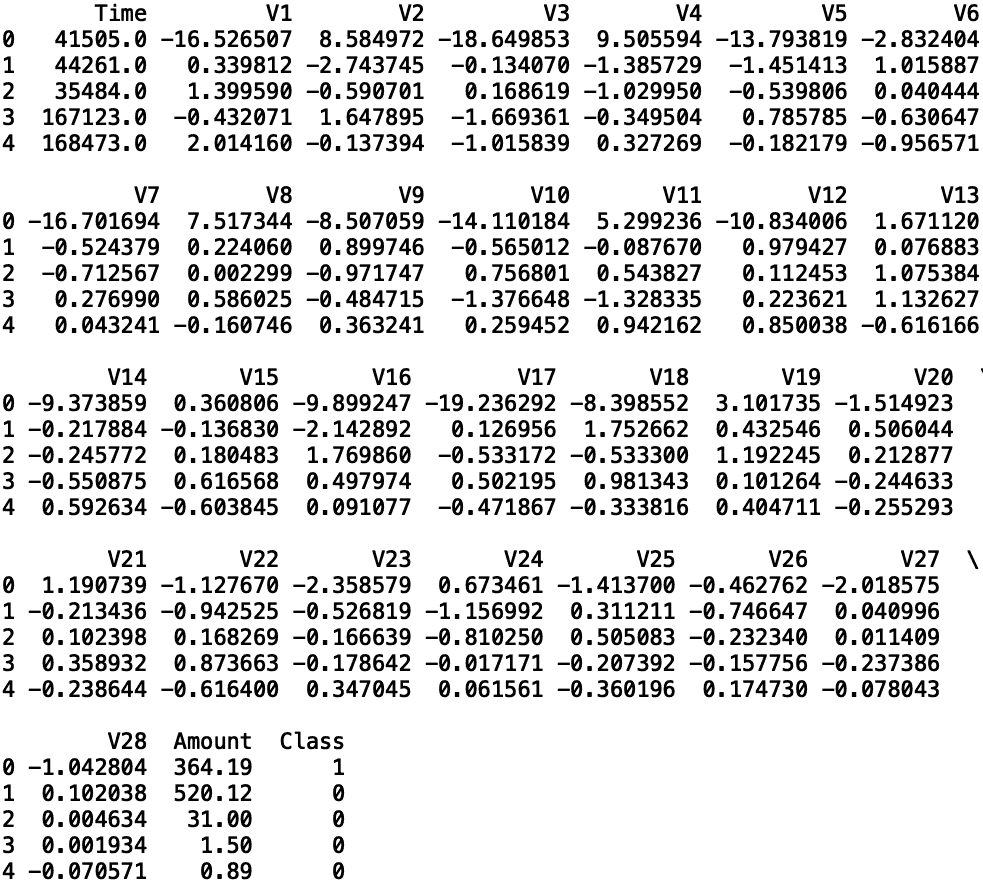
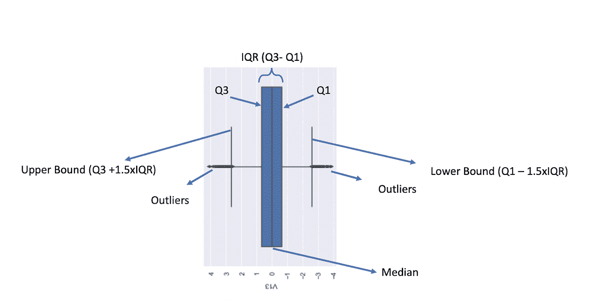
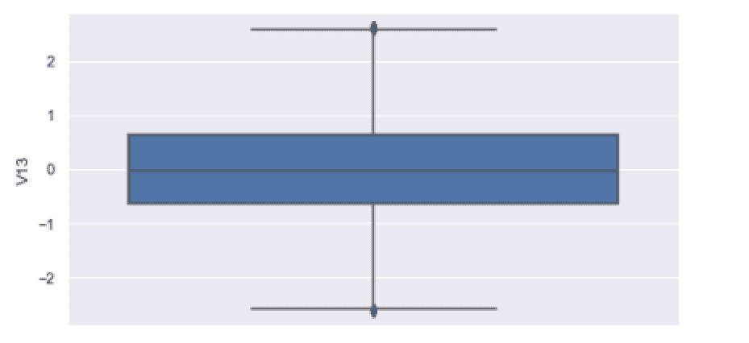
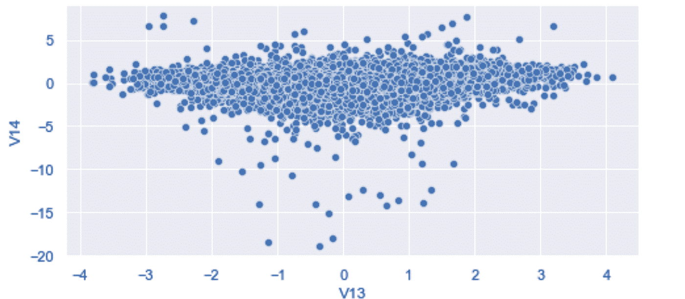
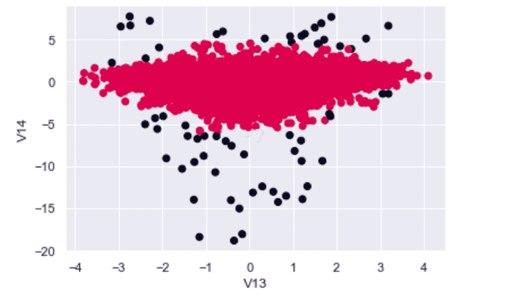
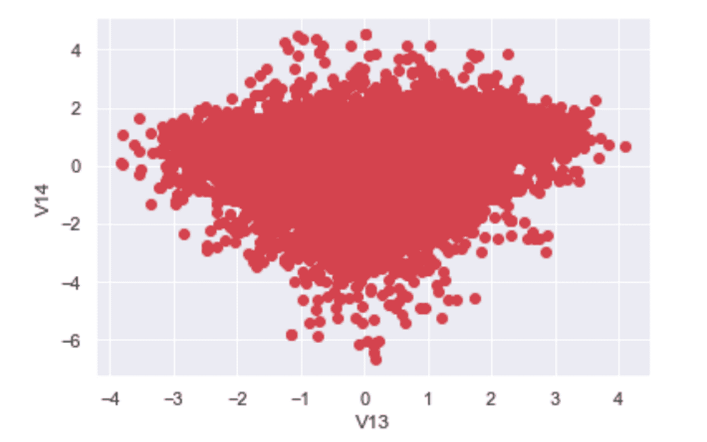

# Python 中的离群点检测技术

> 原文：<https://towardsdatascience.com/outlier-detection-techniques-in-python-1fabf8e68bec>

## Python 中带有示例的异常值检测方法指南


图片由[塞巴斯蒂安·沃特曼](https://www.pexels.com/@sebastian/)在[像素](https://www.pexels.com/photo/black-wooden-king-chess-piece-411195/)上拍摄

离群点检测是识别数据中极值的过程，在金融、保险、网络安全和医疗保健等各行各业都有许多应用。例如，在金融领域，它可以检测像信用卡欺诈这样的恶意事件。在保险业，它可以识别伪造或编造的文件。在网络安全中，它用于识别密码盗窃和网络钓鱼等恶意行为。最后，异常值检测已经被用于医疗环境中的罕见疾病检测。

鉴于异常值检测在各行各业都有许多重要的应用，在这些领域工作的数据科学家需要对进行此类分析的最新方法和工具有一个扎实的了解。

离群点检测有许多方法，每种方法都有自己的优点。广泛用于离群点检测的两种方法是描述性统计和聚类。描述性统计是一种使用汇总统计对数据集中的特征进行定量描述的方法。这包括平均值、方差、最大值和最小值等计算。这还包括箱线图、直方图和散点图等图形表示。相反，聚类技术是一组无监督的机器学习算法，将数据集中的对象分组在一起，以便相似的对象在同一组中。

使用描述性统计检测异常值的一种常用方法是使用四分位数范围(iqr)。该方法通过分析落在四分位数指定范围内的点来工作，其中四分位数是数据的四个等分部分。虽然 IQR 适用于包含单一形状或图案的数据，但它无法区分数据集中不同类型的形状或数据点组。

幸运的是，聚类技术通过有效地将样本分成不同的形状，解决了 IQR 的局限性。用于异常值检测的常用聚类方法是 DBSCAN，它是一种无监督聚类方法，解决了 IQR 的许多限制。它通过识别组来工作，使得每个组的成员密集地聚集在一起，然后将离群值识别为落在任何密集聚集的聚类之外的数据点。与 IQR 不同，DBSCAN 能够捕捉形状和大小不同的星团。

Pandas 中的分位数方法便于计算 IQR。对于聚类方法，Python 中的 Scikit-learn 库有一个易于使用的 DBSCAN 算法实现，可以很容易地从 Scikit-learn 中的 clusters 模块导入。这种易用性对于初学者来说尤其理想，因为 Scikit-learn 软件包允许用户使用默认算法，只需要数据科学家提供最少的规范。此外，每种算法的界面都允许用户轻松修改参数，以进行快速原型制作和测试。

我们将使用[信用卡欺诈数据集](https://www.kaggle.com/datasets/mlg-ulb/creditcardfraud)。我们将应用 IQR 和 DBSCAN 来检测这些数据中的异常值，并比较结果。这些数据拥有[开放数据库许可证](https://opendatacommons.org/licenses/dbcl/1-0/)，可以自由共享、修改和使用。

**读入数据**

让我们从导入 Pandas 库开始，并将我们的数据读入 Pandas 数据框:

```
df = pd.read_csv("creditcard.csv")
```

接下来，让我们使用 Pandas 方法 set_option()放宽列和行的显示限制:

```
pd.set_option('display.max_columns', None)
pd.set_option('display.max_rows', None)
```

出于演示目的，我们将使用数据的缩减采样版本:

```
df = df.sample(30000, random_state=42)df.to_csv("creditcard_downsampled5000.csv", index=False)
```

现在，让我们使用 head()方法显示前五行数据:

```
print(df.head())
```



作者图片

正如我们所看到的，数据集具有从 V1 到 V28 的列，这反映了使用对应于交易信息的特征生成的 28 个主要成分。由于客户保密，有关原始功能的信息不公开。

数据还包含交易金额、类别(对应于欺诈结果:欺诈为 1，否则为 0)和时间，时间是数据集中每笔交易和第一笔交易之间的秒数。

**四分位距(IQR)**

iqr 是一种分析数据中的点如何分布在数据的各个部分的有用方法。一般来说，这是测量数据分布的好方法。iqr 是根据四分位数定义的，即四个等分的数据组。

*   第一个四分位数(Q1)对应于 25%的数据低于该点的值。
*   第二个四分位数(Q2)是数据列的中值。该列中 50%的数据低于该值。
*   第三个四分位数(Q3)是列中 75%的数据低于该值的点。
*   IQR 是第三个四分位数(Q3)和第一个四分位数(Q1)之间的差值。

计算完第一个和第三个四分位数后，计算 IQR 就简单了。我们只取第三和第一个四分位数之差(第三季度减去 Q1)。一旦有了 IQR，我们就可以用它来检测数据列中的异常值。

使用 IQR 检测异常值被称为 1.5 倍 IQR 规则。使用这个规则，我们计算上限和下限，我们可以用它来检测异常值。上限被定义为第三个四分位数加上 1.5 倍的 IQR。下限定义为第一个四分位数减去 1.5 倍 IQR。

它的工作方式如下:

1.  计算上限:Q3 + 1.5 x IQR
2.  计算下限:Q1-1.5 x IQR
3.  通过移除任何小于下限或大于上限的值来计算异常值。

让我们对数据中的 V13 列执行这个操作。首先，让我们创建一个 V13 列的箱线图。我选择 V13 是因为我们的箱线图中该数据列的 IQR 很容易看到。箱线图是直观显示数据列中 IQR 的有用方法。我们可以使用三行简单的代码来生成 V13 的箱线图:

```
sns.set()sns.boxplot(y = df['V14'])
plt.show()
```



作者图片

这里我们可以看到，我们将大量的信息浓缩在一个图中。很可能，我们首先会注意到的是蓝框，它对应于 IQR。在蓝框内，垂直黑线对应于中间值。蓝框的左边缘和右边缘分别对应于 Q3 和 Q1。最左边和最右边的垂直黑线分别对应于上限和下限。最后，最左边和最右边的黑点对应异常值。我们可以使用上限和下限的值来移除异常值，然后通过生成另一个箱线图来确认它们已经被移除。

首先让我们计算这个列的 IQR，这意味着我们首先需要计算 Q1 和 Q3。幸运的是，熊猫有一个简单的方法，叫做分位数，可以让我们这样做。为了计算 Q1，我们调用 quantile()方法，参数输入为 0.25(代表第 25 个百分点):

```
Q1=df['V13'].quantile(0.25)
print("Q1:", Q1)
```


作者图片

我们看到第一个四分位数(Q1)是-0.64。这意味着 V13 列中只有 25%的数据低于-0.64。

为了计算 Q3，我们调用 quantile()方法，参数输入为 0.75(代表第 75 个百分点):

```
Q3=df['V13'].quantile(0.75)
print("Q3:", Q3)
```


作者图片

我们看到第三个四分位数(Q3)是 0.66。这意味着 V13 列中 75%的数据低于 0.66。

IQR 就是 Q3 和 Q1 的差值:

```
IQR=Q3-Q1
```

从这里，我们可以定义一个新的 Pandas 系列，它包含没有异常值的 V13 值:

```
IQR=Q3-Q1
print("IQR: ", IQR)
```


作者图片

我们看到 IQR 是 1.3。这是 Q3 和 Q1 之间的距离。

从这里，我们可以计算上下界。下限是 Q1-1.5 倍 IQR:

```
lower_bound = Q1 - 1.5*IQR
print("Lower Bound:", lower_bound)
```


作者图片

我们看到下界是-2.61。因此，任何低于-2.61 的值都是异常值。

上限是 Q3 + 1.5 倍 IQR:

```
upper_bound = Q3 + 1.5*IQR
print("Upper Bound:", upper_bound)
```


作者图片

我们看到上限是 2.62。因此，任何高于 2.62 的值都是异常值。

因此，我们移除该列异常值的方法是移除高于 2.62 和低于-2.61 的任何值:

```
df_clean = df[(df['V13']>lower_bound)&(df['V13']<upper_bound)]
```

我们现在可以绘制清理后的数据:

```
sns.boxplot(y = df_clean['V13'])
plt.show()
```

我们看到上下边界之外的点已经被移除



作者图片

尽管这种方法对于删除单个列中的异常值很有用，但它有一些明显的局限性。最大的限制是无法捕捉数据中的不同形状。例如，列中的某个点在一维箱线图中可能不是异常值，但在二维散点图中可能是异常值。

为了理解这一点，考虑一下美国的中值收入:在撰写本文时，它是 44，225 美元。尽管这一数值属于美国所有收入的 IQR，但如果我们考虑其他因素，它可能会被视为异常值。例如，44，225 美元对于已经执业 10 年的美国医生来说可能是一个异常收入。为了在我们的数据中捕捉不同的形状来描述这种情况，聚类是一种更好的方法。

**数据库扫描**

DBSCAN 代表基于密度的带噪声应用空间聚类，是一种无监督聚类算法。。该算法通过寻找聚类来工作，使得每个聚类中的点密集/紧密地包装在一起。密度基于聚类中每个数据点附近有多少邻近点。附近的邻居越多，集群密度越高。这种方法将松散聚集的点或单独位于密集聚集的聚类之外的点识别为离群点。

让我们使用 DBSCAN 来识别我们一直在处理的数据中的异常值。首先，让我们可视化一些集群，以了解算法是如何工作的。让我们绘制一个 V13 与 V14 的散点图:

```
sns.scatterplot(df['V13'], df['V14'])
```



作者图片

我们看到，我们有一个非常密集的集群，有许多远离集群的离群点。有趣的是，这个二维空间中的一些异常点会落入 V13 的 IQR，并错误地留在数据中。观察图中 V13 接近于 0 的点和 V14 接近于-20 的点。V13 的值很好，而 V14 的值是异常值。这使得这些点成为异常值。

虽然我们可以从 V13 和 V14 中删除离群值来补救这一点，但是对每一列都这样做是很费力的，尤其是如果您正在处理几十个特性的话。

让我们看看如何使用聚类来做得比 IQR 方法更好。让我们从 Scikit-learn 导入 DBSCAN 算法:

```
from sklearn.cluster import DBSCAN
```

接下来，让我们定义我们的训练数据。让我们考虑第 13 列和第 14 列:

```
X_train = df[['V13', 'V14']]
```

现在，让我们将我们的聚类方法用于训练数据。为了简单起见，让我们通过将输入参数留空来保持默认值:

```
model = DBSCAN()model.fit(X_train)
```

让我们生成一个散点图，在这里我们将标记异常值:

```
cluster_labels = model.labels_
plt.scatter(df["V13"], df["V14"], c = cluster_labels)
plt.show()
```



作者图片

我们看到，该算法在标记异常值方面做得很好，甚至是 IQR 方法可能会遗漏的异常值。散点图中的黑点对应于 V13/V14 2D 异常值，而红点是良好的数据点。

现在，我们可以根据这些聚类标签轻松地移除这些异常值。让我们将分类标签存储在数据框的新列中:

```
df['labels'] = cluster_labels
```

接下来让我们移除离群值。Scikit-learn 的 DBSCAN 实现将聚类标签值-1 分配给有噪声的样本(异常值)。我们可以轻松地删除这些值，并将清除的数据存储在一个新变量中:

```
df_cluster_clean = df[df['labels'] != -1]
```

现在，让我们绘制清理后的数据:



作者图片

我们看到原始数据中不再有异常点。最重要的是，IQR 方法在我们只研究 V13 时遗漏的异常值也被剔除了。

值得注意的是，我们只考虑了二维的异常值。三维以上的可视化变得越来越困难。尽管如此，像 DBSCAN 这样的方法能够检测出数据中的异常值，这些数据包含的维度比我们能够可视化或解释的维度多得多，这是一个好消息。当涉及到高维空间中的离群点检测时，聚类确实是一种优越的方法。

这篇文章中的代码可以在 [GitHub](https://github.com/spierre91/builtiin/blob/main/outlier_detectionpt2.py) 上找到。

**结论**

离群点检测和剔除是数据科学和机器学习的重要组成部分。数据中的异常值可能会对数据中的统计数据的解释产生负面影响，如果公司根据这些错误的计算做出决策，可能会损失数百万美元。此外，离群值会对机器学习模型性能产生负面影响，这会导致样本外性能不佳。糟糕的机器学习模型性能是许多公司的一大担忧，因为这些预测被用来推动公司决策。因此，任何数据科学团队都应该熟悉异常值检测和剔除的可用方法。

在考虑选择哪种方法时，数据科学家应该对手头的数据有很好的理解。如果公司数据很简单，包含的列很少，IQR 应该工作得很好。如果数据包含许多列，很可能数据中存在 IQR 无法捕获的形状和图案。正因如此，在考虑高维空间的离群点剔除任务时，像 DBSCAN 这样的聚类方法是很好的选择。

如果你有兴趣学习 python 编程的基础知识、Pandas 的数据操作和 python 中的机器学习，请查看[*Python for Data Science and Machine Learning:Python 编程、Pandas 和 sci kit-初学者学习教程*](https://www.amazon.com/dp/B08N38XW2Q/) *。我希望你觉得这篇文章有用/有趣。*

***本帖原载于*** [***内置博客***](https://builtin.com/data-science/) ***。原片可以在这里找到***<https://builtin.com/data-science/how-find-outliers-examples>****。****