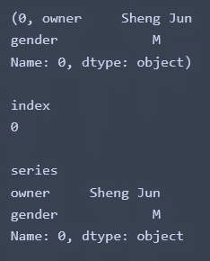
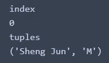

# 应用、映射、应用映射、iterrows 和 itertuples 概述

> 原文：<https://towardsdatascience.com/overview-on-apply-map-applymap-iterrows-itertuples-df752a11f451>

## 附有示例的实用指南

数据清理和特征工程在处理数据时是必不可少的。我最近回顾了一些过去的个人项目，并对它们进行了重构或继续构建。其中之一是 iaito 订单细节的可视化。合气道是模仿武士刀来学习合气道的。iaito 的制造属于高混合小批量制造类别，因为在我们的情况下，每个 iaito 都是为所有者定制的(即按订单生产)。

[](/data-visualization-using-matplotlib-seaborn-97f788f18084) [## 使用 Matplotlib 和 Seaborn 实现数据可视化

towardsdatascience.com](/data-visualization-using-matplotlib-seaborn-97f788f18084) 

我在 2012 年开始构建数据集，同时帮助 iaidoka 成员翻译 iaito 订单细节。每个记录包含每个所有者的 iaito 零件规格。出于隐私考虑，诸如所有者的全名和地址等敏感信息永远不会在数据集中捕获。

在本文中，使用数据集的更新版本，我们将浏览几个常见的数据操作用例以及可能不太明显的注意事项。涵盖的操作概述如下:

*   应用
*   地图
*   应用地图
*   for 循环
*   iterrows
*   迭代元组
*   …向量化…
*   词典

我们将进行通常的库导入，检查数据框并进行一些基本的数据清理。

```
# import libraries
import pandas as pd
import numpy as np
import re
pd.set_option('display.max_columns', None)# load the dataset
df = pd.read_excel('project_nanato2022_Part1.xlsx')
print(f'df rows: {df.shape[0]}, df columns: {df.shape[1]}')
df.head(1)
```


导入的数据框|按作者分类的影像

```
# Check for null or missing values
df.isnull().sum()[df.isnull().sum()>0]
```


有 44 个空值的列|作者图片

包含空值的列…？没什么大不了的。检查数据总是好的做法。看来`unnamed column`号是多余的，可以安全丢弃。尽早丢弃或输入空值(如果可以的话)有助于简化数据清理过程&减少内存使用。


在删除未命名的列|按作者排序的图像之前


删除未命名的列|作者的图像后

然后，列标题被重命名，详细信息可在笔记本中找到。

## 用例#1

我们将从一个简单的用例开始——计算所有者姓名的字符长度。实际上，这可以推导出广告文本的长度等。本质上，这是从现有的数据列派生出一个新的数据列。我们将通过这个用例的`apply`、`map`、`applymap`和`for`循环。我们还将对每个实现进行计时，以便进行比较。使用`timeit`，循环次数保持在 100 次。

我们可以从文档中更好地了解操作。在`apply`的情况下，它描述了一个函数沿着数据帧的一个轴的应用，其中一系列对象被传递给该函数。`map`用另一个值替换系列值。`mapapply`对 DataFrame 的元素应用一个函数-输入需要的数据帧；在我们浏览这些例子的时候，需要记住一些事情。

```
# apply
%timeit -n100 df['name_L1'] = df['owner'].apply(lambda x: len(x))
```


按作者应用计算时间|图像

```
# map
%timeit -n100 df['name_L2'] = df['owner'].map(lambda x: len(x))
```


地图计算时间|作者图片

```
# applymap - applies to elementwise, so pass in a dataframe
%timeit -n100 df['name_L3'] = df[['owner']].applymap(lambda x: len(x))
```


应用地图计算时间|作者图片

```
%%timeit -n100
# for loop
t_name = []
for ele in df['owner']:
    t_name.append(len(ele))
df['name_L4'] = t_name
```


for 循环计算时间|作者图片

根据使用情况，里程和最佳操作会有所不同。对于上面的用例，无论是`for`循环还是`map`都足够了，尽管前者更加冗长。我们*也许*可以摆脱`apply`，但是在处理更大的数据集(例如，数百万条记录)时，它无法伸缩。

## 用例 2

对于下一个用例，weight 列由 iaito 的预期重量范围组成。我们使用`for`循环和`apply`将值提取到两个新的单独的列中。

```
%%timeit -n100
# for loops and splitting of strings
w_lower1, w_upper1 = [], []
for weight in df['weight_(g)']:
    w_lower1.append(weight.split('-')[0])
    w_upper1.append(weight.split('-')[1])
df['w_lower1(g)'] = w_lower1
df['w_upper1(g)'] = w_upper1
```


for 循环计算时间|作者图片

```
# helper function to split weight column
def splitter(row):
    return [row.str.split('-')[0][0],  row.str.split('-')[0][1],]%%timeit -n100
# .apply result_type='expand' creates a dataframe
frame = df[['weight_(g)']].apply(splitter, axis=1, result_type='expand')
frame.rename(columns={0:'w_lower2(g)',
                      1:'w_upper2(g)',
                     },inplace=True)
df[frame.columns] = frame
```


按作者应用计算时间|图像

关于`apply`实施，实施轴必须为 1，才能使用`result_type`。在上面的例子中，用`expand`返回一个新的数据帧。

## 用例#3

对于第三个也是最后一个例子，我们将创建一个新的 name 列，标题后面跟着所有者的姓名。我们可以从性别一栏推断出标题。我们将经历这些操作:

*   `for`循环
*   `iterrows`
*   `itertuples`
*   列表理解+ `apply`
*   …向量化…
*   词典

```
%%timeit -n100
# for loop
res = []
for i in range(len(df['gender'])):    
    if df['gender'][i] == 'M':
        res.append('Mr. ' + df['owner'][i])
    else:
        res.append('Ms. ' + df['owner'][i])
df['name1'] = res
```


for 循环计算时间|作者图片

`iterrows`顾名思义，遍历数据框行。它是作为一个索引序列对来实现的。让我们休息一下，然后再仔细检查一下。


布莱恩·麦高恩在 [Unsplash](https://unsplash.com?utm_source=medium&utm_medium=referral) 拍摄的照片

```
# cap at the 1st data record
for ele in df[['owner', 'gender']].iloc[:1].iterrows():
    print(ele,'\n')
    print(f"index\n{ele[0]}",'\n')
    print(f"series\n{ele[1]}",'\n')
```



iterrows 对象|作者图片

列标题构成了系列的索引。对 iterrows 如何工作有了更好的理解，我们可以这样继续:

```
%%timeit -n100
# iterrows implementation
res = []
for ele in df[['owner', 'gender']].iterrows():
    if ele[1][1] == 'M':
        res.append('Mr. ' + ele[1][0])
    else:
        res.append('Ms. ' + ele[1][0])
df['name2'] = res
```


iterrows 按作者计算时间|图像

`itertuples`以命名元组的形式遍历数据帧。关闭默认的`index`会将第一列的值移入索引。它比`iterrows`还要快。让我们仔细看看。

```
# cap at 1st record, default index on
for ele in df[['owner', 'gender']].iloc[:1].itertuples():
    print(f"index\n{ele[0]}")
    print(f"tuples\n{ele[1], ele[2]}")
```



itertuples #1 |作者图片

```
# cap at first record, index off
for ele in df[['owner', 'gender']].iloc[:1].itertuples(index=False):
    print(f"index\n{ele[0]}")
    print(f"tuples\n{ele[1]}")
```


itertuples #2 |作者图片

综上所述，itertuples 实现类似，但速度更快，如下图所示。

```
%%timeit -n100
res = []
# itertuples implementation
for ele in df[['owner', 'gender']].itertuples(index=False):
    if ele[1] == 'M':
        res.append('Mr. ' + ele[0])
    else:
        res.append('Ms. ' + ele[0])
df['name3'] = res
```


itertuples 按作者计算时间|图像

列表理解和应用的结合也是一种备选解决方案，只是没有那么有效。

```
%%timeit -n100
# combination of list comprehension and apply
title_ = ['Mr. ' if x == 'M' else 'Ms. ' for x in df['gender'] ]
df['t'] = title_
def name_(row):
    return row['t'] + row['owner']
df['name4'] = df.apply(name_,axis=1)
```


按作者列出理解和应用计算时间|图片

接下来，向量指令。在本节中，我们将探索通过代码矢量化进行优化。所以比较的是标量(非矢量)指令和矢量指令。

```
%%timeit -n100
# vectorization
arr1 = df['owner'].array
arr2 = df['gender'].array
arr3 = []
for i in range(len(arr1)):
    if arr2[i] == 'M':
        arr3.append('Mr. ' + arr1[i])
    else:
        arr3.append('Ms. ' + arr1[i])
df['name5'] = arr3
```


向量指令计算时间|作者图片

最后，可以将数据框转换成字典。我们还可以将数据框转换成字典，然后对其进行处理。但是，对于字典来说，一定要注意人们可能希望如何转换键-值对。如果忽略这一点，意外的结果可能会令人惊讶。我们将通过两个例子:1。使用`list`作为`orient`参数来完成工作。默认`dict`输入。

```
%%timeit -n100
# create dictionary from subset of data
df_dict = df.to_dict('list')name_list = []
for idx in range(len(df_dict['gender'])):
    if  df_dict['gender'][idx] == 'M':
        name_list.append( 'Mr. ' + str(df_dict['owner'][idx]) )
    else:
        name_list.append( 'Ms. ' + str(df_dict['owner'][idx]) )
df_dict['name6'] = name_list# convert dictionary back to dataframe
df_new = pd.DataFrame.from_dict(df_dict)
```


计算字典列表操作的时间

```
%%timeit -n100
# create dictionary from data
df_dict2 = df.to_dict()
df_dict2['name7'] = {}
for idx in range(len(df_dict2['gender'])):
    if  df_dict2['gender'][idx] == 'M':
        df_dict2['name7'][idx] =  'Mr. ' + str(df_dict['owner'][idx]) 
    else:
        df_dict2['name7'][idx] =  'Ms. ' + str(df_dict['owner'][idx])# convert dictionary back to dataframe
# separated to deconflict with timeit 
df_new2 = pd.DataFrame.from_dict(df_dict2)
```


计算字典操作的时间

## 结论

恭喜你！你坚持到了文章的结尾。我们已经讨论了`apply`、`map`、`applymap`、`for`循环、`iterrows`、`itertuples`、向量化指令、字典。最佳操作和里程取决于用例，但总的来说，我们可以看到一些操作比其他操作更有效，这肯定是生产级代码的考虑因素之一。

数据集和笔记本可以分别在[这里](https://github.com/AngShengJun/petProj/blob/master/proj_nanato/project_nanato2022_Part1.xlsx)和[这里](https://github.com/AngShengJun/petProj/blob/master/proj_nanato/1_Overview%20on%20apply%2C%20map%2C%20applymap%2C%20iterrows%20%26%20itertuples_2022Feb.ipynb)访问，以供参考和个人使用。如果您想将数据集用于您自己的项目，请指明适当的认证。

暂时就这样了。感谢阅读。

## 2022 年 2 月 27 日更新:

1.  添加了关于数据集所有权和权限的说明。
2.  添加字典操作