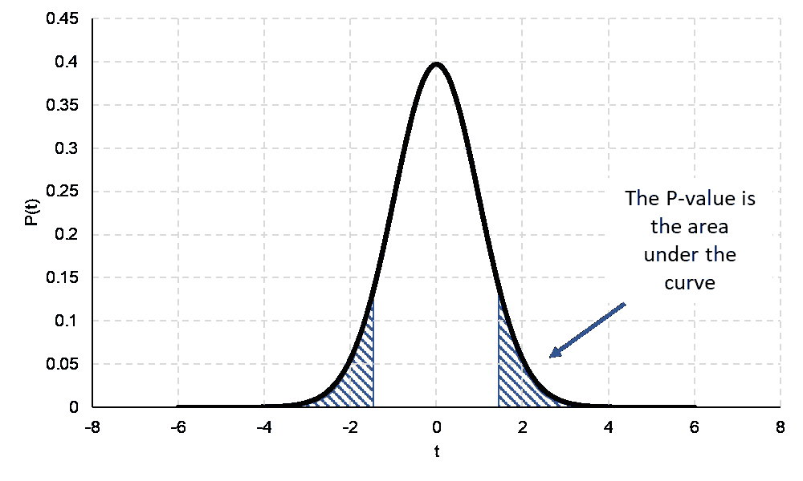
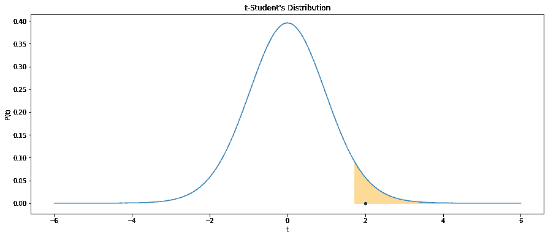
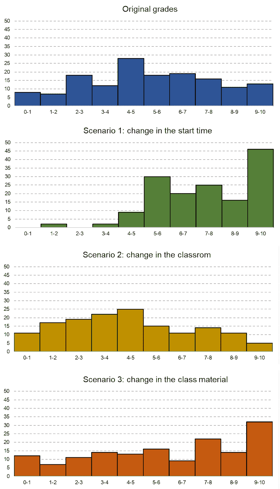
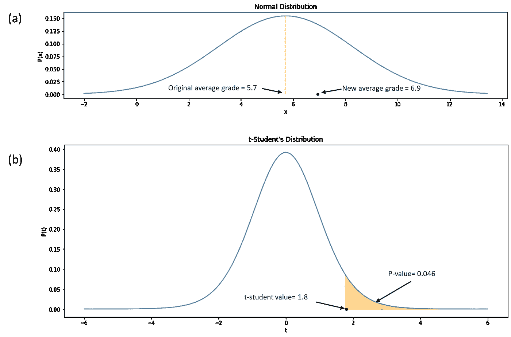
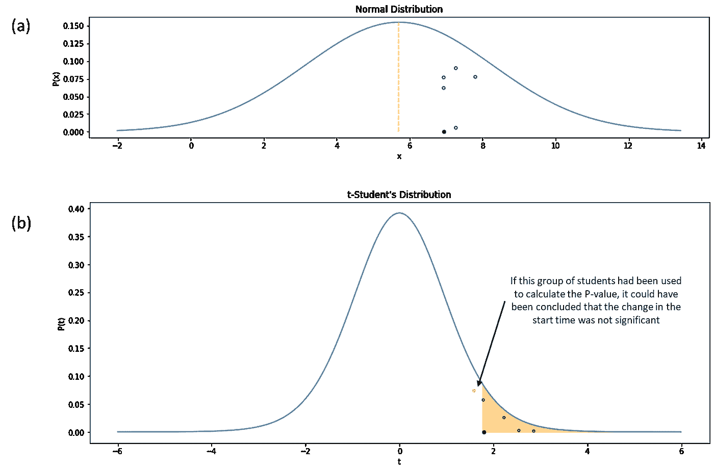
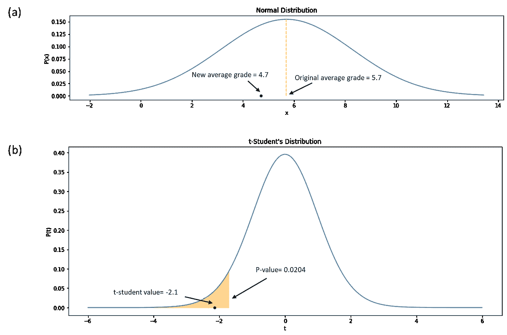
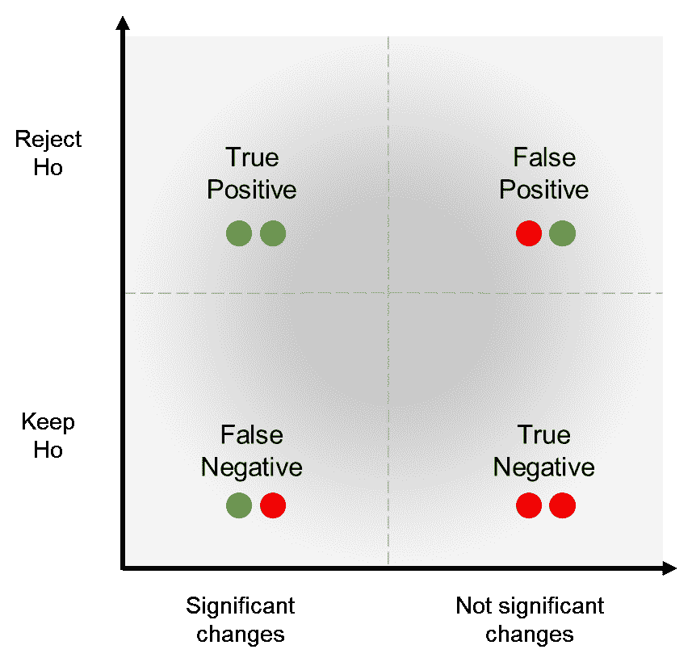
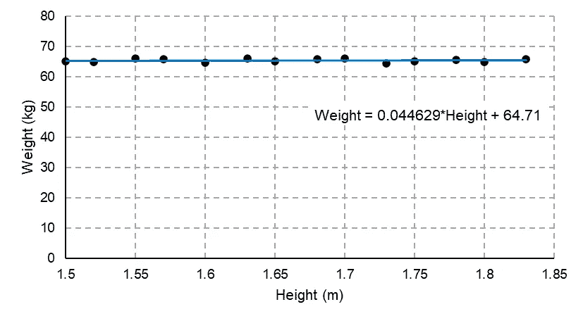

# p 值:在被证明有罪之前是无辜的

> 原文：<https://towardsdatascience.com/p-values-innocent-until-proven-guilty-65cb4e93e52c>

## 统计假设、线性回归和多元宇宙之旅

科林·劳埃德在 [Unsplash](https://unsplash.com?utm_source=medium&utm_medium=referral) 上的照片

*被告坐在证人席上一言不发。陪审团认为他有罪。他能感觉到。最后一条证据是毁灭性的。一张他衬衫上有血、一手拿着屠刀的照片足以证明他有罪。他怎么解释呢？他怎么能让陪审团相信这只是巧合呢？他不是杀人犯，他只是碰巧在错误的时间出现在错误的地方，出现在错误的地方。辩方传唤最后一名证人出庭。他是一名数学家。他的第一句话是:“我计算了这种情况下的 P 值，它远低于 5%”。陪审团似乎很困惑。数学家解释了他的计算。陪审团仔细检查了证据。在审判结束时，他们同意:判决无罪。*

# 什么是 P 值，它们意味着什么？

这是怎么回事？什么是 P 值，它们与谋杀审判有什么关系？更何况这一切和[线性回归](https://en.wikipedia.org/wiki/Linear_regression)有什么联系？首先，我们需要了解 P 值实际上是什么。一个好的起点是统计假设。假设是一种假设，一种我们对某事提出解释的想法。什么都有可能。假设是解释为什么事情会发生的理论。收集证据可以帮助我们确认假说是真是假。我最奇怪的假设之一是，猫不打开冰箱就知道冰箱里有什么！我没有很多证据支持这一点，但这仍然是一个假设。如果我想接受或拒绝这个假设，我应该找到检验它的方法，然后找到足够的证据来自信地说这个假设是真的还是假的。考虑到这一点，什么是统计假设呢？它和另一个假设一样，不同的是，这一次我们将有一个关于变量分布的假设。我可以说世界上超过 75%的金毛猎犬是黄色的。这个假设告诉了我一些关于金毛寻回犬在世界上的分布情况。P 值是检验这些统计假设之一的一种方法，一种知道一个人是否可以忽略或考虑该假设的方法。

P 值的概念与[零假设](https://en.wikipedia.org/wiki/Null_hypothesis)的概念紧密相关。一般来说，如果你正在使用 P 值或考虑使用 P 值，你是在试图确定一件事是否对另一件事有真正的影响。在这种情况下，假设大概是这样的:猫移动的速度和它的颜色有关。也许这只是你的看法，因为每次你看到一只黑猫，它就跳来跳去，而当你看到一只暹罗猫，它就躺在那里等待下一碗虾头！无效假设是你试图反驳的。在这种情况下，无效假设是“猫的颜色不影响猫移动的速度”。想象如何构建零假设的一个好方法是加上“证明我错了！”最后。在这种情况下，你可以这样说:

*   猫比狗睡得多。证明我错了！
*   哈士奇的平均脱毛量比其他任何犬种都要高。证明我错了！
*   猫比狗醒得早。证明我错了！
*   一般来说，人们喝茶比喝咖啡快。证明我错了！
*   每个被拍到穿着染血衬衫拿着刀的人都是杀人犯。证明我错了！

证明某人错误的最好方法是向他或她提供足够的证据，证明假设不成立。如果我回到前面的例子，说“猫的颜色不影响猫移动的速度(证明我错了！)”，你可以找到 10 只比我家黑猫跑得快的非黑猫。这足以无视我的假设吗？假设你测 1000 只非黑猫的最高速度，平均速度高于 1000 只黑猫的平均速度。怎么样？这看起来像确凿的证据！但是，你本来可以挑世界上最慢的 1000 只黑猫，最快的 1000 只非黑猫。我怎么会知道？也许你很幸运…P 值可以帮助我们确定这一点。P 值是**假设零假设为真，获得我们正在观察的结果的概率**。最后一句话的第二部分才是这里的关键！P 值不是找到比黑猫快的非黑猫的概率。P 值是在一个黑猫总是更快的世界里找到一只比黑猫更快的非黑猫的概率。所以，一个小的 P 值告诉我们，如果零假设是真的，那么我们的观察就不太可能发生。这意味着我们可以拒绝零假设。在这种情况下，我们可以说“猫的颜色不影响猫移动的速度是不对的”。如果你的非黑猫小组和黑猫小组一样快或者更快，那么这纯粹是运气。

回到审判，高 P 值表明**在一个被告有罪**的世界里，找到他带着染血衬衫和屠刀的几率很小。在这种情况下，即使他看起来有罪，也有统计证据表明他可能不是。我们用一个更好的例子来分析这个。

# 教室、年级和多元宇宙

Matthew Coolguy 教授是教授中世纪早期欧洲历史的大学教授。他教同样的课程已经超过 8 个学期了，他很担心他的学生表现不佳。他认为早上 7 点上课对大多数学生来说可能太早了，影响了他们的表现。他还认为课程材料可能与此有关。他用非常旧的幻灯片，里面有很多文字和黑白图片。也许如果他更新幻灯片，减少文字量并加入彩色图片，学生们会对他的课程更感兴趣。最后，Coolguy 教授的一位同事告诉他，他也有类似的问题，他通过更换教室解决了这个问题。酷盖教授可以使用另一栋楼里更新更明亮的教室。他可以把他的讲座搬到那栋楼去，看看情况如何。考虑到这一点，Coolguy 教授决定进行一项实验:他将从这些选项中选择一个，并在接下来的几个学期中开始实施。然后，他会将新学期的成绩与旧学期的成绩进行比较，并决定他的假设是否正确。

*图一。酷盖教授想要分析的三种情况。(作者编造的情节)。*

做这个实验的好方法是什么？我们可以简单地在下一个学期实施一个改变，如果平均分数高于之前的平均分数，我们可以说这个改变对学生的表现产生了积极的影响。有这么简单吗？假设 8 个学期后，平均成绩是 5.9 分(满分 10 分)。下学期，Coolguy 教授将他的讲座开始时间从早上 7:00 调整到 10:00。对于上课的 25 名学生来说，这是唯一改变的事情，教室、材料和幻灯片都是一样的。我们现在假设在这个学期结束时，这些学生的平均成绩是 6.9 分(满分 10 分)。这是否足以得出结论，开始时间的改变对学生是有益的？也许这 25 个学生真的是好学生，马修只是碰巧发现了 25 个优秀的学生，无论讲座什么时候开始，他们都会得到更高的分数。另一方面，想象下一学期的 25 名学生是真正的坏学生，对中世纪早期欧洲的历史毫无兴趣。不管什么时候开始，他们都得了很差的分数。分析结果的更好方法是什么？

100 多年前，一位在爱尔兰吉尼斯啤酒厂工作的化学家发明了一种解决类似问题的方法。笔名为“学生”[威廉·希利·戈塞](https://medium.com/value-stream-design/the-curious-tale-of-william-sealy-gosset-b3178a9f6ac8)的作者发明了 t 检验法，这种方法对处理小样本进行质量控制等非常有用。关于学生 t 分布的数学知识在其他[来源](https://en.wikipedia.org/wiki/Student%27s_t-distribution)中有更好的介绍。然而，我们更感兴趣的是这种方法在我们问题中的应用以及这种方法和 P 值之间的关系。通过 t 检验，我们可以考虑样本均值、标准差和样本中的点数来确定我们所做的更改是否显著。它是这样工作的:

**第一步。计算 t-test 或 t-student 值**

*图二。t 检验方程*

请注意该值如何随着样本中点数的增加而增加，以及如何随着标准偏差的增加而减少。此外，t 检验取决于总体和样本均值的差异程度。我们将在接下来的章节中详细阐述这一点。

**第二步。使用学生的 t 分布**计算得到与你得到的结果一样极端的结果的概率

*图 3。t-学生分布。(作者编造的情节)。*

对于这一步，我们需要使用学生的 t 分布曲线。该曲线在商业软件或表格中广泛可用。t 分布曲线看起来像正态分布曲线，但尾部更重。除此之外，t 分布曲线的形状将取决于自由度，通常计算为 n-1，其中 n 是样本数。

如果我们想知道如何找到一组平均值高于总体平均值的值，那么我们可以查看曲线下包含等于或高于 t 检验值的区域。相反，如果我们有兴趣找到一组平均值低于总体平均值的值，我们必须查看曲线下覆盖等于或低于 t 检验的值的区域。还有第三种选择，我们计算两条尾巴在曲线下的面积。当我们分析与线性回归相关的计算时，我们将回到这一点。

曲线下的区域代表 P 值。所以每次我们看到 P 值小于 0.05，我们实际上说的是曲线下的面积小于 0.05。在这种情况下，曲线下的面积代表获得一个和我们正在获得的值一样极端的值的概率。记住“作为极端”意味着“等于或大于”或“等于或小于”，这取决于具体情况。

回到我们的例子，假设 Coolguy 教授决定将他的课移到上午 10 点。请记住，他已经在上午 7 点授课 8 个学期了，现在，他的课程将首次在上午 10 点开始，希望学生们提高他们的整体分数。在改革后的第一个学期，他有 30 名学生，他们的平均成绩为 6.9/10，高于之前的成绩(5.9/10)。图 4 显示了分数的原始分布以及一个黑点，该黑点表示新的平均值。本例中使用的数据集是仅为本练习随机生成的，它不代表一组学生的真实成绩，也不是从任何数据库中复制的。

*图 4。原始等级的正态分布。黑点代表实施某些更改后的新平均成绩。*

对于新的学生组，标准差是 2.75，这意味着计算 t-student 值将得到 2。这是我们必须在 t 分布曲线或表格中使用的数字。在我们的例子中，对于 30–1 = 29 自由度的 t 分布，获得等于或大于 6.9 的平均值的累积概率是 0.027。图 5 显示了一个有 29 个自由度的 t 分布曲线，以及一个代表 t-student 值 2 的黑点。黄色区域代表 0.05 的面积。这意味着任何落在该区域内的 t-student 值将表示 P 值为 0.05 或更小。0.05 是一个常用的 P 值阈值，用于决定是否可以拒绝零假设。

*图五。原始学生群体的 t-学生分布。黑点代表新变化的 t-student 值，黄色区域代表 0.05* 曲线下的区域

在这一点上，重要的是要记住，零假设是我们试图反驳的。在这种情况下，零假设表示“开课时间不影响学生的表现”。因此，P 值表示如果假设零假设为真，获得我们所看到的结果的概率。在这种情况下，假设开始时间的变化对他们的表现没有任何影响，有 2.7%的概率找到平均分数为 6.9 **的一组 30 名学生。我们的意思是，如果开学时间没有任何影响，有一群学生达到那个平均分数的可能性很小。这就是为什么小 P 值(通常小于 0.05)被认为是该参数或结果变化的相关性的指示。**

让我们分析一下 t-student 值是如何在代表 P 值<0.05\. Figure 2 shows the equation that is used to calculate the t-student value. Note how if the difference between the population average and the sample average increases, the t-student value will also increase. This means that this value will be closer to the yellow zone. A variation that doesn’t lead to important changes in the average will have fewer probabilities of ending up inside of the yellow zone. However, the t-student value can also increase according to the sample size. A small change in a few samples will generate a smaller t-student value than a small change in many samples. In the case of our example, an increment in the grades of a few students means less than an increment in the grades of many students. If Prof. Coolguy had made the experiment with 5 students instead of 30, the t-student value would have probably ended outside the yellow zone.

There is still one thing we have to consider which is how dispersed our sample is. This means how different each of the points is from the average. This is measured by the standard deviation (Figure 6). A low standard deviation indicates that the values are close to the mean, while a high standard deviation indicates that the values are spread out. When we calculate the t-student value, a low standard deviation will increase the t-student. In our case, a low standard deviation means that all the students obtained more or less similar grades which means that the changes we did in the experiment affected most students. On the contrary, if the average grade had increased because a few students, who were not influenced by the changes, got better grades; the standard deviation would reflect that since not all grades would be close to the average. This would lower the value of the t-student and will take us to the left of the yellow zone in Figure 5.

*的黄色区域内结束的图 6。标准偏差方程*

# 多元宇宙

回到我们的例子，我们可以问自己，如果 Coolguy 教授实施拟议的变化，会发生什么，更重要的是，P 值在确定这些变化的影响方面会有多好。我们将考虑三种不同的场景，在这些场景中，Coolguy 教授实现了三种改变中的每一种:开始时间、课程材料和教室类型。实际上，同时测试这三种情况是不可能的，所以我们将生成三个多重宇宙，在其中我们将测试每一个变化会发生什么。作为多元宇宙的创造者，我们知道每一个变化会有什么反应。这意味着我们预先知道每一个变化将产生的分数分布。我们真正想测试的是 P 值如何决定这些变化是否显著。以下结果包含在 Jupyter 笔记本中，您可以通过 GitHub [链接](https://github.com/manfrezord/MediumArticles/blob/main/P-Values-Article.ipynb)访问。

图 7 显示了 150 名学生当前年级的分布情况。这种等级分布的平均值为 5.7，标准偏差为 2.6。图 7 还包含了实施每个变更的案例的等级直方图。

*图七。原始人员级别以及每个方案中的级别的直方图。(作者利用本* [*Jupyter 笔记本*](https://github.com/manfrezord/MediumArticles/blob/main/P-Values-Article.ipynb) *制作的剧情)。*

*   场景 1:开始时间的改变。这种变化对大多数情况都有积极的影响。这 150 名学生代表了 Coolguy 教授改变上课时间的世界。
*   场景 2:教室里的变化。这种变化对大多数情况都有负面影响。这 150 名学生代表了 Coolguy 教授改变课堂的世界。
*   场景 3:课程材料的变化。这一变化在大多数情况下没有影响。这 150 名学生代表了一个世界，在这个世界里，酷盖教授改变了他在讲座中使用的材料。

在附加的代码中，我们将定义我们想要分析的场景，然后我们将从该场景中随机选择一些学生。对于这个样本，我们将计算 t-student 值，并确定 P 值是否小于 0.05，这通常意味着我们可以拒绝零假设。在这种情况下，这意味着修改对学生的成绩有影响。在此之后，我们可以从场景中抽取多个样本，并查看该组学生是否比原始组学生表现得更好。

**场景 1。开始时间的改变。**

正如我们在图 7 中看到的，这一变化将对大多数学生的成绩产生积极影响。假设我们在一个有 30 名学生的新学期实施了这一改变。图 8.b 显示了 t-student 分布以及我们用来计算 P 值的 30 名学生原始样本的位置(大黑点)。在这种情况下，P 值位于黄色区域内，这意味着小于 0.05。

图 8.a 显示了一个正态分布，它代表了原始学生的成绩以及来自新场景的 30 名学生相对于该分布的位置(大黑点)。我们可以看到，在新的场景中，平均值高于原始场景。现在的问题是:在这种情况下，这 30 名学生在评估其余学生的表现时有多准确。换句话说，我们能相信这 30 名学生说，任何学生在上午 10 点而不是 7 点上课会表现得更好吗？毕竟，小于 0.05 的 P 值意味着，如果我们假设开始时间的变化对学生的成绩没有影响，那么只有 5%的概率获得这样的结果。

*图 8。a)在实施开始时间的变化后，原始成绩和新的平均成绩的正态分布(黑点)。b)原始学生群体的 t-学生分布。黑点表示新变化的 t-student 值，黄色区域表示 0.05 曲线下的区域。黑点右边曲线下的面积是 0.046(作者用这个* [*Jupyter 笔记本*](https://github.com/manfrezord/MediumArticles/blob/main/P-Values-Article.ipynb) *做出的图)。*

因为我们是这个多元宇宙的主人，我们可以看到如果 Coolguy 教授在上午 10 点继续他的讲座，其他学生会发生什么。图 9 类似于图 7，但是这次它包含了一些其他的点，这些点对应于五个额外的迭代，在这些迭代中我们从新的群体中选择了 30 名学生。这类似于回到过去，假设 Coolguy 教授额外教授 5 个学期，每个学期有 30 名学生。每个点的 y 轴位置并不意味着什么，这些点以这种方式定位是为了避免有许多点在一起，从而很难看出哪个是哪个。

*图 9。a)原始等级的正态分布、实施开始时间(大黑点)变化后的新平均等级以及来自新人群的五个额外样本。b)原始学生群体的 t-学生分布。大黑点表示新变化的 t-student 值，黄色区域表示 0.05 曲线下的区域。其余的点代表来自新群体的五个额外样本(作者使用这个* [*Jupyter 笔记本*](https://github.com/manfrezord/MediumArticles/blob/main/P-Values-Article.ipynb) *制作的情节)。*

请注意，在图 9.a 中，所有组的平均分数都高于原来的平均分数。这意味着对所有这些组来说，开始时间的改变有积极的影响。还需要注意的是，有一组学生的计算 P 值大于 0.05(图 9.b)。如果我们选择这组学生来确定开始时间的变化是否对学生的表现有任何影响，我们会得出结论，它没有任何影响。即使这组学生的平均成绩高于之前的平均成绩，年级和学生人数的差异也会降低 t-student 值，使其位于 0.05 区域之外。

**场景二。教室里的变化。**

现在让我们来关注第二种情况，即教室中的变化。请记住，我们知道这一变化将对学生的平均成绩产生负面影响。如果我们从这个场景中随机选择一组 30 名学生，计算他们的平均成绩，我们得到 4.7，低于原来的平均成绩 5.7(图 10.a)。这一次，P 值为 0.0204，表示-2.1 左侧曲线下的面积(图 10.b)。这意味着，在一个教室的变化不会影响成绩的世界里，获得等于或小于 4.7 的平均成绩的概率是 2.04%。

*图 10。a)在教室中实施变更后，原始成绩和新平均成绩的正态分布(黑点)。b)原始学生群体的 t-学生分布。黑点表示新变化的 t-student 值，黄色区域表示 0.05 曲线下的区域。黑点左边曲线下的面积为 0.0204(作者用这个* [*Jupyter 笔记本*](https://github.com/manfrezord/MediumArticles/blob/main/P-Values-Article.ipynb) *做出的图)。*

现在，让我们从人群中随机抽取 5 个与这个场景相对应的样本。请注意，其中两个组的计算 P 值大于 0.05(图 11.b)。如果我们一开始就选择了这些组，我们的结论可能是教室的变化并没有影响平均成绩。另一方面，有一组学生的平均成绩似乎没有受到这一变化的影响(图 11.a)。对于这群学生来说，换教室其实是稍微提高了成绩。这意味着，即使在我们采集的样本导致 P 值小于 0.05 的情况下，我们也可能有一组个体没有受到这种变化的影响。这没关系。小 P 值只是一个小概率，并不能保证某件事会发生或不会发生。

*图 11。a)原始年级的正态分布、实施课堂时间变化后的新平均年级(大黑点)以及来自新人群的五个额外样本。b)原始学生群体的 t-学生分布。大黑点表示新变化的 t-student 值，黄色区域表示 0.05 曲线下的区域。其余的点代表来自新群体的五个额外样本(作者使用这个* [*Jupyter 笔记本*](https://github.com/manfrezord/MediumArticles/blob/main/P-Values-Article.ipynb) *制作的情节)。*

**场景三。课程材料的变化。**

第三个也是最后一个场景对应的是 Coolguy 教授改变他在讲座中使用的材料的世界。请记住，这种变化不会对成绩产生重要影响。如果我们随机抽取 30 名学生并计算其 P 值，我们可能会得到一个总是大于 0.05 的 P 值(图 12)。但是，在这种情况下，可能会有一些学生的计算 P 值小于 0.05。在这种情况下，这组学生会指出这种变化对成绩有影响，但我们会看到大多数平均成绩与总体平均水平相似。

图 12。黑点代表的班级资料(作者使用本 [Jupyter 笔记本](https://github.com/manfrezord/MediumArticles/blob/main/P-Values-Article.ipynb)绘制的图)实施变更后的原始成绩和新的平均成绩的正态分布。

正如您在前面的场景中看到的，我们可以识别出 4 种可能的结果(图 13)。

*   计算出的 P 值表明我们可以拒绝零假设，并且这种变化确实对总体有影响:真的正
*   计算出的 P 值表明我们可以拒绝零假设，但这种变化对总体没有影响:假阳性
*   计算出的 P 值表明我们不能拒绝零假设，并且变化对总体没有影响:真阴性
*   计算出的 P 值表明我们不能拒绝零假设，但是这种变化确实对总体有影响:假阴性

*图 13。不同的结果取决于对 Ho 的拒绝或接受以及变化的重要性。这也就是所谓的* [*混乱矩阵*](https://en.wikipedia.org/wiki/Confusion_matrix) *。(作者自制的剧情)*

# 关于 P 值的警告

在进行线性回归之前，考虑 P 值的有效性和正确解释是非常重要的。当 P 值小于 0.05 时，您可能会认为您得到的结果有小于 5%的概率是随机的，或者发现假阳性的概率是 5%。然而，这并不是 P 值告诉我们的。实际上，在 P 值小于 0.05 的情况下，我们可能会得到高于 5%的假阳性率。请记住，小于 0.05 的 P 值意味着在零假设为真的情况下，找到您找到的结果的可能性小于 5%(或者更极端)。这并不能告诉你最终可能得到的假阳性的数量。

关于 0.05 的阈值，重要的是要记住 0.05 只是一个任意的极限。为什么是 0.05 而不是 0.025？还是 0.005？如果你在实验中发现的 P 值是 0.06，这个实验与你得到 0.05 的实验相比有多差？这里的最佳答案是，无论 P 值是一个小值还是更小的值，你都应该始终保持谨慎。根据《自然》杂志上一篇阅读量最大的文章，P 值不应该被分类对待，这意味着我们永远不应该仅仅根据 P 值就急于断言某事具有或不具有统计学意义[2]。关于 p 值有效性的讨论比以往更加活跃。因此，在计算 P 值后，我们应该小心不要很快得出结论。这也适用于线性回归，这是下一节的主题。

# 这和线性回归有什么关系？

我们很清楚 P 值是什么。那么，P 值和线性回归之间的关系是什么？还有，为什么 P 值一直出现在线性回归报告上？答案与之前解释的一切都有关系，但它仍然需要一些额外的思考。此时，您可能已经熟悉了类似于来自 [statsmodels](https://www.statsmodels.org/stable/index.html) 的回归报告。像这样的线性回归报告类似于在 [MATLAB](https://www.mathworks.com/products/matlab.html) 、 [MiniTab](https://www.minitab.com/en-us/) 等中得到的报告。它包含每个回归系数、拟合度(R)的一般度量以及 P 值等。回顾回归报告中每个数字的实际含义是一个很好的练习，但这不是本文的主题。如果你想了解更多关于如何阅读和解释回归报告的信息，请参阅参考文献[3]。我们此时的兴趣是了解我们在回归报告中看到的 P 值是如何计算的，以及如何解释它们。

如前所述，为了理解 P 值告诉我们什么，我们首先需要理解 P 值所指的零假设是什么。在线性回归的情况下，零假设说:“自变量 X 对因变量 Y 没有影响”。这意味着 P 值是在计算回归系数取报告上显示的值的概率，假设**特定自变量对因变量**没有影响。让我们想象一下:你试图找到因变量 Y 和自变量 X1，X2 和 X3 之间的回归。有人告诉你:“X2 不可能和你有关系，证明我错了！”。运行线性回归后，您会发现 X2 的回归系数为 23，其 P 值为 0.001。这意味着**如果你不考虑 X2 对 Y 的影响，那么只有 1%的概率得到和你一样好的拟合。**在这种情况下，我们可以说我们可以拒绝零假设:X2 对 y 没有影响是不正确的。换句话说，P 值为 0.05 意味着结果出现在随机分布中的概率只有 5%[4]。现在让我们考虑一下:运行线性回归后，您发现 X2 的回归系数是 23，现在它的 P 值是 0.75。我们现在不能拒绝零假设，因为如果 X2 和 Y 无关是真的，那么有 75%的机会得到和我们得到的一样好的拟合。这一次我们可以说 X2 对 y 没有影响

我们再用一个例子来分析一下这个。下图(图 14)显示了美国 30-39 岁女性样本中女性平均体重与身高之间的关系[5]。这个数据集可以在维基百科的[简单线性回归页面上找到。使用线性回归，我们可以将该数据调整为以下形式的函数:权重= A0+a1 *距离。图 14 中的蓝线代表这一功能。根据线性回归的结果，较好地调整数据的系数为 a0=-39.062 和 a1=61.2722。](https://en.wikipedia.org/w/index.php?title=Simple_linear_regression&oldid=1085888208)

图 14。体重-身高数据集的线性回归。(作者编造的情节。数据集取自[5])。

我们可以使用 statsmodels 计算每个系数的 P 值(图 15)。在这种情况下，我们将得到比 0.05 小得多的值。在线性回归世界中，这意味着两个系数都很重要，我们不能忽略其中任何一个。然而，这真正的意思是，如果我们假设 a0 或 a1 对重量没有任何影响，那么就很少有机会得到像我们这样的拟合。这类似于说我们有统计学上的显著证据证明这两个系数不为零。

*图 15。线性回归结果，其中两个参数显示小于 0.05 的 P 值*

让我们更深入地研究一下。考虑身高和体重之间的关系，如图 16 所示。在这种情况下，线的斜率几乎为零，这意味着身高和体重之间没有很强的关系，因为不管年龄如何，体重似乎总是约为 65。不做任何其他计算，我们可以推断，在这种情况下，如果我们想将数据点调整为曲线，高度并不真正重要。

图 16。体重-身高数据集修改版本的线性回归。(作者编造的情节)。

如果我们计算这种情况下的 P 值，我们会发现乘以身高的系数的 P 值为 0.7302，高于通常的阈值 0.05(图 17)。这是什么意思？在线性回归世界中，这意味着我们不需要这个系数来调整数据点，这是我们之前通过视觉检查图发现的。利用我们已经知道的 P 值，这个数字意味着**得到和不考虑年龄**一样好的拟合的概率是 82%。换句话说，如果我们不考虑身高，我们有很好的机会调整数据，而身高是我们在查看数据后已经知道的。

*图 17。其中一个参数的 P 值大于 0.05 的线性回归结果*

# 如何计算线性回归中的 P 值？

此时，我们唯一需要知道的是如何计算线性回归中的 P 值。如果您已经读到这里，那么您应该知道 P 值代表 t-student 分布中曲线下的面积。根据不同的情况，我们可以计算左尾、右尾或两者之下的面积。因此，为了获得 P 值，我们首先需要计算 t-student。对于线性回归，计算如下:

*图 18。t-线性回归中参数的学生计算*

注意，如果零假设为真，则 b0 代表系数 b 的值。所以，我们唯一需要计算 t-student 的是系数的标准差。标准误差衡量每个系数的精度。我们可以把它想成一个系数的标准差。然而，由于每个系数可能有不同的数量级，标准误差本身并不能很好地表明每个系数的精度。这就是我们在线性回归中使用 P 值的原因！我们取每个系数，除以它的标准误差，然后在 t 分布曲线中找到这个值。

为了计算标准误差，我们首先需要计算分布的标准偏差，通常用σ (sigma)表示:

*图 19。样本的标准偏差方程*

一旦我们有了分布的标准偏差，就可以使用(X'X)^-1 矩阵)计算标准误差(图 20)。如果你以前用过线性回归，你会对它很熟悉。请注意，每个参数的值(X'X)^-1(用红色书写)是不同的。一旦你有了 SE，你就可以通过将系数的值除以 SE 来计算 t-student。

*图 20。标准误差方程*

由于我们对每个系数的绝对值感兴趣，因此 P 值是在考虑两个尾部的情况下计算的。这意味着，一旦我们有了 t-student 值，我们将计算 t-student 和-t-student 左右两边曲线下的面积。P 值实际上代表得到拟合的概率，例如我们得到的系数大于或等于 bj 或小于-bj 的拟合。

*图 21。双尾 P 值*

# 结论

p 值为我们提供了一些关于人口变化影响的信息。在线性回归中，如果我们想用一个变量来调整一些观察到的数据，它们帮助我们了解这个变量有多重要。的确，它们有时会误导人，我们可以找到更好的方法来进行这种分析。然而，如果我们正确地解读它们，我们可以从中提取有价值的信息。记住它们的含义、它们是如何计算的以及为什么通常采用 0.05 的惯例总是很重要的。不像 Coolguy 教授的例子，我们不能创造许多多重宇宙，并分析每一个会发生什么(至少现在不行！).但是，我们可以像本文开头所描述的那位神秘的数学家一样。我们需要接受生活中大多数事情都是不确定的这一事实。包括 P 值在内的统计分析是我们在这条不确定道路上的最佳指南。

# 参考

1.  布莱恩·雷斯尼克(2017)。关于 p 值的无聊辩论展示了科学——以及如何修正它。声音
2.  弗吉尼亚州安海因，南格陵兰，麦克沙恩，B. (2019)。[科学家揭竿而起反对统计学意义](https://www.nature.com/articles/d41586-019-00857-9)。自然 567，305–307
3.  麦克勒蒂姆。(2020).[通过 statsmodels 解释线性回归。总结()](https://medium.com/swlh/interpreting-linear-regression-through-statsmodels-summary-4796d359035a)。中等
4.  普林斯顿大学图书馆。[解释回归输出](https://dss.princeton.edu/online_help/analysis/interpreting_regression.htm)。
5.  维基百科贡献者。简单线性回归。维基百科，免费的百科全书。世界协调时 2022 年 5 月 3 日 00:13。可在:[https://en.wikipedia.org/w/index.php?购买 title = Simple _ linear _ regression&oldid = 1085888208](https://en.wikipedia.org/w/index.php?title=Simple_linear_regression&oldid=1085888208)。访问时间是 2022 年 5 月 13 日。