# 熊猫和 Python 数据科学和数据分析的提示和技巧

> 原文：<https://towardsdatascience.com/pandas-and-python-tips-and-tricks-for-data-science-and-data-analysis-1b1e05b7d93a>

## 用这些熊猫和蟒蛇的把戏让你的效率更上一层楼！


[安德鲁·尼尔](https://unsplash.com/@andrewtneel)在 [Unsplash](https://unsplash.com/photos/cckf4TsHAuw) 上拍照

# 动机

这个博客在我的 [LinkedIn](https://www.linkedin.com/in/zoumana-keita/) 页面的基础上，重新组合了我分享的所有熊猫和蟒蛇的技巧和窍门。我决定把它们集中在一个博客里，通过轻松找到你想要的东西来帮助你充分利用你的学习过程。

内容分为两个主要部分:

*   熊猫技巧和提示只与熊猫有关。
*   Python 技巧&与 Python 相关的技巧。

如果你更喜欢视频，你可以开始在我的 YouTube 频道上观看我关于这些技巧的系列，以获得更多的互动性。每个视频一次包含两到三个技巧。

…

# 熊猫的技巧和窍门

本节提供了所有技巧的列表

## 1\. 𝗖𝗿𝗲𝗮𝘁𝗲 𝗮 𝗻𝗲𝘄 𝗰𝗼𝗹𝘂𝗺𝗻 𝗳𝗿𝗼𝗺 𝗺𝘂𝗹𝘁𝗶𝗽𝗹𝗲 𝗰𝗼𝗹𝘂𝗺𝗻𝘀 𝗶𝗻 𝘆𝗼𝘂𝗿 𝗱𝗮𝘁𝗮𝗳𝗿𝗮𝗺𝗲.

执行简单的算术任务(比如创建一个新列作为其他两列的和)可能很简单。

🤔但是，如果您想要实现一个更复杂的函数，并将其用作列创建背后的逻辑，该怎么办呢？这就是事情变得有点挑战性的地方。

猜猜看…

✅ 𝙖𝙥𝙥𝙡𝙮和𝙡𝙖𝙢𝙗𝙙𝙖可以帮助您使用以下格式轻松地将任何逻辑应用到您的列中:

```
𝙙𝙛[𝙣𝙚𝙬_𝙘𝙤𝙡] = 𝙙𝙛.𝙖𝙥𝙥𝙡𝙮(𝙡𝙖𝙢𝙗𝙙𝙖 𝙧𝙤𝙬: 𝙛𝙪𝙣𝙘(𝙧𝙤𝙬), 𝙖𝙭𝙞𝙨=1) 
```

其中:

➡ 𝙙𝙛是你的数据框架。

➡ 𝙧𝙤𝙬将对应于数据框中的每一行。

➡ 𝙛𝙪𝙣𝙘是要应用于数据框的函数。

➡ 𝙖𝙭𝙞𝙨=1 将函数应用于数据框中的每一行。

💡下面是一个插图。

*` candidate _ info`*函数组合每个候选人的信息，以创建关于该候选人的单个描述列。


熊猫申请和 lambda 的结果(图片由作者提供)

## 2.将分类数据转换成数字数据

这个过程主要发生在特征工程阶段。它的一些好处是:

*   识别数据中的异常值、无效值和缺失值。
*   通过创建更健壮的模型来减少过度拟合的机会。

➡用熊猫的这两个功能，看你的需要了。下图提供了示例。

1️⃣ .𝙘𝙪𝙩()来具体定义您的装订边。

𝙎𝙘𝙚𝙣𝙖𝙧𝙞𝙤
根据候选人的专业知识和经验数量对其进行分类，其中:

*   *入门级:0-1 年*
*   *中级:2-3 年*
*   *高年级:4-5 年*

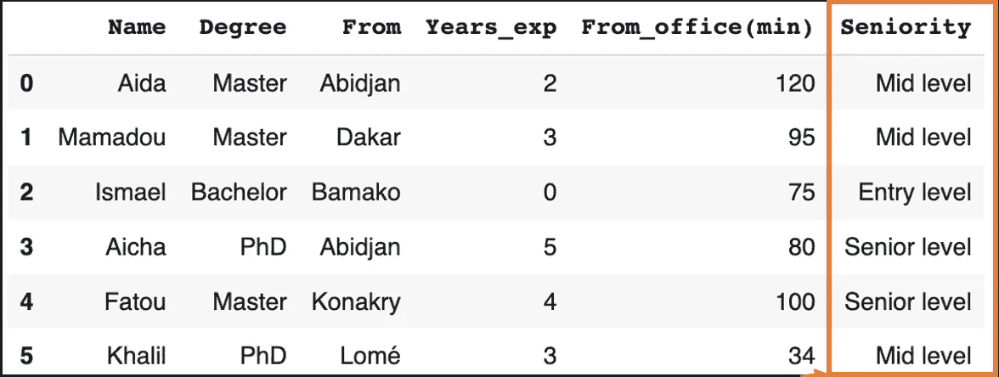

的结果。剪切功能(作者图片)

2️⃣ .𝙦𝙘𝙪𝙩()将您的数据分成大小相等的箱。
它使用数据分布的基本百分位数，而不是条块的边缘。

𝙎𝙘𝙚𝙣𝙖𝙧𝙞𝙤:将候选人的通勤时间分为𝙜𝙤𝙤𝙙、𝙖𝙘𝙘𝙚𝙥𝙩𝙖𝙗𝙡𝙚或𝙩𝙤𝙤 𝙡𝙤𝙣𝙜.


的结果。qcut 函数(图片由作者提供)

𝙆𝙚𝙚𝙥 𝙞𝙣 𝙢𝙞𝙣𝙙 💡

*   使用时。𝙘𝙪𝙩():箱数量=标签数量+ 1。
*   使用时。𝙦𝙘𝙪𝙩():箱柜数量=标签数量。
*   与。设置，否则，最低值将转换为 NaN。

## 3.基于列值从 Pandas 数据框架中选择行

➡使用。𝙦𝙪𝙚𝙧𝙮()函数通过指定过滤条件。

➡过滤表达式可以包含任何运算符(，==，！=，等等。)

➡使用@̷符号在表达式中使用变量。


根据列值从 Pandas 数据框架中选择行(图片由作者提供)

## 4.处理 zip 文件

有时候读和写会很有效率。zip 文件，而不从本地磁盘中提取它们。下面是一个插图。

## 5.选择𝗮𝘀𝘂𝗯𝘀𝗲𝘁𝗼𝗳𝘆𝗼𝘂𝗿𝗣𝗮𝗻𝗱𝗮𝘀𝗱𝗮𝘁𝗮𝗳𝗿𝗮𝗺𝗲𝘄𝗶𝘁𝗵𝘀𝗽𝗲𝗰𝗶𝗳𝗶𝗰𝗰𝗼𝗹𝘂𝗺𝗻𝘁𝘆𝗽𝗲𝘀

你可以使用𝙨𝙚𝙡𝙚𝙘𝙩_𝙙𝙩𝙮𝙥𝙚𝙨函数。它需要两个主要参数:𝚒𝚗𝚌𝚕𝚞𝚍𝚎 𝚊𝚗𝚍 𝚎𝚡𝚌𝚕𝚞𝚍𝚎.

*   𝚍𝚏.𝚜𝚎𝚕𝚎𝚌𝚝_𝚍𝚝𝚢𝚙𝚎𝚜(𝚒𝚗𝚌𝚕𝚞𝚍𝚎 = ['𝚝𝚢𝚙𝚎_𝟷'，'𝚝𝚢𝚙𝚎_𝟸'，… '𝚝𝚢𝚙𝚎_𝚗'])表示我希望数据框的子集包含𝚝𝚢𝚙𝚎_𝟷、𝚝𝚢𝚙𝚎_𝟸,…、𝚝𝚢𝚙𝚎_𝚗.的列
*   𝚍𝚏.𝚜𝚎𝚕𝚎𝚌𝚝_𝚍𝚝𝚢𝚙𝚎𝚜(𝚎𝚡𝚌𝚕𝚞𝚍𝚎 = ['𝚝𝚢𝚙𝚎_𝟷'，'𝚝𝚢𝚙𝚎_𝟸'，… '𝚝𝚢𝚙𝚎_𝚗'])表示我希望数据框的子集不包含𝚝𝚢𝚙𝚎_𝟷、𝚝𝚢𝚙𝚎_𝟸,…、𝚝𝚢𝚙𝚎_𝚗.的列

下面的✨就是一个例证

[select _ subset _ column _ types . py](https://gist.github.com/keitazoumana/2ea1f5d53a125655e8806b73392e7e6c#file-select_subset_column_types-py)

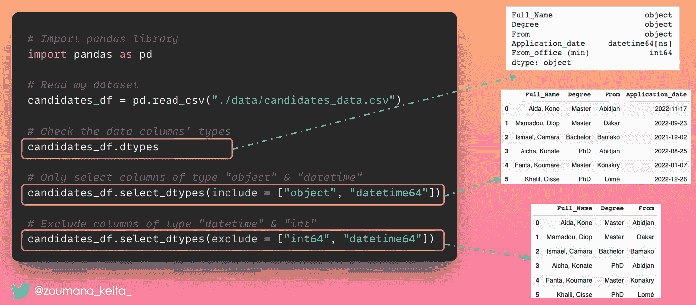

列子集选择(作者图片)

## 6.从熊猫数据框列中删除评论

假设我想通过从申请日期列中删除注释来清除这些数据(candidates.csv)。这可以在加载熊猫数据帧时使用𝙘𝙤𝙢𝙢𝙚𝙣𝙩参数动态完成，如下所示:

➡ 𝚌𝚕𝚎𝚊𝚗_𝚍𝚊𝚝𝚊 = 𝚙𝚍.𝚛𝚎𝚊𝚍_𝚌𝚜𝚟(𝚙𝚊𝚝𝚑_𝚝𝚘_𝚍𝚊𝚝𝚊, 𝙘𝙤𝙢𝙢𝙚𝙣𝙩=’𝚜𝚢𝚖𝚋𝚘𝚕’)

在我的例子中，是𝙘𝙤𝙢𝙢𝙚𝙣𝙩='#'，但也可以是任何其他字符(|，/等)。)取决于你的情况。插图是第一种情况。

✋🏽等等，如果我想为这些评论创建一个新列，但仍然将它们从申请日期列中删除，该怎么办？第二种情况是一个例子。

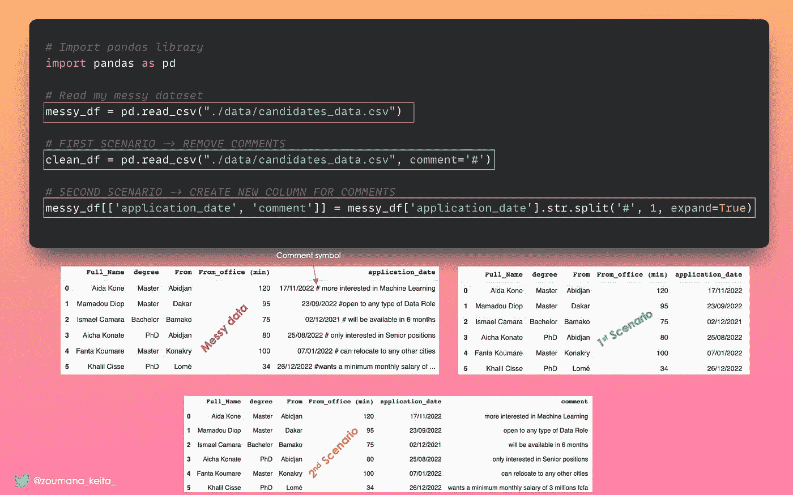

删除熊猫数据框中的评论(图片由作者提供)

## 7.从控制台以表格形式打印熊猫数据帧

❌否，对熊猫数据框应用𝚙𝚛𝚒𝚗𝚝()函数并不总是呈现易于阅读的输出，尤其是对于具有多列的数据框。

✅如果你想得到一个控制台友好的表格输出，使用。𝚝𝚘_𝚜𝚝𝚛𝚒𝚗𝚐()的功能如下所示。

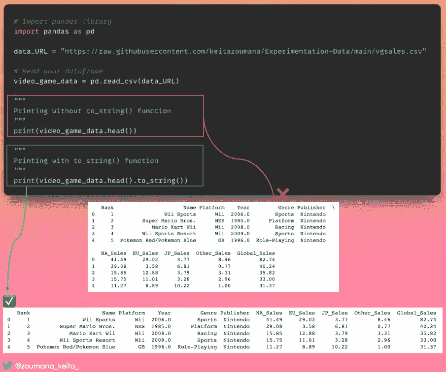

## 8.突出显示熊猫的数据点

对熊猫数据框应用颜色是强调某些数据点以便快速分析的好方法。

✅这是𝚙𝚊𝚗𝚍𝚊𝚜.𝚜𝚝𝚢𝚕𝚎模块派上了用场。它有许多功能，但不限于以下功能:

✨ 𝚍𝚏.𝚜𝚝𝚢𝚕𝚎.𝚑𝚒𝚐𝚑𝚕𝚒𝚐𝚑𝚝_𝚖𝚊𝚡()为每列的最大值指定一种颜色。

✨ 𝚍𝚏.𝚜𝚝𝚢𝚕𝚎.𝚑𝚒𝚐𝚑𝚕𝚒𝚐𝚑𝚝_𝚖in()为每列的最小值分配一种颜色。

✨ 𝚍𝚏.𝚜𝚝𝚢𝚕𝚎.𝚊𝚙𝚙𝚕𝚢(𝚖𝚢_𝚌𝚞𝚜𝚝𝚘𝚖_𝚏𝚞𝚗𝚌𝚝𝚒𝚘𝚗)将自定义函数应用于数据框。


突出显示熊猫的数据点(图片由作者提供)

## 9.减少数据中的小数点

有时，数据集中很长的十进制值并不能提供重要的信息，这可能会很痛苦🤯去看看。

因此，您可能希望将数据转换为大约 2 到 3 个小数点，以便于您的分析。

✅这是你可以用𝚙𝚊𝚗𝚍𝚊𝚜.来完成的事情𝙳𝚊𝚝𝚊𝙵𝚛𝚊𝚖𝚎.𝚛𝚘𝚞𝚗𝚍()的功能如下所示。

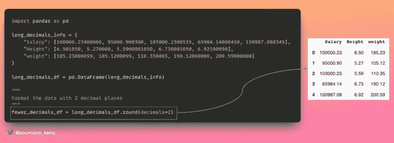

减少数据中的小数点(图片由作者提供)

## 10.替换数据框中的一些值

您可能想要替换数据框中的一些信息，以使其尽可能保持最新。

✅这可以通过熊猫𝚍𝚊𝚝𝚊𝚏𝚛𝚊𝚖𝚎.来实现𝚛𝚎𝚙𝚕𝚊𝚌𝚎()的功能如下所示。

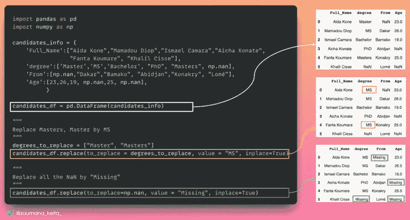

替换数据框中的一些值(图片由作者提供)

## 11.比较两个数据帧并获得它们的差异

有时候，在比较两个熊猫数据帧时，不仅想知道它们是否等价，还想知道如果不等价，区别在哪里。

✅这是。𝚌𝚘𝚖𝚙𝚊𝚛𝚎()的功能派上了用场。

✨它生成一个数据框，并排显示有差异的列。只有当比较的两个数据相同时，它的形状才不同于(0，0)。

✨如果要显示相等的值，请将𝚔𝚎𝚎𝚙_𝚎𝚚𝚞𝚊𝚕参数设置为𝚃𝚛𝚞𝚎.否则，它们会显示为𝙽𝚊𝙽.

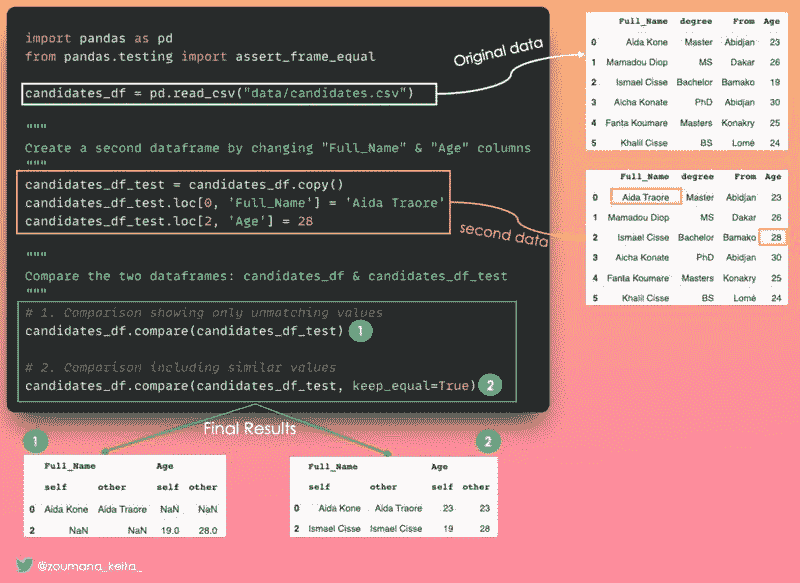

比较两个数据框并获得它们的差异(图片由作者提供)

## 12.获取大型数据集的子集以进行快速分析

有时，我们只需要一个非常大的数据集的子集来进行快速分析。其中一种方法是在获取样本之前读取内存中的全部数据。

这可能需要大量内存，具体取决于数据的大小。此外，读取数据可能需要很长时间。

✅你可以通过指定你想要的行数来使用𝚛𝚎𝚊𝚍_𝚌𝚜𝚟(熊猫函数中的𝚗𝚛𝚘𝚠𝚜参数。

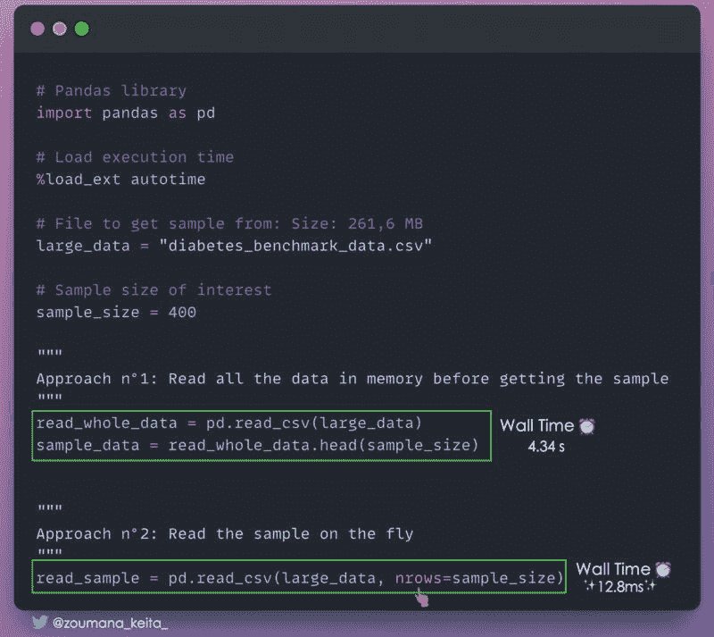

获取大型数据集的子集以进行快速分析(图片由作者提供)

## 13.将数据框从宽格式转换为长格式

有时，它可以是有用的𝚝𝚛𝚊𝚗𝚜𝚏𝚘𝚛𝚖𝚢𝚘𝚞𝚛𝚍𝚊𝚝𝚊𝚏𝚛𝚊𝚖𝚎𝚏𝚛𝚘𝚖𝚊𝚠𝚒𝚍𝚎𝚝𝚘𝚊𝚕𝚘𝚗𝚐𝚏𝚘𝚛𝚖𝚊𝚝，更灵活，更好的分析，特别是在处理时间序列数据。

*   𝙒𝙝𝙖𝙩 𝙙𝙤 𝙮𝙤𝙪 𝙢𝙚𝙖𝙣 𝙗𝙮 𝙬𝙞𝙙𝙚 & 𝙡𝙤𝙣𝙜?

✨宽格式是当你有很多栏的时候。
✨长格式的另一边是当你有很多行的时候。

✅ 𝙿𝚊𝚗𝚍𝚊𝚜.𝚖𝚎𝚕𝚝()是这项任务的完美候选人。

下面是一幅插图

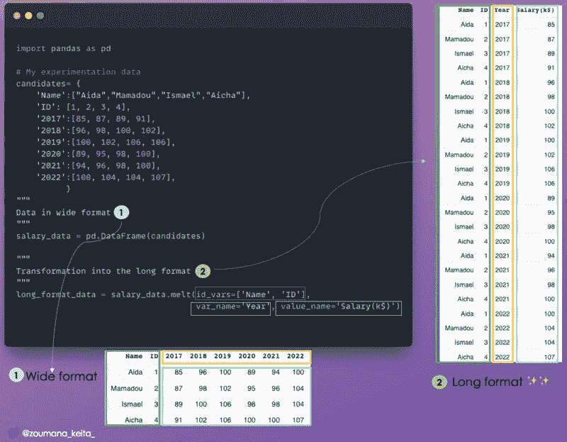

将数据框从宽格式转换为长格式(图片由作者提供)

## 14.通过忽略索引来减小熊猫数据框的大小

你知道你可以通过在保存熊猫数据框时忽略索引来减小它的大小吗？

保存文件时，✅类似于𝚒𝚗𝚍𝚎𝚡 = 𝙵𝚊𝚕𝚜𝚎。

下面是一个插图。


通过忽略索引来减小熊猫数据框的大小(图片由作者提供)

## 15.拼花地板代替 CSV

很多时候，我不会手动查看👀熊猫将使用 CSV 或 Excel 文件的内容进行进一步分析。

如果这是你的情况，也许你不应该使用。CSV 了，想一个更好的选择。

尤其是如果你只关心

✨处理速度

储蓄和装载的✨速度

数据帧占用的✨磁盘空间

✅在那种情况下，。如下图所示，𝙥𝙖𝙧𝙦𝙪𝙚𝙩格式是你的最佳选择。

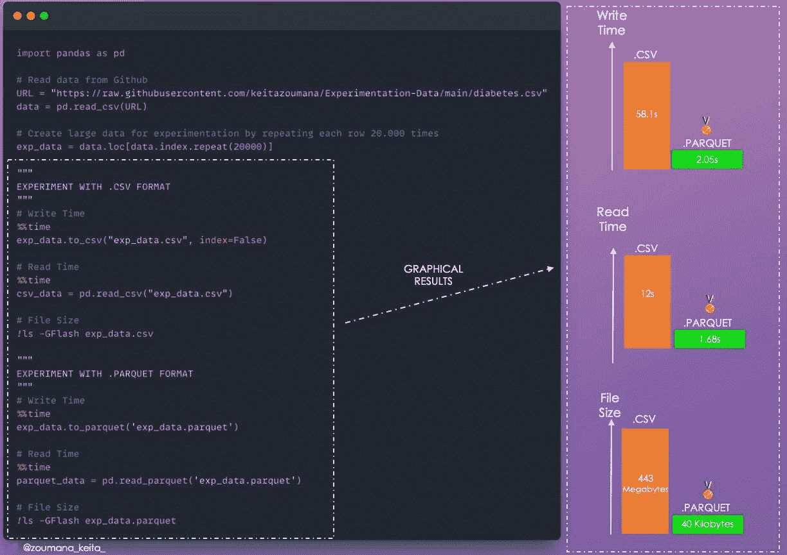

拼花地板代替 CSV(图片由作者提供)

## 16.将您的数据框转换为降价

以更容易理解的方式打印数据框总是更好。

✅一种方法是使用。𝚝𝚘_𝚖𝚊𝚛𝚔𝚍𝚘𝚠𝚗()函数。

💡下面是一幅插图


## 17.格式化日期时间列

当加载 Pandas 数据帧时，默认情况下，日期列表示为𝗼𝗯𝗷𝗲𝗰𝘁，这不是❌的正确日期格式。

✅您可以在𝗽𝗮𝗿𝘀𝗲_𝗱𝗮𝘁𝗲𝘀参数中指定目标列，以获得正确的列类型。


日期时间格式

# Python 技巧和窍门

## 1.用 tqdm 和 rich 创建进度条

当您想要查看给定任务的可视状态时，使用进度条非常有用。

```
#!pip -q install rich
from rich.progress import track
from tqdm import tqdm
import time
```

实现回调函数

```
def compute_double(x):
      return 2*x
```

创建进度条

丰富的进度条实现

tqdm 进度条实现

## 2.获取日、月、年、星期几、一年中的月份


获取日、月、年、星期几、一年中的月份(图片由作者提供)

## 3.列的最小和最大值

如果要获取给定列中具有最大值或最小值的行，可以使用以下函数:

✨ 𝚍𝚏.𝚗𝚕𝚊𝚛𝚐𝚎𝚜𝚝(𝙽，“𝙲𝚘𝚕_𝙽𝚊𝚖𝚎”)→基于𝙲𝚘𝚕_𝙽𝚊𝚖𝚎的顶级𝙽行

✨ 𝚍𝚏.𝚗𝚜𝚖𝚊𝚕𝚕𝚎𝚜𝚝(𝙽，“𝙲𝚘𝚕_𝙽𝚊𝚖𝚎”)→𝙽基于𝙲𝚘𝚕_𝙽𝚊𝚖𝚎的最小行

✨ 𝙲𝚘𝚕_𝙽𝚊𝚖𝚎是您感兴趣的列的名称。

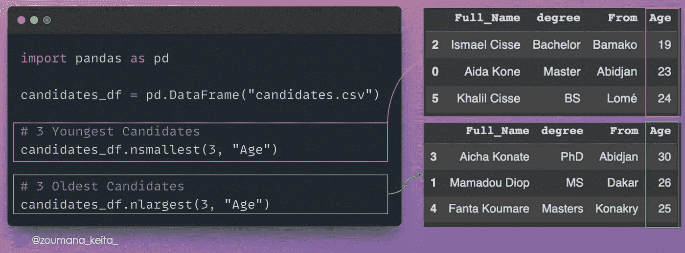

最小和最大值插图(图片由作者提供)

## 4.忽略 pip 安装命令的日志输出

有时，当从 jupyter 笔记本安装一个库时，您可能不想让默认的𝚙𝚒𝚙 𝚒𝚗𝚜𝚝𝚊𝚕𝚕命令生成关于安装过程的所有细节。

✅您可以指定-q 或 quiet 选项来删除这些信息。

下面是一幅插图💡

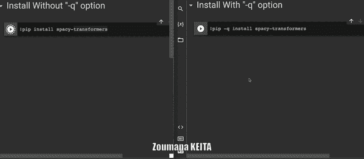

pip 安装插图(作者制作的动画)

## 5.在单个笔记本单元中运行多个命令

感叹号“！”是从 Jupyter 笔记本上成功运行 shell 命令的基础。

然而，这种方法可能相当重复🔂当处理多个命令或者一个很长很复杂的命令时。

✅解决这个问题的更好的方法是在你的笔记本单元格的开头使用%%𝐛𝐚𝐬𝐡表达式。

💡下面是一幅插图

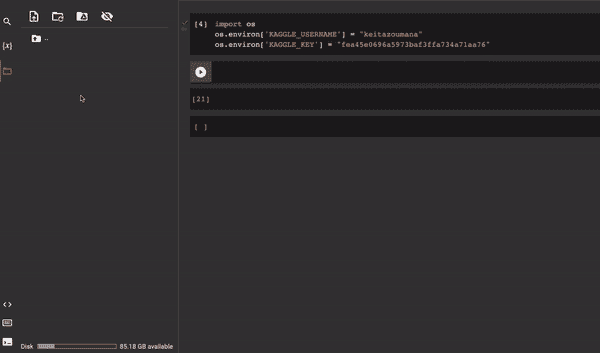

%%bash 语句的图示(由 Autor 制作动画)

## 6.虚拟环境。

一个数据科学项目可能涉及多个依赖项，处理所有这些依赖项可能有点烦人。🤯

✨一个好的做法是组织你的项目，使它可以很容易地与你的团队成员分享，并以最少的努力再现。

✅:一种方法是使用虚拟环境。

⚙️ 𝗖𝗿𝗲𝗮𝘁𝗲 𝘃𝗶𝗿𝘁𝘂𝗮𝗹 𝗲𝗻𝘃𝗶𝗿𝗼𝗻𝗺𝗲𝗻𝘁 𝗮𝗻𝗱 𝗶𝗻𝘀𝘁𝗮𝗹𝗹 𝗹𝗶𝗯𝗿𝗮𝗿𝗶𝗲𝘀.

→安装虚拟环境模块。
𝚙𝚒𝚙 𝚒𝚗𝚜𝚝𝚊𝚕𝚕 𝚟𝚒𝚛𝚝𝚞𝚊𝚕𝚎𝚗𝚟

→给环境起一个有意义的名字。𝚟𝚒𝚛𝚝𝚞𝚊𝚕𝚎𝚗𝚟[𝚢𝚘𝚞𝚛_𝚎𝚗𝚟𝚒𝚛𝚘𝚗𝚖𝚎𝚗𝚝_𝚗𝚊𝚖𝚎]

→激活你的环境。𝚜𝚘𝚞𝚛𝚌𝚎[𝚢𝚘𝚞𝚛_𝚎𝚗𝚟𝚒𝚛𝚘𝚗𝚖𝚎𝚗𝚝_𝚗𝚊𝚖𝚎]/𝚋𝚒𝚗/𝚊𝚌𝚝𝚒𝚟𝚊𝚝𝚎

→开始安装项目的依赖项。
𝚙𝚒𝚙 𝚒𝚗𝚜𝚝𝚊𝚕𝚕 𝚙𝚊𝚗𝚍𝚊𝚜
…

这一切都很棒👏🏼，但是…您刚刚创建的虚拟环境在您的机器上是本地的😏。

𝙒𝙝𝙖𝙩 𝙩𝙤 𝙙𝙤?🤷🏻‍♂️

💡您需要永久保存这些依赖关系，以便使用以下命令与其他人共享它们:

→ 𝚙𝚒𝚙 𝚏𝚛𝚎𝚎𝚣𝚎 > 𝚛𝚎𝚚𝚞𝚒𝚛𝚎𝚖𝚎𝚗𝚝𝚜.𝚝𝚡𝚝

这将创造𝚛𝚎𝚚𝚞𝚒𝚛𝚎𝚖𝚎𝚗𝚝𝚜.包含项目依赖项的𝚝𝚡𝚝文件。

🔚最后，任何人都可以通过运行这个命令来安装完全相同的依赖项:
→ 𝚙𝚒𝚙 𝚒𝚗𝚜𝚝𝚊𝚕𝚕 -𝚛 𝚛𝚎𝚚𝚞𝚒𝚛𝚎𝚖𝚎𝚗𝚝𝚜.𝚝𝚡𝚝

## 7.一次运行多个指标

Scikit 学习指标

## 8.将多个列表链接成一个序列

您可以使用单个 for 循环作为单个序列遍历多个列表🔂。

✅这可以通过使用 Python 𝗶𝘁𝗲𝗿𝘁𝗼𝗼𝗹𝘀模块中的𝚌𝚑𝚊𝚒𝚗() ⛓函数来实现。

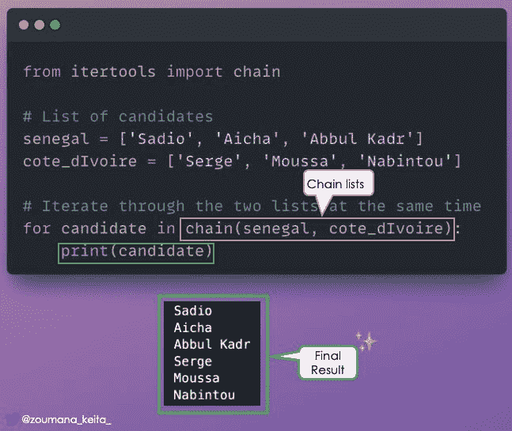

列表链接

## 9.JSON 数据的漂亮打印

❓曾经想要以正确的缩进格式打印 JSON 数据以便更好地可视化吗？

dumps()方法的 indent 参数可用于指定格式化字符串输出的缩进级别。

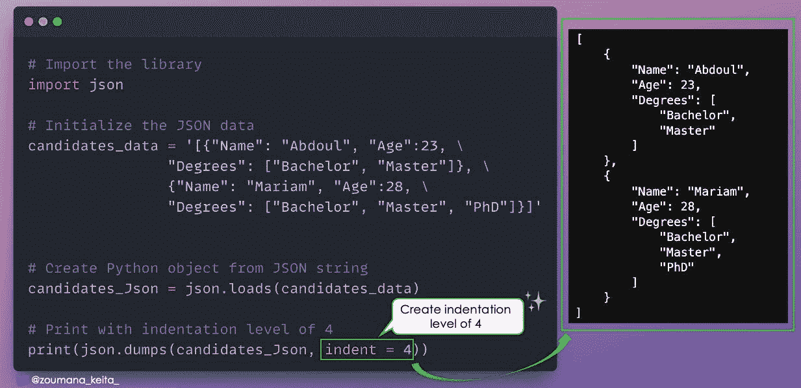

漂亮地打印您的 JSON 数据

## 10.单元测试

你测试你的代码吗？🧪

我的意思是你执行单元测试吗？

无论您是数据科学家还是软件开发人员，单元测试都是确保实现的特性符合预期行为的重要步骤。

这无疑在许多层面上都是有益的:

✨质量更好💎代码。

当添加新特性时，✨允许更简单和更敏捷的代码。

✨降低成本💰通过节省开发时间⏳和避免错误发现的后期阶段。

✨更……

✅和𝘂𝗻𝗶𝘁𝘁𝗲𝘀𝘁一起，你可以像专家一样执行单元测试😎

下面是一幅插图💡

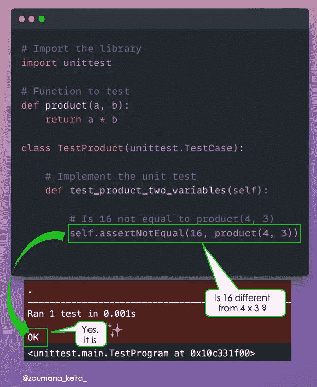

单元测试插图

## 11.迭代多个列表

当试图从这些列表中映射⛓信息时，同时迭代多个列表是有益的。

✅:我的首选方法是 Python 𝘇𝗶𝗽函数。

下面是一幅插图💡

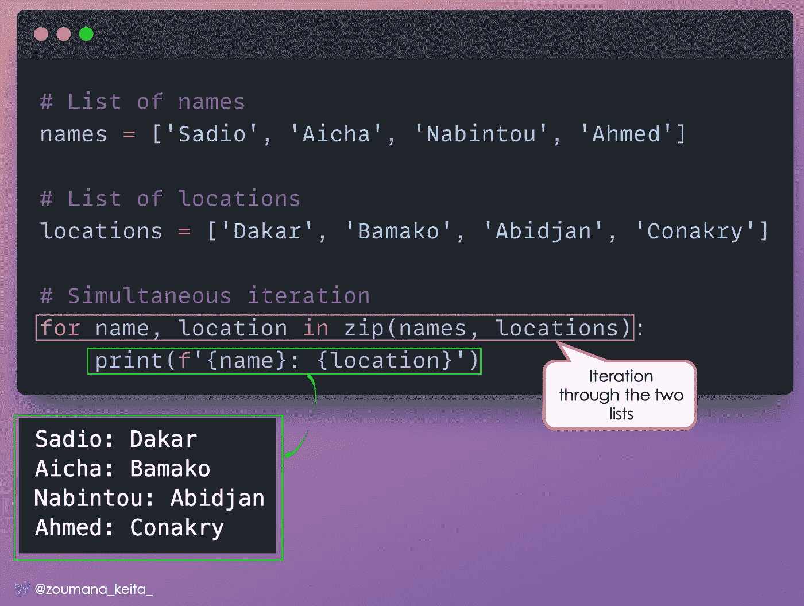

迭代多个列表

## 12.嵌套 for 循环的替代方法

如果你曾经使用过嵌套循环，请举手🔁 🙋🏾‍♂️

当程序变得复杂时，这在大多数情况下是不可避免的。

然而，使用嵌套循环 get 会使你的程序更难阅读🔬并保持🙅🏽‍♂️.

✅你可以使用 Python 内置的𝗽𝗿𝗼𝗱𝘂𝗰𝘁()函数来代替。

下面是一幅插图💡

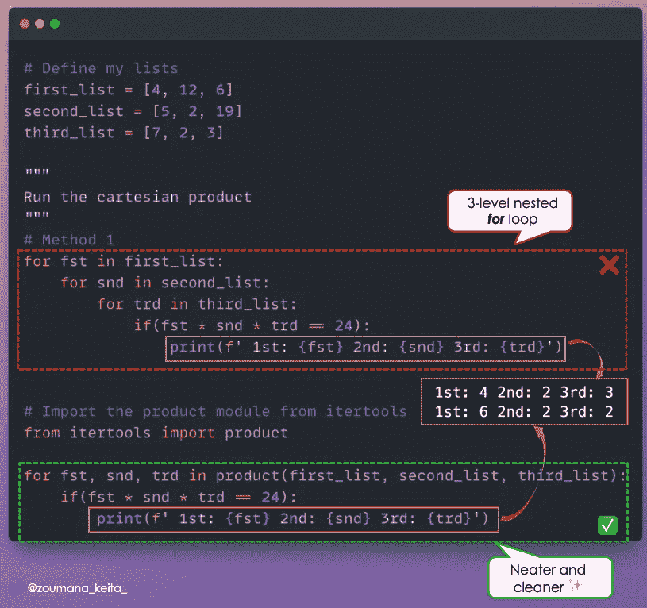

嵌套 for 循环的解决方案

## 13.文本预处理变得简单

文本␂␃预处理从来都不容易。

❓How 您必须编写许多函数或正则表达式来执行基本的文本预处理任务，例如:

✨修复 Unicode

✨删除网址

✨正在摆脱数字、标点符号等吗？

这些任务不仅耗时⏰而且还可能增加复杂性📈取决于文本。

✅使用𝗰𝗹𝗲𝗮𝗻-𝘁𝗲𝘅𝘁 Python 库可以带走所有的负担。

下面是一幅插图💡

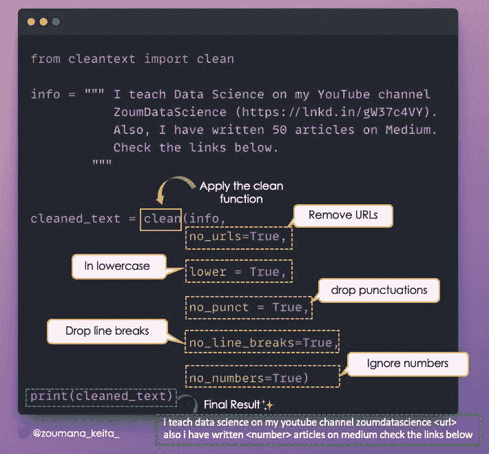

文本预处理插图(图片由作者提供)

# 结论

感谢您的阅读！🎉 🍾

我希望你发现这个蟒蛇和熊猫的把戏列表很有帮助！在这里保持关注，因为内容会在日常的基础上用更多的招数来维护。

此外，如果你喜欢阅读我的故事，并希望支持我的写作，可以考虑[成为一个媒体成员](https://zoumanakeita.medium.com/membership)。每月支付 5 美元，你就可以无限制地阅读媒体上的故事。

欢迎在[媒体](https://zoumanakeita.medium.com/)、[推特](https://twitter.com/zoumana_keita_)和 [YouTube](https://www.youtube.com/channel/UC9xKdy8cz6ZuJU5FTNtM_pQ) 上关注我，或者在 [LinkedIn](https://www.linkedin.com/in/zoumana-keita/) 上问好。讨论人工智能、人工智能、数据科学、自然语言处理和人工智能是一种乐趣！