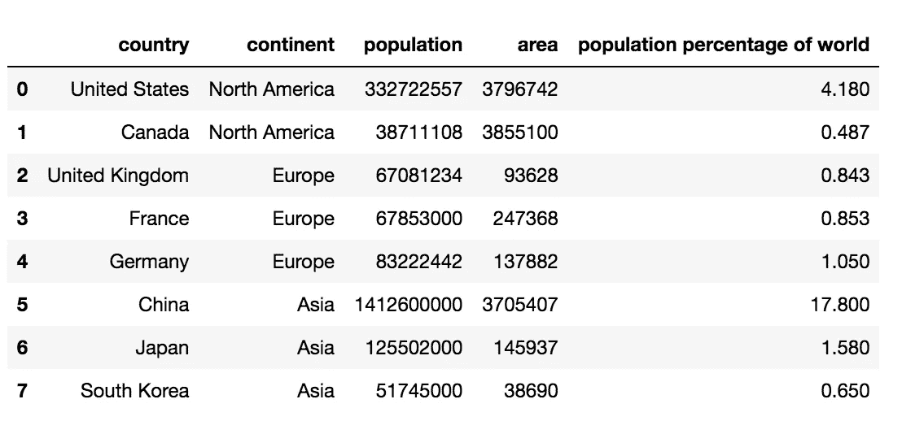
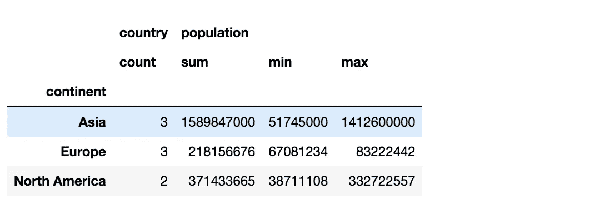

# 熊猫小组，简单解释

> 原文：<https://towardsdatascience.com/pandas-groupby-explained-simply-b2ea80521cbb>

## 熊猫分组的分步示例和不同用例


Anthony Intraversato 在 [Unsplash](https://unsplash.com?utm_source=medium&utm_medium=referral) 上拍摄的照片

# **简介**

在数据科学社区中， [Pandas](https://pandas.pydata.org/) 已经成为一个非常流行的处理和操作数据的框架。它基于 Python，一种我们都熟悉的非常简单和通用的语言。它提供了许多有用的功能来帮助我们将数据转换成我们想要的格式。其中之一是`[groupby](https://pandas.pydata.org/docs/reference/api/pandas.DataFrame.groupby.html)`，这个函数可以根据某些列的值将 [DataFrame](https://pandas.pydata.org/docs/reference/api/pandas.DataFrame.html) 行划分成组。

当我第一次学习`groupby`时，我感到有点困惑，因为似乎有不同的方式可以使用`groupby`。这篇文章的目的是解释`groupby`如何与具体的例子和不同的用例一起工作。

注意，我会假设你对熊猫有基本的了解。事不宜迟，让我们直接开始吧！

# **数据**

为了举例说明涉及`groupby`的例子，首先有一些数据是有用的。在这里，我提供了一个定制的数据框架，其中包含几个国家的一些信息。这里，我们有北美的美国和加拿大；欧洲的英国、法国和德国；亚洲的中国、日本和韩国。

```
import pandas as pddf = pd.DataFrame({
    "country" : ["United States", "Canada", "United Kingdom", "France", "Germany", "China", "Japan", "South Korea"],
    "continent" : ["North America", "North America", "Europe", "Europe", "Europe", "Asia", "Asia", "Asia"],
    "population" : [332722557, 38711108, 67081234, 67853000, 83222442, 1412600000, 125502000, 51745000],
    "area" : [3796742, 3855100, 93628, 247368, 137882, 3705407, 145937, 38690],
    "population percentage of world": [4.18, 0.487, 0.843, 0.853, 1.05, 17.8, 1.58, 0.650]
})
df
```

以下是生成的数据帧的外观:



数据来自维基百科([人口来源](https://en.wikipedia.org/wiki/List_of_countries_and_dependencies_by_population)，[地区来源](https://en.wikipedia.org/wiki/List_of_countries_and_dependencies_by_area))

在这个数据框架中，面积单位是平方英里，而世界人口百分比是百分比。

# **按对象分组**

既然有了数据，就开始探索`groupby`能做什么吧。

假设我们想根据洲来划分我们的数据。我们可以从以下方面着手:

```
df.groupby("continent")
```


请注意，在 jupyter 单元格中执行此操作会打印一个存储在某个内存地址的`groupby`对象。幕后发生的事情是，`groupby`对象根据我们指定的列`continent`对数据帧进行分组。

# **具有聚合函数的 GroupBy】**

为了得到更有用的东西，我们需要告诉`groupby`在我们将数据分组后该做什么。

举个例子吧。假设我们想打印每个洲的条目(行)数，并保留所有列。我们如何实现这一目标？下面是最简单的方法:

```
df.groupby("continent").count()
```


这里的`[count()](https://pandas.pydata.org/docs/reference/api/pandas.core.groupby.GroupBy.count.html)`接收属于每个组(洲)的所有条目，并计算条目的数量，有效地将每个组的条目聚合成一个代表计数的数字。`count()`是一个聚合函数的例子。其他比较流行的聚合函数还有`[sum()](https://pandas.pydata.org/docs/reference/api/pandas.core.groupby.GroupBy.sum.html)`、`[min()](https://pandas.pydata.org/docs/reference/api/pandas.core.groupby.GroupBy.min.html)`、`[max()](https://pandas.pydata.org/docs/reference/api/pandas.core.groupby.GroupBy.max.html)`，对每组进行相应的运算。这里是`groupby`对象支持的所有聚合函数的[列表](https://pandas.pydata.org/docs/reference/groupby.html)。

# **具有聚合函数的 GroupBy 多索引**

在一个`groupby`对象上使用一个聚合函数是很好的，但是如果您希望每一列使用不同的聚合函数呢？例如，假设对于每个大洲，我们需要一个国家和最小、最大和总人口的计数。我们如何实现这一目标？

嗯，`[agg](https://pandas.pydata.org/pandas-docs/version/0.23/generated/pandas.core.groupby.DataFrameGroupBy.agg.html)`函数就是实现这一点的确切方法。我们可以向`agg`传递一个字典，其中包含作为键的列名和作为值的聚合函数名，如下所示:

```
df_agg = df.groupby("continent").agg({"country": "count", "population": ["sum", "min", "max"]})
df_agg
```

生成的数据帧如下所示:



这就是我们想要的。如您所见，现在我们有了一个国家的计数，以及人口的三个统计数据。

这里值得注意的一点是，数据帧似乎有一个两级列结构。这在 Pandas 中称为[多索引](https://pandas.pydata.org/docs/user_guide/advanced.html)，其中需要多个值来访问某一列的值。为了验证这一点，我们可以打印 DataFrame 的列:

```
print(df_agg.columns)
```


例如，要访问 max population 的值，我们需要传入人口元组和 max 作为 DataFrame 的索引:

```
print(df_agg[("population", "max")])
```


# **具有聚合函数的 GroupBy 单索引**

如果您不想处理多索引，而是恢复到单索引，您可以通过在`agg`函数中指定新的列名作为参数来实现:

```
df_agg_single = df.groupby("continent").agg(country_count = ("country", "count"), population_sum = ("population", "sum"), population_min = ("population", "min"), population_max = ("population", "max"))
df_agg_single
```

这将给出一个包含您指定的新列名的单一索引结果:


我们可以通过返回并打印列以及通过单个索引进行访问来验证这一点。

```
print(df_agg_single.columns)
```


```
print(df_agg_single["population_max"])
```


# **具有应用功能的分组依据**

到目前为止，我们已经了解了如何对不同的列应用不同的聚合函数。但是，如果您想计算依赖于两列或更多列的值，该怎么办呢？

例如，假设您想要根据数据中某个洲内的国家来计算该洲的人口密度。我们还想计算一个大陆的人口占世界人口的百分比是否大于 3%。就我们目前所拥有的，我们无法通过聚合函数实现这一点。

我们需要别的东西。这个*是另外一个*是`[apply](https://pandas.pydata.org/pandas-docs/version/0.22/generated/pandas.core.groupby.GroupBy.apply.html)`，一个熊猫函数，它允许我们在将数据分组后指定我们自己的处理函数，在我们的例子中，是按洲分组。

如果我们想要总人口和人口密度，解决方案应该是这样的:

```
def process_continent(continent):
    result = {}
    if continent["population percentage of world"].sum() > 3:
        result["population"] = continent["population"].sum()
        result["population density"] = result["population"] / continent["area"].sum()
    return pd.Series(result, index = ["population", "population density"], dtype = "float64")df_density = df.groupby("continent").apply(process_continent)
df_density
```


如您所见，我们将定义的函数`process_continent`传递给`apply`。在`process_continent`，我们可以接触到每个大洲对应的每个组。我们检查它占世界人口的百分比是否大于 3；如果是，那么我们计算它的总人口和密度，并将结果作为[序列](https://pandas.pydata.org/docs/reference/api/pandas.Series.html)返回。

你可能会注意到有欧洲的`NaN`条目。这是因为在我们的数据中，欧洲的人口不超过 3%，因此没有返回任何内容。为了将其从结果数据帧中排除，我们可以使用`.dropna()`:

```
df_density.dropna()
```


最后，我们的数据框架显示了我们想要的东西:)

# 结论

如果你已经做到了这一步，恭喜你，我希望你在这篇文章中学到了一些有用的东西。我希望这篇文章能对`groupby`的工作原理和实际应用给出更清晰的解释。简而言之，`groupby`与聚合函数配合得很好，如果需要涉及多列的更具体的操作，那么`apply`可以与自定义函数配合使用。

如果你需要的话，这里有这篇文章中讨论的所有代码的链接。

这一个就这么多了！敬请关注未来的文章，如果你觉得我的文章有帮助，别忘了关注我。

以下是我的一些其他帖子，请随意查看:

[](/broadcasting-in-numpy-a-powerful-technique-you-should-know-7dc1dde619fa)  [](/vectorization-must-know-technique-to-speed-up-operations-100x-faster-50b6e89ddd45)  [](https://medium.datadriveninvestor.com/top-20-masters-programs-in-ai-data-science-2021-98aadb7db409)  [](/semantic-similarity-using-transformers-8f3cb5bf66d6)  [](/bert-text-classification-using-pytorch-723dfb8b6b5b)  

# 参考

[群聚，熊猫](https://pandas.pydata.org/docs/reference/api/pandas.DataFrame.groupby.html)

[pandas GroupBy:你的 Python 数据分组指南，真正的 Python](https://realpython.com/pandas-groupby/)

[Python | Pandas data frame . group by()，GeeksForGeeks](https://www.geeksforgeeks.org/python-pandas-dataframe-groupby/)

[Python 熊猫— GroupBy，TutorialsPoint](https://www.tutorialspoint.com/python_pandas/python_pandas_groupby.htm)

[按人口统计的国家和属地列表，维基百科](https://en.wikipedia.org/wiki/List_of_countries_and_dependencies_by_population)

[维基百科按地区列出的国家和属地列表](https://en.wikipedia.org/wiki/List_of_countries_and_dependencies_by_area)