# 熊猫多指数解释

> 原文：<https://towardsdatascience.com/pandas-multi-index-explained-6f11d880c0e5>

## 分级索引

在前几章中，我们看到了如何使用索引。我们要么使用`DataFrame`中提供的默认索引，要么将一列转换成索引。

<https://battox.medium.com/a-thorough-intro-to-pandas-for-data-analysis-ii-d09cbbf67cd>  

现在，我们将看到 Pandas 提供的更多可能性，以通过索引探索一个`DataFrame`，以及我们如何能够拥有多个索引。

在下面的例子中，我们将使用一个数据集，该数据集包含基于马克斯·普朗克进化人类学研究所的世界语言结构图集的 CSV 文件中的世界人类语言信息。

```
import pandas as pd

# We import a CSV dataset.
df = pd.read_csv('human_natural_languages.csv')

# And we are going to convert the column "genus" into index.
df.set_index('genus', inplace=True)
```

**`**inplace**`**论证****

**我们可以用来修改一个`DataFrame`的许多方法会产生一个新的`DataFrame`，并保持原来的完整。用参数`inplace=True`我们修改原来的`DataFrame`。**

```
df.set_index(column, inplace=True)
```

**现在`DataFrame`有了新的索引。如果不使用`inplace=True`，我们也可以做得差不多:**

```
df = df.set_index(column)
```

**这就是我们在上一章中所做的将列转换成索引。**

**我们可以用“genus”作为索引快速浏览一下`DataFrame`，我们会注意到**设置索引保留了行的原始顺序**(在这种情况下是列“Name”的字母顺序)。请记住，当我们将一个列转换为索引时，即使它看起来像一个列，它的行为却并不如此。**

**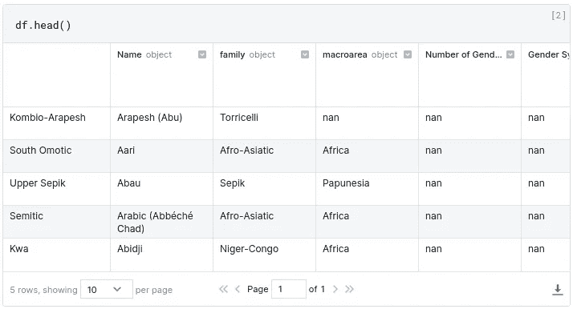**

**图片作者。**

**例如，我们可以通过使用`loc`来选择索引的一个类别。如果我们选择的标签出现不止一次，我们将看到几行。**

**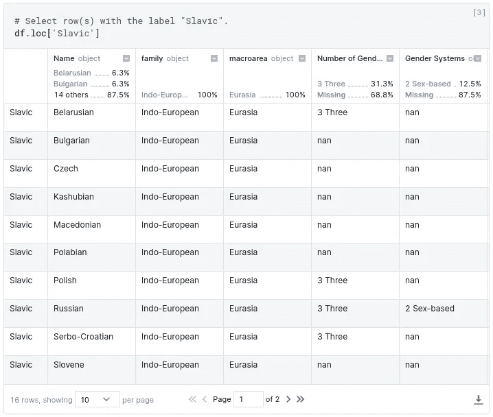**

**图片作者。**

**或者几类。**

****

**图片作者。**

**在表格的开始将会有一种爱尔兰语，到最后，将会有日耳曼语。**

**每当我们需要将索引变回列时，我们将使用`DataFrame.reset_index()`。索引一直存在:当它不是数据集的一列或我们定义的另一个索引时，默认情况下将生成一个索引(标签与位置匹配)。**

**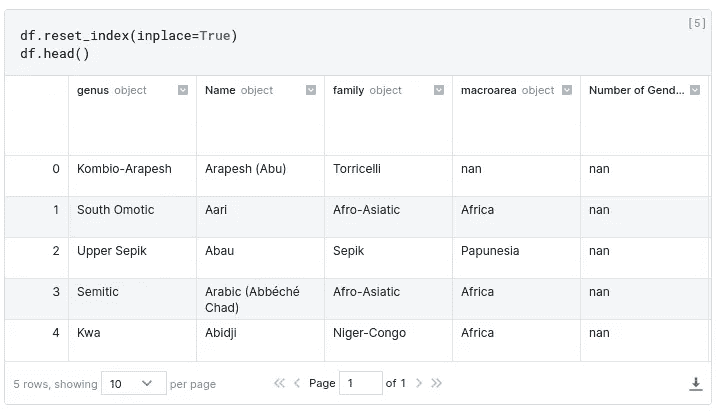**

**图片作者。**

**注意“genus”也是一个列(在第一个位置)。

如果我们没有兴趣将索引(属)保存为一列，我们可能会将`drop=True`参数添加到`reset_index()`中，它可能会被丢弃。**

****

**由 [DeepAI](https://deepai.org/) text2img 模型生成的熊猫套娃。**

# **多指数**

**Pandas 的优点在于它能够将多列或者多行转换成索引。那叫**多指标**。多索引将包含许多索引级别，因此，将建立索引级别的层次结构。**

**尽管能够将多列的内容转换成索引，但我们不能认为现在一行有几个索引，这一点很重要。**多指标**还是一个。有层次。**

**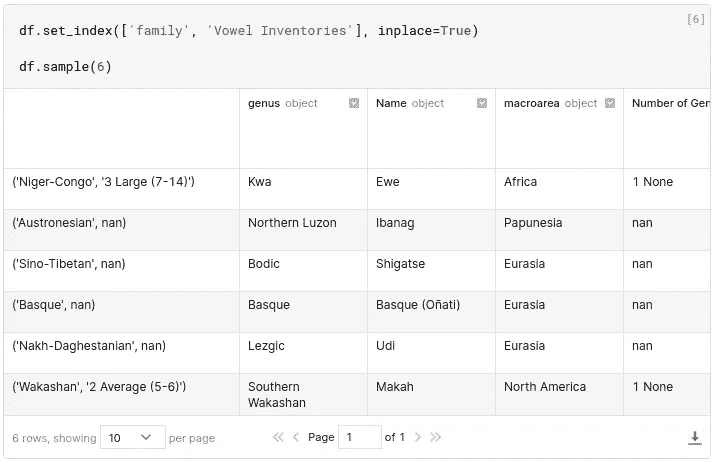**

**图片作者。**

**在这种情况下,“家庭”是指数化的第 0 级，并且优先于指数化的第 1 级“元音目录”。我们现在可以通过名称或级别编号来引用级别。**

****

**图片作者。**

**`FrozenList`有点像普通的`list`，现在不用担心。**

**索引可以有名称，也可以没有名称。大多数情况下，并不是这样:例如，我们到目前为止使用的自动生成的整数索引是在没有名称的情况下创建的。提升为索引的列将列的名称转换为索引的名称，因此索引有了名称，可以修改或删除该名称。**

# **元组**

**在全面了解多索引之前，我们需要介绍 Python 的另一个本机对象`tuple`。**

**一个`tuple`和一个`list`的区别在于列表是可变的，而元组不是；换句话说，我们可以在创建了一个`list`之后添加或删除元素，但是我们不能对一个`tuple`做这样的事情。一旦创建，如果我们想要不同的东西，我们需要创建另一个`tuple`。

我们创建它们的方式类似于创建`list`的方式，但我们将使用圆括号(圆括号)代替方括号。**

```
name_of_tuple = (element_a, element_b)
```

**`DataFrame`的每一行现在用一个`tuple`索引。在前面的例子中，当我们使用“单一”索引时，行是由字符串标签索引的。将`tuple`视为多索引行或列的标签。

在多指标中，`tuple`的元素和指标级别一样多。例如，如果多索引有三个级别，这样的元组将被成形为`(level_0, level_1, level_2)`。**

****

**图片作者。**

**如果你需要检索一个级别的值，Pandas 会帮你搞定`MultiIndex.get_level_values()`。**

****

**图片作者。**

**让我们试一试。我们从 0 级“家族”中选择印欧语，从 1 级“元音库存”中选择元音库存为 5 或 6 的语言。**

**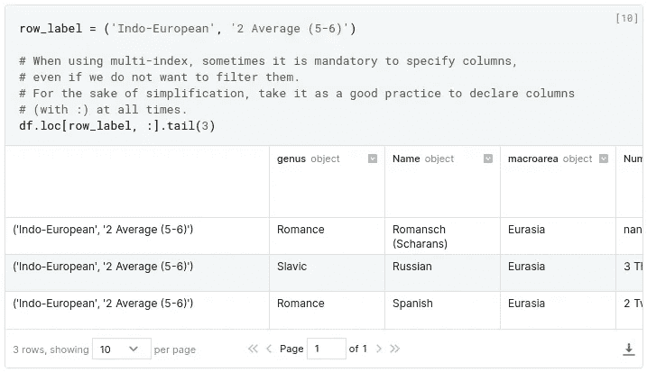**

**图片作者。**

**让我们假设这一次我们不想要印欧语系的语言，而是阿拉瓦坎语和乌拉尔语系的语言。我们没有使用单个标签(将其解释为单个`tuple`)，而是传递一个`list`标签(实际上是一个`tuple`列表)。**

**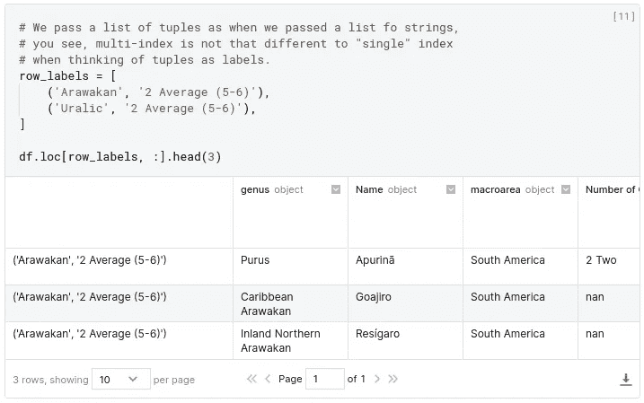**

**图片作者。**

**这是我们刚才所做的另一种方式。**

****

**图片作者。**

**现在有一个小挑战:让我们假设我们想要从级别 0 的所有行中的**中找到级别 1 的结果(例如，小元音库存)(我们实际上忽略了级别 0)。当然，我们可以将 0 级变回列，但是不行，我们不想修改多索引。所以，也许，我们会尝试检索 0 级的所有标签和 1 级的一个标签。我们可以尝试通过使用数据集的全范围`slice` ( `first_row:last_row`)或仅使用冒号`:`来做到这一点。****

```
row_labels = (:, '1 Small (2-4)')
```

**不。这个语法不正确。`slice`仅在索引器`[]`(方括号)内工作，不与任何其他对象(本例中为`tuple`)一起工作。

为此，熊猫提供了一种叫做`IndexSlice`的特殊型号来代替`tuple` s。**

****

**图片作者。**

**有些人喜欢将`IndexSlice`分配给一个较短的标识符，因为他们知道会多次使用它。**

**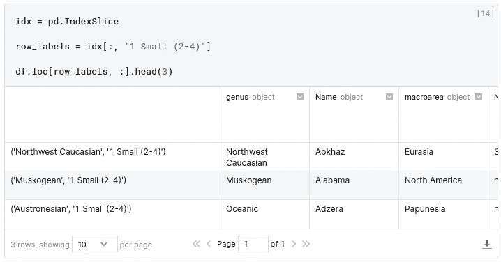**

**图片作者。**

# **横截面**

**使用`DataFrame.xs()`方法是绕过层级的一种简便方法。它的缺点是只为选择而不为分配而工作**。当我们需要改变帧值时，我们必须照常使用`loc` / `iloc`。****

****

**图片作者。**

# **部分选择**

**分层索引的一个重要特性是，您可以通过*部分*标签选择数据，识别数据中的子组。

如果我们只对多索引的更高级别感兴趣，而不是通过`pd.IndexSlice['Indo-European', :]`来选择行，比如我们将一个级别为 0 的标签和所有级别为 1 的标签作为目标，我们可以简单地使用`'Indo-European'`。

**非常重要**:部分选择*会在结果中删除层次索引的*级。**

**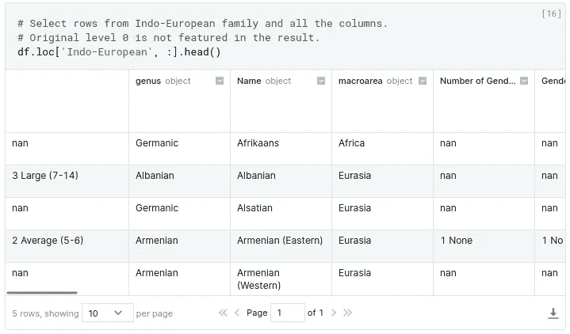**

**图片作者。**

# **整理**

**这个`DataFrame`仍然是按照“名称”栏的字母顺序组织的。为了对值进行不同的排序，我们使用了`DataFrame.sort_values()`，它能够使用一个或多个列和/或索引的内容对行进行排序。

我们将按照“家族”(索引级别 0)对`DataFrame`进行排序，按字母升序排列。如果“family”是一个简单的列，而不是一个索引级别，那么方法是相同的。**

****

**图片作者。**

**现在`DataFrame`从亚非语系的语言开始，显示的第一种语言是库洛语😃。

如前所述，我们也可以通过非索引列对`DataFrame`进行排序，例如，通过语法案例的数量。此外，我们将通过添加`ascending=False`按降序排列。**

**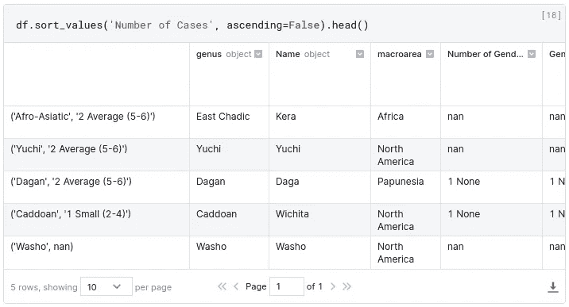**

**图片作者。**

**注意，为了通过索引对值进行排序，我们需要通过它的名称来引用它，正如我们之前所说的，有时索引没有名称。我们可能还想使用索引的位置/级别，而不是名称。然后就是方法`DataFrame.sort_index()`派上用场的时候了(自然，它对列不起作用)。**

**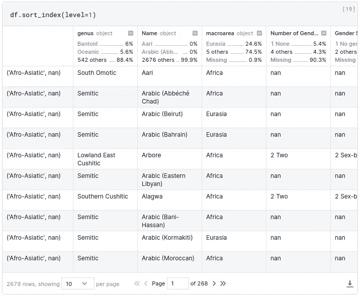**

**图片作者。**

**`sort_index()`的另一个有趣的用例是当我们想要按所有级别排序时(不需要指定名称和层次)。**

****

**图片作者。**

**它首先使用级别 0 对行进行排序，然后使用级别 1。存在重复的 0 级值，这些行很难排序。第二层消除了歧义。**

# **重新命名**

**我们可以更改(行)索引标签或列标签的名称。为此，我们将使用`DataFrame.rename()`方法。

当我们想要改变一些列的名称时，我们传递一个带有旧名称到新名称映射的`dict`。因为`rename()`对两个轴都有效，所以指定我们要瞄准哪一个是很重要的，我们用`index`(对于行)和`columns`参数(非此即彼)这样做，就像这样**

```
df.rename( columns={old_name: new_name, ...} )
```

**还有一种指定轴的方法，不仅在`rename()`中使用，在许多其他方法中也使用。它在一个方向或另一个方向上起作用，值得了解:论点`axis`。它对行使用值`0`(默认情况下)，对列使用值`1`。为了通过使用`axis`获得前一个例子的结果，我们应该这样写:**

```
df.rename( {old_name: new_name, ...}, axis=1 )
```

**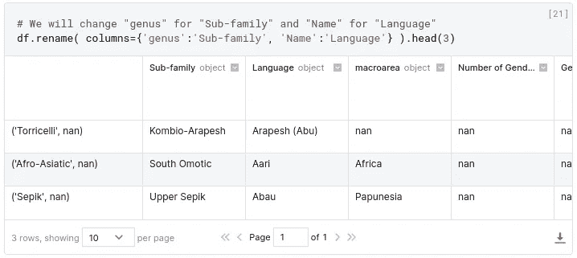**

**图片作者。**

**要更改(行)索引中的名称，我们使用`rename(index={...})`。从旧到新的映射适用于所有级别，无论是多少级别或哪个级别。如果有必要将更改限制在某些级别(在我们想要更改的标签出现在几个级别的情况下)，我们可以使用参数`levels`。**

**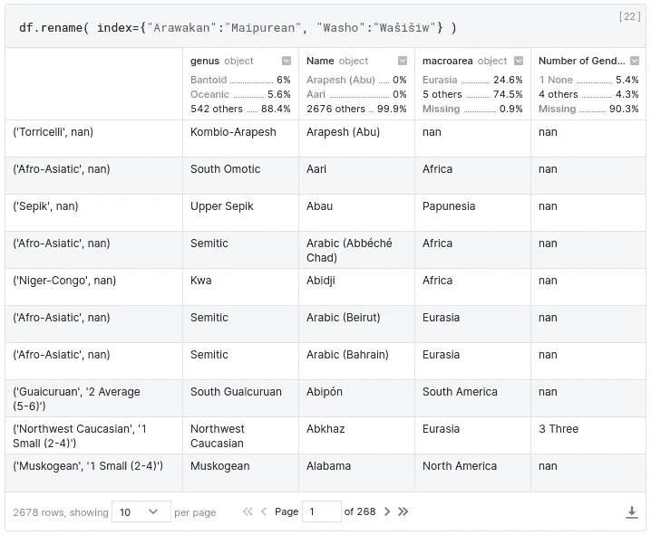**

**图片作者。**

****额外奖金****

**我们被告知，一些讲 Kullo 语的人不太喜欢这个名字，他们更喜欢把他们的语言称为 Dawro。我们想重命名数据集中出现的 Kullo，但是方法`rename()`不行，因为“语言”不是索引而是列。

无论我们想做什么，熊猫总有办法做到:`DataFrame.replace()`行为超过框架值。**

****

**图片作者。**

# **结论**

**当使用多索引时，`DataFrame`的每一行和/或每一列都用代表索引级别的`tuple`进行索引，而不是像简单索引那样用字符串进行索引。**

```
# Let us suppose that we are dealing with a 3-level multi-index at the rows.
rows = [('big', 'square', 'blue'), ('small', 'square', 'green')]

# Retrieve rows with big blue and small green squares multi-index
# and all columns.
df.loc[rows, :]
```

**当我们需要使用`slice`来表示所有的等级值(或它们的范围)时，我们使用`IndexSlice`来代替。**

```
 # Now imagine that we are interested in all the figures
# that are blue or green.
idx = pd.IndexSlice[:, :, ('blue', 'green')]

# Retrieve intended rows and all columns.
df.loc[idx, :]
```

# **我喜欢的熊猫文章**

*   **看看杰西卡·斯特林汉姆写的这个很酷的多索引备忘单。**

# **方法列表**

**在本教程中看到的方法的简短列表。**

*   **`set_index()`**
*   **`reset_index()`**
*   **`Index.get_level_values()`**
*   **`xs()` —横截面。**
*   **`sort_values()`**
*   **`sort_index()`**
*   **`rename()` —更改索引标签。**
*   **`replace()` —改变数值。**

**和一些方便的看不见的方法。**

*   **`rename_axis()` —更改一个`Index`或`MultiIndex`的名称。**
*   **`swaplevel()` —切换两个`MultiIndex`级别的顺序。**
*   **`Index.set_names()` —与`rename_axis()`相似，但直接在`Index`上。**