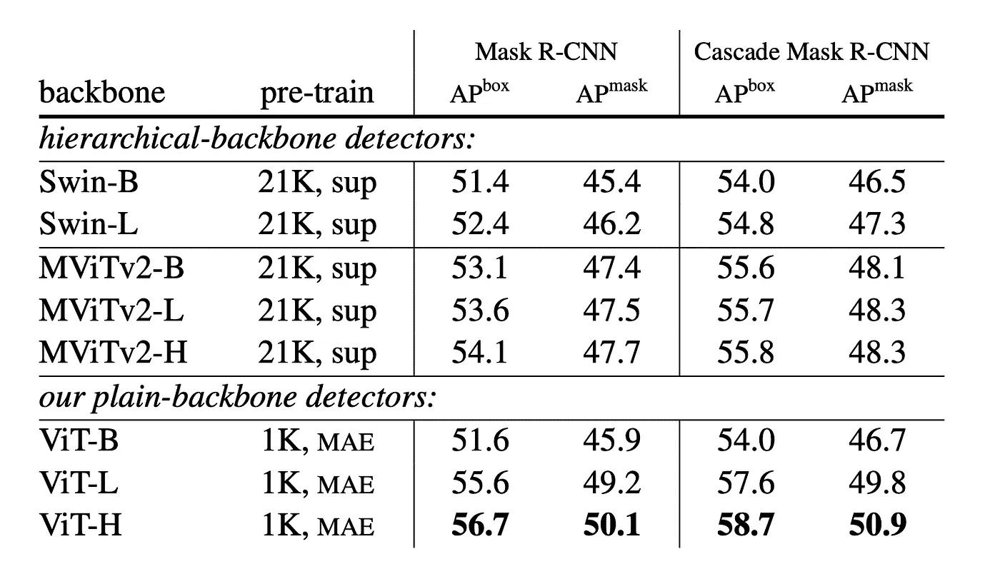

# 论文说明:探索用于目标检测的平面视觉变压器主干

> 原文：<https://towardsdatascience.com/paper-explained-exploring-plain-vision-transformer-backbones-for-object-detection-a84483ac83b6>

## vit 作为目标探测骨干的力量

在这个故事中，我们将仔细研究 Meta AI 的研究人员最近发表的一篇论文，其中作者探索了如何将标准 ViT 重新用作对象检测主干。简而言之，他们的检测架构叫做 **ViTDet** 。

用于普通主干网的特征金字塔网络(FPN)的可视化，如 ViTDet 中的一个,“经典”分级主干网，通常表示为 CNN。来源:[1]

## **先决条件:目标探测骨干**

以前，目标探测器的主干网在网络的不同阶段受益于不同的分辨率。如上图所示，特征图具有不同的分辨率，执行实际物体检测步骤的检测头从中受益匪浅。这些主干在科学文献中通常被称为**等级主干**。通常，ResNets 或其他 CNN 被称为分层主干，但某些 vit(如 Swin Transformer)也有分层结构。我们今天要看的论文必须处理一种不同的主干结构:由于 vit 由一定数量的变换器块组成，所有变换器块都以相同的维度输出特征，所以它从不自然地输出不同分辨率的特征图。作者在论文中讨论了这个问题，并探索了构建多分辨率 FPN 的不同策略。

## **从单一分辨率主干生成多分辨率特征**

由于 ViTs 自然只为其特征地图提供一种分辨率，作者探索了如何使用 FPN 将该地图转换为不同的分辨率。为了简化内存约束和增加特征输出的全局上下文，作者没有计算所有 ViT 块的自注意。相反，他们选择将变压器分成 4 个偶数部分，例如，对于具有 24 个块的 ViT-L，每个部分组成 6 个块。在每个部分的末尾，他们计算该部分的整体自我注意力，其输出被用作 FPNs 的特征图。

为 ViTDet 开发的不同 fpn。来源:[1]

对于**方法(a)** ，他们试图通过使用卷积或去卷积，从每个部分的个体全局注意力输出对 1/16 特征图进行上采样或下采样，来构建类似 FPN 的解决方案。它们还增加了横向连接，用连接蓝色方块的箭头表示。

对于**方法(b)** ，他们通过仅放大和缩小来自全局自我注意模块的最后特征图来构建 FPN。这意味着 FPN 中的所有要素都是根据单个输出构建的。此外，他们再次添加了横向连接。

对于**方法(c)** ，他们提出了一个非常简单纯粹的解决方案:对最终的整体注意力输出进行上采样和下采样，并且不增加任何横向连接。这种方法是迄今为止最简单的方法，但正如我们现在将看到的，它非常有效。

## **不同 FPN 方法的性能比较**

让我们开始吧！

不同 fpn 的 COCO 结果。来源:[1]

值得注意的是，在 MS COCO 检测基准上，**简单 FPN，方法(c)，在两种 ViT 尺寸上，对于包围盒回归和实例分割工作得最好**。

但是，既然已经有了基于 ViT 的检测网络，为什么还要尝试这样一种简单的解决方案来将普通 ViT 用作检测主干呢？答案现在将变得显而易见。

## 与最先进的(SOTA) ViT 检测网络进行比较

最近在自我监督预培训领域的研究已经开始释放出 ViTs 令人难以置信的能力。该领域中最有前途的任务之一是挑战网络来重建对象的屏蔽部分，通过屏蔽自动编码器(MAE)论文来实现。我们在我的博客上重温了这篇论文，在这里 随意刷新你的知识[。](https://medium.com/towards-data-science/paper-explained-masked-autoencoders-are-scalable-vision-learners-9dea5c5c91f0)

与之前基于 ViT 的检测器相比，ViT-Det 的 COCO 结果(底部三行)。来源:[1]

MAE 预先训练一个标准的 ViT 来学习重建图像的屏蔽部分。事实证明，这是一种成功的预培训策略。为了将这种优势转移到对象检测，作者创建了 ViTDet 架构。这就是本文的全部目的:释放预训练 ViTs 用于物体检测的能力。结果说明了一切。

从结果表中可以看出，使用 MAE 预训练主干，然后在其上使用简单的 FPN，可以得到基于 ViT 的检测主干的 SOTA 结果。由于 Swin 变压器和 MViT 在没有修改的情况下与自监督预训练策略不兼容，因此它们在 ImageNet 上被监督进行预训练。令人惊讶的是，MAE 预训练比标准的监督预训练释放出更多的性能。因此，作者暗示对象检测研究的未来改进将来自于:**不是检测架构本身，而是以自我监督的方式对主干进行更强大的预训练。**

在我看来，这代表了物体探测研究的一个关键转变。如果你想阅读更多关于自我监督预训练给计算机视觉领域带来的范式转变的信息，请点击这里 阅读我的故事 [**。**](https://medium.com/towards-data-science/from-supervised-to-unsupervised-learning-a-paradigm-shift-in-computer-vision-ae19ada1064d)

## 包装它

我们探索了 ViTDet 架构，这是对传统 fpn 的简单而强大的修改，特别是对 vit 的修改，它释放了自监督视觉变压器的能力，用于对象检测。不仅如此，这项研究还为目标检测研究的一个新方向铺平了道路，其中的重点是从架构转移到预训练技术。

虽然我希望这个故事能让你对 ViTDet 有一个很好的初步了解，但仍有很多东西有待发现。因此，即使你是这个领域的新手，我也会鼓励你自己阅读这些论文。你必须从某个地方开始；)

如果你对论文中介绍的方法有更多的细节感兴趣，请随时在 Twitter 上给我留言，我的账户链接在我的媒体简介上。

我希望你喜欢这篇论文的解释。如果你对这篇文章有任何意见，或者如果你看到任何错误，请随时留下评论。

**最后但同样重要的是，如果你想在高级计算机视觉领域更深入地探索，考虑成为我的追随者**。我试着到处张贴一个故事，让你和其他人对计算机视觉研究的最新进展保持兴趣！

参考资料:

[1]李，，等.“探索用于物体检测的平面视觉变换骨干”arXiv 预印本 arXiv:2203.16527 (2022)。