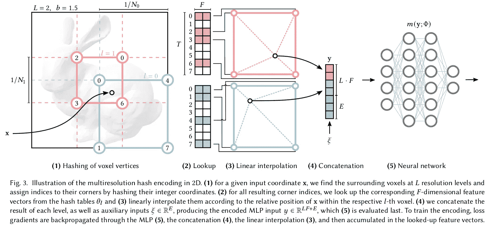
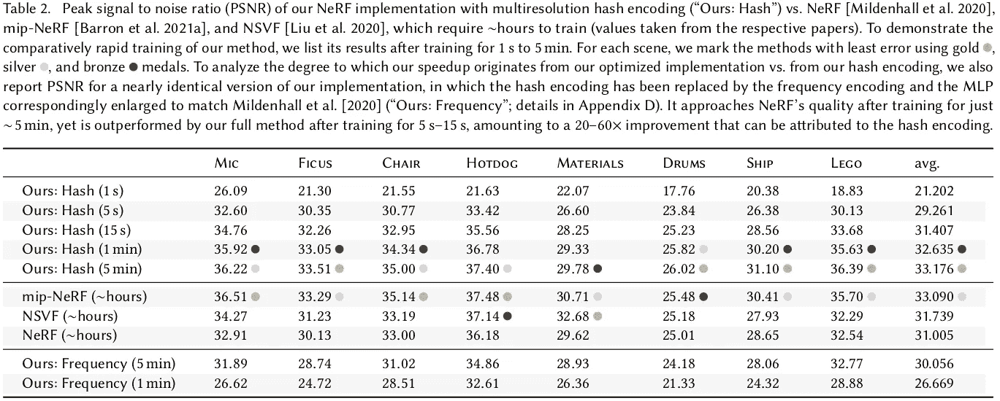

# 论文解释——具有多分辨率散列编码的即时神经图形图元

> 原文：<https://towardsdatascience.com/paper-explained-instant-neural-graphics-primitives-with-a-multiresolution-hash-encoding-8e5a05865378>

## 开创性的 NeRF 论文在计算机视觉界掀起了风暴，但提出的方法需要对每个新场景进行数小时的训练。NVIDIA 的一种新方法将这一时间缩短到了几秒钟

由[项目网站](https://nvlabs.github.io/instant-ngp/)上的视频生成的 GIF，经许可拍摄。*戴珍珠耳环的女孩*翻新 Koorosh Orooj ( [CC BY-SA 4.0](http://profoundism.com/free_licenses.html) )。*迪士尼云*模型华特迪士尼动画工作室( [CC BY-SA 3.0](https://media.disneyanimation.com/uploads/production/data_set_asset/6/asset/License_Cloud.pdf) )。

# 介绍

临近 2020 年底，注意到今年人工智能的主要趋势之一，教授兼研究员 Frank Dellaert 将他的一篇博客文章命名为“[**NeRF Explosion 2020**](https://dellaert.github.io/NeRF/)”。Mildenhall 等人在他们的论文 [NeRF:将场景表示为用于视图合成的神经辐射场](https://arxiv.org/abs/2003.08934)中提出的惊人结果开辟了一条新的研究路线，该研究仍然是计算机视觉中最热门的主题之一，并可能代表许多应用程序的未来，如[3D 形状和图像的合成、人体动画、3D 重建和姿态估计](https://neuralfields.cs.brown.edu/eg22.html)。

最初的 **NeRF 很棒，但是……非常慢**！为单个场景训练模型可能需要几个小时，甚至几天。由 NVIDIA 研究人员托马斯·穆勒、亚历克斯·埃文斯、克里斯托夫·席德和亚历山大·凯勒撰写的论文[即时神经图形图元与多分辨率哈希编码](https://nvlabs.github.io/instant-ngp/assets/mueller2022instant.pdf) ( **即时 NGP** )提出了一种新的方法，即**将这一时间从几个小时缩短到几秒钟**。

这是一个高级话题，你可能从未听说过 NeRF 或者需要复习一下。那样的话，别担心，我会掩护你的！下面你会发现我的文章，这一切都是从这张纸上开始的；我建议您在继续之前阅读它，因为我不打算重复解释已经讨论过的内容。

<https://blog.devgenius.io/paper-explained-nerf-representing-scenes-as-neural-radiance-fields-for-view-synthesis-e16567180531>  

> **免责声明**:大部分图片和内容来源于即时 NGP [论文](https://nvlabs.github.io/instant-ngp/assets/mueller2022instant.pdf) / [项目网站](https://nvlabs.github.io/instant-ngp/)，在本文中我尽量报道了对其理解至关重要的部分，必要时补充细节。所有图片都是在作者许可下拍摄的，必要时还列出了额外的许可。

# 计算机图形图元

在解释即时 NGP 引入的新功能之前，有必要介绍四个任务，或者如论文中所称的**计算机图形图元**，作者将他们的方法与以前的方法进行了比较。

对于即时 NGP 的部分解释，与 NeRF 一样，首先根据一些逻辑对输入进行编码，然后使用多层感知器(MLP)来学习它们与给定输出之间的映射。在这一节中，我们将看到本文中考虑的所有任务的输入和输出是什么。

## 千兆像素图像近似

图片由[报社](https://nvlabs.github.io/instant-ngp/assets/mueller2022instant.pdf)许可拍摄。*戴珍珠耳环的女孩*翻新 Koorosh Orooj([CC BY-SA 4.0](http://profoundism.com/free_licenses.html))。

这项任务旨在测试模型表现高频细节的能力，目标是了解(非常大的)图像的 2D 坐标与其 RGB 颜色之间的映射。基本上，该模型正在**学习有效地压缩**图像，并逐个像素地重建图像，也就是说，给定一个像素的坐标，它将返回该位置处原始图像的颜色。

例如，上图的分辨率为 20 000 X 23 466 (469 M RGB 像素)，而根据我们稍后将介绍的超参数 t 的选择，模型的可训练参数分别为 117 k (T = 2)、2.7 M (T = 2 ⁷)和 47.5 M (T = 2)。

## 符号距离函数

经[报社](https://nvlabs.github.io/instant-ngp/assets/mueller2022instant.pdf)许可拍摄的图像。

**带符号距离函数**(**SDF**)用于**将 3D 形状表示为函数**的零水平集。想象在感兴趣的表面上的一个点上计算 SDF，在这种情况下，SDF 将等于零，而如果该点在表面之外，则它将具有等于该点与表面的最小距离的正值，如果它在表面之内，则相同，但具有负号。

在这个任务中，MLP 学习从 3D 坐标到离表面的距离的映射。这可用于 3D 形状压缩(类似于之前的任务，但用于 3D 形状)和形状完成等任务，如 [DeepSDF:学习形状表示的连续带符号距离函数](http://openaccess.thecvf.com/content_CVPR_2019/html/Park_DeepSDF_Learning_Continuous_Signed_Distance_Functions_for_Shape_Representation_CVPR_2019_paper.html)所示。

## 神经辐射缓存

图片由[报社](https://nvlabs.github.io/instant-ngp/assets/mueller2022instant.pdf)许可拍摄。

该任务涉及**从特征缓冲区**预测照片级像素颜色。

在这种情况下，MLP 从**蒙特卡洛** [**路径跟踪器**](https://en.wikipedia.org/wiki/Path_tracing) 中学习给定场景的 5D [**光场**](https://en.wikipedia.org/wiki/Light_field) 。

在这种情况下，**训练**在线**发生**，在渲染过程中，“过拟合”在后台运行的路径跟踪器的输出。

## 神经辐射和密度场(NeRF)

图片由[报社](https://nvlabs.github.io/instant-ngp/assets/mueller2022instant.pdf)许可拍摄。

最后，最后一项任务是以发起该研究系列的论文命名的，即时 NGP 也是该研究系列的一部分。在这种情况下，MLP 从图像观察和相应的透视变换中学习给定场景的 3D 密度和 5D 光场。

通过这种方式，可以从新的有利位置创建场景的新视图，这个问题称为 [**新颖的视图合成**](https://paperswithcode.com/task/novel-view-synthesis) ，逼真地再现灯光效果和材质属性。更多细节请看[我之前的文章](https://blog.devgenius.io/paper-explained-nerf-representing-scenes-as-neural-radiance-fields-for-view-synthesis-e16567180531)。

既然我们已经提出了我们想要解决的任务，让我们看看这篇论文的主要贡献是什么。

# 输入编码

## 频率编码

NeRF 受早期作品的启发，比如介绍 Transformer 架构的著名论文，将标量位置 x∈R 编码为 L∈N 正弦和余弦函数的多分辨率序列

图片由[报社](https://nvlabs.github.io/instant-ngp/assets/mueller2022instant.pdf)许可拍摄。

如 NeRF 论文中的消融研究所示，如果没有这种编码，高频细节将无法捕捉。

这种编码是**固定的**，因此不太有表现力，这意味着**需要一个“大”MLP**来学习前面介绍的复杂任务，因为从输入到输出的任务都委托给它了。

## 参数编码

最新的先进方法使用参数编码，其思想是在**辅助数据结构**中安排额外的可训练参数，例如**网格**或**树**。然后根据输入查找这些参数，并(可选地)进行插值。

为什么这种方法应该是有益的？我们**用较大的内存占用换取较小的计算成本**；我们可以拥有一个小得多的 MLP，而不是一个大的，虽然以这种方式消除的参数可以通过使用额外的数据结构以某种方式重新获得，**只有其中的一个小的子集会随着每个梯度反向推**而更新，从而大大加快了训练速度。这一点很关键，所以让我们看一个例子来更好地理解它。假设我们用 3D 网格划分我们感兴趣的场景，对于网格内的给定点，对于每个反向传播的样本，我们只需要更新 8 个嵌入(对于包含该点的网格中的 3D 体素的每个顶点一个嵌入)。当我们介绍所提出的方法时，这一点将变得更好理解。

即时 NGP 使用的编码就属于这一类；在描述它之前，让我们先看看以前的方法有什么问题。

一种可能的方法是使用类似于 [ACORN:用于神经场景表示的自适应坐标网络](https://arxiv.org/abs/2105.02788)中的域的**树细分**，其中大型辅助坐标编码器神经网络被训练为在 x 周围的叶节点中输出密集的特征网格。这种方法虽然比以前的方法产生更大程度的自适应性，但它以更高的计算成本**实现，仅当足够数量的输入在每个叶节点结束时才可摊销。**

另一种方法是使用可训练特征的**密集网格**，但是它们**比神经网络权重消耗更多的内存**。特别是，这种方法是**浪费的**，因为空白空间的区域被视为靠近表面的区域，这导致参数的数量增长为 O(N)，而感兴趣的可见表面的区域仅增长为 O(N)。

**如果感兴趣的表面是先验已知的**，诸如**八叉树**或**稀疏网格**的数据结构可用于剔除密集网格中未使用的特征。然而，**在 NeRF 设置中，表面仅在训练期间出现**。

对于这些先前作品的所有参考，请参考论文。现在让我们来看看即时 NGP 最重要的组成部分之一。

# 多分辨率散列编码

图片由[报社](https://nvlabs.github.io/instant-ngp/assets/mueller2022instant.pdf)许可拍摄。

## 程序概要

论文的主要贡献肯定是提出了**输入坐标**的**编码**。

让我们首先简要地总结一下这个过程，然后分别分析细节:

1.  **L** **d 维** **网格**被定义。具体来说，如果我们要建模的是一幅图像，至于“Gigapixel”任务，d 等于 2；另一方面，如果我们想要对三维体积建模，至于“NeRF”任务，d 等于 3。在上图中，你可以看到两个 2D 网格的例子，一个是分辨率为 1 / N0 的**网格，另一个是分辨率为 1 / N1 的网格，我们将在后面看到这些 **N** l 是如何选择的**
2.  每个**级** **l** 与多达 **T** **个具有**维度** **F** 的特征向量**相关联
3.  对于一个给定的样本，其**输入坐标** **x** 被映射到每一层中相应的**体素** (d 维单元)。例如，在图像中，x 落在级别 0 的右下角单元格中，而在级别 1 的中间单元格中
4.  给定层的顶点数**为 **V** = (Nl + 1)^d，例如，如果 N1 = 3 且 d = 2(就像上图中 N1 将边精确地分为 3)，对于层 1，我们有(3 + 1) = 16 个顶点。如果 V ≤T，我们在该层的顶点和特征向量之间有 1:1 的映射。在更精细的级别，其中 V > T，我们使用一个**散列函数**h**将每个 d 维顶点映射到相应级别的 T 个特征向量之一。我们确实可以想到一个散列表，尽管**没有明确的冲突处理**
5.  我们现在有了每层的 d 个特征向量，每个向量都与各自体素的顶点相关联。在这一点上，我们**线性内插**d 矢量以获得代表该层的最终矢量
6.  我们**连接**每一层的最终矢量，如果有的话，**辅助输入**(视角方向，材质参数等。)，这是将作为输入给一个**多层感知器** ( **MLP** )的向量，从这里开始，程序类似于最初的 NeRF

现在让我们更详细地了解每一步。

**选择每个级别的网格分辨率**

一个**几何级数**用于定义在**最粗** ( **Nmin** )到**最细** ( **Nmax** )级别之间的中间**分辨率**:

图片由[报社](https://nvlabs.github.io/instant-ngp/assets/mueller2022instant.pdf)许可拍摄。

使用简单的对数规则，我们可以证明:

图片由作者提供。

我们看到，如果 l = 0，Nl = Nmin * b⁰ = Nmin，而如果 l = L - 1(级别范围从 0 到 L - 1)，Nl = Nmin * Nmax / Nmin = Nmax，则其他值介于两者之间。

由于等级 L 的数量很大，**增长因子** **b** 通常很小。论文的用例有 b ∈[1.26，2]。

## 空间哈希函数

在一个**散列函数**中我们想要什么**特性**？作者列举如下:

1.  高效计算
2.  导致连贯的查找
3.  一致覆盖特征向量阵列，而不管查询点的结构如何

由于这些原因，即时 NGP 使用了一个**空间哈希函数** [ [Teschner 等人 2003](https://www.researchgate.net/publication/2909661_Optimized_Spatial_Hashing_for_Collision_Detection_of_Deformable_Objects) ]的形式

经[报社](https://nvlabs.github.io/instant-ngp/assets/mueller2022instant.pdf)许可拍摄的图像。

其中⊕denotes 的逐位**异或**运算和**ππ**I 唯一，**大素数**。

优化散列函数也被认为是未来的工作，将该方法变成一种**字典学习**方法。

原文提供了其他细节，并为感兴趣的读者提供了有用的参考。

## 性能与质量

可以想象，随着 T 的增加，我们拥有更高的质量、更高的内存使用率和更低的性能(更长的训练/推理时间)。该论文强调的有趣方面是，虽然内存随 T 线性增长，但质量和性能往往呈亚线性增长。

同样，L 和 F 也代表了质量和性能之间的权衡。作者发现 F = 2 和 L = 16 对于他们的大多数应用来说都是很好的值。

## 隐式哈希冲突解决

我们说冲突不被处理，这意味着什么？

首先，我们注意到**在低层没有碰撞**，因为映射是 1:1。在可能发生这些碰撞的较高层，梯度被平均化。一个重要的观察是，不是所有碰撞的点都同等重要；**可见表面上的点**将具有更大的梯度，因此**对学习的编码**具有更大的影响。

值得注意的是，这并非完全没有后果，正如在一项关于使用 MLP 的重要性的最终消融研究中所示，我们看到哈希碰撞会在重建中产生一些噪声，如果我们用线性层替换 MLP，这种噪声会特别明显。

图片由[报社](https://nvlabs.github.io/instant-ngp/assets/mueller2022instant.pdf)许可拍摄。

## d-线性插值

需要注意的是**插补**不是可选的。没有它，我们将有网格对齐的不连续性(块状外观)。线性插值不是人们能想到的最高阶，对于需要更高阶的应用，作者提出了 [**平滑步骤**](https://en.wikipedia.org/wiki/Smoothstep) 函数

图片由[报社](https://nvlabs.github.io/instant-ngp/assets/mueller2022instant.pdf)许可拍摄。

这是更昂贵的 d-二次或 d-三次插值的低成本替代方案。

然而，这种解决方案在本文中从未使用过，根据经验，它会降低所考虑用例的重建质量。

# 履行

## 性能考虑因素

这项工作的一个相关方面是架构是如何实现的，在这里我们可以看到 NVIDIA 研究人员在充分利用 GPU 方面的经验。整个系统实现利用了**完全融合的 CUDA 内核**(融合运算以加速计算)，并专注于最小化浪费的带宽和计算操作。散列表条目以半精度存储，以全精度维护参数的主副本，用于稳定的**混合精度**参数更新。他们还优化了 GPU 缓存，**调度计算**，以便在移动到下一个输入之前，在一个批处理中查找所有输入的多分辨率哈希编码的每个级别。关于哈希表的大小，他们能够最大限度地提高性能，直到 T ≤ 2 ⁹，超过这个阈值，性能开始显著下降，因为 NVIDIA RTX 3090 GPU 的二级缓存对于各个级别来说变得太小。

这种高度优化的 C++实现比 Python 中的简单实现快 10 倍。

有了这种级别的优化，将实现带来的改进与文章中提出的创新带来的改进区分开来是很重要的；在所有的实验中，作者都小心翼翼地将这两种效应分开，有时会重新实现以前的架构。

## 架构、初始化和培训

架构、初始化和训练程序都相当标准。我不会在这里报告我建议查阅文件的所有细节。重要的是要注意，同样在这种情况下，在编码之后，我们使用了一个在结构上与原始 NeRF 非常相似的 MLP，一个密度 MLP 后面跟着一个彩色 MLP，但是由于额外的可训练数据结构而变得更小。

# 实验和结果

图片由[报社](https://nvlabs.github.io/instant-ngp/assets/mueller2022instant.pdf)许可拍摄。

即时 NGP 超越了以前方法的性能和/或增加了所有考虑的任务的灵活性，具有更简单的额外优势。最令人惊讶的结果之一是，他们**与**的峰值信噪比** ( **PSNR** )相匹配**

图片由作者提供。这个指标还有其他定义，这是它在即时 NGP 的 GitHub 库[中的实现方式。](https://github.com/NVlabs/instant-ngp)

**原来的 NeRF(训练小时数)只需 5–15s**，与**相比提升了 20–60 倍**，这可以**归功于**提出的**哈希编码**。

在其他任务中也可以看到类似的结果，例如，即时 NGP 在 2.5 分钟而不是 36.9 小时的训练后，在重建东京的千兆像素图像方面实现了与 ACORN 相同的 PSNR。

总的来说，我们可以说瞬时 NGP 令人难以置信的速度将使得有可能将 NeRF 应用于新的任务，例如，所提出的多分辨率散列编码是将 NeRF 加速几个数量级并匹配并行非神经 3D 重建技术的性能的直接替代。

# 结论

在本文中，我们探讨了 NVIDIA 的即时 NGP 如何让 NeRF 快如闪电。

如果这项新技术引起了你的兴趣，并且你想亲自尝试一下即时 NGP，你可以！看看[官方 GitHub 库](https://github.com/NVlabs/instant-ngp)并按照所有的说明去做，结果会很惊人。

感谢您读到这里，如果您有任何与本文相关的建议或问题，请随时留下评论或与我联系，我的联系方式如下。

想保持联系，不要错过我的新文章？在[中](https://medium.com/@mnslarcher)、 [LinkedIn](https://www.linkedin.com/in/mnslarcher/) 或 [Twitter](https://twitter.com/mnslarcher) 上关注我。