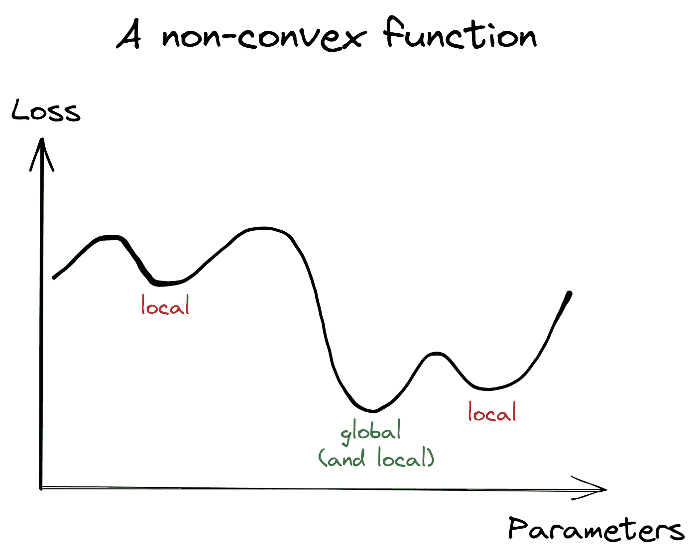
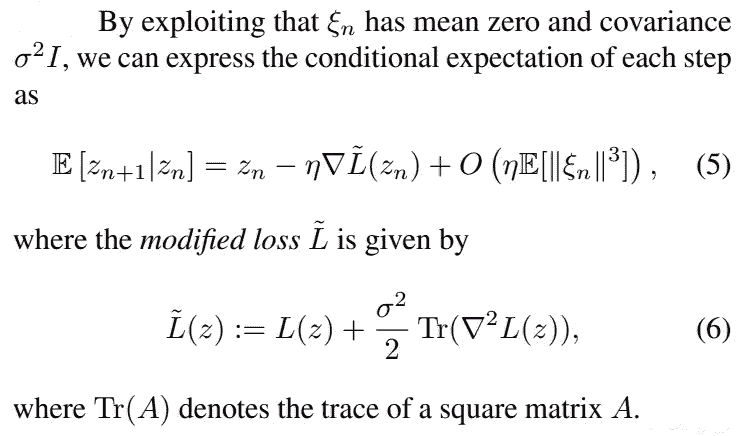
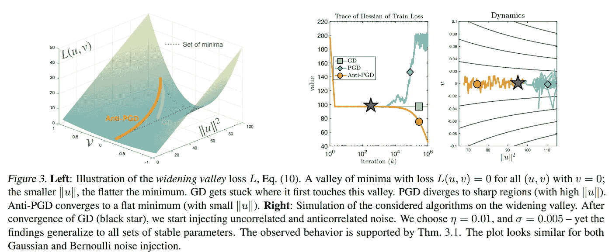
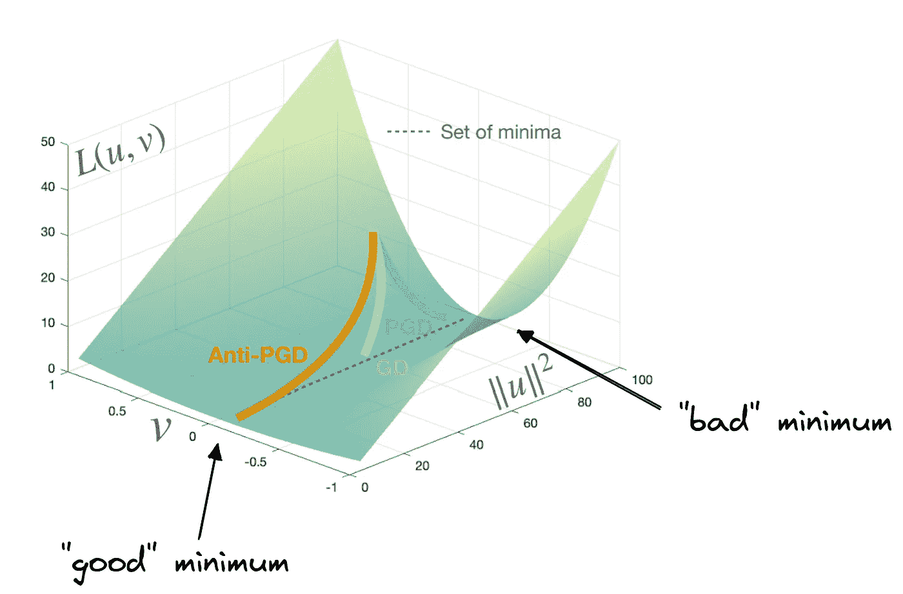
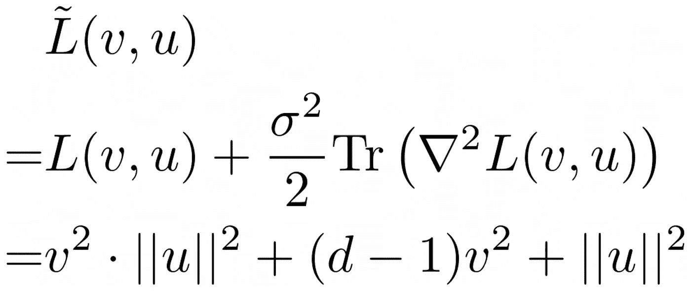
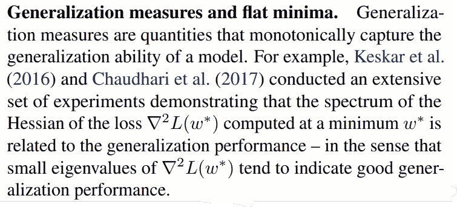

# 论文简化:反相关噪声注入用于改进推广

> 原文：<https://towardsdatascience.com/papers-simplified-anticorrelated-noise-injection-for-improved-generalization-8dd379af059c>

## [机器学习研究](https://medium.com/tag/machine-learning-research)

## 了解在梯度更新期间添加噪声如何有助于概化，包括在 TensorFlow 中的实现


[在](https://unsplash.com/@wrongtog?utm_source=medium&utm_medium=referral) [Unsplash](https://unsplash.com?utm_source=medium&utm_medium=referral) 上的照片

在本文中，我们将查看安东尼奥·奥维多、汉斯·克斯汀、弗兰克·普罗斯克、弗朗西斯·巴赫和奥雷连·卢奇于 2022 年 2 月 6 日发表的一篇论文。它被称为**反相关噪声注入，用于改进泛化**【1】，而[你可以在这里找到](https://arxiv.org/abs/2202.02831)。

我会这样总结这篇论文:

> 当使用梯度下降优化复杂函数时(即，当训练神经网络时)，在梯度更新期间以智能方式添加噪声。

让我们深入研究一下这张纸，看看与不太聪明的方法相比，聪明的方法是什么。在摘要中，作者写了以下内容:

> 将人工噪声注入梯度下降(GD)通常被用来提高机器学习模型的性能。**通常，在这种扰动梯度下降(PGD)** 方法中使用 **不相关的噪声。但是，不知道这是否是最佳的，也不知道其他类型的噪声是否可以提供更好的泛化性能。在本文中，我们放大了**关联连续 PGD 步骤**的扰动的问题。我们考虑了各种目标函数，发现带有反相关扰动的 GD**(“反 PGD”)比 GD 和标准(不相关的)PGD** 更具普遍性。为了支持这些实验发现，我们还得出了一个理论分析，表明**反 PGD 运动到更宽的最小值，而广东和 PGD 仍然停留在次优区域甚至发散。**反相关噪声和泛化之间的这种新联系为利用噪声来训练机器学习模型的新方法开辟了领域。**

这真的让我开始思考。在梯度下降过程中添加噪声不仅有帮助。如果该噪声在梯度下降步骤中**相关**，则优化结果在某些方面甚至更好。这种方法被作者称为**反 PGD** 。

在这篇文章中，我不会向你解释所有的(令人兴奋！)数学细节。相反，我将为您提供一些实现和图片，以便理解本文的主旨。我还尽力创建了论文中提到的优化器的**实现，但是要小心使用代码，因为我在这方面也不是专家。**但是我很高兴得到任何反馈**！**

# 先决条件

为了理解**反 PGD(反扰动梯度下降)**是什么，让我们简单回顾一下 GD 和衍生算法如 SGD 和 PGD 是如何工作的。我在本文的先决条件部分解释了关于 GD 和 SGD 的重要内容

[](/papers-simplified-gradients-without-backpropagation-96e8533943fc)  

但是让我给你一个简略的版本。

## 梯度下降

让我们假设我们想要最小化一个函数 *f* ，其梯度表示为∇ *f* ( *θ* )。然后，GD 随机初始化模型的参数 *θ* ，然后用简单的更新规则**t15】θ←*θ—α*∇*f*(*θ*)**进行迭代更新，直到收敛，即 *θ* 或*f*(*θ*)*do *α* 是学习率*。**

*对于**凸函数**，如果学习率足够小，GD 保证找到全局——也是唯一的局部——最小值。例如，对 L2 损失进行线性回归就是这种情况。对于**非凸函数**，GD 可能会陷入(许多)局部极小值之一。*

**

*图片由我提供。*

## *随机梯度下降*

*SGD 也做同样的事情，但是它**估计** ∇ *f* ( *θ* )而不是像 GD 那样精确地计算它。这有几个优点:*

*   ***使用较少的 RAM** ，因为我们不需要解析完整的数据集来计算梯度*
*   ***更快的收敛** **(在历元数中)**因为在每个历元中关于 dataset_size / batch_size 的梯度更新发生*
*   *根据罗伯特·克莱恩伯格、李沅芷和杨远[2]的说法，与 GD 相比，它倾向于找到更好的局部极小值。*

*第三点肯定不是显而易见的，你应该查看[这篇论文](https://arxiv.org/abs/1802.06175)来更深入地探讨这个话题。基本上，从 GD 到 SGD **平滑**我们想要优化的功能(假设**从现在开始最小化**):*

**

*图片由我提供。*

## *扰动梯度下降*

*这里，我们稍微改变了更新规则:*

**

*图片由我提供。*

*其中*ξₙ*(**扰动** ) 来自一个**居中的正态分布 *N* (0， *σ* )，并且是随机独立的**。在梯度更新期间添加这种噪声可能有助于优化器摆脱局部最小值。然而，作者无法观察到使用 PGD 训练的模型实现了更好的泛化性能。尽管如此，通过给这个想法一点小小的改变，作者使它变得更加有用。*

# ***反扰动梯度下降***

*更准确地说，作者认为拥有反相关扰动是有益的。他们伪造它们的方式再简单不过了:*

**

*图片由我提供。*

*这里——再一次——ξₙ独立于一个 *N* (0， *σ* 分布。这已经足以产生完美的反相关扰动，这意味着*

**

*图片来自他们的论文。*

*这里， *I* 只是单位矩阵。为了得到为什么这是真的直觉，想象一下ξₙ是一维的。然后我们可以忽略换位，可以计算*

**

*图片由我提供。*

*这同样适用于更高维度。不错！*

*然后作者推断这些扰动对损失函数 *f* = *L* 的最小化有以下影响:*

**

*从他们的报纸上。*

> ****注:*** *一个函数的* [*黑森*](https://en.wikipedia.org/wiki/Hessian_matrix) *只是广义二阶导数。例如，如果有函数* f *(* x *，* y *) =* xy *，则给出的黑纱为**

**

*图片由我提供。*

> *轨迹 Tr 就是主对角线的和——从左上到右下，即 0 + 6 xy *。**

*主要要点是:*

> *我们不是试图最小化损失函数，而是试图最小化损失加上其二阶导数的大小，二阶导数充当正则化项。*

*这也与从 GD 切换到 SGD 如何平滑损失函数有关。*

## *反 PGD 如何对抗广东和 PGD*

*好的，我们加入了一些粗麻布和一条现在用于正规化的痕迹。但是为什么呢？为什么有这个正则化子是有益的？我们将在本节中找到答案！*

*为了给出一个直觉，作者在所谓的**加宽谷函数**上测试他们的反 PGD*

**

*图片由我提供。*

*他们试图将其最小化。虽然最小化这个函数是微不足道的(设置 v=0 或所有 u = 0)，但作者(还有我)认为，例如，我们在(0，0，…，0)处的最小值比在(0，100，100，…，100)处的最小值更好一些。要了解原因，请看他们论文的截图:*

**

*从他们的报纸上。*

*在左边，你可以看到一个函数图。原点(0，…，0)的最小值被**平地**包围，而远离原点的最小值则在**越来越陡**的山谷中。这是图表中的大图:*

**

*从他们的论文中，加上我的注解。*

*因此，在某种意义上，我们希望我们的优化器在原点找到最小值，因为它*感觉更安全*。如果我们在原点稍微摆动一下最小值，我们仍然会有一点损失。然而，如果我们达到最小值(0，100，…，100)，稍微改变*v*——例如从 0 到 0.1——会使**损失飙升到 100 *d*** ，维度 *d* 越高，损失越大。*

> *当然，反 PGD 在起源中找到了好的最小值。*

*GD 似乎找到了退而求其次的东西， **PGD 甚至走向被高山环绕的*险峻*极小**。😅*

*反 PGD 发现它是因为黑森的痕迹告诉它:*

**

*从他们的报纸上。*

*在哪里*

**

*图片由我提供。*

*如果我们将此作为正则项添加到 *L* 中，优化器将被迫寻找最小值(0，…，0)，因为优化目标变为*

**

*图片由我提供。*

*而这个函数最小化正好是对于 *u* = (0，… 0)和 *v* = 0，没有别的。*

*作者声称，这不仅适用于加宽谷函数，而且更是一个一般概念。从他们的论文来看:*

**

*从他们的报纸上。*

## *履行*

*你甚至可以在实践中尝试一下，因为据我所知，我**实现了 SGD** (让你开始了解如何编写优化器)**、PGD** 和反 PGD*。如有错误，请写评论！**

```
**import tensorflow as tf

class SGD(tf.keras.optimizers.Optimizer):
    def __init__(self, learning_rate=0.01, name="SGD", **kwargs):
        super().__init__(name, **kwargs)
        self._set_hyper("learning_rate", kwargs.get("lr", learning_rate))

    @tf.function
    def _resource_apply_dense(self, grad, var):
        var_dtype = var.dtype.base_dtype
        lr_t = self._decayed_lr(var_dtype)  # learning rate decay
        new_var = var - grad * lr_t
        var.assign(new_var)

    def get_config(self):
        base_config = super().get_config()
        return {
            **base_config,
            "learning_rate": self._serialize_hyperparameter("learning_rate"),
        }

class PGD(tf.keras.optimizers.Optimizer):
    def __init__(self, learning_rate=0.01, std=0.5, name="PGD", **kwargs):
        super().__init__(name, **kwargs)
        self._set_hyper("learning_rate", kwargs.get("lr", learning_rate))
        self._set_hyper("std", std)

    @tf.function
    def _resource_apply_dense(self, grad, var):
        var_dtype = var.dtype.base_dtype
        lr_t = self._decayed_lr(var_dtype)
        perturbation = tf.random.normal(var.shape)
        new_var = var - grad * lr_t + self._get_hyper("std", dtype=tf.float32) * lr_t * perturbation
        var.assign(new_var)

    def get_config(self):
        base_config = super().get_config()
        return {
            **base_config,
            "learning_rate": self._serialize_hyperparameter("learning_rate"),
            "std": self._serialize_hyperparameter("std")
        }

class AntiPGD(tf.keras.optimizers.Optimizer):
    def __init__(self, learning_rate=0.01, std=0.5, name="AntiPGD", **kwargs):
        super().__init__(name, **kwargs)
        self._set_hyper("learning_rate", kwargs.get("lr", learning_rate))
        self._set_hyper("std", std)

    def _create_slots(self, var_list):
        for var in var_list:
            self.add_slot(var, "previous_perturbation", initializer="random_normal")

    @tf.function
    def _resource_apply_dense(self, grad, var):
        var_dtype = var.dtype.base_dtype
        lr_t = self._decayed_lr(var_dtype)
        previous_perturbation = self.get_slot(var, "previous_perturbation")
        current_perturbation = tf.random.normal(var.shape)
        perturbation_diff = current_perturbation - previous_perturbation
        new_var = var - grad * lr_t + self._get_hyper("std", dtype=tf.float32) * lr_t * perturbation_diff
        previous_perturbation.assign(current_perturbation)
        var.assign(new_var)

    def get_config(self):
        base_config = super().get_config()
        return {
            **base_config,
            "learning_rate": self._serialize_hyperparameter("learning_rate"),
            "std": self._serialize_hyperparameter("std")
        }**
```

# **结论**

**在他们的论文中，Antonio Orvieto、Hans Kersting、Frank Proske、Francis Bach 和 Aurelien Lucchi 已经表明，在梯度更新期间添加噪声可能有利于找到更好的最小值。在机器学习的设置中，这些是具有良好泛化能力的最小值。**

**然而，像 PGD 那样添加独立噪声的天真方法不足以找到这些最小值——它甚至**适得其反**，而(S)GD 似乎是更好的选择。作者推荐反相关噪声，产生**反 PGD** 优化器。**

**作者声称*可能*运行良好是因为:**

> **平坦最小值=小 Hessian =良好的概括**

**但是还有很多研究要做。他们甚至说 SGD 之所以如此有效是因为同样的效果:**

****

**从他们的报纸上。**

**所以，似乎即使对于像 SGD 这样简单的算法，还是有那么多不清楚的地方。我们甚至还没有达到 RMSprop、Adam 或 [Fadam](/papers-simplified-gradients-without-backpropagation-96e8533943fc) 的水平。**

****

**图片由我提供。**

**我希望你今天学到了新的、有趣的、有用的东西。感谢阅读！**

****作为最后一点，如果你****

1.  ****想支持我多写点机器学习和****
2.  ****无论如何都要计划获得中等订阅量，****

****为什么不做** [**通过这个环节**](https://dr-robert-kuebler.medium.com/membership) **？这将对我帮助很大！😊****

**透明地说，给你的价格不变，但大约一半的订阅费直接归我。**

**非常感谢，如果你考虑支持我的话！**

> ***有问题就在*[*LinkedIn*](https://www.linkedin.com/in/dr-robert-k%C3%BCbler-983859150/)*上写我！***

# **参考**

**[1]奥维多，a .，克尔斯汀，h .，普罗斯克，f .，巴赫，f .和卢奇，a .，2022。[反相关噪声注入，以提高泛化能力](https://arxiv.org/abs/2202.02831)。 *arXiv 预印本 arXiv:2202.02831***

**[2] Kleinberg，b .，Li，y .和 Yuan，y . 2018 年 7 月。[另一种观点:SGD 何时逃离局部极小值？](https://arxiv.org/abs/1802.06175)。在*机器学习国际会议*(第 2698–2707 页)。PMLR。**