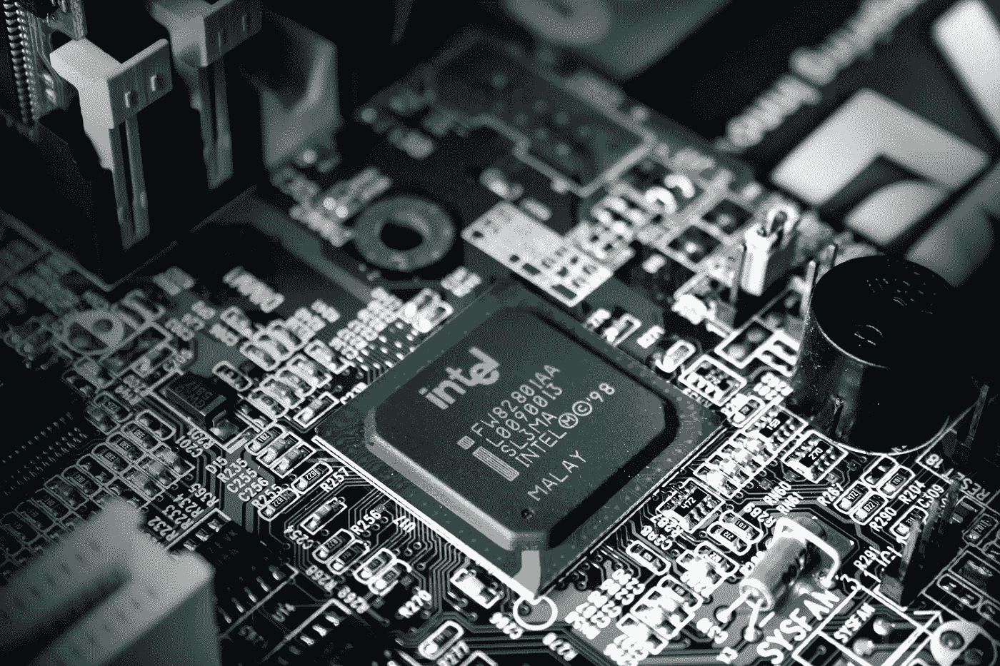

# 拥抱脸的平行推理🤗CPU 上的变压器

> 原文：<https://towardsdatascience.com/parallel-inference-of-huggingface-transformers-on-cpus-4487c28abe23>

## 大型机器学习和深度学习模型的多重处理预测介绍



图片由[斯莱文·久拉科维奇](https://unsplash.com/@slavudin)在 [Unsplash](https://unsplash.com/photos/0uXzoEzYZ4I) 上拍摄

人工智能研究的当前趋势是朝着越来越大的深度学习模型的发展，这些模型在性能方面不断超越彼此。最近自然语言处理(NLP)的例子有 [GPT-3](https://arxiv.org/pdf/2005.14165.pdf) 、 [XLNet](https://arxiv.org/pdf/1906.08237.pdf) 或经典的[伯特](https://aclanthology.org/N19-1423.pdf)变压器模型。虽然不断改进的结果激励着研究人员热情地研究更大的模型，但这种发展也有一个明显的缺点。训练这些大型模型是非常昂贵和耗时的。其中一个原因是深度学习模型需要同时在大量 GPU 上进行训练。由此产生的模型是如此之大，以至于它们不仅需要 GPU 进行训练，还需要在推理时使用 GPU。理论上，对 CPU 的推断是可能的。然而，这些大型模型需要很长时间才能在 CPU 上生成预测，这使得这种方法在实践中不太可行。不幸的是，近年来区块链的大肆宣传导致 GPU 短缺，这大大限制了许多人对 GPU 的访问。

> 如果我们想从预先训练的深度学习模型的出色性能中受益，而又没有 GPU 访问，我们该怎么办？我们一定要转向其他方法吗？答案是否定的。至少对于较小的项目，我们可能会在 CPU 上并行化模型推理，以提高预测速度。但是，从长远来看，对于更大的项目，仍然强烈建议使用 GPU。

# 深度学习模型的推理如何并行化？

在本教程中，我们将使用[光线](https://www.ray.io)对预训练的 HuggingFace 进行并行推理🤗Python 中的变压器模型。Ray 是一个框架，不仅可以在一台机器上，也可以在多台机器上扩展计算。对于本教程，我们将在一台配备 *2，4 Ghz 8 核英特尔酷睿 i9* 处理器的 *MacBook Pro (2019)* 上使用 Ray。

## 为什么要用 Ray 进行并行推理？

在 Python 中处理并行计算时，我们通常利用[多重处理](https://docs.python.org/3/library/multiprocessing.html)模块。但是，该模块有一些限制，使其不适合大型模型的并行推理。因此，我们需要在这方面主要考虑两个因素:

1.  Python 多处理模块使用 [pickle](https://docs.python.org/3/library/pickle.html) 在进程间传递大型对象时序列化它们。这种方法要求每个进程创建自己的数据副本，这增加了大量的内存使用以及昂贵的反序列化开销。相比之下，Ray 使用共享内存来存储对象，所有工作进程都可以访问这些对象，而不必反序列化或复制这些值( [Robert Nishihara](/10x-faster-parallel-python-without-python-multiprocessing-e5017c93cce1) )。考虑到模型通常试图预测大量数据，当使用 Ray 而不是多处理模块时，仅这个因素就已经可以加快计算速度。
2.  Python 多处理模块执行无状态函数，这意味着在一个 map 调用中产生的任何变量，如果我们想在另一个 map 调用中使用，都需要从第一个调用中返回，并传递给第二个调用。对于小对象，这种方法是可以接受的，但是当需要共享大的中间结果时，传递它们的成本是非常高的。在我们的例子中，这意味着我们需要重新加载我们的大拥抱面🤗Transformer 模型，因为映射的函数被认为是无状态的。最终，加载这些模型花费了我们太多的时间，以至于我们可能会因为只加载一次模型而变得更快，然后让它在单个 CPU 上预测整个数据，而不是并行化推理。相比之下，Ray 提供了一个 [actor 抽象](https://ray.readthedocs.io/en/latest/actors.html)，这样类就可以在并行和分布式环境中使用。使用 Ray，我们可以克服这个问题，因为我们可以通过在 actor 的构造函数中只加载一次模型，然后在多个 CPU 上使用它进行并行推理，从而避免模型重新加载的开销。

如果你想更多地了解雷，我推荐你去看看罗伯特·西原的博客。

## 辅导的

在本教程中，我们将使用 [Ray](https://github.com/ray-project/ray) 对来自 CPU 上 [20 个新闻组数据集](http://qwone.com/~jason/20Newsgroups/)的文本文档类进行并行预测。数据集是大约 20，000 个文本文档的集合，平均分布在 20 个不同的新闻组类别中。在本教程中，我们将只关注由类别“rec.motorcycles”和“rec.sport.baseball”组成的 20 个新闻组数据集的子集。我们将使用一个蒸馏蕴涵模型来执行零镜头文本分类。简单地说，零炮分类的工作原理如下:

我们为零镜头蕴涵模型提供文本形式的候选标签，然后该模型可以使用该文本来预测给定文本是否与给定候选标签相关联。零镜头蕴涵模型不必为特定的标签进行显式训练，而是可以基于看不见的标签和文本的语义来执行分类。

**零镜头文本分类示例:**

```
Text to classify: 
*The Avengers, is a 2012 American superhero film based on the Marvel Comics superhero team of the same name.*Candidate labels:
*Movies, Automotive*When providing the zero-shot entailment model with both, the text and candidate labels, the model will then predict a relationship score between the text and labels:
*Movies: 0.9856
Automotive: 0.0144*
```

有兴趣的可以在这里找到更详细的零拍文本分类介绍[。但是现在让我们来看看实际的代码示例。](https://nlp.town/blog/zero-shot-classification/)

**安装所需的 Python 包:**

```
pip install ray
pip install torch
pip install transformers
pip install scikit-learn
pip install psutil
```

**加载拥抱面🤗变压器型号和数据**

首先，我们导入所有重要的包，从 [Scikit-learn](https://scikit-learn.org/stable/datasets/real_world.html#newsgroups-dataset) 获取 20 个新闻组数据集，并从 HuggingFace 初始化我们的零镜头蕴涵模型🤗。

```
Number of text articles: 777
```

**预测单个文本文档并检查输出**

让我们在单个文档上测试零射击模型预测。

```
Text: Hey, the Lone Biker of the Apocalypse (see Raising Arizona) had flames coming
out of both his exhaust pipes. I love to toggle the kill switch on my Sportster
to produce flaming backfires, especially underneath overpasses at night (it's
loud and lights up the whole underpass!!!
Labels: ['motorcycle', 'baseball']
Scores: [0.9970590472221375, 0.002940954640507698]
```

我们可以观察到，我们的零镜头蕴涵模型可以正确地预测类，而无需事先在数据集上进行训练。

**预测单个 CPU 上的所有文本文件**

让我们预测单个 CPU 上所有文本文档的类别，并测量计算时间。

```
Prediction time: 0:04:12.172323
```

**预测多个 CPU 上的所有文本文档**

我们来预测一下所有文本文档在多个 CPU 上的类，测量一下计算时间。

```
Number of available CPUs: 16
Prediction time: 0:01:58.203863
```

与仅在一个 CPU 上进行计算相比，我们通过利用多个 CPU 显著减少了预测时间。为了用 Ray 并行化预测，我们只需要把 HuggingFace🤗局部对象存储中的管道(包括 transformer 模型)，定义一个预测函数`predict()`，用`@ray.remote`修饰。之后，我们必须在远程设置中执行该功能，并用`ray.get()`收集结果。

# 摘要

Ray 是一个易于使用的计算框架。我们可以用它在预先训练好的 HuggingFace 上进行并行 CPU 推理🤗Transformer 模型和 Python 中的其他大型机器学习/深度学习模型。如果你想了解更多关于射线和它的可能性，请查看[射线文件](https://docs.ray.io/en/latest/index.html)。

# 来源:

[](https://www.ray.io)  [](https://medium.com/@robertnishihara) 