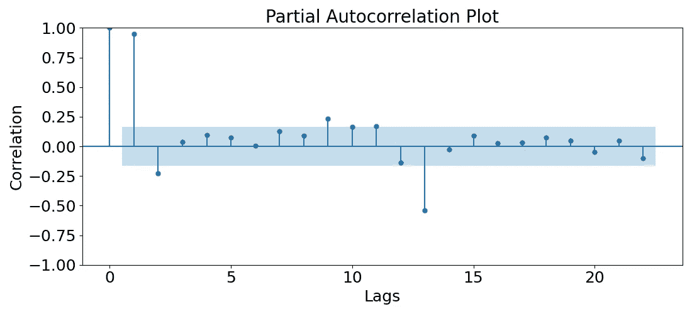

# 时间序列分析的偏自相关

> 原文：<https://towardsdatascience.com/partial-autocorrelation-for-time-series-481a9cfa7526>

## 描述什么是偏自相关及其在时间序列分析中的重要性

马库斯·斯皮斯克在 [Unsplash](https://unsplash.com?utm_source=medium&utm_medium=referral) 上的照片

# 介绍

在我之前的文章中，我们讨论了 [**自相关**](https://medium.com/towards-data-science/autocorrelation-for-time-series-analysis-86e68e631f77) 的概念:

 [## 时间序列分析的自相关

### 描述什么是自相关，为什么它在时间序列分析中有用。

towardsdatascience.com](/autocorrelation-for-time-series-analysis-86e68e631f77) 

自相关是随机变量或数据在不同时间点(滞后)的相关性。自相关传递了不同滞后的数据的相似性，使我们能够推断出我们的时间序列的一些有趣的特征，如季节性和趋势。

> 如果你想了解更多关于自相关的知识，一定要看看我上面链接的帖子！

大多数人都听说过自相关，然而你可能不知道它不太流行的表亲[**【PACF】**](https://online.stat.psu.edu/stat510/lesson/2/2.2)。在这篇简短而甜蜜的文章中，我想描述什么是 PACF，为什么它有用，并通过一个简单的例子来说明在 Python 中应用 PACF。

# 什么是偏自相关？

我们可以从解释 [**偏相关**](https://en.wikipedia.org/wiki/Partial_correlation) 开始。这是两个随机变量之间的 [**相关性**](https://en.wikipedia.org/wiki/Correlation) ，同时控制另一个(orm more)随机变量的影响，该随机变量影响我们相关的原始变量。

假设我们有三个随机变量:X****Y***和 ***Z*** 。 ***X*** 与 ***Y、*** 的偏相关，排除*Z[的影响，数学上就是](https://www.geeksforgeeks.org/how-to-calculate-partial-correlation-in-excel/):**

****

**作者在 LaTeX 中创建的方程。**

**其中 ***r*** 是范围在-1 和 1 之间的 [**相关系数**](https://en.wikipedia.org/wiki/Pearson_correlation_coefficient) 。**

**偏自相关仅仅是时间序列在两个不同时间状态下的偏相关。更进一步，它是两个不同滞后的时间序列之间的相关性，不考虑任何中间滞后的影响。例如，滞后 2 的偏自相关只是滞后 1 没有解释的相关性。**

# **为什么有用？**

**与自相关不同，偏相关还没有被我用于时间序列分析。然而，它的主要和非常重要的影响出现在构建预测模型时。**

**当拟合 [**自回归**](https://en.wikipedia.org/wiki/Autoregressive_model) 、 [**ARMA**](https://en.wikipedia.org/wiki/Autoregressive%E2%80%93moving-average_model) 或**模型时，PACF 用于估计 [**自回归**](https://online.stat.psu.edu/stat501/lesson/14/14.1) 分量的数量/阶数，如 [**Box-Jenkins**](https://en.wikipedia.org/wiki/Box%E2%80%93Jenkins_method) 程序所定义。这些模型可能是最常用的，并且在训练预测模型时通常会提供最佳结果。****

> ****在以后的博客中，我计划解释自回归模型、ARMA 模型和 ARIMA 模型。在此之前，请参考上面的链接来了解这些算法。****

****现在让我们看一个应用 PACF 的 Python 例子。****

# ****Python 中的示例****

****我们将使用航空客运量数据集:****

> ****数据[来自拥有 CC0 许可证的 Kaggle](https://www.kaggle.com/datasets/ashfakyeafi/air-passenger-data-for-time-series-analysis) 。****

****作者代码要点。****

********

****作者用 Python 生成的图。****

****数据有明显的趋势和明显的年度季节性。****

****statsmodels Python 模块提供了一个 [**plot_pacf**](https://www.statsmodels.org/dev/generated/statsmodels.graphics.tsaplots.plot_pacf.html) 函数来绘制不同滞后的 pacf，这也被称为*相关图*:****

****作者代码要点。****

********

****作者用 Python 生成的图。****

****我们看到滞后 1 是高度相关的，在时间上还有其他高度相关的滞后，这可能是由于季节性影响。****

****然而，从这个图来看，如果我们建立一个预测模型，我们将选择多少个自回归函数是很不清楚的。因此，通常建议使用[***auto ARIMA***](https://alkaline-ml.com/pmdarima/modules/generated/pmdarima.arima.auto_arima.html)等建模软件包对可能的参数进行网格搜索。****

> ****蓝色区域是滞后不再具有统计显著性**的地方。我们通常通过查看蓝色区域上方的自回归数来选择自回归数。******

# ******总结和进一步的思考******

******在这篇文章中，我们已经了解了部分自相关。这是一个时间序列与其自身滞后版本的相关性，不包括任何中间滞后。它的主要用途是估计预测模型(如 ARMA 和 ARIMA)的自回归分量的数量。******

******这篇文章中使用的完整代码可以在我的 GitHub 中找到:******

****** [## Medium-Articles/partial _ 自相关. py at main egorhowell/Medium-Articles

### 我在我的媒体博客/文章中使用的代码。通过创建一个关于…的帐户，为 egorhowell/Medium-Articles 的开发做出贡献

github.com](https://github.com/egorhowell/Medium-Articles/blob/main/Time%20Series/Time%20Series%20Tools/partial_autocorrelation.py) 

# 参考资料和进一步阅读

*   *预测:原理与实践:*[https://otexts.com/fpp2/](https://otexts.com/fpp2/)

# 和我联系！

*   要在媒体上阅读无限的故事，请务必在此注册！T17*💜*
*   [*要想在我发帖注册时得到更新的邮件通知就在这里！*](/subscribe/@egorhowell) 😀
*   [*LinkedIn*](https://www.linkedin.com/in/egor-howell-092a721b3/)*👔*
*   *[*推特*](https://twitter.com/EgorHowell) 🖊*
*   *[*github*](https://github.com/egorhowell)*🖥**
*   ****🏅****

> ***(所有表情符号都是由 [OpenMoji](https://openmoji.org/) 设计的——开源的表情符号和图标项目。执照: [CC BY-SA 4.0](https://creativecommons.org/licenses/by-sa/4.0/#)*********