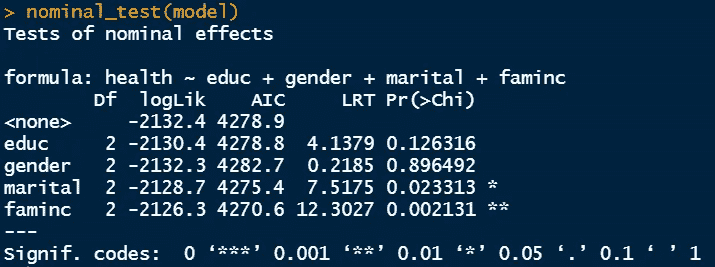
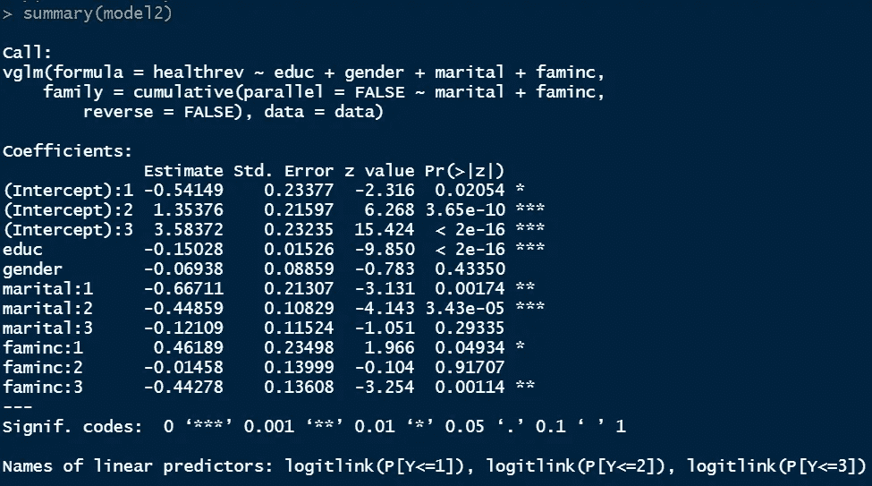

# R 中的部分比例奇模型

> 原文：<https://towardsdatascience.com/partial-proportional-odd-model-in-r-dc5face36e40>

## R 系列中的统计

约书亚·索蒂诺在 [Unsplash](https://unsplash.com/s/photos/data-science?utm_source=unsplash&utm_medium=referral&utm_content=creditCopyText) 上拍摄的照片

> **简介**

我们之前已经执行了一个广义有序逻辑回归模型，其中解释变量的影响被允许在不同水平的响应变量之间变化。当我们发现一些预测变量违反比例奇数假设时，我们可以只允许这些变量的影响在不同水平的结果中变化。这种模型被称为部分比例奇数(PPO)模型。

> 背景示例

在常规逻辑回归中，假设遵循比例奇数(PO)假设。这种假设表明，每个预测值的系数在自变量的所有类别中都是相同的。部分比例奇数(PPO)假设正好相反。它指出，每个预测值的影响在所有类别的响应变量中不应该是相同的。

如果我们考虑一个广义的模型，所有四个预测变量的系数对于不同水平的健康状况是不同的。另一方面，如果我们考虑一个 PPO 模型，只有那些违反 PPO 假设的预测变量的系数是不同的。这就是广义模型和 PPO 模型的区别。现在让我们看看下面的例子。

我们从 UCI 资料库中提取了成人数据集。我们将健康状况作为反应变量，并将教育、性别、婚姻状况和家庭收入作为预测因素。健康状态有四种不同的顺序响应。

让我们假设在 PO 模型中，教育系数是“x ”,这个值是相同的，与健康状况水平无关。例如，健康状况从 1 变到 2 时，教育系数为“x ”,健康状况从 2 变到 3 时，教育系数仍为“x ”,依此类推。在 PPO 模型中，我们说这是不正确的。不同输出电平的系数可能不同。换句话说，将健康状况差的人转变为健康状况一般的人的教育效果不同于将健康状况一般的人转变为健康状况良好的人的教育效果。

> **数据集**

UCI 机器学习知识库的成人数据集将是本案例研究的数据源。该数据集应该能够根据人口统计数据识别出大约 3 万人，比如他们的种族、教育程度、职业、性别、工资、如果他们有工作的话每周工作多长时间，以及他们的收入。

[来自 UCI 机器学习知识库的成人数据集](https://archive.ics.uci.edu/ml/datasets/adult)

这将需要我们对原始数据进行一些更改，以便我们可以在 r 中实现它。更改后，预测值和响应变量如下所示。

*   学历:数值型，连续型。
*   婚姻状况:二进制(0 表示未婚，1 表示已婚)。
*   性别:二进制(0 代表女性，1 代表男性)。
*   家庭收入:二进制(0 代表平均或低于平均，1 代表高于平均)。
*   健康状况:依次(1 表示差，2 表示一般，3 表示好，4 表示优秀)

修改的数据

> **违反采购订单假设的变量**

要执行部分比例奇数模型，我们首先需要确定哪些变量违反了比例奇数假设。一旦确定了变量或变量集，我们就可以使用这些变量的输入运行相同的模型，并要求模型在不同的结果中改变这些保护器的效果。

首先，我们可以使用下面的命令找出违反 PO 假设的变量。我们需要将健康状态变量声明为一个使用 clm()命令的因子。

> data$healthrev 型号< - clm(可接受性 _ 代码~价格 _ 代码+维护 _ 代码+安全 _ 代码，数据=数据)
> 标称 _ 测试(型号)

婚姻状况和家庭收入违反 PO 假设

一旦执行，我们可以得到对数似然、AIC 统计以及似然比卡方检验数据。这里，很明显，婚姻和家庭收入变量违反了 PO 假设，其中 p <0.05 (also marked with a star). The PO assumption holds true for both education and gender.

> **定义了 R** 中的 PPO 模型

广义模型和 PPO 模型之间的区别是在“平行=假”部分后提到了违反 PO 假设的变量。剩下的和概化模型差不多。

> **结果解读**

PPO 模型总结

结果窗口非常相似。在这里，教育和性别是固定的，因为它们的影响是不允许变化的，我们还观察到婚姻和家庭系数有三个不同的值。为了更好地理解这里的输出，读者可以在下一篇文章中浏览这个通用模型的输出。

<https://mdsohel-mahmood.medium.com/generalized-ordinal-regression-model-in-r-930834edae10>  

我们还可以获得如下的奇数比矩阵。

奇数比率

对于教育程度和性别，所有三个模型的系数估计值和比值比都是相同的。婚姻状况的系数分别为-0.667、-0.447 和-0.121，比值比为 0.513、0.638 和 0.885。

*   已婚者比未婚者处于第 1 类(健康状况较差)的可能性高 0.513 倍。
*   已婚者处于 2 类或以下(健康状况较差)的可能性是未婚者的 0.638 倍。
*   已婚者处于 3 级或以下(健康状况较差)的可能性是未婚者的 0.885 倍。

总的来说，可以说结婚降低了一个人处于或低于特定健康状态的几率，增加了一个人处于或高于特定健康状态的几率。显然，一个人结婚与更好的健康状况联系在一起的事实是非常明显的。

对于家庭收入，解释变得有点棘手。第一个系数是正的，而第二和第三个是负的。奇数比分别为 1.587、0.985 和 0.642。

*   较高的家庭收入使 1 类健康状况的几率增加 1.587 倍。
*   较高的家庭收入使 2 级或以下健康状况的几率降低 0.985。
*   较高的家庭收入使 3 级或以下健康状况的几率降低 0.642。

对于性别而言，它似乎不是健康状况的重要预测因素。

> **结论**

当我们执行广义有序逻辑回归模型和部分比例奇数模型时，我们看到了一些有趣的结果。在本文中，我们解释了部分比例奇数模型的系数和旧比率。这种方法只适用于当我们想改变不同水平的结果之间的一些预测因素的影响。

> **数据集确认**

[杜瓦博士和格拉夫博士(2019 年)。UCI 机器学习知识库[http://archive . ics . UCI . edu/ml]。加州欧文:加州大学信息与计算机科学学院(CC BY 4.0)](https://archive.ics.uci.edu/ml/datasets/adult)

感谢阅读。

<https://mdsohel-mahmood.medium.com/membership>  <https://mdsohel-mahmood.medium.com/subscribe> 