# 利用模式归纳提取用户高亮文本模式

> 原文：<https://towardsdatascience.com/pattern-induction-what-is-a-pattern-part-1-79ee1bd5adc6>

## *一步一步的指导如何快速准确地从几个文档中提取文本，只需少量用户给定的高亮文本*

提取包含季度收入的文本模式。图片作者。

你还记得上一次你不得不花费数不清的时间从成百上千的文档中找到你需要的确切信息吗？这是常见使用情形的几个示例:

*   财务分析师需要从季度报告和市场分析师报告中提取公司的收入，例如“500 亿美元的收入”或“150 亿美元的收入”。
*   质量保证专业人员提取产品编号以解决客户投诉，例如“MR-9483”或“MR-2930”。
*   一名记者试图从 FBI 新闻稿的数据集中提取刑事犯罪的增加和减少，例如“犯罪增加了 6%”或“犯罪减少了 5.5%”

从大量文本和文档中提取概念和关键信息的过程既麻烦又耗时。我们在 IBM 的团队已经将多年的研究和工程技术提炼为**模式归纳**，这是一个人工智能驱动的工具，旨在大大加快这一过程。

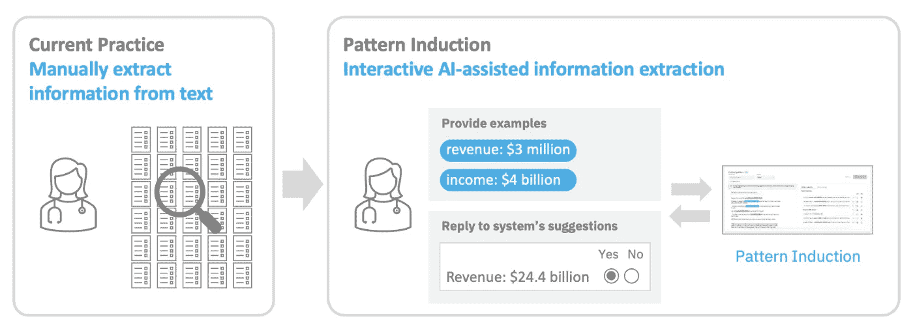

模式归纳的高级概述。图像由 Yannis Katsis。

给定几个提取示例和额外的用户反馈，模式归纳学习所提供示例背后的模式，并使用它们从输入文档中提取相似的模式信息。

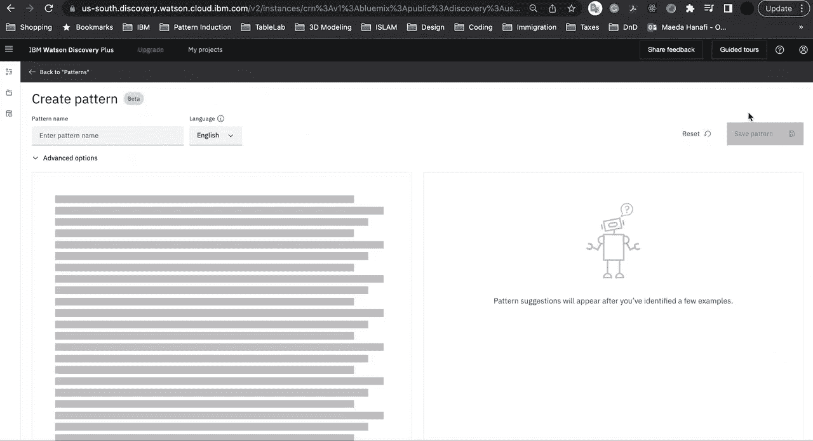

模式归纳:使用用户突出显示的文本示例从一组文档中提取货币金额。图片作者。

在本文中，我们将讨论以下内容:

*   什么是*图案*？
*   如何使用模式归纳，利用用户提供的高亮文本示例提取模式。
*   关于如何在 IBM Cloud 上设置一个帐户来访问 Watson Discovery，然后访问模式归纳特性的补充部分。

# 什么是模式？

在我们开始之前，让我们首先从理解模式的含义开始。一个模式在概念上是一系列具有一定规律性的*记号*或单词。例如，考虑以下财务用例中的示例:

如上所述，这些实例遵循一种模式，可以描述为以单词“revenue”或“income”开头的*文本，后跟冒号和货币金额*。

在我们如何设计模式归纳来读取这样的文本的上下文中，模式是在*记号*上的*正则表达式*，其中模式中的记号可以:

*   来自**字典**(例如，从文本中的标记生成的字典，例如包含货币比例的字典)。
*   始终是一个精确的字符串**文字。**
*   成为众所周知的**命名实体**的一部分(如货币、位置等。)使用人工智能技术识别。

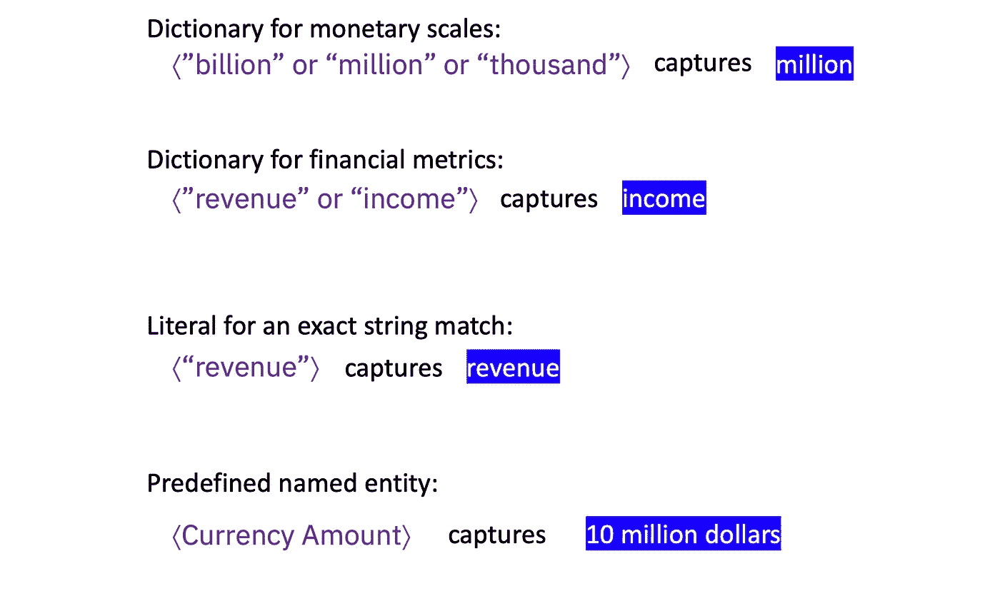

字典、文字和命名实体如何捕获文本中的标记。图片作者。

使用字典、文字、命名实体和正则表达式，我们可以使用**规则**简洁地描述模式，这些规则是令牌上这种正则表达式的序列。以下是描述我们财务用例的基本模式的规则:

*其中<货币金额>是一个命名实体。*

诸如记者、金融分析师、刑事调查人员或非技术背景的人经常发现手工制作这些规则具有挑战性。创建这些规则通常需要大量的试验和错误，以及一定程度的技术经验，如对语言概念的更深入理解。模式归纳从用户提供的文本示例中的模式自动生成这些规则。通过自动化手动构建规则，我们的模式归纳实现将帮助您专注于提炼提取的文本。

# *如何使用模式归纳提取模式*

在上一节中，我们简要地向您解释了模式的结构。在这一节中，我们将带您了解如何使用模式归纳来提取文本模式。

模式归纳是一个*人在回路*系统，它结合了领域专家的专业知识和自动学习能力，以快速学习高质量的提取器。在这个系统中，我们使人类能够快速地提供例子和对系统建议的反馈，以实现特定领域的结果和高覆盖率和高质量。

让我们从用户的角度向您介绍一个典型的模式归纳工作流。出于示例的目的，我们继续使用相同的场景，我们的目标是从财务文档*中提取收入信息，例如“200 亿美元的收入”。*

**先决条件:**在开始之前，请创建一个模式归纳项目，遵循本博客末尾的“尝试模式归纳”一节中概述的几个简单步骤。

**第一步:突出几个例子。**一旦您完成了先决条件，首先突出显示几个属于您想要提取的模式的字符串(参见下面图 1 中的例子)。一旦你提供了足够多的例子(我们推荐这个版本至少有两个)，系统将学习所提供的例子背后的一般模式。

> 提示:我们鼓励您从提供两个示例开始，等待系统完成学习，然后再对学习结果提供反馈和/或直接突出显示更多示例。

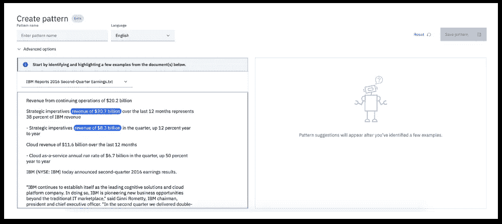

图 1:用户突出显示了几个例子。图片作者。

**第二步:检查模型发现的提取，并回复系统的建议。**一旦系统处理了突出显示的示例并学习了您的第一个提取器版本，它会用两种类型的信息更新屏幕(参见下面的图 2):首先，它会用绿色突出显示当前学习的提取器预测的所有文本片段，供您检查。第二，系统探查一系列是/否问题供您验证，以理解您的意图并纠正任何错误的提取。

> 提示:我们鼓励您回答尽可能多的问题(最好是所有问题)，因为这些问题是系统有策略地选择的，以帮助区分您可能想要提取的潜在模式。

图 2:系统返回一些建议供用户验证。图片作者。

**第三步**:等一会儿……一旦系统学习到一个准确的提取器(由少量模式组成)，它会相应地通知你。

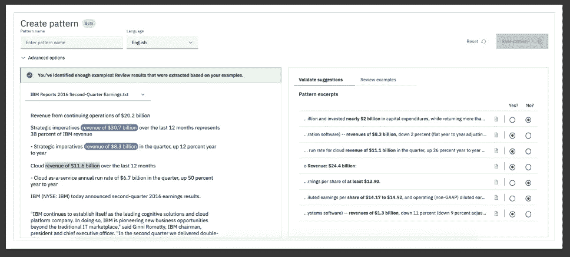

图 3:后端算法告知已经学习了精确的算法。图片作者。

**第四步:回顾摘录的例子。** 为了确保提取的准确性，您可以单击“查看示例”窗格并检查提取的示例列表。如果您发现任何错误或遗漏的摘录，您可以通过重复上述步骤 1-3 来提供更多示例和/或反馈。

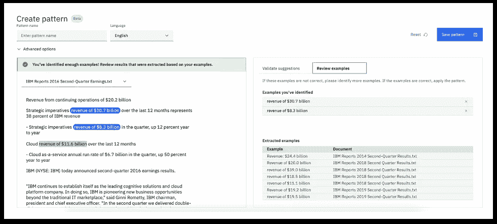

图 4:用户评论提取的模式。图片作者。

**第五步:保存你的模式。如果一切看起来都正确，你现在可以进入过程的最后阶段，包括保存学习到的模式以备将来使用。只需在左上角为您的图案键入一个名称，然后单击右上角的“保存图案”按钮。保存模式时，选择“文本”等字段进行丰富。**

**步骤 6:在原始文档的上下文中可视化模式提取。**如果您导航到左上角的“改进和定制”选项卡，您会看到一个搜索栏。点击搜索栏中的“Enter”键将会显示一个段落列表(图 5)。

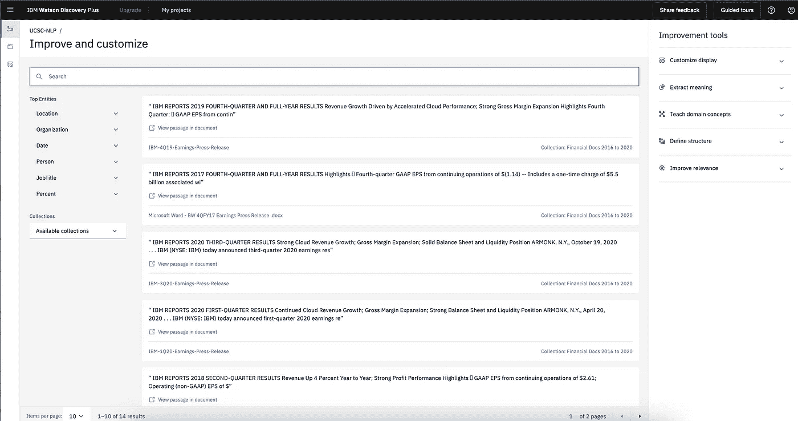

图 5:查看“改进和定制”选项卡中的段落

您可以为任何一个搜索结果选择“查看文档中的段落”，在右下角，选择“打开高级视图”将显示原始 PDF 文档。选择任何一个保存的模式将会直接在文档中突出显示提取内容(图 6)。

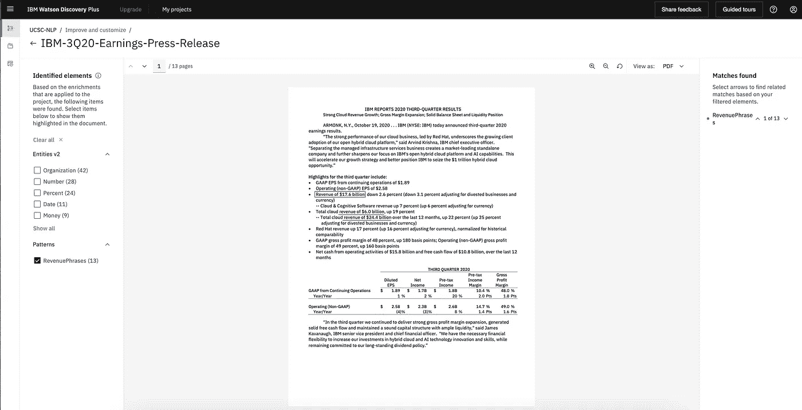

图 6:我们刚刚创建的模式中的收入短语在文档的上下文中突出显示。

# 补充部分:试用模式归纳

按照这些简单的步骤尝试模式归纳:

**第一步:创建一个 IBM 帐户，并按如下所述建立一个 Watson Discovery 项目:**在 Watson Discovery 上注册一个 IBM 帐户，然后导航到您的云仪表盘:【https://cloud.ibm.com】T2。点击屏幕右上角的“创建资源”按钮。

图 7:你的云账户主页。图片作者。

在你的左边搜索“沃森发现”，点击标题为“沃森发现”的服务。选择适合您的计划，如 premium、plus 等。

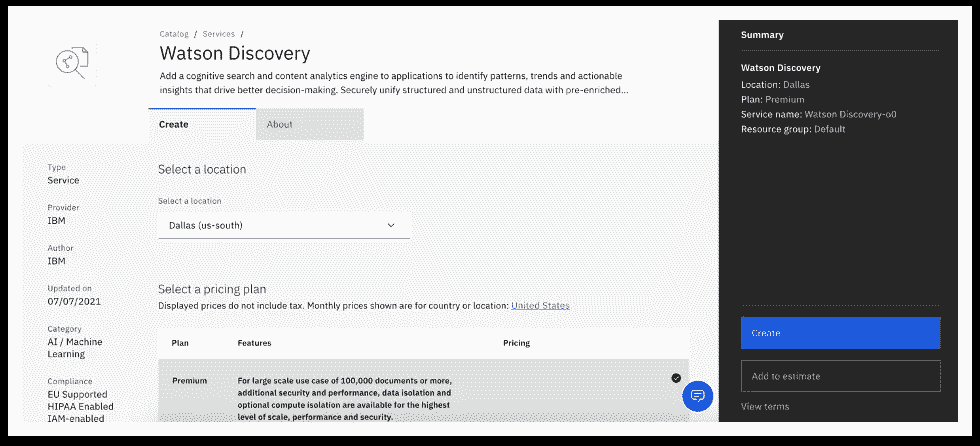

图 8:创建 Watson 发现服务。图片作者。

创建服务后，导航到 https://cloud.ibm.com/resources 的。在这里，您可以查看最近创建的服务，如下所示。点击您的“沃森发现”服务，然后点击“启动沃森发现”按钮。这将把您重定向到服务，在那里您可以为您的提取任务创建一个项目。

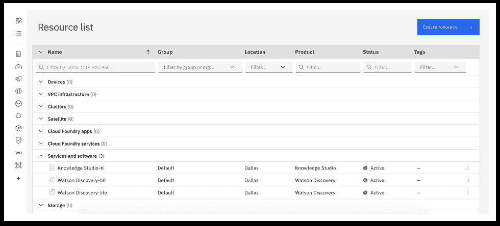

图 9:资源列表。请注意“服务和软件”部分下的“Watson Discovery”服务。图片作者。

要创建一个项目，提供一个项目名称，选择“文档检索”作为项目类型(参见图 10)，然后单击“下一步”。完成上传数据集的步骤。

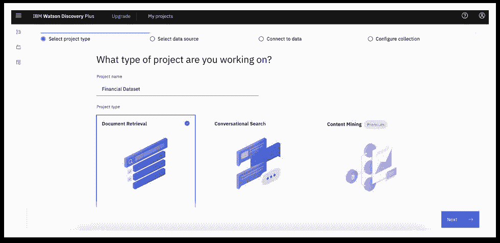

图 10:选择“文档检索”作为您的项目类型。图片作者。

文档上传后，建议本教程启用智能文档理解功能。单击以管理您的数据集(参见图 11 中的左上角)。选择“识别字段”选项卡，然后选择“预训练模型”。然后通过选择“提交”来确认选择，并通过点击右上角的按钮“应用更改并重新处理”来应用更改。

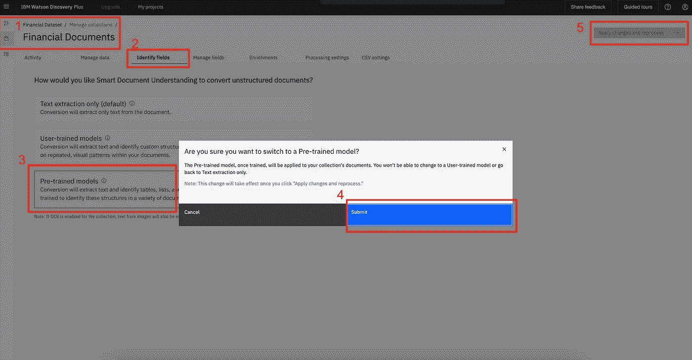

图 11:启用智能文档理解特性

**第二步:现在，为了跟进，你可以尝试在这里下载以下任何一个数据集:**

*   从演示中，您可以尝试从 IBM 新闻稿数据集中提取收入和现金流，“23 亿美元的收入”或“450 亿美元的现金流”。点击[这里](https://community.ibm.com/community/user/watsonai/communities/community-home/all-news?attachments=&communitykey=80650291-2ff4-4a43-9ff8-5188fdb9552f&defaultview=&folder=183aec0c-a4ae-4743-8836-3366eb44fe49)。
*   用联邦调查局的新闻发布数据集挑战自己，提取不同类型犯罪相关的百分比的增加和减少，“犯罪上升 5%”或“犯罪下降 6%”。点击[这里](https://community.ibm.com/community/user/watsonai/communities/community-home/all-news?attachments=&communitykey=80650291-2ff4-4a43-9ff8-5188fdb9552f&defaultview=&folder=183aec0c-a4ae-4743-8836-3366eb44fe49)。

数据上传完成后，导航到“改进和定制”屏幕，在这里您可以通过点击“教授领域概念”下的“模式”来访问模式归纳(参见图 12)。

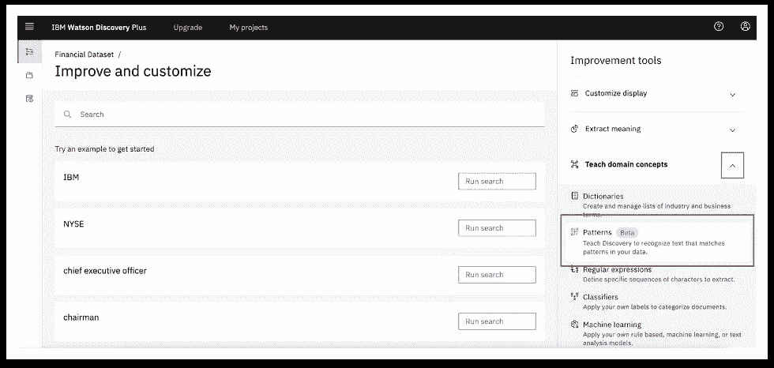

图 12:访问模式归纳。图片作者。

点击“Create”来创建一个新的模式，选择要从中创建模式的文档(或者让系统从您的文档集合中随机选择文档)，然后点击“Next”(参见图 13)。这将导航到模式归纳，在这里您可以开始创建模式。

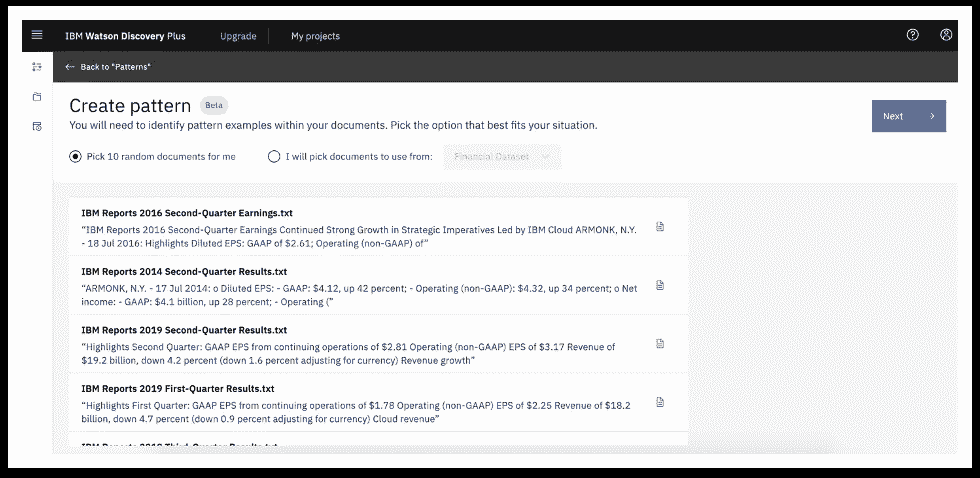

图 13:选择用来创建模式的文档。图片作者。

# 结论

在本文中，我们向您介绍了模式归纳，这是一个帮助用户使用突出显示的文本示例快速准确地提取文本模式的工具。模式归纳只需要很少的努力就可以启动提取文本的过程。它也不需要用户编写一行代码。

## 补充资源

如果您正在将模式归纳应用到您的文档中，并且您正在寻找关于使用模式归纳的更全面的用户指南和最佳实践，请查看下一篇帖子:

*   [模式归纳:提取文本模式的最佳实践](https://medium.com/@maeda-han/pattern-induction-best-practices-for-extracting-text-patterns-part-3-2c0ee6481a3c)

*作者:前田哈纳菲博士、亚尼斯·卡西斯博士、李蕴瑶博士、比卡尔帕·纽帕内博士*