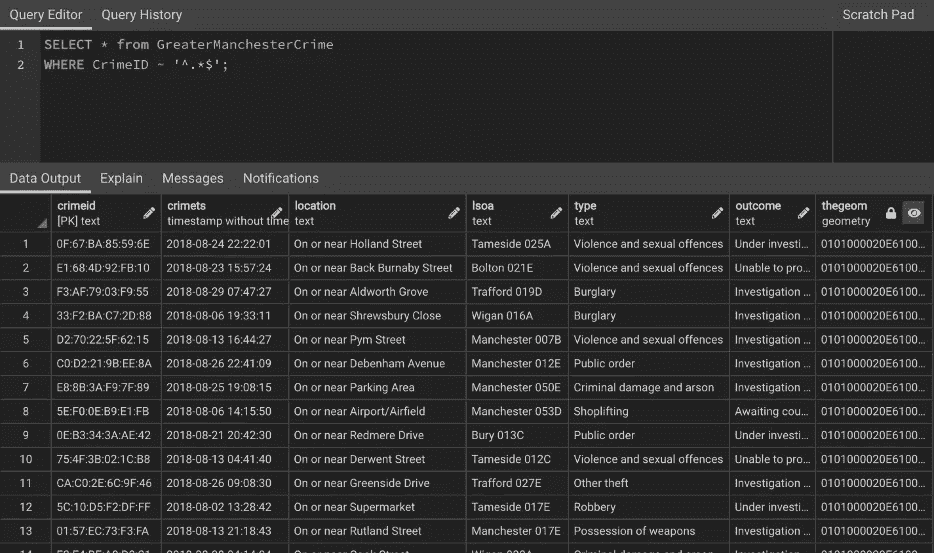
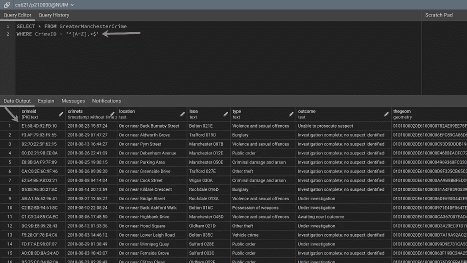
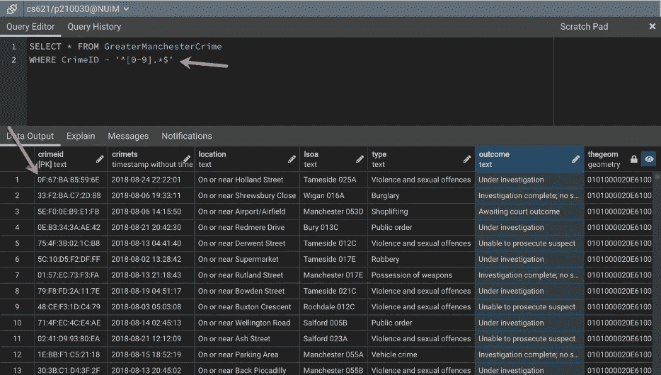
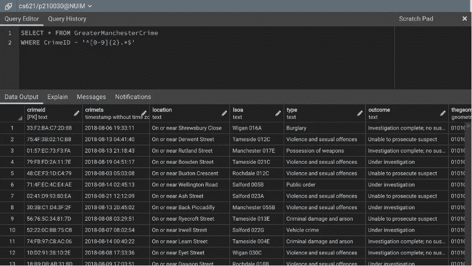
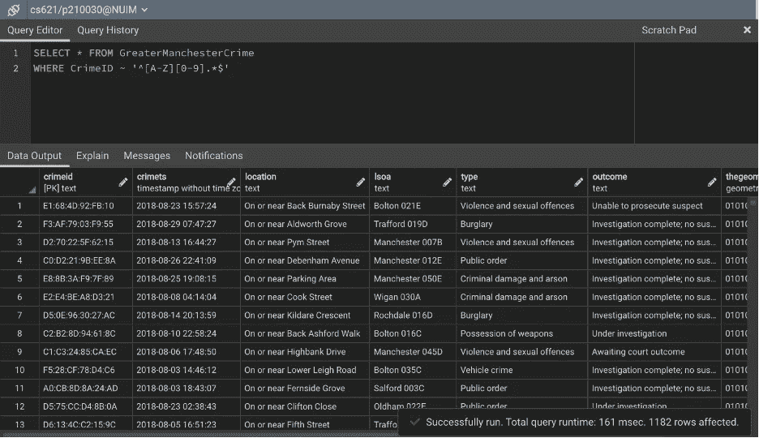

# PostgreSQL 中的模式匹配和正则表达式

> 原文：<https://towardsdatascience.com/pattern-matching-and-regular-expressions-in-postgresql-cd1fa76e5f3f>

## 了解如何在 PostgreSQL 中使用正则表达式


来自[像素](https://www.pexels.com/photo/software-engineer-standing-beside-server-racks-1181354/)的图像

在本文中，我将讨论 PostgreSQL 中的模式匹配和正则表达式。PostgreSQL 是一个开源的关系数据库管理系统，在最近几天受到了广泛的欢迎。PostgreSQL 可以快速轻松地安装在内部或流行的云平台上，如 Azure、AWS 等。使用任何数据库时需要掌握的一项重要技能是学习和编写 SQL 查询。PostgreSQL 还支持本地 ANSI SQL 查询，对于初学者来说，开始为 PostgreSQL 数据库编写查询非常容易。

编写查询的一个重要方面是用户应该能够过滤和选择系统需要访问的数据。额外或不必要的数据会增加带宽并降低查询性能。因此，SQL 提供了一个过滤谓词“WHERE ”,用户可以使用它来过滤查询并选择只与过滤谓词匹配的结果。例如，如果我们想要选择在计算机科学部门工作的用户，那么我们将编写如下 SQL 查询。

```
SELECT * FROM users WHERE department = ‘Computer Science’
```

请注意，过滤器谓词使用等号(=)和要在用户表的 department 列中匹配的精确短语。然而，在某些情况下，可能需要基于精确短语的一部分进行过滤。换句话说，可能会要求用户过滤所有与短语的一部分匹配但不完全匹配的记录。比如让我们考虑有两个系，计算机科学和计算数学。现在，过滤这两个部门的查询可以编写如下。

```
SELECT * FROM users WHERE department LIKE ‘Comput%’
```

注意 LIKE 操作符是如何在查询中使用的，以便只过滤后面跟有“%”符号的精确短语的一部分。“%”运算符是一个通配符运算符，表示可以在匹配的短语后选择任何内容。

# PostgreSQL 中的正则表达式

到目前为止，我们已经学习了如何使用 WHERE 子句过滤查询，以及如何使用 LIKE 操作符匹配模式。在正常的 SQL 操作中，LIKE 操作符很好，但是在过滤大型数据库时，LIKE 操作符似乎存在一些性能问题。此外，LIKE 运算符的过滤条件仅限于通过仅包含通配符(%)来查找模式。为了克服这个问题，PostgreSQL 提供了一种使用正则表达式进行模式匹配的高级方法。正则表达式已经在编程语言中大量使用了很长时间，然而，在 SQL 语句中使用这些正则表达式，使得查询高度动态化，并且在大型数据库中执行得更好。PostgreSQL 中的正则表达式是使用波浪号( **~** )运算符实现的，并使用了“**”。*** "作为通配符。



图 1 —在 PostgreSQL 数据库中使用正则表达式

如上图所示，我们在 PostgreSQL 中使用了正则表达式，使用了代字号( **~** )运算符和通配符'**。***’。该查询将从 *GreaterManchesterCrime* 表中选择具有有效 *CrimeID* 的所有记录。因为模式条件只是通配符，所以它将从表中获取所有记录。另外，在 PostgreSQL 中编写正则表达式时需要注意的另一个要点是，模式匹配语句总是以' **^** 操作符开始，以' **$** '符号结束。这两个操作符标记了正则表达式语句的开始和结束。综上图，当使用通配符过滤所有记录时，表达式可以实现为" **^.*$** ”。

# 正则表达式—以数字或字符开头的字符串

在上一节中，我们已经学习了如何通过使用通配符来实现正则表达式。现在，我们将向前迈进一步，尝试获取以字符或数字开头的记录，用于列 CrimeID。

在 PostgreSQL 中，字母数字字符可以通过使用模式“**【A-Z】**”或“**【A-Z】**”进行匹配，具体取决于我们尝试匹配的大小写。这里需要注意的重要一点是，由于 PostgreSQL 是区分大小写的，因此，必须指定我们试图在模式中匹配的确切大小写。同样，对于匹配的数字，我们可以笑脸使用“**【0–9】**”或“ **\d** ”。现在我们已经对使用 Regex 过滤字符和数字有了一些了解，让我们继续在数据库上实现它。

## 对于匹配字符–

```
SELECT * FROM GreaterManchesterCrime WHERE CrimeID ~ ‘^[A-Z].*$’
```



图 2 —在 PostgreSQL 中使用正则表达式—大写模式匹配

如上图所示，CrimeID 字段已经过筛选，仅包含 ID 以大写字母开头的记录。注意通配符“**”是如何。*** "再次用于表示 SQL 语句中第一个字符之后的任何内容。

要过滤语句中的数字，我们可以简单地编写如下查询。

```
SELECT * FROM GreaterManchesterCrime WHERE CrimeID ~ ‘^[0–9].*$’
```



图 3 —在 PostgreSQL 中使用正则表达式—数字模式匹配

从上图中，我们可以看到，只有以数字开头的 CrimeID 记录被过滤，以匹配正则表达式标准。

# 正则表达式-以重复数字或字符开头的字符串

在本文的上一节中，我们已经了解了如何使用正则表达式语法在 PostgreSQL 中编写 SQL 查询，以及如何在被过滤的字符串的第一个位置过滤字符和数字。现在，让我们给需求增加一些复杂性，并过滤开头超过一个字符或数字的记录。PostgreSQL 通过在花括号内提供计数，使得指定重复次数变得非常容易。或者，您也可以多次重复相同的字符模式匹配，以匹配您的标准。例如，我们希望过滤所有以两个字符开头的记录。这个查询可以写成如下形式。

```
SELECT * FROM GreaterManchesterCrime WHERE CrimeID ~ ‘^[A-Z] [A-Z].*$’
```

运筹学

```
SELECT * FROM GreaterManchesterCrime WHERE CrimeID ~ ‘^[A-Z] {2}.*$’
```


图 4 —在 PostgreSQL 中使用正则表达式—重复大写模式匹配

正如您在上图中看到的，我们使用了花括号中的数字来表示在列中查找模式的次数。这使得查询非常动态，因为您可以指定想要在查询中搜索的任意数量的字符，并且您将得到结果。同样，您也可以实现相同的逻辑来重复数值。在这种情况下，查询可以写成如下形式。

```
SELECT * FROM GreaterManchesterCrime WHERE CrimeID ~ ‘^[0–9]{2}.*$’
```



图 5 —在 PostgreSQL 中使用正则表达式—重复数字模式匹配

上图显示了在过滤重复数值时使用正则表达式实现模式匹配。

# 正则表达式-以字符和数字开头的字符串

在本文的最后一部分，我们将结合目前为止所看到的内容。我们将构建查询并匹配模式，该模式将过滤以字符开头后跟数字的记录。要形成该规范的查询，只需在正则表达式中组合字母和数字字符的条件。SQL 语句可以写成如下形式。

```
SELECT * FROM GreaterManchesterCrime WHERE CrimeID ~ ‘^[A-Z][0–9].*$’
```



图 6 —在 PostgreSQL 中使用正则表达式—字母数字模式匹配

# 结论

在本文中，我们深入探讨了如何用 PostgreSQL 中的正则表达式编写 SQL 语句。正则表达式帮助我们编写动态 SQL 语句，用于匹配数据库中某一列的模式。当您不需要查询中的精确匹配，但是希望查找所有符合条件的记录时，模式匹配非常有用。PostgreSQL 中的模式匹配也可以使用 SQL LIKE 操作符来实现，但是搜索是有限的。正则表达式提供了更大的灵活性，并允许动态控制匹配模式的范围。要了解更多关于在 PostgreSQL 中使用正则表达式进行模式匹配的知识，我建议您阅读官方教程。