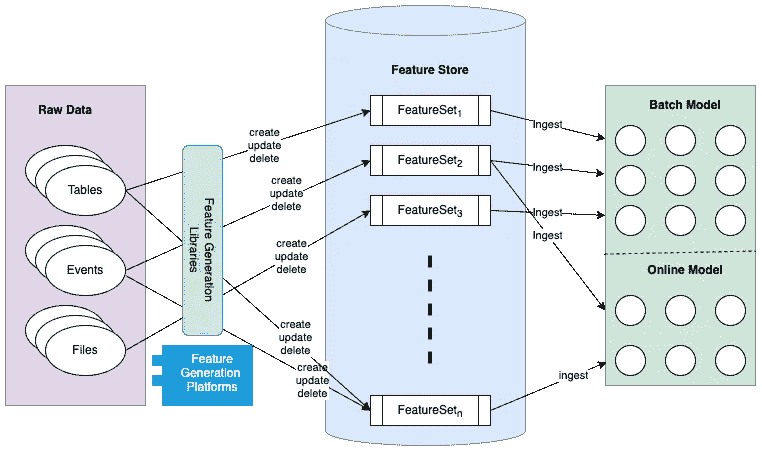

# 用于复制机器学习特征的模式

> 原文：<https://towardsdatascience.com/patterns-for-reproducing-machine-learning-features-949e95544e35>

## 如何通过可再现的特征来再现机器学习应用中的流程

典型软件应用的可靠性需要确定性的输出。对于生活在随机性和不确定性领域的机器学习(ML)应用来说，很难保证同样的效果。然而，通过使它们可再现来确保应用程序的大部分是可能的，这是可靠性的先决条件。每个人都知道应该在任何地方一致使用的随机种子。然而，除此之外，在应用程序的培训、服务和评估阶段，还有其他一些组件应该修复。

在这篇文章中，我们探索了机器学习中可重复性的设计模式。设计模式的灵感来自《机器学习设计模式》这本书。我强烈推荐这本书给 ML 从业者。

设计模式是:

*   *转换*:如何在不同阶段保持特性的一致性，比如简单机器学习应用的训练、服务和评估
*   *可重复分割:*如何在训练、验证和测试数据集中分割特征，以确保无泄漏训练，而不管数据量如何
*   *特征存储:*如何以可复制的方式获取特征，并在不同的机器学习作业中重用

# 可重复特征分割

训练模型需要在训练集、测试集和验证集中拆分特征。通常的做法是使用随机方法将特征分成这些集合。它不适合现实情况，因为它假设一个特征集中的行是不相关的，而在许多情况下并非如此。

有必要使用分布良好的列和确定性散列函数。首先，可以从捕获行之间相关性的列开始。如图 1 所示，然后可以使用该列散列的尾部数字来分割数据集。有一系列散列函数可用于此目的，例如 [Farm Hash](https://github.com/google/farmhash) 。然而，在继续进行剩余的过程之前，必须对分割进行测试，例如使用 [Kolmogorov-Smirnov 测试](https://en.wikipedia.org/wiki/Kolmogorov%E2%80%93Smirnov_test)。有时一个列是不够的，在这种情况下，应该探索更多的列。在极端情况下，可以对所有列执行拆分。

图 1:使用列创建训练/测试/验证数据集。图片由作者、

在某些情况下，对散列进行正常的随机分割是不合适的。就时间序列数据而言，基于日期/时间序列或间隔的定制分割更为可取。对于具有偏斜分布的列的情况，分层抽样将更适合。尽管对于大量数据，这种分割不是必须的。

# 一致变换

真实机器学习应用的输入并不按原样使用。相反，它们经历了一系列产生特征的转变。这些特征用于训练机器学习模型。在服务或评估期间，输入是新的，但是需要经过相同的转换集。

严肃的团队不应该将输入数据提取和特征生成视为机器学习工作流的数据管道的一部分。此外，采用/设计一种建模框架将是有益的，该建模框架实际上允许对模型对象内的转换进行编码，并且作为建模图/流水线的一部分，作为训练和预测任务的一部分来执行转换。常见的机器框架，如 [scikit-learn](https://scikit-learn.org/stable/data_transforms.html) 、 [TensorFlow](https://www.tensorflow.org/tfx/tutorials/transform/simple) 等。这样做将允许模型创建或操作的可靠特征生成，并且只要转换操作简单，就保持 ML 工作流简单。

虽然输入数据处理和特征变换的单独处理在所有情况下都是必要的，但是打包变换函数不适合复杂的机器学习情况。对于处理大量信息的应用程序来说尤其如此。在这种情况下，有必要在分布式数据处理环境中运行特征变换，这对于训练任务或服务任务来说可能不是推荐的环境。试图在同一环境中打包这些操作将需要复杂的设置，这会增加操作成本和/或迫使选择不合适的解决方案堆栈。

图 2:模型训练和服务过程，除了其他典型函数，如 fit、predict 等，还包括 transform 函数。适用于简单的应用程序。图片由作者提供。

# 功能存储

对于机器学习应用程序来说，特征工程是至关重要的，但也是最耗时的过程之一。特性从组织数据中获取领域和业务洞察力。真实的工业应用表明，使用正确的特征是成功的机器学习配方的最关键的成分。没有一个准确的、一致的、治理良好的过程，就不可能获得正确的特性。一个不成熟的组织应用特定的过程来生成特性，这是实现生成和消费特性的期望过程的障碍。由于重复，特设流程极其浪费，并且难以采用适当的治理流程。

如图 3 所示，*特征库*设计模式将特征创建过程与使用这些特征的模型的开发和服务相分离。使用一组特征生成平台上的特征生成库来处理表格、事件和文件形式的原始数据。库-平台对根据数据-特征类型对而变化。从集合的角度来考虑特性是有好处的，集合的大小取决于使用它的模型的性质。对于批量模型，数据集将会很大，而对于在线模型，数据集可能只包含一些最近的数据点。有必要在生态系统中包含创建、更新、删除、接收、版本控制、编目、治理和缓存特性的功能。这方面有几款产品可以走中心组件，比如[顶点 AI 特征店](https://cloud.google.com/vertex-ai/docs/featurestore)、 [HopsWorks 特征店](https://www.hopsworks.ai/feature-store)、 [Databricks 特征店](https://docs.databricks.com/applications/machine-learning/feature-store/index.html)等。

图 3:机器学习应用的特征存储解耦特征生成和消费。图片由作者提供。

特征存储来自特征服务的特征工程。这允许在模型开发期间，特征开发和创建与特征服务异步发生。一旦特征被添加到特征存储中，它们就可以立即用于训练和服务，并且被存储在来自各种 ML 应用的单一位置。这确保了模型训练和服务之间的一致性。功能库是一个版本控制的功能库。这允许新的 ML 项目从目录的特征选择过程开始，而不是从零开始执行特征工程。随着越来越多的功能添加到商店中，它允许组织实现规模经济效应。

# **备注**

本文关注的是特征工程的设计模式，以重现机器学习流程。一致拆分模式将主数据集拆分为训练、测试和验证数据集，以确保即使数据集不断增长，训练中使用的样本也不会用于评估或测试。*转换*设计模式通过明确捕获将模型输入转换为模型特征的过程，解决了模型训练管道和模型服务管道之间的数据准备依赖性的再现性。最后，我们引入了*特征库*设计模式来解决复杂 ML 作业中特征的可再现性和可重用性。

有没有更多你觉得有必要的设计模式？请分享。