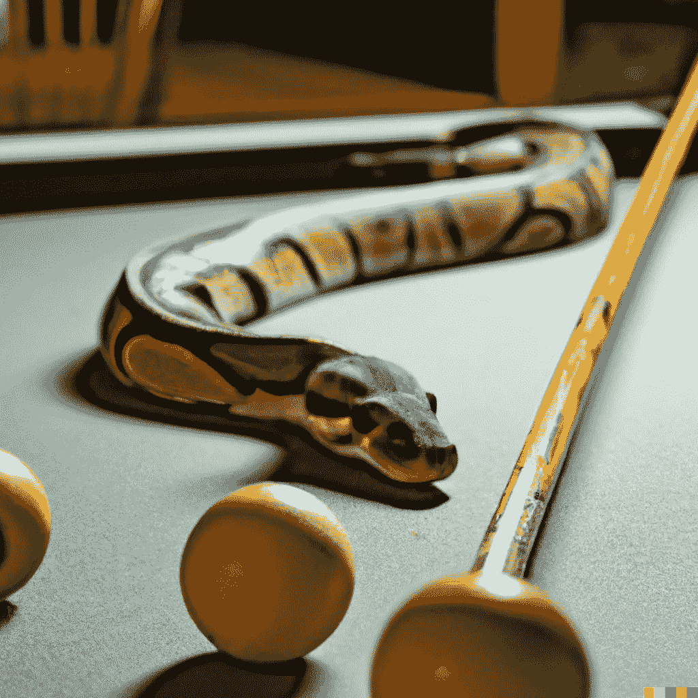

# Python 中完美的、无限精确的游戏物理学(第 2 部分)

> 原文：<https://towardsdatascience.com/perfect-infinite-precision-game-physics-in-python-part-2-360cc445a197>

## 用台球把哲学变成编程

一条玩台球的蟒蛇——来源:[https://openai.com/dall-e-2/](https://openai.com/dall-e-2/)

这是向您展示如何用 Python 编写一个完美的物理引擎的四篇文章中的第二篇。这是我将所有物理、数学、甚至哲学转化为编程的宏伟目标中的一小步。通过这个项目，我们将发现惊喜，增加了解，并且(我希望)玩得开心。[所有代码都可以在 GitHub](https://github.com/CarlKCarlK/perfect-physics) 上获得。

在[第一部](/perfect-infinite-precision-game-physics-in-python-part-1-698211c08d95)中，我们开发了顶级的完美物理引擎。然后我们将它应用于牛顿的摇篮，一个三角形内接的圆，以及网球和篮球下落。

在第 2 部分中，我们将把引擎应用到更复杂的事情上:台球休息。(当我看到结果的时候，它们改变了我对世界的哲学理解。)

想象一个母球散射出一个三角形的台球。如果——休息一会儿之后——你可以反转每个球的方向，它们会重新形成一个静止的三角形并吐出母球吗？换句话说，我们的宇宙包括撤销按钮吗？

## 一个带有蝴蝶的近似物理引擎

六年前，我做了这个实验。我使用了一个不完美的近似物理引擎。如视频所示，实验失败了。三角形确实重新形成了，但它不是静止不动的。(要重放/暂停视频，请按左下角的按钮。)

不完美的 2015 年模拟(画外音包括一首关于数学家亨利·庞加莱的诗)

当时，我把失败归因于蝴蝶效应。蝴蝶效应说，初始条件中非常小的差异(或近似)会导致后来的巨大差异。实验的失败激发了这首诗:

> 牛顿说一切都是可逆的，庞加莱说不，我们的目标是有限的，我们尝试过，但没有什么是永远不变的。

## 没有蝴蝶的完美物理引擎

我们新的物理引擎避免了蝴蝶效应。它准确地知道每一个时间、位置和速度。它使用了`175–9*sqrt(3)/2`这样的表达方式。所以，我们应该可以反向台球，对不对？让我们看看。(要重放/暂停视频，请按左下角的按钮。声音是有帮助的。)

台球休息(11 视频秒/203 模拟单位)

还是不行。三角形再次重新形成，但又一次没有保持在一起。这让我很难过。然而，作为程序员，我们不会沮丧，我们会调试。在这种情况下，我们必须调试世界。

我们将从逐个事件运行模拟开始:

台球休息事件(45 视频秒/177 模拟单位)

对称性的缺乏让你吃惊吗？作为程序员，我们知道我们的下一个调试步骤:创建一个[最小可再现的例子](https://en.wikipedia.org/wiki/Minimal_reproducible_example)。换句话说，找一个说明同样问题的小例子。

考虑一下这个三圈世界。我们运行了两次。

在第三帧中，观察小球的速度箭头。箭头指向不同的方向。世界已经分化。

我们可以追踪原因到第二帧。在时钟=14，cueball 击中其他两个球。但是它首先瞬间击中哪个球呢？无论哪个先击中，都会获得更多的能量，破坏对称性。

我听说你反对模拟器先选择一次碰撞。为什么不通过平均分配能量来保持对称呢？嗯，因为…

*   我们已经讨论了三种选择——球 1 的最大能量、球 2 的最大能量或相等的能量。然而，总的来说，模拟器面临着无限的选择。它可以在两个球之间以任意比例分配能量，同时仍然保持能量和动量。是什么让“平等”变得特别？
*   好吧，我承认在*这个*案例中,“相等”可能是对称的。然而，一般来说，没有对称性可用。考虑三个运动圆之间的不对称碰撞。因此，对称性没有给出答案。

三个圆不对称碰撞

所以，多次碰撞可以导致无限可能的结果，我们不能依赖于对称性。我们能做什么？我不认为在无限可能的结果中有任何“公平”的选择方式。(关于可能的牛顿非决定论的最佳讨论，请参见从第 18 页开始的爱德华·a·李的[信息物理系统建模的基本限制](https://dl.acm.org/doi/pdf/10.1145/2912149)。也可以参考 Sammy Gerbil 的这个[物理堆栈交换评论](https://physics.stackexchange.com/a/296850/351617)和 Google Group sci . Physics . research 中的这个 2003 年的讨论。)

当有疑问时，做一些简单的事情。我让模拟器将多次碰撞视为成对碰撞的列表。然后，它以随机顺序处理每一对。例如，当三个圆(A、B、C)发生碰撞时，我们最多有三个碰撞对(AB、BC、AC ),它们可以排序为 3！，也就是 6 种方式。

即使这种简单的方法也会导致大量可能的结果。在完整的 15 三角球台球世界中，引擎经常看到 5 到 7 对的碰撞(因此，120 到 5，040 个结果)。它还看到一次与 18 对的碰撞(所以 18！或 6，402，373，705，728，000 个结果)。

## 觉得幸运吗？

这让我想起了一个新问题。如果你非常非常幸运的话，你能逆转一次撞球吗？我相信答案永远是“是”，但我不知道如何证明。然而，对于三个三角形球的世界，我尝试了各种随机种子。我尝试的第 17 粒种子成功了，制作了这个活动视频:

三个三角球的台球事件(27 视频秒/96 模拟单元)

这个普通的视频:

三个三角球的台球(17 视频秒/74 模拟单元)

因此，即使有完美的、无限精确的物理学，这个世界也不是确定的，除非我们非常非常幸运。这个结果不依赖于蝴蝶效应(小差异导致大差异)或者量子不确定性。相反，它依赖于三个或更多的碰撞物体在遵守牛顿物理定律的同时交换能量和动量的无数种方式。

我们现在可以回答可逆性问题:一个完美的、无限精确的世界是可逆的吗？我们已经看到，在实践中，答案是“不”。

令人惊讶的是，物理学家的回答是“是的”。怎么会？偷偷使用“可逆性”的不同定义。据我所知，[他们说](https://en.wikipedia.org/wiki/Time_reversibility)一个系统是“可逆的”,如果它有*任何*的机会回到它以前的状态，即使这种机会是 6402373705728000 分之一，或者是在一个无限连续体上选择一个点。

科学哲学家了解这些问题吗？引用[斯坦福哲学百科全书](https://plato.sydney.edu.au/entries/determinism-causal/#DetCha):

> 打破永恒的模型可以在碰撞现象的基础上构建。第一个问题是多粒子碰撞，牛顿粒子力学对这种碰撞没有现成的解释。

爱德华·a·李给出了我所见过的最好的例子。在[信息物理系统建模的基本限制](https://dl.acm.org/doi/pdf/10.1145/2912149)中，他展示了这个世界中质量是不相等的，比如 1/5，1 和 5，速度是 1，0，-1。

质量不等，比如 1/5，1，5。

当我们[将这个例子通过引擎](https://github.com/CarlKCarlK/perfect-physics/blob/main/part_5_plato_and_the_Nerd.ipynb)时，我们得到了`[-73/27, -40/27, -5/9]`或`[-31/9, -7/9, -2/3]`的最终速度，这取决于随机种子。

## 总结第二部分

实际上，这个世界是不可逆的！用我们完美的物理引擎，我们回答了一个哲学问题。

在[第一部](/perfect-infinite-precision-game-physics-in-python-part-1-698211c08d95)中，我们开发了顶级的完美物理引擎，并将其应用于网球和篮球掉落等世界。

在这里，在第 2 部分中，我们开始尝试让台球重新形成一个静止的三角形，然后吐出母球。这在 2015 年失败了，当时我用一个不完美的物理引擎进行了尝试。我们可以把失败归因于蝴蝶效应。我们新的完美物理引擎又失败了。使用我们的调试技巧，我们发现问题是多重冲突的不确定性。只有在非常简单的世界和非常幸运的情况下，我们才能看到可逆性。

接下来，在第 3 部分中，我们将看到如何让计算机创建引擎下的两个 Python 函数。在第四部分的[中，我们将加速引擎一点(但还不够)并讨论限制。](/perfect-infinite-precision-game-physics-in-python-part-4-9cdd609b3e6c#19f5-510d38fe7d32)

如果你有想让我运行的模拟的想法，请发给我。它们可能成为第五部分的基础。

你可以从[CarlKCarlK/perfect-physics(github.com)](https://github.com/CarlKCarlK/perfect-physics)下载这段代码。让我知道如果有兴趣，我会创建一个更好的安装程序。

请按照[卡尔·m·卡迪— Medium](https://medium.com/@carlmkadie) 获取后续零件的通知。所有部分都将免费阅读。最后，在 YouTube 上，我有更老的(近似的)[物理模拟](https://www.youtube.com/playlist?list=PLyBBVRUm1CyScgmzqpLGiKqwM-BxaiCnE)和一些[试图幽默的自然视频](https://www.youtube.com/playlist?list=PLyBBVRUm1CyRr8tgjNdarj7cq55YFHhbf)。