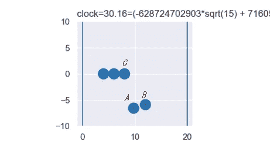

# Python 中完美的、无限精确的游戏物理学(第 4 部分)

> 原文：<https://towardsdatascience.com/perfect-infinite-precision-game-physics-in-python-part-4-9cdd609b3e6c>

## 改进速度和功能，完美和不完美


一条蟒蛇输给了一只乌龟——来源:[https://openai.com/dall-e-2/](https://openai.com/dall-e-2/)

*这是向您展示如何用 Python 编写一个完美的物理引擎的四篇文章中的第四篇。这是我将所有物理、数学、甚至哲学转化为编程的宏伟目标中的一小步。* [*所有代码在 GitHub*](https://github.com/CarlKCarlK/perfect-physics) *上都有。*[*Part 1*](https://medium.com/towards-data-science/perfect-infinite-precision-game-physics-in-python-part-1-698211c08d95)*介绍了高级引擎，并将其应用于牛顿的摇篮、网球&篮球掉落等物理世界。* [*第二部*](https://medium.com/towards-data-science/perfect-infinite-precision-game-physics-in-python-part-2-360cc445a197) *将引擎应用于台球的打破，揭开了意想不到的非决定论。在* [*第 3 部分*](https://medium.com/towards-data-science/perfect-infinite-precision-game-physics-in-python-part-3-9ea9043e3969) *中，我们通过工程方程创建了低级引擎，然后让 SymPy 包做了很难的数学运算。*

这篇文章是关于我们完美的物理引擎的局限性。

它是缓慢的。我们将看到如何使它更快一点，但还不够快，无法使它实用。除非……我们用数值近似值代替它的完美计算。我们可以做到这一点，但如果我们这样做，我们将消除引擎存在的理由。

我们还会看看它的许多其他限制——例如，只有 2D，没有重力，等等。对于每个限制，我们将讨论一个可能的扩展来修复它。一些扩展会很容易。其他的就很难了。

# 速度

当我启动这个物理引擎时，我希望所有的表达式都简化成类似于`8*sqrt(3)/3`的东西。当我看着这些表情时，我的希望破灭了。考虑三角形内接的三个圆:

三角形内接的三个圆(14 视频秒，63 模拟单位)

我们将查看在一些碰撞事件之后一个球的 *x* 位置的表达式:


10 次碰撞事件后，表情看起来还不错。40 后，我们看到一个平方根里面有一个平方根，这似乎是不祥之兆。到了 50 个事件，表情爆炸。

下一个图显示了表达式的长度与碰撞事件数的关系。请注意，*y*-轴是对数轴，因此我们至少看到了指数爆炸。


我实现了以下加速。他们使引擎速度提高了几倍。然而，请注意，一个“快几倍”的指数，仍然是指数缓慢。

*   **在安全的情况下使用浮点**:在安全的情况下，将表达式评估为(近似)浮点或复杂。例如，为了检查两个物体是否相向运动，我们找到它们的瞬时相对速度(见[第三部分](https://medium.com/towards-data-science/perfect-infinite-precision-game-physics-in-python-part-3-9ea9043e3969))。我们需要知道`speed>0`。我假设如果`float(speed)<-0.00001`，那么速度不是正的。类似地，如果一个速度的(近似)虚部比 0 大 0.00001，我假设速度是复数。这种优化很有帮助。但是，有些值太接近于零而无法使用，仍然需要进行符号评估。
*   **回收一些接下来的碰撞**:在下面的世界里，A 和 B 接下来会发生碰撞。稍晚一点，C 会与墙壁相撞。在 A 和 B 碰撞后，我们需要计算它们与场景中每个物体的下一次碰撞。然而，我们不需要重新计算 C 和墙的碰撞，因为它没有参与 A 和 B 的碰撞。在许多情况下，避免这种重新计算可以大大提高速度(从对象数量的平方到线性)。我们还可以通过跳过两对都是静止的线对来避免一些计算。



*   **利用一些并行性**:发动机的几个部分的工作可以并行完成。具体来说，为一系列物体对找到下一次碰撞的时间。此外，在保存所有碰撞事件后，我们可以相互独立地渲染视频帧。我使用了 [mapreduce1](https://fastlmm.github.io/PySnpTools/#util-mapreduce1) ，这是我最初为基因组处理编写的多线程/多处理库。令人惊讶的是，在多个进程中运行 SymPy 函数并没有给我带来净收益。我不知道原因，但怀疑 SymPy 的自动缓存。

那么，一个完美的无限精度物理引擎是不是注定不切实际？是啊！然而，不完美和有限精度也是可行的。

**数值模拟**:我没有实现这个。但是，如果您感兴趣，以下是转换为数值模拟器的一些步骤:

*   [生成数字代码](https://docs.sympy.org/latest/modules/numeric-computation.html)(用[高效公共子表达式](https://docs.sympy.org/latest/modules/simplify/simplify.html#module-sympy.simplify.cse_main))。例如，在这里我们为直到下一次圈-圈碰撞的时间生成数字代码。它生成 35 个表达式。

```
from sympy import cse, numbered_symbols
from perfect_physics import load
cc_time_solutions = load("cc_time_solutions.sympy")
cse(cc_time_solutions, symbols=numbered_symbols("temp"))
# Outputs ...
([(temp0, a_vx**2),
  (temp1, a_vy**2),
  (temp2, b_vx**2),
  (temp3, b_vy**2),
  (temp4, a_vx*b_vx),
...
```

*   将每个圆的 *x* 位置组合成一个单独的 **x** NumPy 矢量。同样， **y** ， **vx** ， **vy** ， **m** ， **r** 。例如，如果我们有六个圆，其中一个以 vx 为 1 移动，其他的都是静止的，我们会说:`vx = np.array([1, 0, 0, 0, 0, 0])`。使用 NumPy 矩阵和向量运算符自动并行计算。在这里，我们为牛顿摇篮中的所有 36 对圆计算上面的前五个子表达式。我们只需要三个快速的 NumPy 步骤，而不是 5 x 6 x 6 的计算:

```
import numpy as np

vx = np.array([1, 0, 0, 0, 0, 0])
vy = np.array([0, 0, 0, 0, 0, 0])
temp0 = vx**2 # this covers temp2
temp1 = vy**2 # this covers temp3
temp4 = np.outer(vx, vx)
temp4
# Outputs:
array([[1, 0, 0, 0, 0, 0],
       [0, 0, 0, 0, 0, 0],
       [0, 0, 0, 0, 0, 0],
       [0, 0, 0, 0, 0, 0],
       [0, 0, 0, 0, 0, 0],
       [0, 0, 0, 0, 0, 0]])
```

如果我们这样做所有的步骤，我们会得到两个 6 x 6 的矩阵，告诉我们任意两个圆之间碰撞的时间。计算圆圈 *A* 与 *B* 以及 *B* 与 *A* (以及 *A* 与 *A* )碰撞的时间似乎效率很低，但对于 NumPy 来说这是高效的。

除了速度慢，我们的模拟在其他方面也有限制。让我们看看这些限制，并考虑改进的实用性。

# 限制和扩展

以下是该引擎的一些限制，大致按照我认为可以/应该修复的顺序排列。

## 显式单位

所有的物理引擎都应该给出单位——米、英尺、米每秒、英里每小时等等。该引擎目前适用于任何[一致的单位集](http://www.endurasim.com.au/wp-content/uploads/2015/02/EnDuraSim-Engineering-Units.pdf)，例如 [SI](https://en.wikipedia.org/wiki/International_System_of_Units) 。然而，它并没有明确这些单位。采用 SI 并使这些单位显式化是应该做的，而且应该容易做到。

更有趣的是使用 SymPy 的[单元库](https://docs.sympy.org/latest/modules/physics/units)。我相信这将让引擎使用任何一致的单位系统，并容易地在单位系统之间转换。

## 简单非弹性碰撞

我们的模拟看起来不现实，因为圆圈从不减速。一个简单的解决方法:每次碰撞后减少一定百分比的动能。这是通过按比例减少`vx`和`vy`来实现的。

## 向下恒定重力

现在的模拟器不了解重力。这意味着，例如，网球和篮球“下落”( [Part 1](https://medium.com/towards-data-science/perfect-infinite-precision-game-physics-in-python-part-1-698211c08d95) )实际上并没有下落。

没有重力，圆圈在两次碰撞之间沿直线运动。如果我们加上向下不变的重力，圆圈就会以抛物线运动。这将增加我们用 SymPy 求解的方程的非线性。据我所知，SymPy 应该可以处理这些。

## **粒子**

[有些物理论文](https://plato.sydney.edu.au/entries/determinism-causal/#DetCha)讨论粒子间的碰撞。我曾希望现在的引擎可以把一个粒子模拟成一个半径为零的圆。可悲的是，它失败了，因为碰撞的粒子最终在完全相同的位置，但没有关于粒子的哪一侧接触另一个粒子的信息。我乐观地认为，引擎可以扩展，以解决这个问题。

## **3D**

这将是一个有趣的引擎扩展到三维领域的工作。这样，墙将是由三个不共线的点定义的无限平面。我认为我们的方程([第三部分](https://medium.com/towards-data-science/perfect-infinite-precision-game-physics-in-python-part-3-9ea9043e3969))可以直接扩展到 3D，SymPy 可以再次为我们解决它们。

为了实现这个扩展，我个人需要温习一下我的平面几何。然而，回想一下，对于 2D，我们使用的是斜率和单位向量，而不是三角函数。我认为这给了我们一条通向 3D 的坦途。此外，我们不应该在现有的`x` 和`y`变量中引入一个新的变量`z`，而是应该用一个变量 `position`，一个由三个元素组成的元组来代替这三个变量。(速度也是如此。)

渲染一个 3D 场景会比我们目前的 2D 绘图更复杂，但我认为已经有了相关的软件包。

## 未绑定变量

我们目前允许圆的属性，比如说`vx`，是一个表达式，比如`3*sqrt(3)/7`。然而，我们不允许它停留在`vx`，也就是保持不受束缚。这阻止了我们解决没有给出或不需要具体数值的物理问题。

我认为我们可以创建一个版本的引擎来处理未绑定的变量。然而，在某些情况下，引擎需要报告它的答案。比如最左边的球要去`a_vx`，那么最右边的球最后的`b_vx`会是什么？


如果你回答`b_vx=a_vx`，那么你记得牛顿的摇篮。然而，更好的答案是:`b_vx=a_vx`如果`a_vx > 0;`T5，否则。换句话说，我们必须考虑`a_vx`为零或负值，并且最左边的球永远不会击中另一个球的情况。

## **角动量**

我想创造一个完美的物理引擎，了解一些关于旋转物体和角动量的东西。我会从一个新的引擎开始，这个引擎只有 T9 知道角动量，而对当前引擎的线动量一无所知。完美地完成直线和角度似乎很难。

## **其他形状**

为什么只是圈子；为什么不是正方形等等。？为什么只是无限的墙；为什么不是有限的墙？

完美地做到这些是非常困难的。有角动量的正方形自旋。有限的墙可能会错过或击中狭窄的道路。正方形和有限墙都会引入凸角。

## **更多限制**

有些限制看起来太难了，以至于我无法想象扩展可以完美地修复它们:

*   现实摩擦和非弹性碰撞
*   通过弹簧或其他非刚体的真实碰撞。
*   相互引力(三体，众所周知非常非常难做到完美)
*   声速

# 总结第四部分

因此，我们通过在安全的地方增加数值近似值和回收碰撞信息来提高引擎速度。然而，即使这样，对于大多数应用来说，它的速度还是不够快。我们还列举了通过扩展可以克服的局限性。我最感兴趣的扩展包括:

*   单位
*   向下恒定重力
*   作为墙的三维球体和无限平面

感谢你和我一起踏上创造完美物理引擎的旅程。我鼓励你实现你自己的引擎或者扩展这个引擎。你可以从[CarlKCarlK/perfect-physics(github.com)](https://github.com/CarlKCarlK/perfect-physics)下载代码。让我知道如果有兴趣，我会创建一个更好的安装程序。

关注[Carl m . Kadie-Medium](https://medium.com/@carlmkadie)获取新文章的通知。在 YouTube 上，我有旧的(近似的)[物理模拟](https://www.youtube.com/playlist?list=PLyBBVRUm1CyScgmzqpLGiKqwM-BxaiCnE)和一些[试图幽默的自然视频](https://www.youtube.com/playlist?list=PLyBBVRUm1CyRr8tgjNdarj7cq55YFHhbf)。