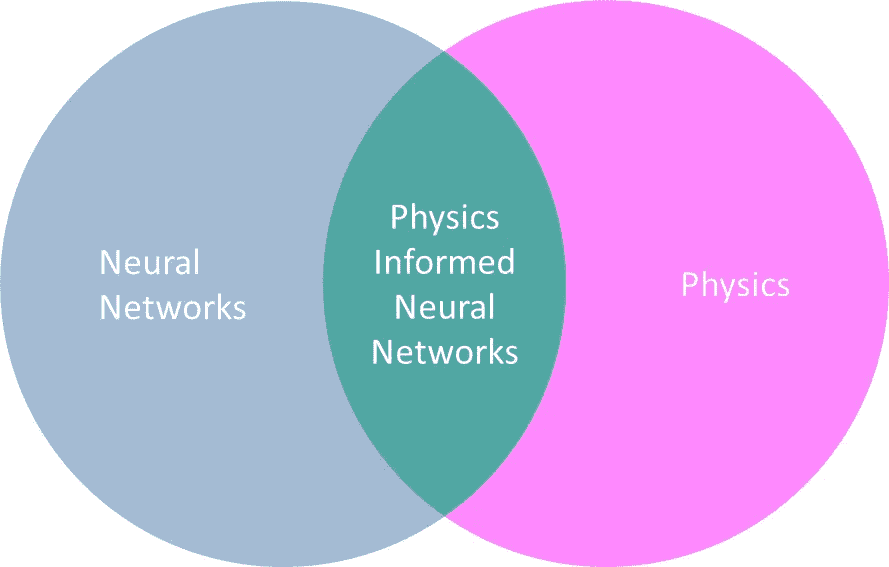
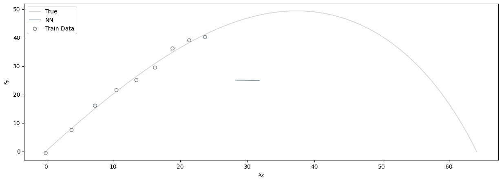
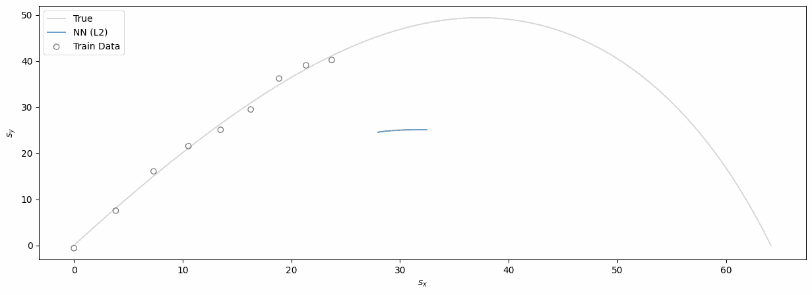
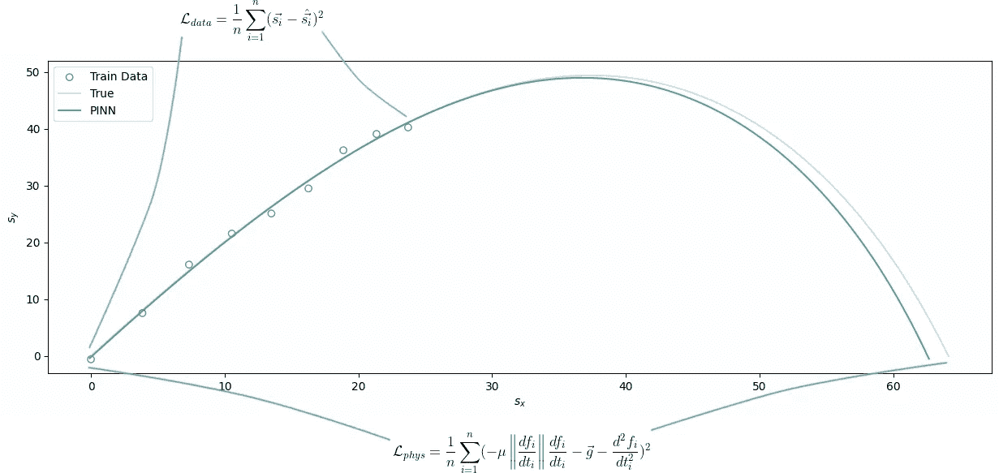
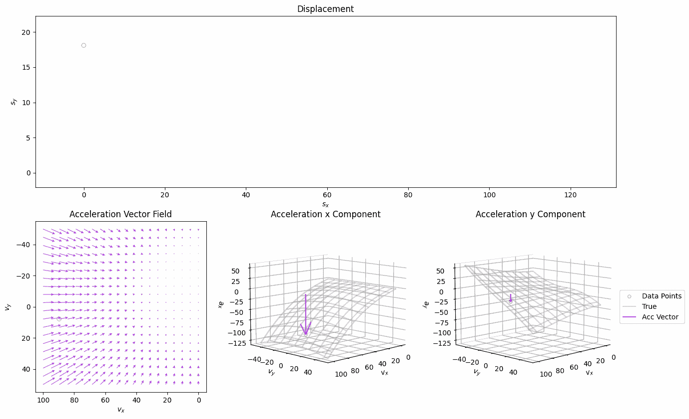
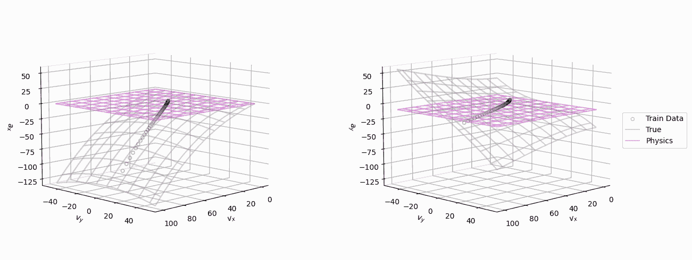
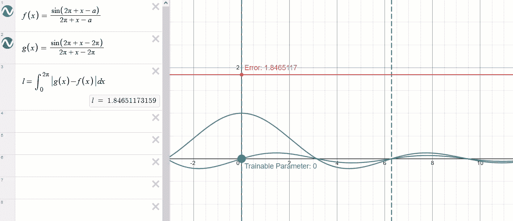
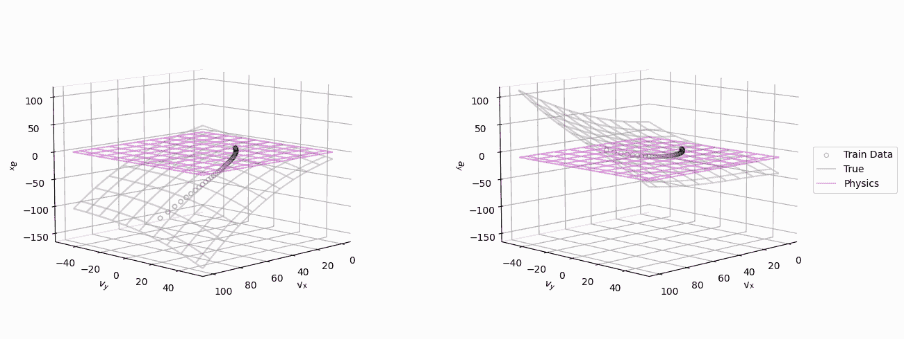
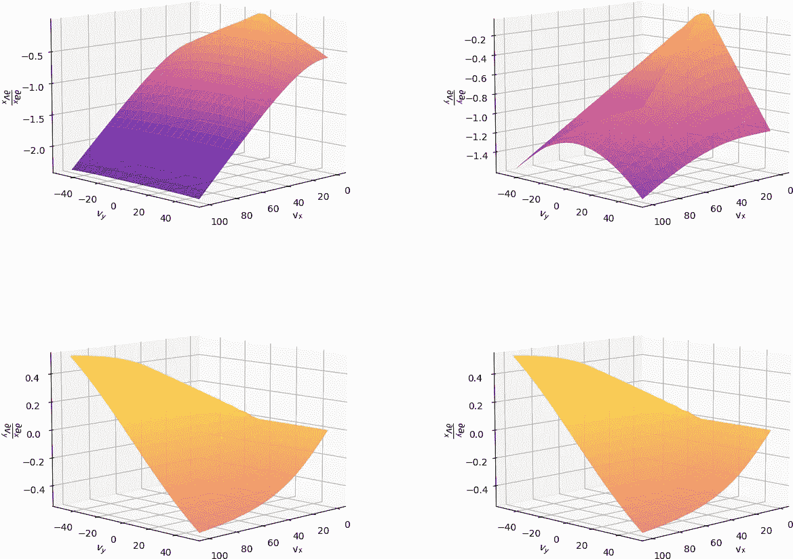
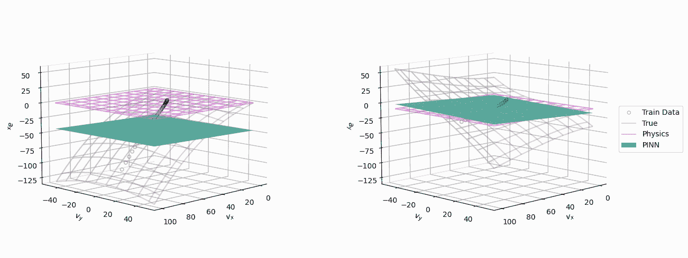

# 物理学通知神经网络(PINNs):直观指南

> 原文：<https://towardsdatascience.com/physics-informed-neural-networks-pinns-an-intuitive-guide-fff138069563>

## 物理学的(可读的)什么，如何，为什么通知神经网络


作者图片

如果你曾经试图阅读现有的关于物理学通知神经网络(PINNs)的文献，这是一个艰难的阅读！要么大量的方程对大多数人来说是陌生的，并假设你已经是所有概念的专家，要么过于简单而无法很好地理解。这篇文章旨在以直观的方式浏览 PINNs，并对当前的文献提出一些改进。

**传统物理模型**创建是领域专家的任务，他将物理模型参数化，使其最适合感兴趣的系统。例如，使用阻力、升力、重力、推力等方程创建飞机动力学模型。以及对模型进行参数化，以试图使模型与特定的飞机紧密匹配。

纯粹的**数据驱动神经网络**方法是尝试使用神经网络的监督学习从特定系统获得的数据来学习模型。

**物理学通知神经网络** (PINNs)位于两者的交叉点。使用数据驱动的受监督的神经网络来学习模型，但是也使用给予模型的物理方程来鼓励与系统的已知物理的一致性。它们的优势在于既可以由数据驱动来学习模型，又能够确保与物理学的一致性，还能够在可用数据之外进行精确的外推。因此，PINNs 能够用更少的数据生成更健壮的模型。



PINNs 位于神经网络和物理学的交叉点。作者图片

理解[神经网络](https://en.wikipedia.org/wiki/Neural_network)、[运动学](https://en.wikipedia.org/wiki/Kinematics)和[普通](https://en.wikipedia.org/wiki/Ordinary_differential_equation)和[偏微分方程](https://en.wikipedia.org/wiki/Partial_differential_equation)将非常有助于完全消化本页内容，但并非能够获得直观理解的必要条件。

文献中大多数 PINNs 的例子是基于物理方程，如流体运动(Navier–Stokes)、光和波传播(非线性薛定谔方程，korte weg–De Vries)或其他此类函数，并考虑关于时间的函数[1]。

为了获得一些直觉，我们将利用运动定律来探索针。更具体地说，我们将使用[抛射体运动](https://en.wikipedia.org/wiki/Projectile_motion)作为一个例子，因为它提供了一个简单的例子来探索，但足够复杂以涵盖 PINNs 的各个方面。

到本文结束时，我们将了解 PINN 如何工作，以及 PINNs、纯数据驱动的神经网络和纯物理函数之间的权衡和差异。

# 抛射体运动(基于时间)

让我们考虑抛体运动(一个自由落体的抛体)在重力和阻力作用下的函数。根据描述抛射体运动的物理方程以及它们之间的关系，我们已经对这个问题有所了解。

射弹在时间 t 的位移矢量(位置)由以下函数定义:


位移的一阶导数给出速度矢量，定义为:


二阶导数给出加速度，定义为:


射弹的加速度由下式给出:


其中μ为阻力系数(未知变量)，g 为重力矢量(已知变量)。本质上，在给定的时间点上，抛射体的加速度是相对于其在相反的行进方向(阻力)上的当前速度，并且被重力拉下。

直观地说，[导数](https://en.wikipedia.org/wiki/Derivative)告诉我们函数的*变化率*。举个例子，当速度(加速度)的导数为 0 时，就告诉我们速度没有变化。当加速度为正时，速度增加。当加速度为负时，速度减小。

我们可以注意到加速度取决于速度。因此，位移没有[闭合形式的](https://en.wikipedia.org/wiki/Closed-form_expression)解，因为不存在给出给定时间 t 的位移的有限方程。我们需要求助于数值积分方法，如[龙格-库塔](https://en.wikipedia.org/wiki/Runge%E2%80%93Kutta_methods)。


在重力和阻力的影响下，以初始位置和速度运动的射弹(轨迹)的单一地面真实位移。作者图片

# 在理想的世界里…

训练神经网络的基本方法包括普通的监督学习，使用整个感兴趣领域的完美数据。

在这里，网络的目标是学习


注意:本页所有的 gif 都显示了通过训练学习的函数的输出。


根据来自整个领域的完美数据训练神经网络。神经网络能够快速学习轨迹的精确模型。作者图片

问题解决了，对吧？如果你曾经将机器学习应用于现实世界的问题，你现在肯定会大笑:)

# 实际上…

然而，访问整个领域的完整数据是很难实现的。更现实的是，我们可以访问嘈杂、稀疏和不完整的数据。在这种情况下，采用监督学习的基本方法会给我们带来不理想的模型。



针对嘈杂、稀疏和不完整的数据训练神经网络。神经网络完全按照要求去做，并根据我们提供的数据拟合一个函数。然而，该函数对于预测射弹位移的预期用途并不十分有用。我们可以说它“过拟合”。作者图片

# 规范化

解决这个问题的一个典型方法是使用规范化。

L2 正规化由以下因素提供:


它具有惩罚网络中的大权重的效果，并且直观地惩罚局部梯度专门化。通过应用 L2 正则化，我们鼓励网络拟合从*到*的数据，而不是从*到*的数据。

对于我们有数据的领域，L2 正则化提高了我们模型的有用性。然而，在缺乏跨越整个领域的数据的情况下，该模型不能推断出超出可用数据的太多内容。



使用 L2 正则化对噪声、稀疏和不完整的数据训练神经网络。该模型在存在数据的领域更有用，但不能跨域进行外推。作者图片

# 进入物理学通知神经网络

与 L2 正则化训练非常相似，PINN 将数据损失降至最低，但也使用已知的物理作为额外的正则化项。

本质上，我们可以说“拟合数据，但要确保解与我们已知的物理方程一致”。

该网络的目标是使用对可用数据的监督学习来学习 *f* (t)，因此我们有回归目标和预测值之间的均方误差(MSE)的标准数据损失。


然而，我们也知道抛射体的加速度由下式给出


我们可以将这些知识整合到神经网络的训练中。

由于常微分方程(ODEs)


和


给我们这个方程所需要的值，我们可以使用我们的机器学习(ML)库的自动微分功能来获得网络相对于网络输入(时间 t)的一阶和二阶导数(梯度),以获得速度和加速度向量。然后，我们可以将这些导数代入等式，得到以下结果:


所以我们在说，为了我们的网络尊重已知的物理，我们的网络对时间(加速度)(左手边)的二阶导数，应该等于一阶导数(速度)(右手边)的函数。换句话说，它们之间应该没有差别:


我们如何将这些知识应用到培训过程中？我们可以简单地将这个方程的误差(MSE)最小化为一个额外的损耗。


这给了我们一个物理损失项，它试图最小化网络梯度(速度和加速度)和已知物理给出的相应方程之间的误差。最小化数据损失和(加权)物理损失给了我们一个 PINN。这就是它的全部；).数据损失使用来自训练数据的样本进行训练，物理损失使用来自感兴趣的整个领域(我们指定)的样本进行训练。由于物理损失只需要跨域的输入，而不需要目标，因此我们可以自由选择任何适当的采样策略(例如，均匀采样是一种简单的策略)。

然而，有一点仍然存在，即μ(阻力系数)是一个我们不知道的变量。但是我们可以简单地使μ和网络参数一起成为可训练变量，这意味着μ将在训练过程中被发现，也就是说，我们可以从数据中得知我们的弹丸的阻力系数是多少。

对于贯穿这些例子的所有神经网络，网络使用 128 个神经元的 2 个完全连接层的架构，使用高斯误差线性单元(GELU)激活。尽管文献中的大多数例子使用 tanh 激活，我们发现 GELU 提供了更多的理论和经验上的好处[2] [3] [4](试着运行任何开源的 PINN 例子，把 tanh 换成 GELU)。因为我们正在最小化网络梯度的损失，所以我们使用的任何激活函数都需要对适当的连续梯度处处可微，这排除了诸如标准 ReLU (ReLU 是分段线性的，因此给出恒定梯度)的激活。


使用物理正则化(PINN)对噪声、稀疏和不完整的数据训练神经网络。物理损失允许网络通过数据点进行正则化，以及以与已知物理一致的方式在训练数据之外进行外推。由于噪音数据量很低，在这里不可能找到地面真相的解决方案。随着更多的数据和/或更少的噪声，网络能够以极高的准确度学习地面实况解。作者图片



数据损失用于确保通过训练数据的拟合(顶部)，物理损失用于确保与整个领域的已知物理的一致性(底部)。作者图片

如果你更喜欢代码而不是方程，这里有一段使用 TensorFlow 实现上述训练的代码:

```
...[@tf](http://twitter.com/tf).function
def train(t_train, s_train, t_phys):
    # Data loss

    # predict displacement
    s_train_hat = net.predict(t_train)
    # MSE loss between training data and predictions
    data_loss = tf.math.reduce_mean(
        tf.math.square(s_train - s_train_hat)
    ) # Physics loss

    # predict displacement
    s_phys_hat = net.predict(t_phys)
    # split into individual x and y components
    s_x = s_phys_hat[:, 0]
    s_y = s_phys_hat[:, 1]
    # take the gradients to get predicted velocity and acceleration
    v_x = tf.gradients(s_x, t_phys)[0]
    v_y = tf.gradients(s_y, t_phys)[0]
    a_x = tf.gradients(v_x, t_phys)[0]
    a_y = tf.gradients(v_y, t_phys)[0]
    # combine individual x and y components into velocity and
    # acceleration vectors
    v = tf.concat([v_x, v_y], axis=1)
    a = tf.concat([a_x, a_y], axis=1)
    # as acceleration is the known equation, this is what we want to
    # perform gradient descent on.
    # therefore, prevent any gradients flowing through the higher
    # order (velocity) terms
    v = tf.stop_gradient(v)
    # define speed (velocity norm, the ||v|| in the equation) and
    # gravity vector for physics equation
    speed = tf.norm(v, axis=1, keepdims=True)
    g = [[0.0, 9.81]]
    # MSE between known physics equation and network gradients
    phys_loss = tf.math.reduce_mean(
        tf.math.square(-mu * speed * v - g - a)
    ) # Total loss

    loss = data_weight * data_loss + phys_weight * phys_loss

    # Gradient step

    # minimise the combined loss with respect to both the neural
    # network parameters and the unknown physics variable, mu
    gradients = tf.gradients(loss, net.train_vars + [mu])
    optimiser.apply_gradients(zip(gradients, net.train_vars + [mu]))...
```

这个简单的例子展示了 PINNs 的有效性。利用少量的噪声数据，我们已经能够学习射弹的鲁棒和精确的模型。PINN 也在这个过程中学习了抛射体的物理参数(阻力系数)。此外，由于抛体位移不存在封闭解，我们利用 PINN 得到了该函数的精确近似解析解和封闭解。

# 抛射体运动(基于状态)

同样，文献中的大多数例子集中在关于时间的函数上(加上其他变量)。但是关于系统的当前状态而不是时间的模型呢？换句话说，一个时间步进模型。

让我们把抛体运动问题重新表述为一个函数，它取系统的当前状态，在这种情况下是速度，并给出加速度:


我们可以定义两个函数；一个接受速度 x 和 y 分量，给出加速度 x 分量，另一个接受速度 x 和 y 分量，给出加速度 y 分量:


为了获得一些直觉，让我们考虑遵循这些函数的下列轨迹。我们从初始位移和速度开始，并查询函数以获得在该时间点施加的加速度。然后，我们使用数值积分方法(如[龙格-库塔](https://en.wikipedia.org/wiki/Runge%E2%80%93Kutta_methods))将加速度加到速度上，并再次类似地得到位移。然后，我们重复这一过程，以获得一段时间内的轨迹。

按照这种方法，下面的位移图(顶部)显示了随时间变化的轨迹。加速度矢量场图(左下角)显示了域中任何给定速度的加速度，加速度 x 和 y 分量图(右下角)显示了矢量场的各个加速度分量(函数 *f* 和 *h* )。



运行由 *f* 和 *h* 组成的时间步进模型以产生轨迹的可视化。作者图片

# 物理学和梯度下降

我们可能会问自己，如果我们能够学习物理函数的参数值，为什么我们甚至需要涉及神经网络呢？毕竟，我们正在使用已知的物理方法来规范网络。为什么不直接在物理函数上使用梯度下降？

如果我们知道管理数据的函数由以下公式给出:


并且我们可以学习未知参数μ，那么我们*可以*直接在物理函数上使用梯度下降。



使用梯度下降直接训练物理函数。地面实况函数(灰色线框)，具有由该函数生成的可用训练数据(灰点)，以及通过梯度下降直接学习的物理函数(洋红色线框)。作者图片

在这种情况下，我们能够通过梯度下降完美地学习物理函数的精确参数化。为什么我们不这样做呢？

事实上有几个原因。正如我们在上面已经看到的，并不总是有封闭形式的解决方案可以使用，这在许多情况下妨碍了这种方法。

即使我们有可用的封闭形式的解，由于物理函数受其参数化的限制，误差梯度很可能是非单调的。这意味着学习将很有可能收敛到局部最优而不是全局最优。

考虑下面的函数 *f* ，我们有它的数据，我们试图通过梯度下降学习函数 *g* 的参数化。在任何方向将可训练参数 *a* 从 0 移开都会导致正误差梯度(误差变得更差)。因此 0 是一个局部最优解，梯度下降将收敛于此。然而，如果我们将 *a* 一直向右移动，我们会发现全局最优值，而梯度下降不会从其原始初始化值中发现全局最优值。



直接在函数上使用梯度下降无法发现全局最优参数的函数示例。(图片由作者提供，使用德斯莫斯图形计算器[https://www.desmos.com/calculator](https://www.desmos.com/calculator)创建)

当然，除了梯度下降法，还有其他优化方法…

然而，还有一个进一步的问题，这意味着即使这种方法是成功的，它可能仍然不会给我们一个有用的模型。

在前面的所有例子中，我们使用的物理函数完美地代表了产生数据的函数。然而，即使是物理函数也只是模型，是真实潜在动力学的简化。

我们所用的抛体运动方程只考虑恒定阻力和重力。那么升力、方向和高度相关的阻力、推力、科里奥利力等呢？？除非我们能够精确地指定基本的物理函数，否则不可能学习一个精确模拟可用数据的参数化。

作为一个例子，让我们将一些简单的提升添加到我们用来生成训练数据的等式中:


其中 Cl 是升力系数。现在让我们试着学习一下我们之前用过的物理函数的参数化(没有升力)。



根据不同函数(有升力)产生的数据训练物理函数(无升力)。已知物理函数的学习参数化不能给我们一个潜在数据的有用模型。作者图片

啊…不理想。不存在精确模拟我们数据的可能参数化。

# 物理通知神经网络

我们可以应用与之前相同的技术来训练 PINN 人完成这项任务的时间步进版本。而在我们应用常微分方程(ODEs)之前，我们只有一个独立变量(时间)，现在我们有多个独立变量(速度 x 和 y 分量)。

我们可以将多个功能实现为单个多输出神经网络。


我们还可以使用偏微分方程(PDEs)来获得该函数相对于独立变量的梯度:

加速度 x 分量相对于速度 x 分量的梯度。


加速度 y 分量相对于速度 y 分量的梯度。


加速度 x 分量相对于速度 y 分量的梯度。


加速度 y 分量相对于速度 x 分量的梯度。


如下图所示:

有趣的事实:加速度的一阶导数叫做 jerk，二阶、三阶、四阶导数是 snap、crackle、pop:)



根据上述方程的偏导数。作者图片

通过这样做，我们得到了已知物理的偏导数。与前面类似，我们可以用公式表示一个损失函数，它使我们的网络输出(因变量)相对于输入(自变量)的梯度与这些已知的物理方程之间的误差最小化。最小化数据损失和(加权)物理损失给了我们一个 PINN。直观地说，加权项表示我们希望对符合物理学和可用数据的重视程度。


通过在任务中训练这个 PINN，我们能够使网络与数据相适应，而且能够基于给定的已知物理规律进行正则化和外推，以及学习物理函数的参数化(在这种情况下是阻力系数)。我们能够产生精确的模型，但是 PINN 不存在需要封闭形式的解决方案的问题，并且由于使用神经网络来学习函数而不会收敛于局部最优。虽然可用的数据由单个轨迹组成，但我们已经能够在整个领域(即，从任何状态)获得射弹的精确模型，而不仅仅是接近训练数据轨迹。



训练 PINN 完成任务。地面实况函数(灰色线框)、地面实况函数产生的训练数据(灰点)、由 PINN 学习的变量参数化的物理函数(洋红色线框)和 PINN 解(绿色表面)。作者图片

正如我们之前使用梯度下降直接训练物理函数时看到的，除非给定的已知物理与产生数据的函数精确匹配，否则不可能产生有用的模型。然而，当 PINN 生成一个基于*和*可用数据*和*已知物理的模型时，我们能够生成一个结合了两者优点的模型。

让我们重温一下从包含 lift 的函数生成训练数据的示例:


但是为 PINN 提供了不包括升力的已知物理特性:


PINN 能够学习适合训练数据的函数(从具有升力的地面实况函数)，但也确保与已知物理尽可能多的一致性。在我们有数据的地方，数据损失确保与数据相符，物理损失作为正则化项。在我们没有数据的情况下，物理损失允许基于已知物理函数的梯度进行外推。


根据不同功能(带升力，灰色线框)产生的数据(灰点)训练 PINN，我们已经通知 PINN(绿色表面)关于(洋红色线框)。作者图片

我们可以看到，PINN(绿色)比最适合物理函数(洋红色)的地面真实(灰色)模型更有用。PINN 能够拟合升力产生的数据点，但仍然能够将其与最佳拟合学习参数化已知物理函数的梯度的正则化和外推混合，而没有升力。我们还可以采取通过训练 PINN 来学习物理函数的参数的方法，并且根据我们的需要直接使用所学习的参数化物理模型。这需要权衡较高的可解释性/透明度，因为推断是通过已知的物理学进行的，而潜在的保真度较低的模型，因为物理学可能无法准确拟合数据。

# 结论

通过阅读这篇文章，我们已经了解了如何和为什么使用物理通知神经网络，以及使用不同方法的差异。PINNs 提供了一种学习健壮和准确的系统模型的方法，我们能够以管理数据的已知方程的形式提供现有的领域知识，即使在方程与数据不完全匹配的情况下。额外的物理信息允许发现已知方程中的变量，并允许用比单纯的数据驱动学习少得多的数据来学习物理一致的解决方案。

[1](PINNs)【https://maziarraissi.github.io/PINNs/T4

[2](葛鲁纸)[https://arxiv.org/abs/1606.08415](https://arxiv.org/abs/1606.08415)

[3](GELU TDS)[https://towards data science . com/on-the-disparity-with-GELU-1 DDD 902d 64 b](/on-the-disparity-between-swish-and-gelu-1ddde902d64b)

[4](激活功能)【https://mlfromscratch.com/activation-functions-explained/ 