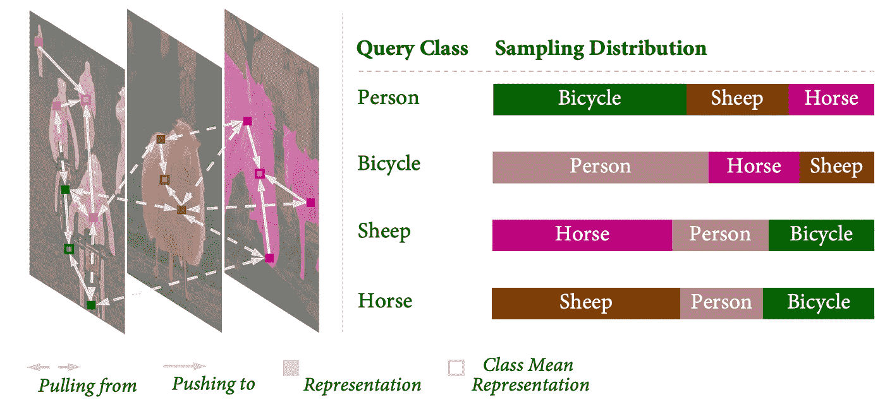
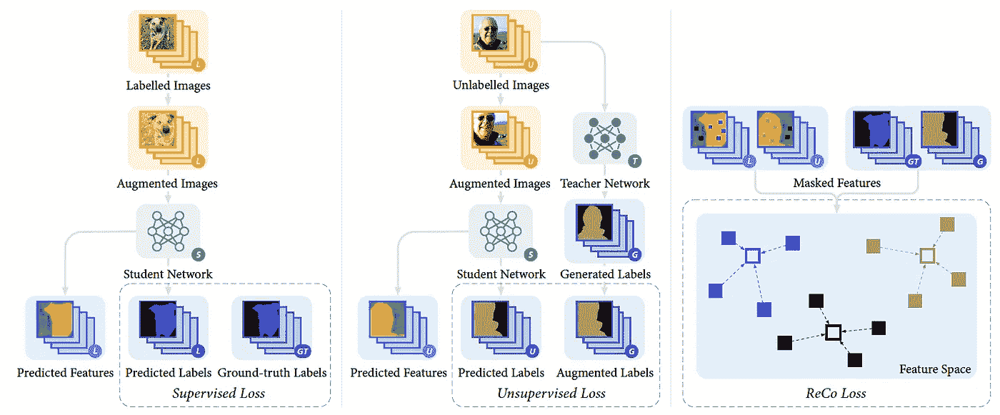

# 像素级密集对比学习

> 原文：<https://towardsdatascience.com/pixel-level-dense-contrastive-learning-6558691eeb67>

## 基于主动采样策略的密集对比学习

汤姆·温克尔斯在 [Unsplash](https://unsplash.com?utm_source=medium&utm_medium=referral) 上的照片

对比学习是一种无标签的自我监督学习过程。由于它能够经济有效地提高模型性能，近年来被越来越多的深度学习项目用作预训练过程，形成了无监督预训练和有监督微调的模型训练范式。

然而，几乎所有应用良好的 CL 算法都是为全局特征设计的，这可以提高依赖于全局特征的任务(例如图像分类)的模型性能。而对于其他需要局部特征的任务，比如语义分割和对象检测，这些算法就不那么有效。

对于那些对 CL 算法基础感兴趣的人，我介绍我以前的博客[理解对比学习和 MoCo](https://medium.com/geekculture/understanding-contrastive-learning-and-moco-efe491e4eed9) 。在本文中，我将简要介绍全局级 CL 算法的局限性，并讨论区域级 CL 算法作为解决方案。

## 全球对比学习(GCL)

无监督的 CL 算法是自学的学习者，其中正对被拉在一起，负对被推开。例如，输入图像及其增强版本形成正对，而任意两个不同的(增强)图像形成负对。结果，相似图像的特征向量在潜在空间中形成一个簇，这导致了无监督的聚类效果。

## GCL 的极限

上面讨论的 CL 算法使用全局汇集的特征进行学习。首先将特征向量归一化到单位超球面上，然后将正对的特征向量拉在一起，将负对的特征向量推开。由于局部细节被排除在外，训练好的网络很难进行微调，以实现高密度任务的高精度。

为了实现高密度任务的高性能，我们最好保留本地特性。然而，包含局部细节的特征图对于对比学习来说太大了。回想一下，在 GCL，使用空间大小为 1×1 的全局特征向量来计算对比损失，如下所示，其中 sim 是两个向量的内积。

对比损失

**注意，如果我们使用空间大小为 HxW 的特征图来计算损失，复杂度得到二次改善。**此外，负对的数量可能非常多，在 [SimCLR](https://arxiv.org/pdf/2002.05709.pdf) 中大约为 4000 ~ 8000 个。因此，用大的空间特征图计算对比损失是不可行的。

## 区域对比学习(RCL)

由于上述问题，保留空间特征而不将它们全部用于 CL 是至关重要的。这里可以使用主动采样策略，其中对于 CL 只采样一小部分空间像素。

(记录)

在 2022 年 ICLR 奥运会上，伦敦帝国理工学院的研究人员提出了一种叫做 ReCo 的区域 CL 新方法。通过主动采样策略，学习过程需要更少的内存并且变得高效。与传统的 CL 不同，由于正负对是在像素级构建的， **ReCo 是监督的 CL，其中每个图像像素的标签都是必需的**。

像素级对比损失

根据上述损失函数，在学习到的潜在空间中，对于每个查询像素向量，正键是其语义标签与查询相同的所有像素向量的**平均值**。另一方面，负关键字是具有来自查询的不同标签的像素向量。总损失是从小批量中的所有类采样的所有查询像素的总和。

## 主动采样策略

虽然计算高分辨率图像的所有像素的损失是昂贵的，但作者以主动学习的方式引入了硬负挖掘，以将学习资源集中在稀疏的像素集合上。

为了选择一个稀疏的像素集，使训练过程有效和高效，我们应该考虑主动采样的两个部分:关键采样和查询采样。

*活动键采样*

主动关键采样是对某个查询像素的关键像素进行采样。回想一下，正关键字是其标签与查询像素相同的所有像素向量的平均值，正关键字是固定的。因此，只对负键进行采样。

负键包括硬样本和易样本。**对于一个查询像素，如果它与某一类的负关键字之间的距离已经足够远，那么该类的负关键字就是简单样本，不需要再进行采样。另一方面，如果距离很近，将它们区分开来将是模糊的，并且该类的负键是硬样本，并且需要被采样以学习更准确的判定边界。**

4 个类的成对类关系图

因此，在关键采样之前，知道每对不同类别向量之间的距离是很重要的。作者使用每一个小批量更新的成对类关系图。查询类别和不同类别之间的关系是这两个类别的平均潜在向量之间的 softmax 归一化内积。对于如上所示的 4 个类的例子，在查询类为 0 且负关键类为 1 的以水颜色标记的位置，其关系值在右侧计算。因为关系值是 softmax 归一化的，所以该值只是显示两个类别的学习的潜在向量的相似性的概率。高概率意味着相似性很高，应该从该类中采样更多的负对，而低概率意味着相似性已经很低，来自该类的少量负样本就足够了。结果，降低了概率值以使不同类别的潜在向量可区分。

因为我们只考虑不同类之间的关系，所以不使用上述 4x4 表的对角线，并且用 x 标记。其他元素可以类似于上面讨论的 water color 元素来计算。

*主动查询采样*

由于语义分割任务中的类别不平衡，采用所有像素进行查询会使普通类别(包括背景类别)过拟合。此外，没有必要这样做，因为大多数像素容易被很好地分类。关注一小部分硬像素对于模型性能至关重要。

根据置信度图的简单和困难查询

如上所示，作者建议使用分类置信度图和阈值来过滤硬查询。我们可以注意到，硬查询位于不同语义区域的边界，而简单查询位于每个区域的内部。在训练过程中，我们可以动态地增加阈值来关注硬查询。

*一种半监督学习算法*

由于语义分割数据集的标记非常耗时，作者还提出了一种半监督学习算法来利用标记和未标记的图像。**这很有帮助，如果你有自己的未标记数据集，但仍想尝试这种算法，你可以与另一个具有相似语义标签的已标记数据集相结合。**半监督学习算法基于著名的[均值教师框架](https://arxiv.org/pdf/1703.01780.pdf)，其中使用了师生模型。

半监督学习框架

如上图从左到右，学习框架包含三个部分:针对标注数据的监督语义切分学习；无标记数据的无监督语义分割学习:和像素级对比学习识别。相应地，损失函数也包含三个部分。

最终损失函数

由于无监督部分没有地面真实标签，生成的高置信度伪标签用于 ReCo 部分，使得 ReCo 学习可靠。

## RCL 的重要性

通过 RCL，我们可以对模型进行密集对比学习，这有利于下游的密集任务。ReCo 在这里只是语义分割的一个例子。在不久的将来，更具体的密集任务如对象检测、关键点检测等。会在对比学习文献中被考虑，这对一般的人工智能发展是重要的。

## 参考

[均值教师是更好的榜样:加权平均一致性目标提高半监督深度学习结果，2018](https://arxiv.org/pdf/1703.01780.pdf)

[视觉表征对比学习的简单框架，2020](https://arxiv.org/pdf/2002.05709.pdf)

[理解对比学习和 MoCo，2021](https://medium.com/geekculture/understanding-contrastive-learning-and-moco-efe491e4eed9)

[带区域对比的自举语义分割，2022](https://arxiv.org/pdf/2104.04465.pdf)

 