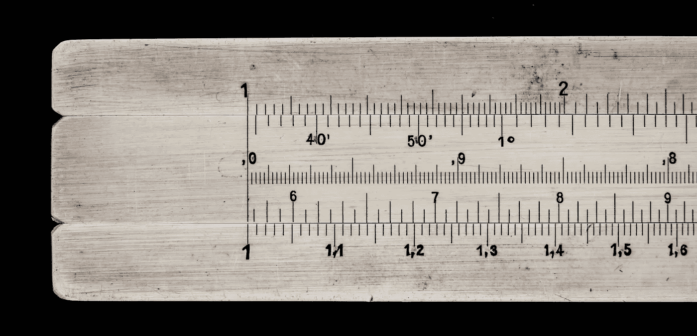
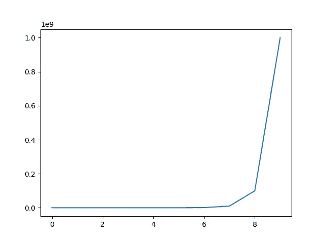

# 如何用 Python 中的 Matplotlib 绘制对数轴

> 原文：<https://towardsdatascience.com/plot-logarithmic-axes-matplotlib-python-bb8533f430c0>

## 了解何时以及如何在对数标度上可视化数据



罗伯特·索林在 [Unsplash](https://unsplash.com/s/photos/logarithm?utm_source=unsplash&utm_medium=referral&utm_content=creditCopyText) 上的照片

## 介绍

当可视化数据时，确保数据点以一种我们试图告诉读者的“故事”足够清晰的方式绘制在数字或图表中是很重要的。这意味着根据数据的性质，我们需要选择最合适的参数。在这种情况下，最重要的一个方面是扩展。

在今天的文章中，我们将讨论在对数标度上可视化数据的几个原因。此外，我们将展示如何使用 Python 和`matplotlib`包绘制带有对数轴的图形，并了解使用哪种方法取决于您是使用 Pyplot 还是面向对象的接口。

## 回到学校——对数

首先，让我们回忆一下，确保我们都明白对数是什么意思。**对数是表示指数方程的另一种方式**。例如，等式 **2⁴ = 16** 也可以表示为


来源:作者

对数是指数(即上面例子中的`4`),等式意味着当基数`2`被提升到指数`4`时，结果将等于`16`。

## 你什么时候会使用对数标度

第一个——可能也是最明显的——你应该考虑在对数尺度上可视化的原因与数据点的范围有关。对数标度允许显示大范围的数据点，而不会在图形的两端压缩非常小和/或大的值。例如，让我们考虑这样一个场景，我们想要为特定银行的客户绘制可用余额。显然，我们可能有一些拥有数百万甚至数十亿资产的客户，但我们大多数客户群的可用资金会少得多。因此，对数标度肯定会帮助我们处理向更大值的偏斜。

时间序列也是另一种情况，对数标度可以帮助我们以更直观的方式解释数据，因为对数标度可以帮助我们更准确地可视化随时间的分数变化。例如，考虑一段时间内股票价格的可视化。**股票价格从 10 美元涨到 15 美元和从 20 美元涨到 25 美元将通过线性标度上的相同向上移动来绘制**，因为在这两种情况下，涨幅都等于 5 美元。然而，在对数标度上，从 10 美元到 15 美元的第一次变化代表股票价格上涨 50%,而从 20 美元到 25 美元的第二次变动对应于价格上涨 25%,因此对数标度将能够更清楚地显示这一细节(事实上，第一次价格变动的涨幅/幅度将是第二次价格变动的两倍)。

最后，您可能考虑使用对数标度的另一个原因是当数据点更自然地以几何形式表示时

## 用 Python 中的 matplotlib 绘制对数标度的图形

现在让我们看看如何使用 Python 中的`matplotlib`包在对数标度上绘制图形。

如果您正在使用`matplotlib`中的**面向对象接口**，您可以使用`[matplotlib.axes.Axes.set_xscale('log')](https://matplotlib.org/stable/api/_as_gen/matplotlib.axes.Axes.set_xscale.html)`或`[matplotlib.axes.Axes.set_yscale('log')](https://matplotlib.org/stable/api/_as_gen/matplotlib.axes.Axes.set_yscale.html)`分别用于 X 轴或 Y 轴。

```
import matplotlib.pyplot as plt data = [pow(10, i) for i in range(10)]fig, ax = plt.subplots()
ax.plot(data)
**ax.set_yscale('log')**
plt.show()
```

结果图的 Y 轴将以对数标度显示，如下图所示


对数标度上 Y 轴的示例图(使用面向对象的界面)—来源:作者

另一方面，如果您正在使用 **Pyplot 接口**，您可以使用`[matplotlib.pyplot.xscale('log')](https://matplotlib.org/stable/api/_as_gen/matplotlib.pyplot.xscale.html)`和`[matplotlib.pyplot.yscale('log')](https://matplotlib.org/stable/api/_as_gen/matplotlib.pyplot.yscale.html)`分别用于 X 轴和 Y 轴。

```
import matplotlib.pyplot as plt data = [pow(10, i) for i in range(10)]plt.plot(data)
**plt.yscale('log')**
plt.show()
```

下面显示了将呈现在屏幕上的结果输出；


对数标度上 Y 轴的示例图(使用 Pyplot 界面)—来源:作者

在线性标度上(即不使用`plt.yscale('log')`或`ax.set_yscale('log')`，数据将显示如下:



同样的情节，线性比例——来源:作者

## 最后的想法

在今天的文章中，我们讨论了对数，以及当我们需要处理向小值或大值倾斜的数据时，需要以对数标度绘制图形。对数标度有用的另一个场景是时间序列表示(例如当可视化股票价格运动时)。最后，我们展示了如何使用面向对象和 Pyplot 接口在 Python 和`matplotlib`中绘制对数标度的图形。

[**成为会员**](https://gmyrianthous.medium.com/membership) **阅读媒体上的每一个故事。你的会员费直接支持我和你看的其他作家。你也可以在媒体上看到所有的故事。**

[](https://gmyrianthous.medium.com/membership) [## 通过我的推荐链接加入 Medium-Giorgos Myrianthous

### 作为一个媒体会员，你的会员费的一部分会给你阅读的作家，你可以完全接触到每一个故事…

gmyrianthous.medium.com](https://gmyrianthous.medium.com/membership) 

**你可能也会喜欢**

[](/save-plots-matplotlib-1a16b3432d8a) [## 如何使用 Matplotlib 将绘图保存到图像文件

### 了解如何将 matplotlib 图形和绘图保存到图像文件

towardsdatascience.com](/save-plots-matplotlib-1a16b3432d8a) [](/change-font-size-matplolib-480630e300b4) [## 如何更改 Matplotlib 图中的字体大小

### 了解如何更改使用 matplotlib 生成的 Python 图中的字体大小

towardsdatascience.com](/change-font-size-matplolib-480630e300b4) [](/change-figure-size-matplotlib-11a409f39584) [## 如何在 Matplotlib 中改变图形的大小

### 讨论如何在 Python 中调整用 matplotlib 创建的图形的大小

towardsdatascience.com](/change-figure-size-matplotlib-11a409f39584)