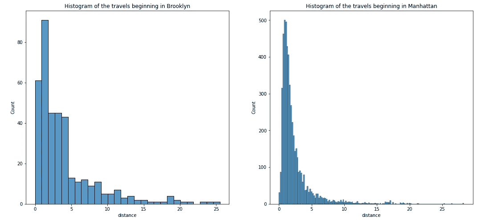
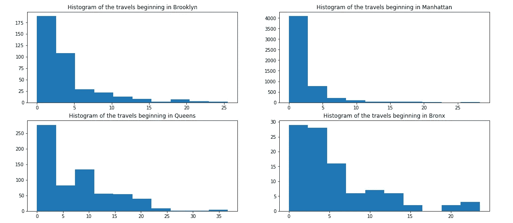

# 使用 Python 在同一个图形中绘制多个图形

> 原文：<https://towardsdatascience.com/plot-multiple-graphics-in-the-same-figure-using-python-1cbe5a23e89f>

## 了解如何在同一个 matplotlib 图形中绘制多个图形


Pawel Czerwinski 在 [Unsplash](https://unsplash.com/s/photos/tetris?utm_source=unsplash&utm_medium=referral&utm_content=creditCopyText) 上的照片

如果你使用 Jupyter 笔记本，你会知道它的右侧在图形方面变得非常少。发生这种情况是因为你通常创建一个单元格的图形，它不会超过你的屏幕的一半。

然而，有时需要并排绘制两个图形，这不仅是为了更好地利用空间，而且主要是因为我们作为数据科学家，经常需要比较图形。

假设您正在分析一家出租车公司的行程分布，并且您想知道在曼哈顿和布鲁克林接送乘客的行程之间的距离差异。

让我们加载数据集。我将使用来自名为 *Taxis 的`seaborn`包中的一个样本数据集。*导入 seaborn 后即可加载。

```
import seaborn as sns# Load dataset
df = sns.load_dataset('taxis')
```


Seaborn 的出租车数据集。图片由作者提供。

那我们就把从曼哈顿和布鲁克林开始的旅行分离出来。

```
# Brooklyn travels
df_bklyn = df.query(' pickup_borough == "Brooklyn" ')# Manhattan Travels
df_mhtn = df.query(' pickup_borough == "Manhattan" ')
```

## Seaborn 的多个地块

现在是时候看看奇迹是如何发生的了。首先，我们创建一个图形，并指出我们想要的行数和列数(在下面的例子中，同一行有两个图)。

然后，我们应该创建我们的图，并使用切片符号指示这些图在网格中的位置。如果只有一行，那么只需要一对方括号(`my_grid[0]`)。当您有多行和多列时，使用两对方括号(`my_grid[0][0]`表示绘制在第一行第一列)。

```
# Creating a grid figure with matplotlib
fig, my_grid = plt.subplots(nrows=1, ncols=2, figsize=(18,8))# Histograms# Plot 1
g1 = sns.histplot(data=df_bklyn, x='distance', ax=my_grid[0])# Title of the Plot 1
g1.set_title('Histogram of the travels beginning in Brooklyn') # Plot 2
g2 = sns.histplot(data=df_mhtn, x='distance', ax=my_grid[1])# Title of the Plot 2
g2.set_title('Histogram of the travels beginning in Manhattan');
```



同一行上的两个图。图片由作者提供。

## 使用 Matplotlib 的多个图

带有`matplotlib`的多重情节非常相似，但是让我们看看编码时的细微差别。

你会注意到，当我们创建网格时，我们必须使用元组和列表。如果我们只有一行，你可以只用一个元组。

```
# Creating a grid figure with matplotlib SINGLE ROW EXAMPLE
fig, (g1, g2, g3) = plt.subplots(nrows=1, ncols=3, figsize=(18,8))
```

但是如果您有多行，请使用元组列表，每行一个元组。

```
# Creating a grid figure with matplotlib MULTIPLE ROWS EXAMPLE
fig, [(g1, g2, g3), (g4, g5, g6)] = plt.subplots(nrows=2, ncols=3, figsize=(18,8))
```

让我们来看一个纽约市 4 个不同街区距离直方图的实例。注意，这里我们不再使用`ax`参数。

```
# Creating a grid figure with matplotlib
fig, [(g1, g2), (g3, g4)] = plt.subplots(nrows=2, ncols=2, figsize=(18,8))**# Histograms****# Plot 1**
g1.hist(data=df_bklyn, x='distance')# Title of the Plot 1
g1.set_title('Histogram of the travels beginning in Brooklyn')**# Plot 2**
g2.hist(data=df_mhtn, x='distance')# Title of the Plot 2
g2.set_title('Histogram of the travels beginning in Manhattan')**# Plot 3**
g3.hist(data=df_queens, x='distance')# Title of the Plot 3
g3.set_title('Histogram of the travels beginning in Queens')**# Plot 4**
g4.hist(data=df_bronx, x='distance')# Title of the Plot 4
g4.set_title('Histogram of the travels beginning in Bronx');
```



滑行距离的 2x2 多幅图。图片由作者提供。

## 在你走之前

快速发布，但非常有用。我记得我在笔记本上记下了这一点，并经常回来提醒我该怎么做。

也就是说，我希望这篇文章起到同样的作用，帮助初学者轻松地在同一个图形中绘制多个图形。

记得关注我了解更多。

[](https://gustavorsantos.medium.com/)  

如果你想订阅 Medium，这是我的推荐链接。

[](https://gustavorsantos.medium.com/membership) 