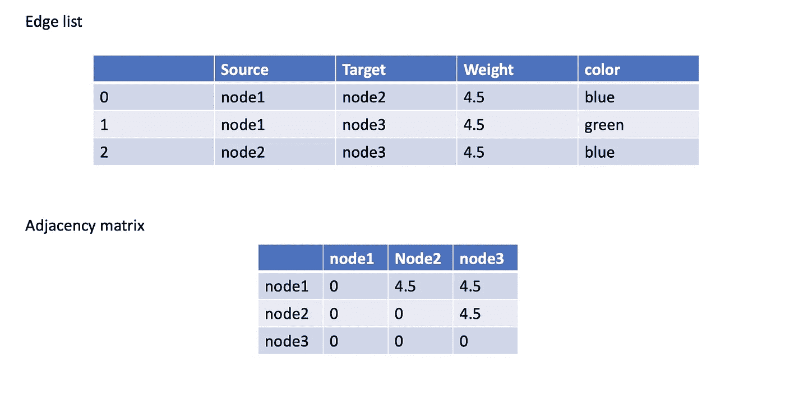
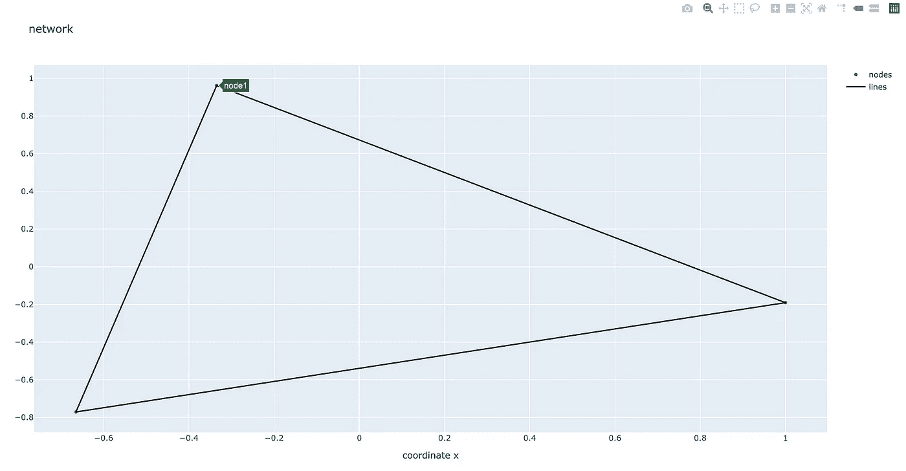

# Plotly 符合科学可视化

> 原文：<https://towardsdatascience.com/plotly-meets-scientific-visualization-8c2074f032cb>

## 虽然静态情节是科学展示的默认选项，但交互性也有它自己的力量


[西格蒙德](https://unsplash.com/@sigmund?utm_source=medium&utm_medium=referral)在 [Unsplash](https://unsplash.com?utm_source=medium&utm_medium=referral) 上拍照

虽然交互式图形已经广泛应用于金融等领域，但静态图形仍然是科学可视化的主流。原因很简单，科学强调的是真理，而不是表象。除此之外，传统的科学出版物和演示文稿依赖于印刷文本，这使得交互性似乎没有那么有用。

然而，我最近发现，当我制作模型原型，只是想知道我的结果会是什么样子时，交互式绘图会非常方便。在某些情况下，交互式绘图可以节省时间，因为它允许我一次浏览“成千上万”的静态绘图。

如果你以前读过我以前的教程([为科学出版物](/making-publication-quality-figures-in-python-part-i-fig-and-axes-d86c3903ad9b)制作静态图)，你可能知道我总是使用虚拟的例子来帮助你理解底层的编程原理，这允许你完全知道如何使用一个包，而不是仅仅通过提供几行代码让你复制和粘贴来触及表面。

并不是每一个交互图在科学可视化中都有用，我发现最有用的是散点图。最好的说明方法是画一个网络(图)，因为它由线和点组成。今天让我来引导您了解两个流行的 Python 包— `networkx`和`plotly`。前者用于表示图形，后者用于生成交互式图形。

代码可从以下位置获得:[https://github . com/frankligy/python _ visualization _ tutorial/blob/main/plotly/plotly . py](https://github.com/frankligy/python_visualization_tutorial/blob/main/plotly/plotly.py)

# **如何表示一个网络(图)？**

网络(图)是节点和边的集合，每个节点和边可以有关联的属性。表示它们的两种流行方式是(a)边列表，(b)邻接矩阵。



表示网络的边列表或邻接矩阵(图片由作者提供)

如您所见，它们都可以被视为一个数据框。所以我们首先创建两个熊猫数据框，我们将把它们转换成`networkx`图形对象。

```
import networkx as nx
import pandas as pd
```

我希望代码本身是可自我解释的，我们用`from_pandas_edgelist`如果你想把边列表转换成`G`，用`from_pandas_adjacency`转换邻接矩阵。这里最后一个参数`create_using`指定了我们想要构建什么类型的图。`networkx`有以下几种类型:

1.  `nx.Graph`:节点间的单条边，无向
2.  `nx.DiGraph`:节点间的单边，有向
3.  `nx.MultiGraph`:节点间的多条边，无向
4.  `nx.MultiDiGraph`:节点间的多条边，有向

我们从最简单的`nx.Graph`开始。

现在让我们以`G1`为例，检查一下图表的结构:

```
## For nodes
type(G1.nodes())
# networkx.classes.reportviews.NodeView
list(G1.nodes())
# ['node1', 'node2', 'node3']
type(G1.nodes(data=True))
# networkx.classes.reportviews.NodeDataView
list(G1.nodes(data=True))
# [('node1', {}), ('node2', {}), ('node3', {})]
G1.nodes['node1']
# {}
```

对于节点，使用`nodes`方法访问所有信息。请记住`data`参数将决定节点属性(作为 python 字典)是否显示(结果将是普通列表或嵌套列表)。这些节点可以被视为一个列表，您可以对其进行循环，也可以被视为一个可映射的对象，您可以使用节点名称来访问其关联的属性。

```
## For edges
type(G1.edges())
# networkx.classes.reportviews.EdgeView
list(G1.edges())
# [('node1', 'node2'), ('node1', 'node3'), ('node2', 'node3')]
type(G1.edges(data=True))
# networkx.classes.reportviews.EdgeDataView
list(G1.edges(data=True))
# [('node1', 'node2', {'weight': 4.5}),
 ('node1', 'node3', {'weight': 4.5}),
 ('node2', 'node3', {'weight': 4.5})]
G1.edges[('node1','node2')]
# {'weight': 4.5}
```

对于边，同样，`data`参数决定是否显示边的属性。边也有双重性，你可以用一个元组像字典一样访问，或者用一个列表迭代。

最后，作为`networkx`中最后一个重要的基本操作是如何将`set`和`get`的节点和边属性化。由于该属性只是一个字典，因此设置就像创建一个字典并将其分配给 graph 对象一样简单:

```
## node
node_color_dict = {'node1':'green','node2':'blue','node3':'red'}
nx.set_node_attributes(G1,node_color_dict,'color')
list(G1.nodes(data=True))
# [('node1', {'color': 'green'}),
 ('node2', {'color': 'blue'}),
 ('node3', {'color': 'red'})]## edge 
nx.get_edge_attributes(G1,'weight')
# {('node1', 'node2'): 4.5, ('node1', 'node3'): 4.5, ('node2', 'node3'): 4.5}
```

在`networkx`包中当然有许多更有用的功能([见 API](https://networkx.org/) )，但是底层的数据结构与我们在这里展示的是一样的。有了这些信息，我们可以前往`Plotly`包。

# Plotly:三层抽象

虽然有无数的 Plotly 教程，但我发现没有一个真正适合我，因为它们没有真正说明原理(即底层数据对象)，而是触及了表面(即如何制作条形图？).科学可视化的一个关键特征是理解可视化包的来龙去脉，以便我们可以随心所欲地操纵它。所以这将是我在这篇文章中的主要关注点。

总而言之，`Plotly`包可以用于三个不同的级别(从高级或最抽象到低级或最不抽象):

1.  这是一个高级 API，允许在一行代码中制作散点图、条形图等图形。然而，我发现它没有那么灵活，尽管这是 Plotly 开发者推荐的方式。
2.  `plotly.graph_objects`:这是一个中级 API，为各种剧情提供了更通用的抽象，这里我们会遇到`trace`、`figure`和`layout`这样的概念。我发现这一关是科学剧情生成的绝佳界面。
3.  `dictionary is everything`:这是底层 API，前两层最终会转换成字典，然后转向 JSON，因为`Plotly`使用 javascript 进行最终可视化。虽然这个级别提供了最大的灵活性，我们当然可以在需要时使用它，但它会使您的代码非常笨拙。此外，调试会更加困难，因为他们不希望用户经常使用这一层。

因此，我们将演示如何使用来自`graph_object`层的`Plotly`。

# 使用 Plotly 的最佳实践

关于`plotly`有一点让人不知所措，那就是做同一件事往往有多种方式。对于初学者来说，这可能会造成困难，而不是提供方便。这最终将取决于个人的编程偏好，我们可以选择一个最适合我们的。在这里，我要和你分享我的最佳实践，那就是把一个情节分解成几个部分。

网络图可以分为以下几个部分:

1.  节点
2.  优势
3.  绘图布局(x 轴、y 轴、标题、图例等)

`Plotly`图形对象层为顺序创建上述图形元素提供了极大的灵活性。首先，由于我们要将网络显示到 2D 空间中，我们需要计算每个节点的布局(每个节点在 2D 空间中的坐标)。

```
import plotly.graph_objects as go
import networkx as nx## step1: compute the graph layout (coordinates of nodes in 2D)
coords_dict = nx.spring_layout(G1,seed=42)# {'node1': array([-0.33486468,  0.96136632]),
 'node2': array([ 1\.        , -0.19068184]),
 'node3': array([-0.66513532, -0.77068448])}## step2: set the dictionary as the attribute of the node
nx.set_node_attributes(G1,coords_dict,'coord')## step3: validate
G1.nodes['node1']#{'color': 'green', 'coord': array([-0.33486468,  0.96136632])}
```

我们首先绘制节点，在`plotly`中我们称之为节点或边`trace`，

```
node_x = []   # store x coordinates
node_y = []   # store y coordinates
node_text = [] # store text when mouse hovers over the node
for node,node_attr_dict in G1.nodes(data=True):  # recall anatomy 
    x,y = node_attr_dict['coord']
    node_x.append(x)
    node_y.append(y)
    node_text.append(node)
node_trace = go.Scatter(name='nodes',x=node_x,y=node_y,mode='markers',hoverinfo='text',text=node_text,marker={'color':'green','size':5})
```

让我们试着反向理解代码，为了绘制节点的轨迹，我们实例化了一个`go.Scatter`对象。思路是，先想好要画哪个元素(trace，或者 layout，或者其他)，在`plotly`中实例化哪个 graph 对象，然后[引用 API 引用检查可用参数。](https://plotly.com/python-api-reference/generated/plotly.graph_objects.Scatter.html)一个单独的教程永远无法涵盖所有的提示，但我相信这是你未来所有任务最可持续的方式。

正如参考文献所说，我们给这个轨迹起了一个名字，这个名字将有助于自动填充图例标签。我们需要一个存储 x 坐标的列表，对于 y 坐标也是如此。我们选择`mode`作为`markers`，因为我们正在画点，而不是线。`text`参数是一个当鼠标悬停在点上时可以显示的列表，这是通过设置`hoverinfo='text'`将这两个链接起来实现的。现在，对于点的属性，我们可以提供一个字典，因为 Plotly 底层的所有东西都是字典或一个`go.scatter.marker`对象，我们将在绘制边缘时演示后者。这两种手段完全一样。

然后我们画出边缘，

```
edge_x = []
edge_y = []
for edge_end1,edge_end2,edge_attr_dict in G1.edges(data=True):
    x0,y0 = G1.nodes[edge_end1]['coord']
    x1,y1 = G1.nodes[edge_end2]['coord']
    x2,y2 = None,None
    for x,y in zip([x0,x1,x2],[y0,y1,y2]):
        edge_x.append(x)
        edge_y.append(y)
edge_trace = go.Scatter(name='lines',x=edge_x,y=edge_y,mode='lines',line=go.scatter.Line(color='black',width=2))
```

通过利用我们在`networkx`部分学到的知识，理解我们如何提取我们需要的信息，我们循环遍历边，返回位于边两端的节点名称。然后，可以使用节点名作为关键字来找出坐标信息。作为一种特质，我们添加了`[None,None]`作为分隔符，告诉 Plotly 在节点之间留一个间隙。同样，我们实例化了`go.Scatter`对象，这里`line`参数作为`go.scatter.Line`对象传递，你也可以像`line=dict('color':'black','width':2).`一样使用原始字典

接下来，我们绘制布局，

```
fig_layout = go.Layout(showlegend=True,title='network',xaxis=dict(title_text='coordinate x'))
```

布局包含图形解剖像图例，标题，以及如何装饰 x 轴和 y 轴。同样，[我们应该参考 API 参考来理解参数](https://plotly.com/python-api-reference/generated/plotly.graph_objects.Layout.html)的用法。

最后，我们可以把它们组合成一个图形，

```
fig = go.Figure(data=[node_trace,edge_trace],layout=fig_layout)
```

我们可以将它导出为一个 HTML 页面，`include_plotlyjs`决定 javascript 脚本需要如何继续执行。由于 Plotly 依赖于 javascript，我们可以将 javascript 代码放到输出中，这会大大增加 HTML 文件的大小。或者，我们可以使用`cdn`来指示 web 浏览器中的引擎查看存储在某处的 javascript 代码的副本，这样它们就不需要包含在您生成的每个 HTML 文件中。

```
 fig.write_html('./network.html',include_plotlyjs='cdn')
```

现在我们来看剧情:



互动网络图(图片由作者提供)

我刚刚将这个 HTML 页面部署到我的 GitHub 页面，你可以做同样的事情来与他人分享你的交互图。这非常简单，只需将 HTML 文件上传到你的 GitHub 页面，进入你的设置，并启用 GitHub 页面，然后你可以通过一个唯一的 URL 导航到你的 HTML。[要进入这个互动的情节，让我们来这里吧！](https://frankligy.github.io/python_visualization_tutorial/plotly/network.html)对我来说，最重要的功能是(a)将鼠标悬停在节点上，(b)放大和缩小图形，(c)平移(向右或向左移动图形)，这些都可以通过右上角的标签访问。

代码可在:[https://github . com/frank ligy/python _ visualization _ tutorial/blob/main/plotly/plotly . py](https://github.com/frankligy/python_visualization_tutorial/blob/main/plotly/plotly.py)获得

# 结论

我个人认为散点图是调试和原型制作时最方便的科学可视化工具。理解如何制作一个静态的剧情仍然是非常重要的，但是既然我们已经有了像`Plotly`这样简单易用的工具，为什么不花几分钟时间掌握它呢？

差不多就是这样！我希望你觉得这篇文章有趣和有用，感谢阅读！如果你喜欢这篇文章，请在 medium 上关注我，非常感谢你的支持。在我的 [Twitter](https://twitter.com/FrankLI55917967) 或 [LinkedIn](https://www.linkedin.com/in/guangyuan-li-399617173/) 上联系我，也请让我知道你是否有任何问题或你希望在未来看到什么样的教程！