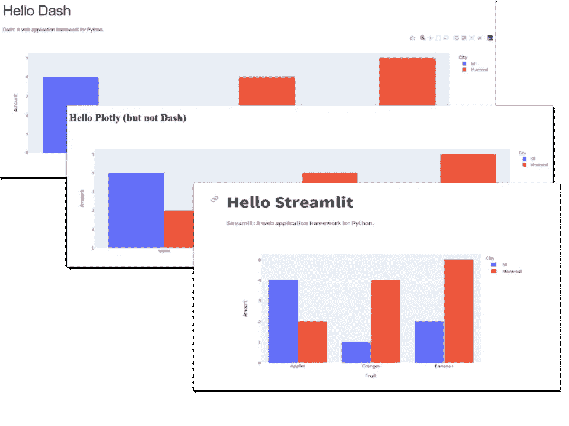
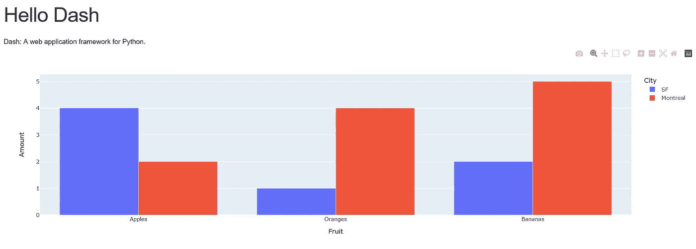

# Plotly 带有 Streamlit、Dash 或 Flask

> 原文：<https://towardsdatascience.com/plotly-with-streamlit-dash-or-flask-4d78fa025ea2>

## 数据可视化

## 哪种框架最适合您的数据科学应用



作者图片

如果我说你可以简单地通过交换你使用的框架来减少一半的应用程序，你会怎么说？

我通过在 Dash、Flask 和 Streamlit 中编写相同的简单应用程序进行了一个快速实验，结果很有启发性。

## 破折号

该应用程序复制自 Dash 文档，代码如下:

```
import dash
import dash_core_components as dcc
import dash_html_components as html
import plotly.express as px
import pandas as pdapp = dash.Dash(__name__)df = pd.DataFrame({
   'Fruit': ['Apples', 'Oranges', 'Bananas', 'Apples', 'Oranges', 'Bananas'],
   'Amount': [4, 1, 2, 2, 4, 5],
   'City': ['SF', 'SF', 'SF', 'Montreal', 'Montreal', 'Montreal']
})fig = px.bar(df, x='Fruit', y='Amount', color='City',  
   barmode='group')app.layout = html.Div(children=[
   html.H1(children='Hello Dash'),
   html.Div(children='''
   Dash: A web application framework for Python.
   '''),
   dcc.Graph(
      id='example-graph',
      figure=fig
   )
])if __name__ == '__main__':
   app.run_server(debug=True)
```

*代码转载由 Plotly 提供—版权所有 2019 Plotly，* [*麻省理工学院许可*](https://github.com/plotly/dash-docs/blob/master/LICENSE)

这并不难做到:首先我们导入库，然后设置 Flask 应用程序，接下来我们定义 dataframe，接下来是实际绘制图形的线条。`app.layout`部分本质上是 Dash 内部编写的 HTML，最后一行运行应用程序。

它会生成一个如下所示的网页:



作者图片

由于 Dash 基本上是一个使用 Plotly 的 Flask app，所以我编写了一个用 Flask 和 Plotly 构造的等价 app(参见我的文章[*Web Visualization with Plotly 和 Flask*](/web-visualization-with-plotly-and-flask-3660abf9c946) *)* ，并将其与 Dash 版本进行了比较。

我个人的观点是我的 Flask/Plotly 应用程序更容易编写，也更灵活(你的观点可能不同)。

## 一个简单的烧瓶+ Plotly 应用程序

这个应用程序有两部分:Flask 应用程序本身和一个 HTML 模板。Flask 应用程序的工作类似于 Dash 应用程序，但不构建实际的网页。网页是一个 HTML 模板，我们将 Plotly 数据从 Flask 应用程序传递给它，这样它就可以显示图表。

烧瓶部分具有与 Dash 相似的结构:

```
from flask import Flask, render_template
import pandas as pd
import json
import plotly
import plotly.express as pxapp = Flask(__name__)**@**app.route('/')
def notdash():
   df = pd.DataFrame({
      'Fruit': ['Apples', 'Oranges', 'Bananas', 'Apples', 'Oranges', 
      'Bananas'],
      'Amount': [4, 1, 2, 2, 4, 5],
      'City': ['SF', 'SF', 'SF', 'Montreal', 'Montreal', 'Montreal']
   })fig = px.bar(df, x='Fruit', y='Amount', color='City', 
      barmode='group')graphJSON = json.dumps(fig, cls=plotly.utils.PlotlyJSONEncoder)return render_template('notdash.html', graphJSON=graphJSON)
```

模板是将要显示的网页。它相当于 Dash 应用程序的布局，但我们将它写在一个 HTML 文件中。

```
<!doctype *html*>
<html>
 <body>
  <h1>Hello Plotly (but not Dash)</h1>
  <div *id*='chart' *class*='chart'”></div>
</body><script *src*='https://cdn.plot.ly/plotly-latest.min.js'></script>
<script *type*='text/javascript'>
  var graphs = {{graphJSON | safe}};
  Plotly.plot('chart',graphs,{});
</script></html>
```

你可以在原[文章](/web-visualization-with-plotly-and-flask-3660abf9c946)中找到 app 的描述。

它看起来是这样的:


作者图片

和原版非常相似。

## 流线型+plottly

自从我写了那篇文章之后，我发现了 Streamlit。Streamlit 是一个非常易于使用的框架，允许您编写包含图表、数据框架和一些非常易于使用的 UI 元素(如选择框、按钮、文本字段等)的数据科学应用程序。

而且是 100% Python。

以下是用 Streamlit 编写的等效应用程序:

```
import pandas as pd
import streamlit as st
import plotly.express as pxdf = pd.DataFrame({
    "Fruit": ["Apples", "Oranges", "Bananas", "Apples", "Oranges",   
    "Bananas"],
    "Amount": [4, 1, 2, 2, 4, 5],
    "City": ["SF", "SF", "SF", "Montreal", "Montreal", "Montreal"]
    })fig = px.bar(df, x="Fruit", y="Amount", color="City",
                 barmode="group")st.title('Hello Streamlit')
st.write('''
    Streamlit: A web application framework for Python.
''')
st.plotly_chart(fig)
```

你应该注意到的是绝对的简单。除了最后三行之外，代码与其他应用程序非常相似——它必须是用于声明熊猫数据帧和绘制 Plotly 图形的 Python 代码。

但是应用程序的其余部分，渲染网页的部分只有三行代码！

它看起来确实与其他应用程序略有不同，这是因为 Streamlit 在默认情况下会给你的应用程序添加一个视图。


作者图片

不得不说，Streamlit 在网页设计方面更具限制性，因为它不允许你像 Dash 或 Flask 应用程序那样拥有 HTML 的全部功能。但是有一些用 Streamlit 制作的非常好看的应用程序，这个非常简单的应用程序的代码是其他版本的一半大小。这可能不是所有情况下的解决方案，但肯定值得考虑。

一如既往，感谢阅读。这是对 Streamlit 在创建数据科学应用程序方面的优势的简单介绍，您可以在我的 [Github repo](https://github.com/alanjones2/Alan-Jones-article-code/tree/master/streamlitdashflask) 中找到代码。

您可以在[我的网站](https://alanjones2.github.io/)上找到关于 Streamlit 和其他主题的其他文章:

[](https://alanjones2.github.io/) 