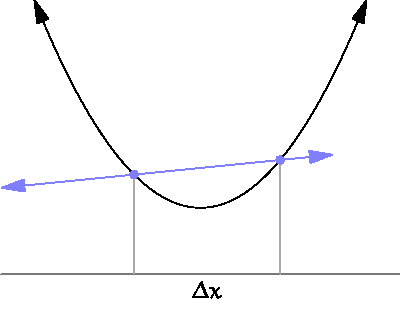

# 强化学习中的策略梯度解释

> 原文：<https://towardsdatascience.com/policy-gradients-in-reinforcement-learning-explained-ecec7df94245>

## 了解所有基于似然比的策略梯度算法(强化):直觉、推导、对数技巧，以及高斯和 softmax 策略的更新规则。

斯科特·韦伯在 [Unsplash](https://unsplash.com?utm_source=medium&utm_medium=referral) 上拍摄的照片

当我第一次研究政策梯度算法时，我并不觉得它们特别容易理解。直觉上，它们看起来足够简单——**采取行动，观察奖励，调整政策**——但在最初的想法之后，是许多冗长的推导、我早已忘记的微积分技巧和大量的注释。在某一点上，它只是变成了一个模糊的概率分布和梯度。

在这篇文章中，我试图一步一步地解释这个概念，包括关键的思维过程和数学运算。诚然，这是一个有点长的阅读，并需要一定的强化学习(RL)的初步知识，但希望它揭示了一些政策梯度背后的想法。重点是**似然比策略梯度**，这是诸如增强/普通策略梯度等经典算法的基础。

考虑到篇幅，我们先来构建这篇文章:

1.  *数值逼近:学习确定性策略*
2.  *数值逼近:学习确定性策略*
3.  *策略近似方法:转向随机策略*
4.  *建立目标函数*
5.  *定义轨迹概率*
6.  *推导政策梯度*
7.  *对数概率函数的梯度*
8.  *近似梯度*
9.  *定义更新规则*
10.  *示例:Softmax 和高斯策略*
11.  *损失函数和自动梯度计算*
12.  *算法实现(加强)*

# 一.价值近似值:学习确定性政策

RL 的目标是学习一个好的决策政策π，使回报随时间最大化。虽然(确定性)策略π的概念一开始看起来有点抽象，但它只是一个基于问题状态 *s* 、 *π :s→a* 返回动作 *a* 的函数。

如果你对 RL 有一些经验，你可能从**值近似值**开始。这类 RL 保持接近动态编程范式，旨在*近似*值函数——反映下游回报的 [Q 值](/a-minimal-working-example-for-deep-q-learning-in-tensorflow-2-0-e0ca8a944d5e)——而不是递归求解[贝尔曼方程](/why-reinforcement-learning-doesnt-need-bellman-s-equation-c9c2e51a0b7)达到最优。

对于值近似值方法，确定性策略工作得很好。通常，我们用概率 1-ϵ选择最佳行动(给定我们的 q 值),用概率ϵ选择随机行动，允许对新行动进行一些探索。我们比较 r(t)+Q_t+1 和 Q_t，并使用观察到的误差来改进价值函数。整个概念非常接近贝尔曼的最优条件。

*想了解更多关于 RL 各种类的内容？看看这篇文章:*

 [## 强化学习的四个策略类别

towardsdatascience.com](/the-four-policy-classes-of-reinforcement-learning-38185daa6c8a) 

# 二。策略近似方法:转向随机策略

在策略近似方法中，我们省略了学习值函数的概念，而是直接**调整策略**。我们**用一组参数θ对策略**进行参数化——例如，这些参数可以是神经网络权重——并调整θ以改进策略π_θ *。*

这听起来很合理，但是我们如何评估一个给定政策的质量呢？我们如何更新θ？没有将相应的性能与其他东西进行对比的能力，就没有办法分辨。像ϵ-greedy 的价值逼近方法一样，我们需要一些**探索机制**。

有许多策略近似方法(例如，遗传算法、爬山法)，但是**策略梯度**由于其效率而被使用得最多。政策梯度算法有多种形式(例如，*有限差分法*对θ添加小扰动并测量差异)，但本文仅关注**似然比政策梯度**。

核心思想是用一个参数化的概率分布π_θ(a | s)= P(a | s；θ).我们**从θ调整的概率分布**中抽取动作，而不是返回单个动作。

随机策略可能看起来不方便，但它为优化策略提供了基础。我们将很快进入数学领域，但是让我们从一个手动的直觉开始。各种政策样本使我们能够对比与某些行动相关的奖励。我们用这些样本来改变θ，**增加获得高回报的概率**。这就是似然比梯度政策的本质。

# 三。建立目标函数

当在一个连续的决策过程中移动时，我们遵循一个状态-行动*轨迹τ=*(S1，a1，…，s_T，a_T)。通过对行为进行抽样，策略影响了我们观察时间范围内每个可能的**状态和行为序列的概率**。每一条轨迹都有一个对应的概率 P(τ)和一个累积奖励 R(τ)=∑γ^t R_t(奖励 R_t 的序列用γ折现)。

> 为了简单起见(不是必须的)，我们假设一组有限的轨迹，这样我们可以对概率求和而不是积分。

有了这些要素，我们就可以正式确定我们的**目标**，即随着时间的推移使预期回报最大化。这里，τ~π_θ形式化了占优策略下的轨迹分布。同样，我们可以对所有轨迹概率求和，并乘以相应的回报。

**目标函数** J(θ)如下:

似然比策略梯度法的目标函数。由于抽样提供了对期望值的无偏估计，我们可以使用模拟来近似估计。

相应的**最大化问题**表示为:

政策近似的最大化问题。通过调整θ，我们的目标是增加遵循产生高回报的轨迹τ的概率。

# 四。定义轨迹概率

从最大化问题来看，调整θ显然会影响轨迹概率。下一个问题是:**如何计算概率 P(τ；θ)?**回想一下，这个客观项受政策π_θ的影响。通过增加高回报轨迹的概率，我们提高了预期回报。

> 如果你想要更多关于这部分的理论背景，值得阅读**似然比方法、评分函数**和**重要性抽样**。对于本文来说，当前的详细程度已经足够了。

在完全确定的环境中，我们可以计算每个策略π_θ产生的轨迹，并找到产生最高累积回报的策略。然而，大多数 RL 问题不完全是确定性的，而是具有(实质上的)随机成分。因此，轨迹概率受政策的影响，但不完全由政策决定。给定我们的政策，我们计算某个回报轨迹发生的**概率。**

总而言之，我们处理两种概率分布:

*   **保单本身就是一个概率分布**π_θ(a | s)= P(a | s；θ) .该策略规定了在给定状态下选择每个动作的概率，并且取决于参数设置θ。
*   一个**转移概率分布** P(s_t+1|s_t，a_t)描述了环境中的状态转移。注意，这个概率分布部分受π_θ(行动选择)影响，部分受外源信息影响。

有了这些信息，让我们试着计算在策略π_θ(a|s)下轨迹τ出现的概率。每一时间步**将采样动作π_θ(a_t|s_t)的概率**乘以转移概率 P(s_t+1|s_t，a_t)。随后，我们将每个时间步长的这些概率相乘，以找到完整轨迹实现的概率:

轨迹概率是动作概率(由策略π_θ决定)和状态转移概率(由转移函数 P(s_t+1)决定)的乘积。

麻烦的部分是转移函数 P(s_t+1)。这就是环境的模型，往好里说是工作复杂，往坏里说是完全未知。

这个模型的另一个缺点是，它是概率的产品。对于很长的时间范围和很小的概率，轨迹概率变得非常小。由于计算机语言只提供有限精度的浮点数，这导致了数值的不稳定性。

让我们以后再担心这些事情，首先重新考虑我们实际上旨在优化的函数。

# 动词 （verb 的缩写）引入政策梯度

如前所述，我们寻求最大化我们的预期回报 J(θ)。如何优化该函数，例如，确定使目标函数最大化的参数θ？

现在我们已经做了一些有益的观察。通过采用*随机*策略，我们对产生不同轨迹τ的各种行为进行采样，使我们能够看到哪些行为产生最佳回报。换句话说，**采样观测为策略参数θ提供了更新方向**。

是时候具体化这个“方向”了。高中的时候，我们学过如何取函数 f(x)关于 x 的**导数** δf/δx 向其最大值(或最小值)移动。如果导数很大，就意味着斜率很陡——我们可能离最优值很远。如果它是 0，我们降落在局部最优。我们可以对 J(θ)做同样的事情，求目标函数 J 对θ的导数。

使用切线的导数斜率动画[图片来自[维基百科](https://en.wikipedia.org/wiki/Derivative#/media/File:Tangent_animation.gif)

一个**梯度**概括了导数的概念，仅仅是偏导数的一个**向量。由于θ通常是一个向量θ=[θ_1，θ_2，…θ_N]，我们可以看到如何计算每个参数的偏导数(例如，δJ(θ)/δ θ_1):**

参数化累积报酬函数 J(θ)的梯度。梯度是向量θ中每个参数θ_n 的偏导数的向量。

为了计算梯度，我们必须能够对函数**J(θ)求导。我们看到改变πθ(a | s)会影响轨迹概率 P(τ；θ).然而，我们还没有解决*如何*计算这些轨迹概率；记住我们可能甚至不知道转移函数 P(s_t+1|s_t，a_t)！**

一些数学的时间到了。

# 不及物动词推导政策梯度

我们需要检索目标函数的显式梯度。让我们一步一步来。我们从预期回报的梯度开始:

第一步:表示为预期报酬的梯度

如前所述，我们可以将其改写为所有轨迹概率的总和**乘以轨迹回报:**

步骤 2:表示为概率加权回报轨迹的梯度

总和的*梯度等于**梯度总和**，因此我们可以在总和内移动梯度。*

步骤 3:重写为渐变总和

下一步需要更多的关注。让我们回顾一下对梯度政策定理至关重要的一个恒等式——对数导数技巧。

> **对数求导技巧**
> 
> 数学中一个常见的技巧是将一个表达式乘以 1，这显然不会改变它。在这种情况下，我们乘以*P(τ；θ)/P(τ；θ)* ，这样表达式变成:

步骤 4a:将表达式乘以 P(τ；θ)/P(τ；θ)(等于 1)

> 我们可以重新排列成:

步骤 4b:重新排列表达式

> 并随后:

步骤 4c:再次重新排列表达式

> 何必呢？嗯，这是因为我们现在可以应用下面的恒等式:

日志标识。这个至关重要的结果——也称为似然比或得分函数——有助于轨迹概率函数的关键转换。

> 这个恒等式是整个定理的基石。其实，**这个结果就是似然比**。
> 
> 我将不再详细解释——本文中已经有足够的数学知识了——但是可以使用(I)对数函数的导数和(ii)链式法则来重建恒等式。

使用对数导数技巧，我们将表达式改写为

步骤 4:使用对数导数技巧重写

这个表达是个好消息，原因有很多！我们现在将把自己限制在一个原因上，那就是项∑_θ(P(τ；θ).为什么这是好消息？在对数变换之前，我们对概率的*梯度*求和，现在我们对概率本身求和。有了这个结果，我们可以**把我们的梯度改写成期望值。**最后一步变成了

第五步:按照预期重写

值得停下来评估一下我们的成就。我们已经知道我们可以把目标函数*写成期望值*，但是现在我们发现**也可以把梯度本身写成期望值**。这一点对于应用 RL 等基于采样的方法至关重要。

不幸的是，我们仍然不知道如何处理 P(τ；θ)，(即如何实际计算梯度)但我们很快就会到达那里。

# 七。对数概率函数的梯度

还记得我们之前纠结轨迹概率函数吗，因为它需要环境的显式模型(P(s_t+1|s_t，a_t)部分)？原来我们已经解决了使用日志技巧！

让我们写出梯度部分∇_θ对数 p(τ；θ).首先，我们简单地用 P(τ；θ)我们之前已经确定:

步骤 1:用轨迹概率代替显式表达式

我们可以重写为*对数*概率，而不是取整个概率乘积的对数:

第二步:使用对数概率重写

对数概率的一个方便的特性是它们是相加的而不是相乘的。对于数值稳定性来说，这是非常令人愉快的(考虑到浮点数的有限精度)。它还有助于防止通常困扰 RL 算法的爆炸/消失梯度。

然而，主要的结果是我们有效地**将转移函数** P(s_t+1) **与策略** π_θ(a_t)解耦。因为梯度是相对于θ取的，而 P(s_t+1|s_t，a_t)不依赖于θ，所以我们简单地取它！

步骤 3a:移除状态转换功能。因为它与第二项分开，不依赖于θ，所以对梯度没有影响。

产生的结果看起来更清晰，我们的梯度只取决于政策:

步骤 3b:移除过渡函数后的梯度

最后一步，我们在求和中引入梯度符号(*‘和的梯度=梯度的和’*)，这样我们可以计算每个时间步长的梯度(例如，对于单个动作)。最终结果:

步骤 4:表示为梯度和

# 八。近似梯度

我们快到了。然而，到目前为止的计算涉及到真实的预期，包括所有可能的轨迹。典型的 RL 问题在计算上是难以处理的(否则我们可以只应用动态编程)，所以我们需要使用轨迹的**样本**。

事实上，我们基于有限数量的样本来计算一个**近似梯度**。幸运的是，我们已经建立了梯度也是一个期望值，我们可以用模拟来估计。表达式看起来是这样的:

基于有限数量的轨迹样本 m 的梯度近似

正如你所看到的，这个表达式是完全容易处理的。我们可以对轨迹和相应的回报进行采样，即使我们不知道环境模型。我们所需要的是一个明确定义的政策，可微分的 w.r.t. θ。

为了简单起见，我将在本文的剩余部分继续讨论*渐变*，但是请记住，我们实际上使用的是*近似* *渐变*。

# 九。定义更新规则

一旦我们计算了(近似的)梯度，我们如何应用它来更新我们的策略？

基于采样观察，我们希望**逐渐更新策略参数**。为此，我们定义了一个学习率α∈(0，1)，表示放在计算的梯度上的权重，以更新现有的参数向量。相应的更新规则如下所示:

策略梯度更新规则。新的政策参数是旧参数和目标函数梯度的加权组合。

通常，更新规则由θ应改变的增量表示:δθ=α∇_θj(θ)。

记住梯度只是偏导数的向量。因此，更新规则为θ中的每个元素提供了唯一的权重更新。通过这种方式，更新与单个功能的影响保持一致。

# X.示例:Softmax 和 Gaussian 策略

我们已经达成了一个明确的更新规则，但如果你对所有的曲折感到有点茫然，这是可以理解的。

让我们看看是否可以将我们的抽象结果具体化，为**离散和连续动作空间提供规范的策略。**

一些符号。设ϕ(s,a)是基函数的向量(例如，从状态动作对导出的解释变量的向量)。如前所述，θ是相应的一组参数，可以解释为每个变量的权重。我们假设一个简单的线性函数ϕ(s,a)^⊤⋅θ——注意，我们可以很容易地用θ参数化的神经网络来代替它。

对于离散动作，最常用的是 **softmax 策略**。其定义如下:

Softmax 政策。这个策略通常用于离散的动作空间

其梯度(此处[的推导](https://math.stackexchange.com/questions/2013050/log-of-softmax-function-derivative))如下:

softmax 策略的梯度

结果可以解释为所有动作的*观察到的*特征向量(来自采样动作)减去*预期的*特征向量。因此，如果奖励信号很高，并且观察向量与预期向量相差很大，则提供了更新该动作的概率的强烈动机。

对于连续动作空间，高斯策略最常见。这里，我们从参数化的正态分布中绘制动作。分布的平均值由μ_θ=ϕ(s,a)^⊤⋅θ.表示

高斯政策。这个策略通常用于连续动作空间

相应的梯度:

高斯政策的梯度

同样在这里，可以看出，在高回报的情况下，远离平均值的行为触发了强烈的更新信号。由于概率总和必须为 1，增加某些轨迹的概率意味着减少其他轨迹的概率。因此，调整政策会影响预期回报。

# XI。损失函数和自动梯度计算

尽管策略需要是可微分的，并且梯度可以使用微积分来计算，但是手动计算偏导数是相当麻烦的。特别是当策略是深度神经网络时——其中θ表示网络权重——我们通常依赖于**自动梯度计算**。

对于自动梯度，我们只需定义一个**损失函数**并让计算机求解所有导数。损失函数有效地代表了更新信号。我们添加一个负号(因为训练依赖于梯度*下降*而不是- *上升*)，并定义规范损失函数如下:

策略梯度算法的损失函数。大多数实现都提供了自动微分，这样就可以计算出梯度。

# 十二。算法实现(加强)

本文提供的信息解释了似然比策略梯度方法的背景，如 Williams 的经典**加强算法**。

让我们把这些放在一起:

加强算法，也称为普通策略梯度或似然比策略梯度[图片由作者提供，基于 Williams (1992)]

虽然这需要一些数学知识，但实际的算法是简洁明了的。我们所需要的只是抽样奖励和我们政策的梯度。

**Python 实现**(例如，使用 TensorFlow 定义的策略网络)也不需要太多代码——查看我下面的文章中关于连续和离散变体的例子。

      

如果你想更进一步，也可以阅读我关于自然梯度和 TRPO 的文章，它们构成了当代政策梯度算法的基础:

    

如果你成功了，恭喜你！掌握策略梯度算法需要一些时间，但一旦掌握，它们就为混合方法(如行动者-批评家方法)以及更高级的方法(如近似策略优化)打开了大门。因此，他们的理解对任何 RL 从业者都是至关重要的。

# 摘要

*   给定政策下的预期回报由国家行动轨迹乘以相应回报的概率来定义。**似然比政策梯度**通过增加高回报轨迹的概率，部署由θ参数化的随机政策，建立在这一定义之上。
*   我们可能不知道环境的转变和回报功能。然而，在经过**对数变换**之后，我们使用的是加法(对数)概率，而不是概率的乘法。这种转换将策略从(可能未知的)状态转换功能中分离出来。
*   如果我们有一个关于它的参数化θ的可微策略，我们可以计算它的**梯度**。因为我们可以将这个梯度表示为一个期望值，所以我们可以使用模拟来近似它。典型的 RL 实现利用损失函数，从损失函数自动导出梯度。
*   在诸如**加强**的算法中，我们从环境中采样转换和回报(使用随机策略)，并将轨迹回报乘以对数策略的梯度来更新参数θ。

# 进一步阅读

**加固算法**

威廉姆斯，R. J. (1992 年)。联结主义强化学习的简单统计梯度跟踪算法。*机器学习*， *8* (3)，229–256。

**不同政策梯度方法解释**

里德米勒，m .，彼得斯，j .，，S. (2007 年 4 月)。在 cart-pole 基准上评估政策梯度方法和变体。在 *2007 年 IEEE 近似动态规划和强化学习国际研讨会上*(第 254–261 页)。IEEE。

**有限差分、似然比和自然政策梯度的描述**

[http://www.scholarpedia.org/article/Policy_gradient_methods](http://www.scholarpedia.org/article/Policy_gradient_methods#Likelihood_Ratio_Methods_and_REINFORCE)

**政策梯度介绍(许宗盛)**

[https://Jonathan-hui . medium . com/rl-policy-gradients-explained-9b 13 b 688 b 146](https://jonathan-hui.medium.com/rl-policy-gradients-explained-9b13b688b146)

**政策梯度推导(Chris Yoon)**

[https://medium . com/@ thechrisyoon/derivating-policy-gradients-and-implementing-reinforce-f 887949 BD 63](https://medium.com/@thechrisyoon/deriving-policy-gradients-and-implementing-reinforce-f887949bd63)

**对数导数技巧的解释(大卫·迈耶):**

[https://davidmeyer.github.io/ml/log_derivative_trick.pdf](https://davidmeyer.github.io/ml/log_derivative_trick.pdf)

**似然比政策梯度(戴维·迈耶):**

[https://David Meyer . github . io/ml/policy _ gradient _ methods _ for _ robotics . pdf](https://davidmeyer.github.io/ml/policy_gradient_methods_for_robotics.pdf)

**政策梯度定理的证明和大量的政策梯度算法(Lilian Weng):**

[https://lilian Weng . github . io/posts/2018-04-08-policy-gradient/](https://lilianweng.github.io/posts/2018-04-08-policy-gradient/)

**似然比梯度(蒂姆·维埃拉):**

[https://timvieira . github . io/blog/post/2019/04/20/the-likelihood-ratio-gradient/](https://timvieira.github.io/blog/post/2019/04/20/the-likelihood-ratio-gradient/#:~:text=The%20likelihood%2Dratio%20method%20can%20be%20used%20to%20derive%20several,knowledge%20of%20the%20transition%20distribution)

**Sergey Levine(伯克利)关于政策梯度的演讲幻灯片**

[http://rail . eecs . Berkeley . edu/deeprlcourse-fa17/f17 docs/lecture _ 4 _ policy _ gradient . pdf](http://rail.eecs.berkeley.edu/deeprlcourse-fa17/f17docs/lecture_4_policy_gradient.pdf)

**David Silver (Deepmind)关于政策梯度的演讲幻灯片**

[https://www . David silver . uk/WP-content/uploads/2020/03/pg . pdf](https://www.davidsilver.uk/wp-content/uploads/2020/03/pg.pdf)

**彼得·阿比尔的 4A 深度 RL 训练营演讲:政策梯度**

伯克利政策梯度讲座

**David Silver 的 RL 课程——第 7 讲:政策梯度方法**

关于政策梯度的 DeepMind 讲座