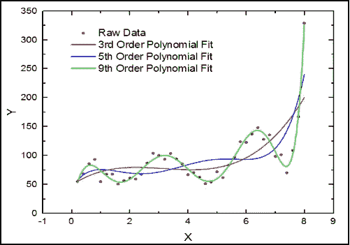
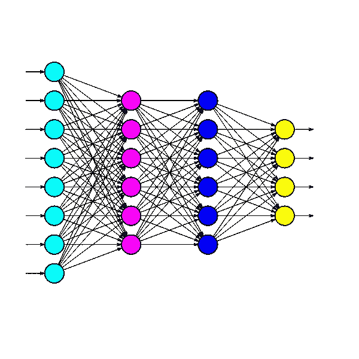

# 多项式回归——神经网络的替代方案？

> 原文：<https://towardsdatascience.com/polynomial-regression-an-alternative-for-neural-networks-c4bd30fa6cf6>

## 多项式和神经网络的讨论，理论上它们都能无限逼近连续函数



使用三种不同次数的多项式对数据集执行多项式回归的示例。理论上，多项式可以实现无限紧密的配合。[图片来自[维基媒体](https://upload.wikimedia.org/wikipedia/commons/9/90/Poly-reg-3.png)作者[肖巴](https://commons.wikimedia.org/wiki/File:Poly-reg-3.png)

首先，这更像是一篇讨论文章。虽然我将尝试比较多项式和神经网络，但没有大量的数学严谨性或文献支持来支持这篇文章。它也不是教程:这次没有 Python 实现或数值实验(至少我自己没有)。最后，我也不是试图说服你放弃神经网络，接受多项式回归。

说完这些，让我们说说我*想用这篇文章做什么*。几乎每个人都在生活中的某个时候学会了设计多项式，他们拟合任何函数的能力在很久以前就被证明了。添加这两个应该会产生有趣的用例，但是对数据科学中的多项式回归的关注是相当不深刻的。如果这篇文章成功地引发了一些思考，并恢复了对古老的多项式设计艺术的关注，那就足够了。

## 神经网络

先说神经网络，以及我们为什么喜欢它。从数学的角度来看，神经网络的巨大吸引力在于它们可以无限逼近任何连续函数。原则上，即使是简单的单层网络也能完成这项任务。是的，有严格的理论要求，你可能永远无法在实践中达到完美的契合，但它仍然是一个令人放心的属性。

*【提供一些* ***泛逼近定理的背景****:George Cybenko(1989)证明了具有 sigmoid 激活函数的单层网络可以无限逼近任何连续函数。Hornik 等人(1989)表明，该结果也适用于多层网络中的其他激活函数。从那时起，定理已经扩展到其他方向，例如，任意层宽度和深度，各种激活函数，非连续函数等。同样，这些结果不能提供任何实际的保证，因为条件可能是不现实的。】*



神经网络的示例。多个层通常捕获数据集的特定特征。[图片由[open clipbart](https://freesvg.org/nn1)在 [FreeSVG](https://freesvg.org/) 上提供]

我知道这不是对神经网络最详尽的描述，但是我们还有很多材料要介绍。我们继续吧。

## **多项式**

另一类能够拟合几乎任何数据集的函数似乎几乎被遗忘了——至少在数据科学界——但与神经网络具有相似的属性(Stone-Weierstrass 定理)。正如你可能已经从标题中猜测到的，那就是多项式类**。**

**很可能，你高中的时候有过一些多项式。然后，取决于你之后的方向，你可能研究了很多，也可能根本没有研究。无论如何，它们在当今的数据科学中似乎并不太受欢迎。**

**为了提供一个简短的复习，多项式被定义为:**

> **由不定项(也称为变量)和系数组成的表达式，只涉及变量的**加**、**减**、**乘**和非负整数**取幂**运算—维基百科**

**多项式的一个例子可能是:**

**`f(x) = (x − 3)(x − 2)(x − 1)(x)(x + 1)(x + 2)(x + 3)`**

**相应的图如下所示:**

****

**7 次多项式的示例。高次多项式可以拟合非常复杂的模式。[图片来自[维基媒体](https://commons.wikimedia.org/w/index.php?curid=25264233)作者[梅利坎普](https://commons.wikimedia.org/wiki/User:Melikamp)**

**请注意，多项式可以通过将各项相乘来写出。多项式总是可以改写成标准形式:**

****

**注意，虽然特征`x^k, k>1`是非线性的，但是作为统计估计问题**是线性的**(特征的加权线性组合)，并且可以用基本的线性回归技术来解决。这是一个强大的属性，使生活变得容易得多。**

**在数据科学中，我们通常处理多个特征(例如，一个以上的解释变量，比如说`x_1, x_2, x_3`)，转化为一个**多变量多项式**。例如，像这样的术语可能代表一个特征:**

**`x_1x_2x_3²`**

**或者如果你喜欢更具描述性的东西:**

**`x_years_experience * x_salary_last_year * x_num_past_jobs²`**

**这只是众多可能特征中的一个。可以想象，多项式很快变得相当混乱和复杂。两个方面决定了多项式的复杂性:**

*   ****变量的数量**。表达式`2x_1²x_2⁴ - 3x_1x_2² + x_1 + 8`包含两个解释变量，`x_1`和`x_2`。具有两个变量的多项式可以在 3D 绘图中可视化，在更高的维度上，我们人类的大脑往往会有所欠缺。**
*   **多项式的**次**。这是标准形式表达式中的最高幂(乘以变量时指数的总和)。例如，在`2x_1²x_2⁴ - 3x_1x_2² + x_1 + 8`示例中，度数将是 6(即 2+4)。**

**此时，您可能会发现一个潜在的问题。带有一个变量的 5 次多项式(如`w_5x⁵ + w_4x⁴ + w_3x³ + w_2x² + w_1x + w_0`)似乎是可行的，带有五个变量的 1 次多项式(如`w_1x_1 + w_2x_2 + w_3x_3 + w_4x_4 + w_5x_5 + w_0`)也是可行的。**

**但是，如果我们同时增加次数和变量的数量，特征的数量可能会爆炸。当我们转向像`x_1⁴x_2x_3³x_4²`这样的装置时，我们意识到*有很多*的**高度多变量特征**我们可以设计来捕捉复杂的交互。首先，我们不知道哪些特性是相关的——不管我们有多少领域知识。在精神上，我们可以概念化基本的相互作用和二次效应，但除此之外就没什么了。**

**总之，我们有两个问题要处理:(1)包括哪些特征，以及(2)我们应该在多大程度上捕捉相关效应。在面对这些挑战之前，让我们暂时回到神经网络。**

## **多项式和神经网络之间的联系**

**我们很少费心以数学形式明确写出神经网络，但我们可以。本质上，每个隐藏节点将前一层的加权组合作为输入，根据某个激活函数(例如，sigmoid 或 ReLU)对其进行变换，并将输出传递给下一层。**

**就像一个高次多项式取一些初始解释变量`x_1,x_2,x_3`并嵌入到类似`x_1²x_2x_3⁴`的复杂特征中一样，一个神经网络也转换输入并隐式提取特征。你看这是怎么回事。根据加州大学和斯坦福大学的研究人员(Cheng et al .，2021)，**神经网络实际上是一类特殊的多项式**。每一层都增加了多项式的复杂性。**

> **如果激活函数是任何多项式，或者由一个多项式实现，则 NN 精确地执行多项式回归。**
> 
> **而且，多项式的次数会逐层递增。”—程等，2019**

**这是一个迷人的结果。事实证明，我们并没有真正讨论对立的解决方法。如果有什么不同的话，神经网络为多项式回归的总体解决方案类增加了特定的角度和概念化。**

**为了避免问题过于复杂:在剩余部分，我将继续使用术语**多项式**表示典型的多项式回归，术语**神经网络**表示神经网络。**

***【程等论文注:仅讨论简单人工神经网络；特殊口味，如循环、通用、卷积等。不包括在内。同样值得指出的是，这篇论文没有提供严格的数学证明。最后，到目前为止，这份手稿还没有被同行评审或发表。]***

## **多项式回归-特征选择和数据拟合**

**回到多项式。我们现在知道了它们的样子，但是我们如何在数据科学环境中使用它们呢？为了解决这个问题，让我们假设我们使用一个给定的数据集来构建一个既适合训练数据又能很好地解释未知数据的模型。**

**虽然有很多方法可以将变量组合成高级术语，但是现在**创建特性**并不太复杂。虽然我不会在这里深入探讨，但是类似于`sklearn.PolynomialFeatures`的东西可以在一定程度上生成所有的特性。例如，对于两个变量和 2 度，我们将生成`[1, x_1, x_2, x_1², x_1x_2, x_2²]`。**

****拟合多项式**本质上也不具有挑战性。例如，`numpy.Polynomial`功能包含许多常见的多项式(切比雪夫多项式、埃尔米特多项式、勒让德多项式等。)并且拟合是在一行代码中完成的:**

```
output = Polynomial.fit(x_data, y_data, deg=3)
```

**真正的挑战在于找到正确的**特征子集**。也许`x_1⁷x_2³x_3²`证明了一个深刻的预测，或者也许`x_1⁵x_2⁴x_3²`是。即使对于更合理的程度，也经常存在如此多的可能性，以至于对所有模型(即，特征的组合)进行穷举搜索是不可行的。**

**一些技术可能有助于处理大量特征，例如:**

*   ****主成分分析** (PCA)以在设计多项式之前降低特征集的维数；**
*   ****卡方检验**检验特征在预测结果中的显著性；**
*   ****决策树**(或随机森林)选择成功特征；**
*   ****弹性网回归**(结合套索和脊线)剔除低显著性特征。**

**我承认:不一定容易。然而，请记住，神经网络训练中的认真努力还需要特征选择、架构选择和超参数调整。这两种解决方法都不会立即产生一个完美的模型。**

**另一个挑战在于**过度拟合**。一个 20 次多项式可能捕捉到许多特殊的效果、异常值等等。尽管我们不一定想要对训练数据有一个完美的拟合；我们希望这个模型能够很好地处理以前没有见过的数据。前述的*弹性网*有所帮助，避免高次多项式也是如此。与神经网络不同——神经网络也容易过度拟合——对于多项式回归，我们可以计算*方差膨胀因子—* ,因为我们仍在执行普通最小二乘(OLS)回归——当我们即将在模型中引入**多重共线性**时会发出警告。**

**总之:我们有所有必要的工具来将复杂的多项式拟合到复杂的数据集中。这并不是说多项式是数据科学的灵丹妙药。这并不是说拟合一个合适的多项式将是一件轻而易举的事。它绝对没有说我们会找到理论上可以达到的完美匹配。这也不是令人难以置信的黯淡前景。**

## **多项式和神经网络的优势**

****

**神经网络的最大好处之一是它们可以有效地捕捉层次结构。[照片由[尤金·特卡琴科](https://unsplash.com/@eugene_tkachenko?utm_source=medium&utm_medium=referral)在 [Unsplash](https://unsplash.com?utm_source=medium&utm_medium=referral) 拍摄]**

**多项式的起源可以追溯到几个世纪以前；到目前为止，它们已经被很好地研究和理解了。显然，它们确实有一些缺点——否则，一开始就没有人会费心研究新技术。神经网络在该领域赢得了应有的地位。**

**也许神经网络最大的吸引力在于它们捕捉层级效应的能力。这是他们在计算机视觉上工作得如此好的原因之一，特定的层专用于大形状、小形状、颜色等。由于分层架构，他们通常能够**很好地概括**，引入处理新数据所需的*归纳偏差*。**

**此外，神经网络在许多方面都便于使用。是的，当网络变得更先进时，你必须研究层和节点的数量、学习速率和额外的超参数。找到合适的架构需要时间和精力。**

**然而，就**功能设计**而言，很多工作是从你手中拿走的。基本上，你输入一些解释变量，网络就会自己计算出相关的相互作用和高阶效应。有了所有可用的库和复杂的**梯度下降算法**，定制一个神经网络是完全可行的。**

**相比之下，对于*多项式回归*，**训练本身是直接的**(基本回归)。挑战在于选择合适的特征并将它们组合成一个合理的模型。这里有一个小小的帮助，就是前面提到的**多重共线性警告**，它比神经网络更容易避免过度拟合。离群点检测有点问题。在线性回归中，离群值很容易识别；在这里，它们可能被认为是某种奇怪的非线性模式的一部分。**

**在库的帮助下，这两种解决方法现在都很容易管理。拟合多项式不需要成为数学家，训练神经网络也不需要成为机器学习工程师。**

## **一些结果(来自程等人)**

**最终，相关的问题是*‘哪一个更好？’*。希望你不要期望在这里找到一个结论性的答案。**

**然而，值得注意的是，Cheng 等人(2019)在多个数据集(分类和回归任务)上比较了两者的性能。有趣的是，他们发现多项式回归的表现与神经网络一样好，甚至更好。此外，他们的实验表明多项式很少需要高于二阶或三阶。因此，它们也是可以解释的。**

> **“由于这个和其他原因，例如数据边缘的大拟合值，许多作者建议不要使用高于 2 或 3 次的多项式模型，事实上，在本文的实证实验中，我们很少发现有必要使用更高的次数。”—程等，2019**

**直觉上，这是有道理的。**相互作用效应**在高阶时会急剧减弱。将两个或三个变量相乘会产生相关的见解，捕捉线性和二次效应也是如此。但是在现实生活中，我们真的经常遇到有意义的 20 次方效应或十几个变量之间的相互作用吗？如果有什么不同的话，这个结果意味着神经网络对于手头的任务来说经常是不必要的复杂，导致了臭名昭著的过度拟合效应。**

> **“最重要的是，我们已经表明，公关应该是一个有效的替代无核武器国家。我们使用各种类型的各种数据进行了实验，在所有情况下，PR 的性能与 NN 相似，或者明显优于 NN，而没有 NN 试图找到调整参数的良好组合的麻烦。**
> 
> **在某些情况下，PR 实际上优于 nn 的事实反映了 nn 通常被过度参数化的事实，本质上是拟合比它们应该拟合的更高次的多项式。”—程等，2019**

**尽管测试了各种数据集，但声称多项式回归优于神经网络拟合还是言过其实。当然——特别是在充分微调的情况下——很容易找到神经网络优于多项式回归的反例。我还怀疑多项式在完成超级马里奥游戏或识别人脸(即更专业化的神经网络)方面是否同样成功。**

**对于典型的数据科学任务——估计工资、预测旅行时间、按流派对歌曲进行分类——多项式显然比神经网络更合理。由于现实的过度简化，线性回归往往不尽人意，然而深度神经网络可能会寻找根本不存在的高度复杂的模式。**

## **结束语**

**正如本文开头所提到的，这更多的是一篇讨论文章。它不打算是完整的或严格的，也不主张多项式回归取代神经网络。**

**尽管如此，看到多项式回归与神经网络的竞争有多激烈肯定是很有趣的。后者取得的进展非常有趣，但大多数数据科学任务都不在一般的 DeepMind 挑战水平上。**

**虽然深度学习对许多人有强烈的吸引力，但它是否总是最适合这项工作的方法是值得怀疑的。多项式提供了非常丰富的现实表现；即使低度数和交互效果也能捕捉大部分真实世界的效果。在那种形式下，它们相对紧凑和全面，避免了神经网络容易遭受的*【黑箱】*效应。**

**现代工具包消除了过去多项式回归遇到的许多实际问题。理论上，多项式可以实现与神经网络相同的“完美”拟合，同时只需要比基本线性回归多一点的知识。**

**总而言之，也许是时候给多项式第二次机会了。**

## **参考**

**Cheng，x .，Khomtchouk，b .，Matloff，n .，& Mohanty，P. (2019)。多项式回归作为神经网络的替代。 *ArXiv 预印本。*[https://arxiv.org/abs/1806.06850v2](https://arxiv.org/abs/1806.06850v2)**

**乔治·西本科(1989 年)。sigmoidal 函数的叠加逼近。*控制、信号与系统的数学*， *2* (4)，303–314。**

**霍尼克，k .，斯廷奇科姆，m .，，怀特，H. (1989)。多层前馈网络是通用逼近器。*神经网络*， *2* (5)，359–366。**

**M. H .斯通(1948 年)。广义维尔斯特拉斯逼近定理。*数学杂志*， *21* (5)，237–254。**

**魏尔斯特拉斯，K. (1885)。因此，分析师们将库利尔的工作放在一个更低的位置。*柏林科学研究院院长会议*， *2* ，633–639。**

**[](https://en.wikipedia.org/wiki/Polynomial) [## 多项式-维基百科

### 在数学中，多项式是由不定项(也称为变量)和系数组成的表达式

en.wikipedia.org](https://en.wikipedia.org/wiki/Polynomial) [](https://en.wikipedia.org/wiki/Polynomial_regression) [## 多项式回归-维基百科

### 在统计学中，多项式回归是回归分析的一种形式，其中独立变量之间的关系…

en.wikipedia.org](https://en.wikipedia.org/wiki/Polynomial_regression)  [## 方差膨胀因子—维基百科

### 在统计学中，方差膨胀因子(VIF)是估计某个变量的方差的比率(商)

en.wikipedia.org](https://en.wikipedia.org/wiki/Variance_inflation_factor)  [## 通用逼近定理—维基百科

### 在人工神经网络的数学理论中，通用逼近定理是建立…

en.wikipedia.org](https://en.wikipedia.org/wiki/Universal_approximation_theorem) [](https://scikit-learn.org/stable/modules/generated/sklearn.preprocessing.PolynomialFeatures.html) [## sklearn.preprocessing .多项式功能

### 使用 sk learn . preprocessing . polynomial features 的示例:scikit 的发布亮点-learn 0.24 发布亮点…

scikit-learn.org](https://scikit-learn.org/stable/modules/generated/sklearn.preprocessing.PolynomialFeatures.html)  [## 便利类-NumPy 1.22 版手册

### 一个有效处理多项式的子程序包。在该子包的文档中,“有限功率……

numpy.org](https://numpy.org/doc/stable/reference/routines.polynomials.package.html#module-numpy.polynomial)**