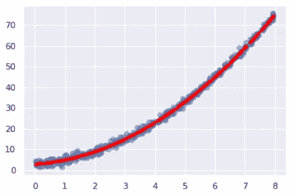

# Python 中的多项式回归

> 原文：<https://towardsdatascience.com/polynomial-regression-in-python-dd655a7d9f2b>

## 对非线性数据使用更复杂的回归方法


叶夫根尼·特卡琴科在 [Unsplash](https://unsplash.com/s/photos/curves?utm_source=unsplash&utm_medium=referral&utm_content=creditCopyText) 上的照片

# 介绍

传统的线性回归是一种广泛使用的统计工具，用于确定两个变量之间的线性关系，使分析师能够做出推断，并从数据中提取良好的洞察力，包括预测。

然而，并不只有线性数据。并非所有数据集都具有线性模式。有些情况下，它们*快到了，*但是我们需要进行转换来“帮助”它们适应线性算法。

一种可能性是幂变换，例如，使二次或三次方程表现得像线性方程一样。通过向数据添加一个变换层，我们可以更好地拟合它，正如我们将要看到的。

# 多项式

在数学中，多项式是由变量(x，y，z)和系数(乘以变量的数字)组成的方程。

简单的线性回归是一次多项式，其中我们有乘以变量 x 的系数，简单明了。你一定见过很多次了，下面是简单的线性回归公式。


第二、第三或第 n 次多项式类似，但在这种情况下，系数乘以变量的二次、三次或第 n 次幂。例如，在下面的二次公式中，β乘以平方变量，β1 乘以非平方变量。因为这里的最高幂是 2，所以多项式是二次的。如果我们有一个三次变量，它将是 3 次，以此类推。


很好。现在我们知道如何识别多项式的次数。让我们继续，看看 it 在数据中的影响。

# 数据有哪些变化？

查看我们的数据图以了解其形状以及线性回归如何拟合是很重要的。或者，更好的是，如果它是最合适的。

我们来看不同次数多项式的形状。


不同次数多项式的曲线形状。图片由作者提供。

观察到每个度数的增加使得数据产生更多的曲线。度 1 是一条线，正如所料，度 2 是一条曲线，之后的其他是“S”形或其他曲线。

知道数据不再是一条直线，使用简单的线性回归就不太合适了。取决于曲线有多亮，你仍然可能得到一些有趣的结果，但是总会有一些点非常偏离。

让我们看看如何处理这些情况。

# 多项式特征

Scikit-Learn 有一个类名`PolynomialFeatures()`,用于处理线性回归拟合高次多项式的情况。

事实上，它所做的是转换你的数据，有点像在数据上添加一个*层*，帮助`LinearRegression()`算法识别所需的正确曲线度数。它以我们需要的度数计算分数。

## 二次数据

让我们从二次方程开始。我们可以创建一个数据集。

```
# Dataset
X = 8 * np.random.rand(500, 1)
y = 1 + X**2 + X + 2 + np.random.randn(500,1)# Plot
plt.scatter(X,y, alpha=0.5);
```


二次方程。图片由作者提供。

让我们导入所需的模块。

```
from sklearn.linear_model import LinearRegression
from sklearn.preprocessing import PolynomialFeatures
```

接下来，我们可以拟合一个线性模型。只是为了展示发生了什么。

```
# Linear Regression
linear_model = LinearRegression().fit(X,y)
preds = linear_model.predict(X)
```

这将产生接下来的情节。


二次多项式拟合的线性回归。图片由作者提供。

嗯……有几次我们会是正确的，其他时候我们会很接近，但是大多数预测不会太好。我们来评价一下模型。

```
# y_mean
label_mean =  np.mean(y)
print('label mean:', label_mean )# RMSE
rmse = np.sqrt( mean_squared_error(y, preds))
print('RMSE:', rmse )# % Off
print('% off:',rmse/label_mean)**[OUT]:** label mean: 26.91768042533155 
RMSE: 4.937613270465381 
% off: 0.18343383205555547
```

平均打八折。如果我们给它`linear_model.score(X,y)`打分，我们会得到 94%的 R。

现在，我们将转换数据以反映二次曲线，并再次拟合模型。

```
# Instance
poly2 = PolynomialFeatures(degree=2, include_bias=False)
X_poly = poly2.fit_transform(X)# Fit Linear model with poly features
poly_model = LinearRegression().fit(X_poly,y)
poly_pred = poly_model.predict(X_poly)# Plot
plt.scatter(X,y, alpha=0.5)
plt.plot(X, poly_pred, color='red', linestyle='', marker='.', lw=0.1);
```

这就是结果(99% R)。



拟合二次数据的二次线性回归。图片由作者提供。

哇！现在看起来真不错。我们将对其进行评估。

```
label mean: 26.91768042533155 
RMSE: 1.0254085813750857 
% off: 0.038094240111792826
```

我们将误差降低到平均值的 3%方差。

## 测试多重转换

我们可以测试多个变换，看看拟合值的效果如何。你会注意到，随着我们越来越接近函数的次数，曲线越来越符合这些值。有时，它甚至会过度拟合数据。

我们将创建这个函数，它采用解释变量( **X** )和响应变量( **y** )，并通过管道运行数据，该管道在一个循环中为用户指定的值拟合不同程度的线性回归，并绘制结果。我将把这个函数放在我的 [GitHub 库](https://github.com/gurezende/Studying/blob/master/Python/sklearn/PolynomialFeatures.ipynb)中。

```
fit_polynomials(X2, y2, from_= 1, to_= 4)**[OUT]: Results for each (degree, R²)** [(1, 0.042197674876638835),  
 (2, 0.808477636439972),  
 (3, 0.8463294262006292),
 (4, 0.9999999996536807)]
```

请注意，我们开始时拟合度很差，只有 4%的 R，结束时模型拟合度非常好，达到了 99%。


黑点是真正的 y。红点非常适合它们。图片由作者提供。

请看上图，其中 1 度(*蓝点*)功能确实非常关闭，4 度(*红点*)可能是过度拟合的模型(*真正的 Y 是黑点*)。此图显示了多项式变换拟合指数数据的能力。

我们应该注意的另一件事是，如果我们从`PolynomialFeatures`开始不断增加`degree`参数，数据会变得越来越过度拟合，直到对于非常高的值，它会开始降低分数，因为它会更适合噪声，而不是数据。

```
fit_polynomials(X2, y2, from_=10, to_=30, step=10)**[OUT]: Results for each (degree, R²)** [(10, 0.9999999996655948),
 (20, 0.981729752828847), 
 (30, 0.9246351850951822)]
```

我们可以看到，随着我们的增加，R 在下降，点不再适合。


较高的度数值会过度拟合，并且可能会模拟噪波。图片由作者提供。

# 在你走之前

这是 Scikit 的另一个好工具——Learn。`PolynomialFeatures()`。

它用于将非线性数据转换为可以通过线性回归建模的新数据。

随着度数的增加，回归线越来越适合数据。

如果你喜欢这个内容，请关注我的博客。

[](http://gustavorsantos.medium.com/)  

如果你正在考虑加入 Medium 成为会员，这是我的[推荐代码](https://gustavorsantos.medium.com/membership)，其中部分价值与我分享，所以你也可以激励我。

在 [Linkedin](https://www.linkedin.com/in/gurezende/) 上找到我。

# 参考

[](https://en.wikipedia.org/wiki/Polynomial)  [](/polynomial-regression-bbe8b9d97491)  [](https://scikit-learn.org/stable/modules/generated/sklearn.preprocessing.PolynomialFeatures.html) 