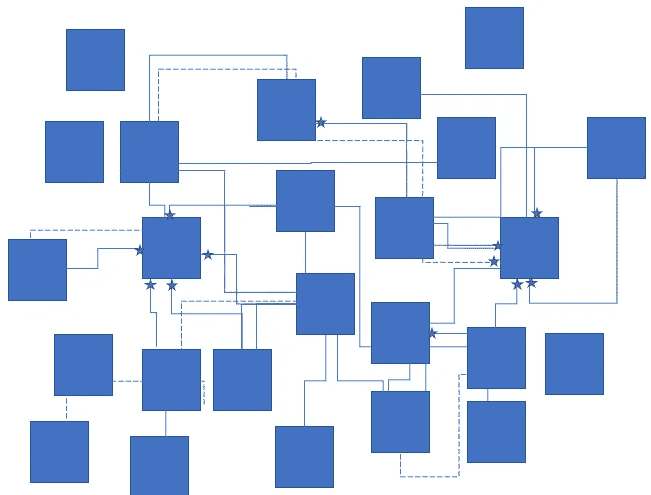
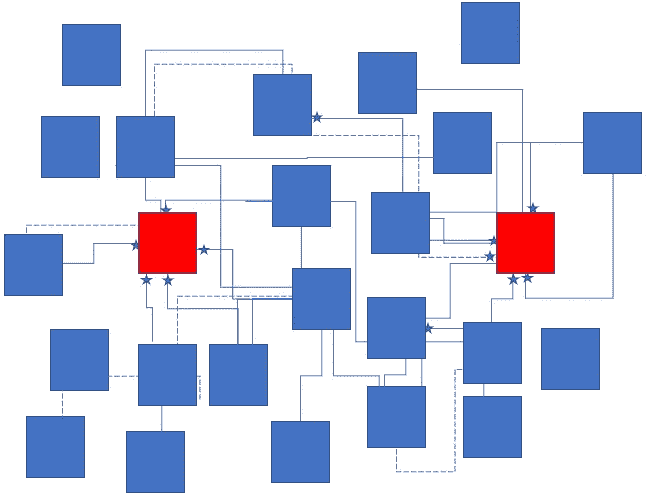
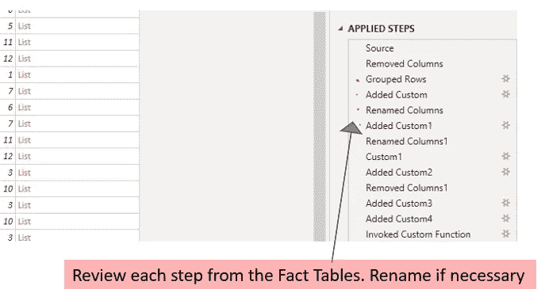

# Power BI 建模——继承混乱的模型

> 原文：<https://towardsdatascience.com/power-bi-modelling-inheriting-a-messy-model-76e235fb851>

## 在这些情况下该怎么做


尼古拉斯·皮卡德在 [Unsplash](https://unsplash.com?utm_source=medium&utm_medium=referral) 上拍摄的照片

你有没有继承过乱七八糟的模式？就像陷入蜘蛛网，被整个吞噬。

我说的吞噬整体是什么意思？

这意味着，如果你没有问正确的问题，你可能会花一整天的时间来制定措施和查询，却一事无成！

我去过那里。

图片胜过千言万语。

看看这种类型的模型。这里的每个“正方形”都是一张桌子。



作者图片

我记得有人开玩笑地称这种数据建模风格为“蜘蛛网模式”。😀

在这种情况下你能做什么？

你可以做几件事。在深入细节之前，先问一些宽泛的问题。

# 怎么办。

1.  确定并理解报告的目的
2.  确定事实表
3.  确定与事实表相关的过滤表
4.  复制度量标准和视觉效果来测试您的理解
5.  查看与事实表相关的超级查询步骤

## 理解报告的目的

首先，在你做任何事情之前，询问一下报告的目的。这是一个很重要的问题。这将为你接下来需要做的事情打下基础。

记下受众是谁，他们阅读此报告的频率以及原因。这背后的解释是什么？您将需要这些信息来帮助您理解数据模型。

如果可能的话，在报告的每一页，询问每一页的主旨。

在浏览模型时，请将这些作为您的心理笔记。

## 确定事实表。

既然您已经了解了报告的内容，那么是时候深入研究模型本身了。

让我们确定事实表。**事实表应该比其他表有更多的连接。**

再看关系，**他们很可能处于一对多关系的多端。**

确定了事实表后，您可以进行列检查，以了解报告的内容。您可以通过浏览实际的报告和事实表来做到这一点。

试着记住报告的目的。在任何时候，如果你发现事实表与实际的报告不相关，如果可能的话，是时候回到以前的开发者那里，问问他们为什么在那里。

您会发现，很多时候这里有事实表用于特定的报告目的。它只在那里被报告一两次，但它留在那里只是为了以防有额外的请求。

记下这些事实表。

这是为了让您了解什么被认为是“重要”的表，并且大多数度量也是围绕这个表构建的。



作者图片

用红色突出显示的很可能是事实表。即使他们不是，这也是一个很好的问题，问为什么有这么多反对它的加入。毕竟，如果它是一个不包含重要信息的表，为什么会有这么多的连接呢？

现在你可能会想，我只是假设在你继承的模型中实际上有事实表。如果它非常复杂，以至于没有事实表或者没有人知道它们是什么，该怎么办？

在这种情况下，请记住报表的目的，并在报表中查找引用这些表的度量。那些可能是你的事实表。

在下面的测量中，它会给你很多线索。例如，如果是总计的总和，总计表在哪里？它非常重要，足以在报表度量中使用，因此值得一看。第二部分是 KEEPFILTERS。这可能是一个过滤表。

```
Measure = CALCULATE(SUM(Totals), KEEPFILTERS(Store == A))
```

请记住，报告的目的是提供关于事实表位置的关键提示。

## 识别过滤表

仔细看看事实表。应该有其他的表加入进来反对它。这些可能是过滤表。您可以通过转到主报告并检查过滤器来验证这一点。

是否有针对最终用户的**过滤器？他们用什么桌子？很可能这些都是过滤表。**

记下这些过滤表，它们在与利益相关者的会议中对你有所帮助。你可以参考这些表格，它们很可能是你可以用来“切割数据”的表格。

这会给你一些谈判的权力。假设有人要求以某种方式切割数据，您可以问自己过滤表是否存在，或者您可能需要更多的工作来获得这样的表。


作者图片

黄色的表可能是过滤表。

## 仔细检查报告

既然您已经理解了报告的目的，并且已经确定了一些事实表(其中一些可能已经过时了)和过滤表，那么是时候通过问自己一些问题来再次检查您对报告的理解了。

这是有趣的部分！

看看你能否复制一些报告的视觉效果，最好是最重要的，以及你是否理解它们是如何创建的。您可能会遇到某些可视级别的过滤器以及“内置”了过滤器的度量

这些是问前一个开发者的好问题。

“为什么这个视觉效果只有 2021 年 4 月 1 日之后才有视觉级别过滤器，而其他视觉效果没有？”

"为什么有一个测量 XYZ 的过滤器？"

"为什么在 Power Query 中而不是 DAX 中这样做？"

这些都是要问的问题。记得回顾报告的目的。

比较表格时使用 TREATAS、INTERSECT 和 EXCEPT。这些函数将帮助您比较表，而不必建立实际的关系。这样做将使模型在导航时保持不变。如果你想了解更多关于这些功能的信息，请点击这里查看这篇文章。

## 查看与事实表相关的超级查询步骤

现在，您已经知道了事实表和过滤表在哪里，以及如何再现一些度量和可视化，是时候看看 Power Query 了。



作者图片

回顾 Power Query 中的转换过程，特别注意构建事实表的过程。您可能想知道为什么创建事实表过程中的每一步都是必要的。这需要一些时间。

**检查**时，总是复制查询。您也不想意外删除步骤。尽量用你理解的方式重命名这些步骤。它将帮助您跟踪您已经检查过的步骤，以及哪些步骤还需要检查。

如果其他的一切都失败了，你真的对报告一无所知，并且收到了前一个开发人员令人困惑的回复？

这份报告一提出来你就取消会议了吗？

你被告知去解决它？😤

只需向每个人展示蜘蛛网模式，并告诉每个人你将需要重建一切。很可能从一开始就错了！