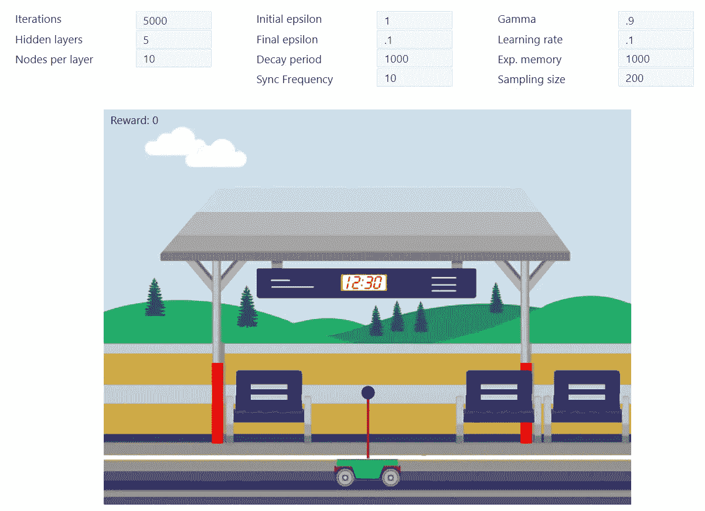

# DQN 实用指南

> 原文：<https://towardsdatascience.com/practical-guide-for-dqn-3b70b1d759bf>

## DQN 在强化学习中的实现


照片由 [JJ 英](https://unsplash.com/@jjying?utm_source=medium&utm_medium=referral)在 [Unsplash](https://unsplash.com?utm_source=medium&utm_medium=referral)

> “实践你所知道的，这将有助于弄清楚你现在所不知道的”
> **伦勃朗**

# 概观

Mnih 等人[2015]提出的深度 Q-网络是许多深度强化学习算法的跳转起点和构建点。然而，尽管它表面上很简单，然而，当实现它和寻找问题的解决方案时，它代表了一些挑战。

本文将使用 [Tensorflow.js](https://www.tensorflow.org/js) 作为实现技术，原因很明显:
——你需要安装的东西越多，你就越不可能努力编写真正的算法。
- Javascript 是一种很好的流行语言，对于熟悉 C++、C#、Java 等的人来说非常直观……
-在网上分享演示既简单又直接。

# 该算法

如前所述，该算法本身非常简单，可以通过下图进行总结


DQN 工作流程(图片由作者提供)

以下步骤描述了该算法的实际工作原理:

1-创建 Q-网络和目标-网络
2-使用 Q-网络
用数据填充经验缓冲区 3-重复以下步骤足够的次数
4-从经验缓冲区获得随机样本
5-将样本作为输入馈送到 Q-网络和目标网络
6-使用目标网络的输出来训练 Q-网络(即，目标网络的输出将在 标准的监督学习场景)
7-应用探索/开发策略(例如:ε贪婪)
8-如果选择了探索，则生成随机动作，否则，如果选择了开发，则向 Q 网络馈送当前状态，并从输出中推断动作。
9-将动作应用于环境，获得奖励，以及新状态
10-将旧状态、动作、奖励和新状态存储在经验缓冲区(也称为重放记忆)
11-每隔几集，将权重从 Q-网络复制到目标-网络

# 为什么是两个网络？

很明显，我们想知道，为什么我们需要两个网络？
实际上，Q 学习公式如下:


q-学习:非策略 TD 控制(摘自萨顿和巴尔托的书:强化学习，介绍)

我们注意到，为了使 Q(S，A)达到它的最终值，它必须变得几乎等于 R' + γ max Q(S '，A)。因此，为了使 Q(S，A)向 R' + γ max Q(S '，A)移动，我们将问题转化为某种监督学习，其中我们估计 Q(S，A)和 R' + γ max Q(S '，A)成为“标签”。
用于估计 Q(S，A)的网络权重将通过损失函数和反向传播的组合来更新。

但是我们不知道最大 Q(S '，a)，我们简单地使用相同的神经网络来估计它，然而，该网络的权重不断地变化，这在每次迭代中给出不同的最大 Q(S '，a)值。这使得对 Q(S，A)的估计可以追踪一个移动目标。

为了解决这个问题，我们创建了一个相同的神经网络，我们称之为目标网络，而计算 Q(S，A)所需的第一个网络将被称为在线网络。目标网络的目的是在一段时间内具有固定的权重，以便稳定 max Q(S’，a)的计算。然后，在一些迭代之后，目标网络通过在线网络的权重的简单拷贝来更新其权重，在线网络有机会学习这些权重。

## 当心一些实现陷阱

*   标准化输入。这可能是显而易见的，但是初学者可能很容易忘记这个重要的特性。这将对输出产生重大影响，因为一些输入可能具有较大的值范围，而其他输入则具有较小的值范围。这并不意味着后者不如前者重要。然而，从计算的角度来看，大值会压倒小值。因此，如果您看到一些明显的输入有奇怪的值，这是一个很好的条件反射，检查输入是否已经被规范化。
*   同步两个神经网络。DQN 使用两个神经网络，一个是“在线”的，这意味着在每次迭代中计算 Q 值，另一个是“目标”网络，它计算 Q 值，但基于一组稳定的权重。
    “目标”网络表示表达式 R + γ max Q(St+1)。“在线”和“目标”网络的输出用于计算均方误差(MSE ),然后通过反向传播更新“在线”网络的权重。
    每一定次数的迭代，“在线”网络的权重应该被复制到“目标”网络，以便“目标”获得由“在线”网络学习的经验。
    这里的重要值是设置复制权重的迭代次数的正确值。太小的值，使系统不稳定，太大的值使系统无法学习。所以当事情没有朝着正确的方向发展时，检查这个参数是很重要的。
*   填补经验缓冲。在过程开始时，重要的是通过让代理与环境交互来填充经验缓冲区，并在经验缓冲区中存储当前状态、动作、奖励、下一状态、终端状态，以便当学习过程从该经验中生成随机样本时。
*   抽样规模。将采样大小设置为经验缓冲区大小的一半左右是一个很好的做法，因为小的采样大小会使从经验中学习的效率低下，而大的采样大小(最大值附近)会在学习中引入您不想要的偏差。例如，如果你有一辆自动驾驶汽车，并且由于大多数时间道路是直的，过度地从直路经验中采样将使 AI 倾向于最小化转弯的影响。

# 扁担例子

DQN 的一个经典实现是 CartPole 游戏，在这个游戏中，人工智能代理应该以某种方式移动手推车，以保持杆子接近垂直。
电杆与垂直方向的夹角不得超过 30 °,手推车不得触及边缘。每当人工智能代理收集到 300 个奖励时，就取得了胜利。

你可以在 https://rl-lab.com/cartpole/查看游戏的真实实现



图片显示了弹球游戏的配置(图片由作者提供)

以下是算法主要部分的代码片段。它包含主循环、播放步骤和基于批量样本的训练。

train()方法包含训练的主循环。它首先初始化代理，并用经验填充重放内存缓冲区，然后开始循环:训练，然后单步执行。

```
train(agent, maxIterations, batchSize, gamma, learningRate, syncEveryFrames) { // init the agent
  agent.reset(); // at first fill the replay memory with experience by playing
  // without any training
  for (let i = 0; i < agent.replayBufferSize; ++i) {
    agent.playStep();
  } // create optimizer for the training  
  const optimizer = tf.train.adam(learningRate); // loop until all iterations are done
  let counter = maxIterations; while (counter > 0) { // train the agent by extracting samples from replay memory and 
    // use them as input for the DQN   
    agent.trainOnReplayBatch(batchSize, gamma, optimizer); // after each training, play one step of the game    
    agent.playStep(); if (agent.frameCount % syncEveryFrames === 0) {
       copyWeights(agent.targetNN, agent.onlineNN);
    } counter--;
  }
}
```

playStep()方法使代理只玩一步游戏。它使用ε贪婪策略，使它在部分时间选择随机动作，在其余时间选择返回最大 Q 值的动作。

```
// play one step of the game and store result in replay memory
playStep() {...
  let action;
  let actionIndex = 0; const state = this.game.getState(); if (Math.random() < this.epsilon) {
    // Pick an action at random.
    actionIndex = this.getRandomAction();
    action = ALL_ACTIONS[actionIndex];
  } else {
  // Greedily pick an action based on online DQN output.
  // use tf.tidy() to clean up after finishing
     tf.tidy(() => {
       const stateTensor =  getStateTensor(state);
       actionIndex = this.onlineNN.predict(stateTensor)
                              .argMax(-1).dataSync()[0]; action = ALL_ACTIONS[actionIndex];
     });
  } // play one step of the game and get the results
  const result = this.game.step(action); // store experience in replay Memory
  this.replayMemory.append([state, actionIndex, result.reward,
                                 result.state, result.status]); // if terminal state, reset the game
  if (r.status != 0) {this.reset();}}
```

trainOnReplayBatch()从 replayMemory 中提取一个样本，并将其作为 DQN 的输入，然后使用均方误差作为损失函数来更新权重。

```
// This method is used to train the online network by using batch
// samples from the memory replaytrainOnReplayBatch(batchSize, gamma, optimizer){// Get a batch of examples from the replay buffer.
const batch = this.replayMemory.sample(batchSize);//define the loss function
const lossFunction = () => tf.tidy(() => { // example[0] is the state
  // example[1] is the action
  // example[2] is the reward
  // example[3] is the next state
  // example[4] indicates if this is a terminal state const stateTensor = getStateTensor(batch.map(
                                     example =>   example[0]));
  const actionTensor = tf.tensor1d(batch.map(
                                   example => example[1]), 'int32');

  // compute Q value of the current state
  // note that we use apply() instead of predict
  // because apply() allow access to the gradient
  const online = this.onlineNN.apply(stateTensor, {training: true});
  const oneHot = tf.oneHot(actionTensor, NUM_ACTIONS);
  const qs = online.mul(oneHot).sum(-1);  // compute the Q value of the next state. 
  // it is R if the next state is terminal
  // R + max Q(next_state) if the next state is not terminal const rewardTensor = tf.tensor1d(batch.map(
                                         example => example[2]));
  const nextStateTensor = getStateTensor(batch.map(
                                         example => example[3]));
  const nextMaxQTensor =  this.targetNN.predict(
                                         nextStateTensor).max(-1);
  const status = tf.tensor1d(batch.map(
                          example => example[4])).asType('float32'); // if terminal state then status = 1 => doneMask = 0
  // if not terminal then status = 0 => doneMask = 1
  // this will make nextMaxQTensor.mul(doneMask) either 0 or not
  const doneMask = tf.scalar(1).sub(status);
  const targetQs = rewardTensor.add(
                           nextMaxQTensor.mul(doneMask).mul(gamma));  // define the mean square error between Q value of current state
  // and target Q value
  const mse = tf.losses.meanSquaredError(targetQs, qs);
  return mse;
});// Calculate the gradients of the loss function with respect 
// to the weights of the online DQN.const grads = tf.variableGrads(lossFunction);// Use the gradients to update the online DQN's weights.optimizer.applyGradients(grads.grads);tf.dispose(grads);
}
```

最后，这里是一个视频，其中 DQN 代理人通过达到 300 英镑的奖励来玩并赢得了掷骰子游戏。

展示 DQN 算法玩钢管舞的视频(视频由作者提供)

# 结论

DQN 是最流行的深度强化学习算法之一。它第一次在 Atari 游戏上实现了超人水平的性能。
随着时间的推移，它经历了多次改进，这使得它仍然是 DRL 表现最好的代理商之一。