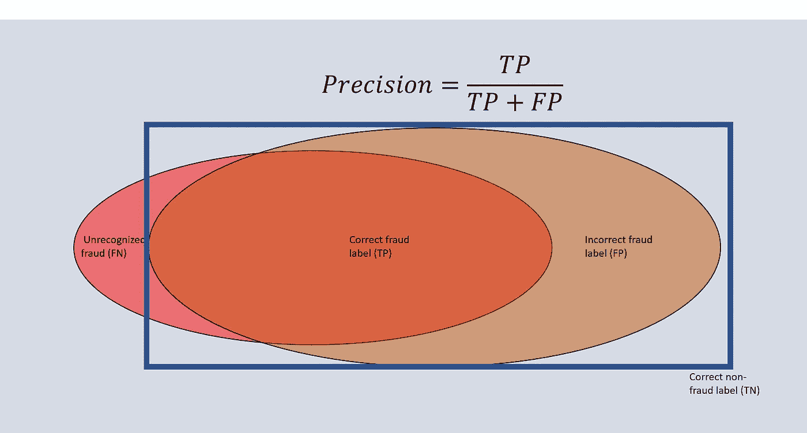
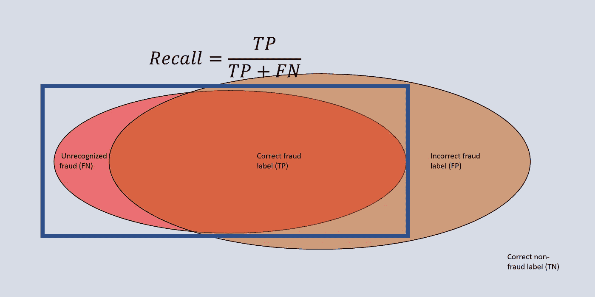
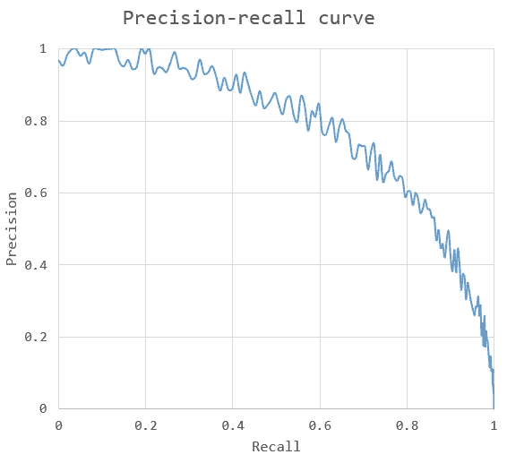

# 精确度和召回率——包含实例的综合指南

> 原文：<https://towardsdatascience.com/precision-and-recall-a-comprehensive-guide-with-practical-examples-71d614e3fc43>

## 所有你需要知道的关于准确性，精确性，回忆，F 分数，班级不平衡和混乱矩阵

在 [Unsplash](https://unsplash.com?utm_source=medium&utm_medium=referral) 上由 [Fer Troulik](https://unsplash.com/@fertroulik?utm_source=medium&utm_medium=referral) 拍摄的照片

假设我的工作是为一家银行开发一个信用卡欺诈检测模型。现实中，假设只有 0.1%的交易是欺诈性的。我聪明地假设*没有*交易是欺诈性的，并以 99.9%的模型准确率(即正确分类的百分比)而自豪。我拍拍自己的背，打开一瓶冰啤酒。

然而，我的雇主不高兴了。尽管它是一个高度准确的模型，但它并不做任何事情来检测欺诈，因此也不能解决潜在的业务问题。似乎我们需要另一个性能指标。

那么为什么准确性在这里不起作用呢？机器学习问题的一个共同特点是，我们必须处理**类不平衡**。一个类别(正)中的数据点数量压倒性地超过另一个类别(负)中的数量是非常典型的。然而，我们试图检测的往往是异常情况:疾病、欺诈案件、安全隐患等。

由于这里精确度不够，让我们看看我们*做*需要什么。

## **语境**

首先，关于使用什么样的绩效指标的问题应该*总是*由你想要解决的问题、你试图获得的洞察力来驱动。虽然这听起来很明显，但是仍然有太多的人专注于某些指标，而没有解决*为什么*的问题。

## 真与假，正与负

是时候了解一些术语了。通常，我们会将我们感兴趣的数据(欺诈案件、某个死者、猫的照片)标识为**阳性**，而将其余数据标识为**阴性**。我们可以很容易地将它扩展到多个类(例如，猫、狗、大象、老鼠)，但是这里让我们坚持使用二进制方法。

我们的模型可能正确地(**真**)或不正确地(**假**)预测实际类别，无论它是正的还是负的。因此，我们有四种类型，它们通常被总结在一个**混乱矩阵**中:

混淆矩阵将模型预测的类别与现实中的实际类别进行对比。[图片由作者提供]

绝对数字和百分比传达了很多信息，但并不能说明全部情况。在实践中，并不是所有象限的权重都相同——这取决于前面提到的上下文。例如，在医疗环境中*假阴性*(未诊断的疾病)可能会产生灾难性的后果，而*假阳性*可能会在后续检查中得到纠正(尽管需要额外的费用)。准确性并没有捕捉到这些洞见。

长话短说:我们需要一些新的指标。

## 准确(性)

准确性仅仅考虑所有数据的正确分类比率。在术语范围内，我们可以将其定义如下:

请注意，许多损失函数和误差指标取决于精度。默认情况下，每一个错误的分类通常会受到同等的惩罚。正如欺诈检测示例中已经显示的，准确性可能会对模型的性能提供非常差的洞察，尤其是在处理类别不平衡时。

## 精确

精度与*真*阳性和*所有*阳性的比例有关:

它说明了结果的有效性。换句话说，它说明了有多少检索到的元素是相关的。高精度表明，如果算法规定一个元素是正的，它可能确实是正的。

*【为了记忆，我有时发现* ***P*** *精度只涉及* ***P*** *预测* *阳性】*

回到欺诈的例子:precision 将告诉我们被识别的案例中有多少是欺诈性的。假设我们正确识别了 800 ( *真阳性*)，错误识别了另外 700 ( *假阳性*)；我们的精度是 0.53。

欺诈检测设置的精确度示例。它会考虑所有被标记为欺诈的案例[图片由作者提供]

## 回忆

**回忆**描述了*真*阳性和*所有*阳性(即包括假阴性)的比例:

此指标告诉我们结果的完整程度，例如，检索到多少相关元素。高召回率意味着捕获了大部分真正积极的元素。

****R****ecall 可能是考虑到****R****eal 阳性(注意假阴性实际上是阳性)】**

*再次考虑欺诈的例子。假设我们从 1000 个实例中识别出 800 个实例(*真阳性*)(包括 200 个*假阴性*)。我们的召回率是 0.8。*

**

*欺诈检测环境中的召回示例。它处理所有真实的欺诈案件[图片由作者提供]*

*请注意，通过简单地将许多元素标记为阳性，您可以获得高召回率，但这通常是不可取的。假设我们将大量交易标记为欺诈。该集合可能确实包含所有欺诈交易，但也包含许多需要人工处理的误报(=成本)。请注意，我们正在处理精确度和召回率之间的**权衡**。*

## *f 分数*

*我们认为精确度和召回率都提供了有用的见解，但是用一个数字来表达它们之间的平衡会更方便。这就是 F 分数的作用。更准确地说，它是精确度和召回率的**调和平均值**。最简单(也是最常见)的 F 分是**平衡 F 分**，也称为`F_1`。1 表示它同等重视精确度和召回率。它由表示*

**

*请注意，通过乘以精度和召回率(分子)，两个指标之间的差异将被扣分。如果我们的精度是 0.8，召回率是 0.2，那么 F 值只有 0.32。如果两者都是 0.5，F 值也是 0.5。可选的 F 值(例如，`F_0.5`、`F_2`)更重视精确度或召回率。*

## *精确回忆曲线*

*另一种表达权衡的方式是**精确召回曲线**。一般来说，你发现的真阳性越多，随之而来的假结果就越多。把分类器算法想象成一种看门人，使用一定的接受阈值。一个非常关键的人可能在非常确定自己的情况下(高*精度*)只让某个元素通过，冒着拒绝真阳性的风险。更宽松的方法可能会传递更多的元素，捕获更多的总人口(高*召回*),但也会引入更多不正确的分类。*

**

*精确度-召回率曲线示例，显示了各种分类阈值的精确度和召回率之间的权衡。曲线下的面积作为一个性能指标[图片来自作者]*

*曲线下面积( *AUC* )提供了对模型质量的洞察。一个完美的模型有`AUC=1`，精度和召回率都永远是 1.0。一个“好”的模型会弯曲到(1，1)点，覆盖很大的区域。*

## *如何应对阶层失衡？*

*现在我们知道*如何*在阶级不平衡的情况下衡量绩效，但是我们该如何利用这些信息呢？假设我们注意到我们的欺诈检测模型召回率很低，我们如何解决这个问题？*

*通常情况下，召回和/或精度的问题源于阶级的不平衡。如果一个集合中的元素数量绝大多数是负数，并且我们优化了准确性，那么一小部分正数几乎不会影响整体性能。记住，一个简单的损失函数平等地测量所有不正确的分类(*假阴性*和*假阳性*)。*

*全面的评估超出了这里的范围，但是有两个一般的解决方向:(I)我们对一些错误分类的加权比其他的更重，以及(ii)我们对包含较少否定的子集进行训练。*

*首先，让我们检查称重。通过调整**损失函数**，我们可以影响训练。在欺诈检测案例中，我们可能更喜欢将太多案例标记为潜在欺诈，而不是太少案例。换句话说，我们朝着*高回忆*驶去。通过更严厉地惩罚假阴性，我们训练算法将更多病例标记为阳性(冒着增加假阳性的风险)。*

*反之亦然。如果我们设计一个垃圾邮件过滤器，我们最好确定检测到的电子邮件确实是垃圾邮件。当有疑问时，最好让用户决定电子邮件是否相关。在这里，我们更喜欢*高精度*，并会惩罚误报(不是垃圾邮件，但被标记为垃圾邮件)最多。*

*第二种解决方案需要**重新调整样本**。这比我在这里提出的要复杂一点，但机器学习算法分类 1000 个正面和 1000 个负面比 1000 个正面和 100 万个负面更容易。在后一种情况下，该模型可能会针对数量大得多的负数进行定制。或者，您可以从少数类中复制样本来重新平衡集合。*

## *最后的话*

> *“哪些错误分类最具现实影响？”*

*对于任何机器学习问题，问题应该总是与模型的目的相关。光背度量对你帮助不大。相反，应该关注哪些错误分类更有害，以及如何尽可能地防止它们，同时在精确度和召回率之间保持健康的平衡。最终，记住机器学习模型是达到目的的手段，而不是最终目标本身。*

**

*列出所有潜在的分类并强调哪个错误分类最有害通常是有用的[图片由作者提供]*

## *关键要点*

*   ***当数据集不平衡时，准确性**(正确分类的总百分比)通常不是一个有意义的性能指标*
*   ***阶级不平衡**暗示一个阶级比其他阶级更经常出现。惩罚某些错误分类并对数据集进行重新采样有助于解决失衡问题。*
*   ***精度**是一个惩罚误报的指标。因此，具有高精度的模型谨慎地将元素标记为正。*
*   ***召回**是一个惩罚假阴性的指标。当有疑问时，具有高召回率的模型倾向于积极的分类。*
*   ***F-scores** 和**精度-召回曲线**为平衡精度和召回提供指导。*

## *进一步阅读*

*       *