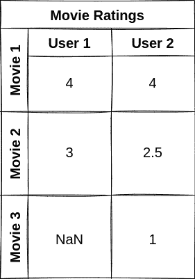
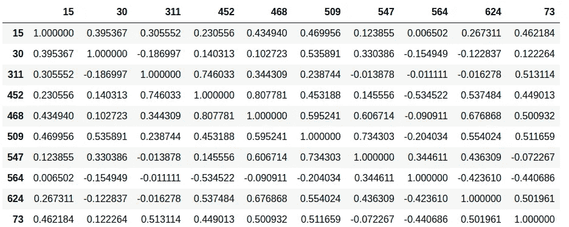
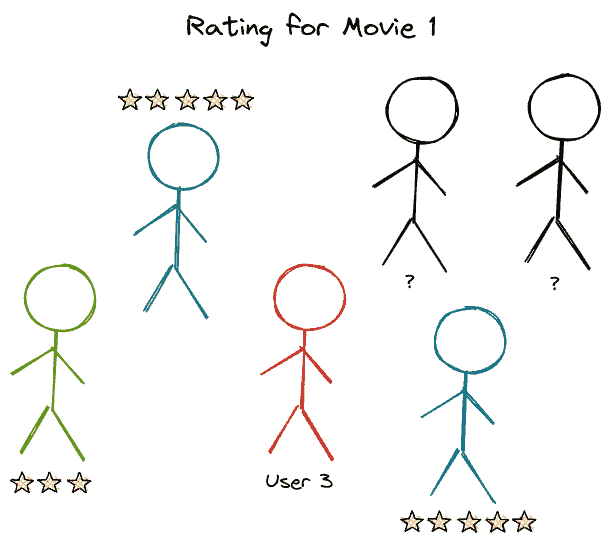
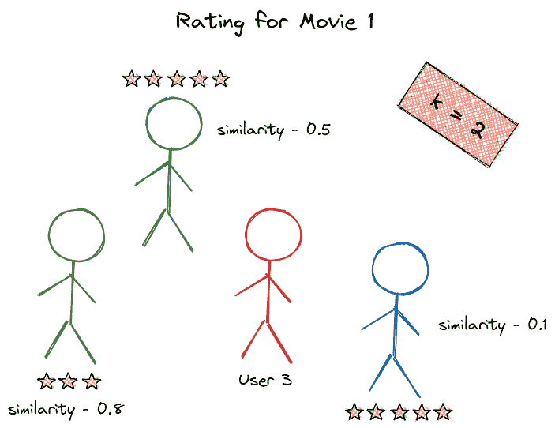
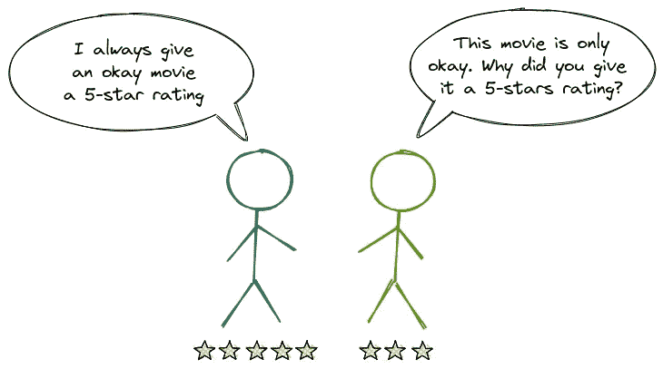
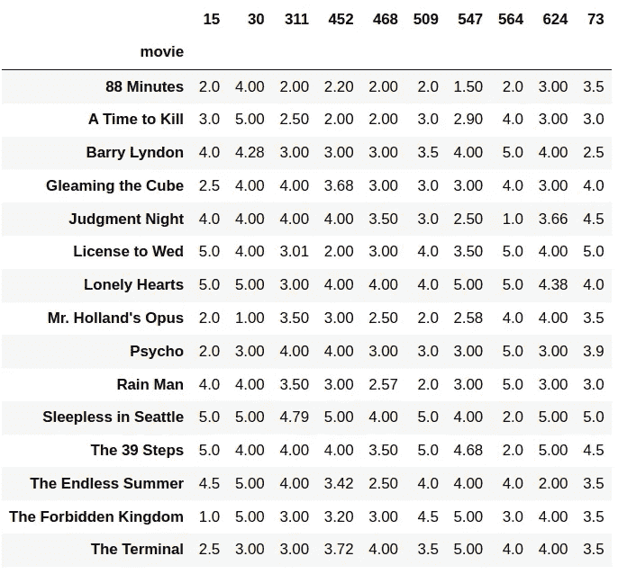

# 通过基于用户的协作过滤预测电影分级

> 原文：<https://towardsdatascience.com/predict-movie-ratings-with-user-based-collaborative-filtering-392304b988af>

## Python 中协作过滤的全面介绍

# 动机

假设您有一个来自不同用户的电影评级数据库。系统里有一些你的用户没看过的电影。你如何利用这些数据向你的用户推荐新的相关电影？


作者图片

一种直接的方法是使用用户 2 对同一电影的评价来猜测用户 1 对该电影的评价。为了增加猜对的机会，用户 2 应该有与用户 1 相似的评分行为。



作者 GIF

在预测了所有的评级之后，我们将向用户 1 推荐被用户 1 预测为高度评级的电影。

上面的方法是基于用户的协作过滤的简化版本，它使用用户之间的相似性来提供推荐。

本文将向您展示如何使用协同过滤来填补真实电影数据库中缺失的评级。

# 获取数据

我们将通过 Creative Common License 使用从 Kaggle 上的[电影数据集](https://www.kaggle.com/datasets/rounakbanik/the-movies-dataset)中收集的数据。本文中用作示例的数据子集可以从[这里](https://drive.google.com/uc?id=1p2TxvZFG_UrxBeBtOo57SsGD9WR9RHsD)下载。

将下载的文件另存为`small_movie_ratings.csv`，然后加载数据:


作者图片

请注意，该数据中有一些缺失值。我们将从寻找每对用户之间的相似性开始。

# 寻找用户之间的相似之处

我们将使用[皮尔逊相关系数](https://en.wikipedia.org/wiki/Pearson_correlation_coefficient)根据用户对电影的评分来找出他们之间的相关性。

如果两个用户给出完全相同的评级，则皮尔逊相关性为 1。

```
1.0
```

如果两个用户的相对电影评级以相同的速率增加，相关性仍然是 1。

```
1.0
```

如果两个用户的评分完全相反，则相关性为-1。

```
-1
```

让我们使用这个方法来创建一个函数，用于查找两个用户之间的相关性:

创建一个矩阵，显示所有用户对之间的相似之处:



作者图片

# 获得相似的用户

假设我们希望根据其他用户的评级来预测用户 3 对电影 1 的评级。我们首先希望只选择对电影 1 进行了评级的用户。



作者 GIF

接下来，我们只挑选与用户 3 最相似的 k 个用户。我们称这些 *k* 数量的用户为用户 3 的*邻居*。

在下面的例子中，我们将邻居的数量设置为 2。



作者 GIF

# 获取相似用户对一部电影的评分

由于不同的用户可能对他们喜欢的电影有不同的评分标准，我们希望通过从用户对所有电影的**平均**评分中减去用户对电影的**评分来调整这种偏差。**



作者图片

这意味着调整偏差后，用户𝑣对电影《𝑖》的评级为:


作者图片

在下面的 GIF 中，由于用户 1 对所有电影的平均评分为 1，我们将用户 1 对电影 1 的评分减去 1。因为用户 2 对所有电影的平均评分是 4，所以我们用 4 减去用户 2 对电影 1 的评分。

因此，在调整偏差后，用户 1 和 2 对电影 1 的新评级将分别是 2 星和 1 星。


作者 GIF

# 基于相似用户的评级来获取用户对电影的评级

## **在调整偏差之前获得评级**

在对偏差进行调整之前，用户𝑢对电影𝑖的评级是通过取所有邻居𝑣.对电影𝑖的评级的加权平均值来计算的


作者图片

例如，用户 1 和用户 3 之间的相似度是 0.8。用户 1 对电影 1 的评价是 2。我们将用户 1 的调整评级乘以他们的相似性 0.8。

我们可以对用户 2 进行类似的计算。下表总结了这些计算。


作者图片

然后，我们将这些加权评分的总和除以 0.8 和 0.5。

该计算的结果是在调整偏差之前用户 3 对电影 1 的评级。


作者 GIF

## 调整偏差后获得评级

还记得我们用平均评分减去每个邻居对电影的评分来消除他们的偏见吗？

为了获得用户𝑢对电影《𝑖》的预期评级，在调整偏差之前，我们将把用户𝑢的平均评级加到用户𝑢对电影《𝑖》的预期评级上。


作者图片

在下面的 GIF 中，在调整偏差之前，用户 3 对电影 1 的预期评级为 1.61，用户 3 对所有电影的平均评级为 2。取 1.61 和 2 之和，得出 3.61。


作者 GIF

# 获取所有用户的缺失评分

现在我们准备将上面显示的所有函数放入函数`predict_rating`中。该功能根据用户邻居的评分来预测用户对某部电影的评分。

使用`predict_rating`功能预测所有缺失评分的评分:

```
Top 2 neighbors of user 30, Barry Lyndon: ['547', '509']
Top 2 neighbors of user 311, License to Wed: ['547', '509']
Top 2 neighbors of user 311, Sleepless in Seattle: ['547', '509']
Top 2 neighbors of user 452, 88 Minutes: ['547', '509']
Top 2 neighbors of user 452, Gleaming the Cube: ['547', '509']
Top 2 neighbors of user 452, The Endless Summer: ['547', '509']
Top 2 neighbors of user 452, The Forbidden Kingdom: ['547', '509']
Top 2 neighbors of user 452, The Terminal: ['547', '509']
Top 2 neighbors of user 468, Rain Man: ['547', '509']
Top 2 neighbors of user 547, A Time to Kill: ['509', '468']
Top 2 neighbors of user 547, Mr. Holland's Opus: ['509', '468']
Top 2 neighbors of user 547, The 39 Steps: ['509', '468']
Top 2 neighbors of user 624, Judgment Night: ['547', '509']
Top 2 neighbors of user 624, Lonely Hearts: ['547', '509']
Top 2 neighbors of user 73, Psycho: ['547', '509']
```

在填写完所有缺失的评分后，我们来看看评分数据库:



作者图片

相当酷！现在，我们可以向以前没有看过这些电影的用户推荐预测评级很高的电影。

# 结论

恭喜你！您刚刚学习了如何根据基于用户的协作过滤来预测电影评级。我希望这篇文章能激励你创建你的推荐系统。

随意发挥，并在这里叉这篇文章的源代码:

[](https://github.com/khuyentran1401/Data-science/blob/master/machine-learning/collaborative_filtering/collaborative_filtering.ipynb)  

我喜欢写一些基本的数据科学概念，并尝试不同的数据科学工具。你可以在 LinkedIn 和 T2 Twitter 上与我联系。

星[这个回购](https://github.com/khuyentran1401/Data-science)如果你想检查我写的所有文章的代码。在 Medium 上关注我，了解我的最新数据科学文章，例如:

[](/observe-the-friend-paradox-in-facebook-data-using-python-314c23fd49e4)  [](/shap-explain-any-machine-learning-model-in-python-24207127cad7)  [](/how-to-schedule-flights-in-python-3357b200db9e)  [](/how-to-solve-a-staff-scheduling-problem-with-python-63ae50435ba4)  

# **参考**

电影数据集。2018–09.鲁纳克巴尼克。
CC0:公共领域。从[https://www . ka ggle . com/datasets/rounakbanik/the-movies-dataset](https://www.kaggle.com/datasets/rounakbanik/the-movies-dataset)检索到 2022–03–18

Katsov，I. (2018)。*算法营销简介*。伊利亚·卡佐夫。