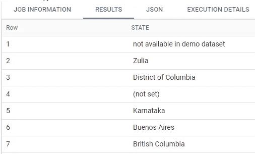
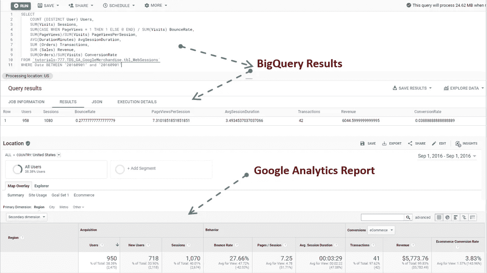
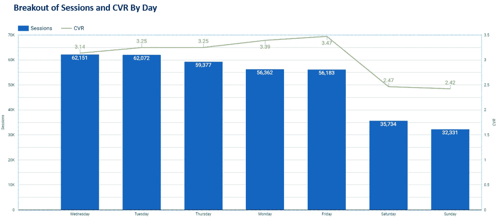
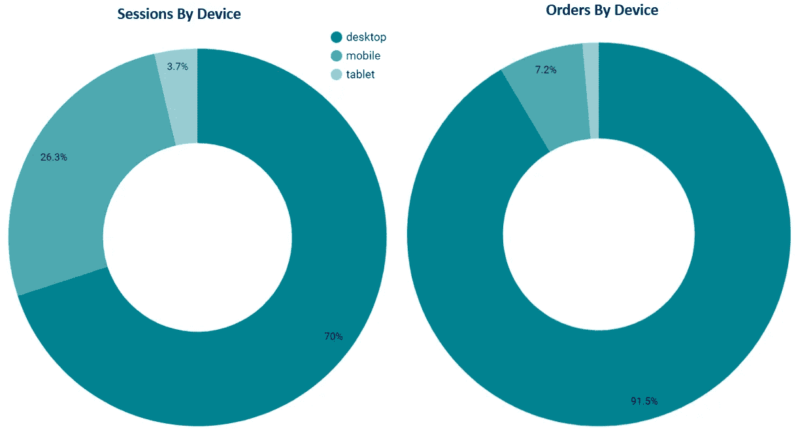
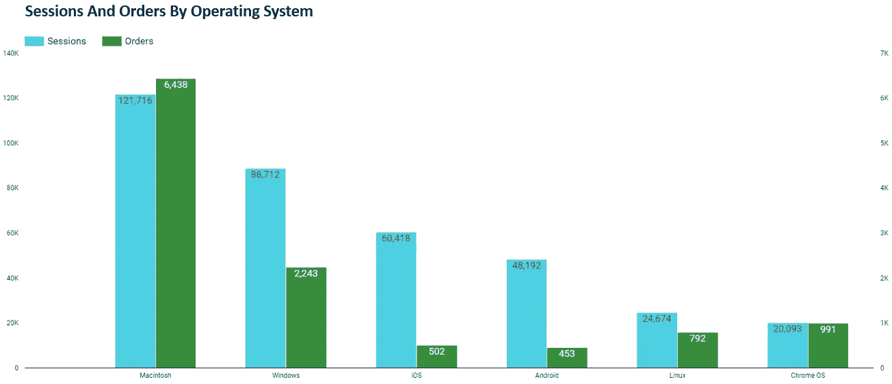

# 在 BigQuery 中从 Google 商品商店的 Google 分析数据集预测转换事件

> 原文：<https://towardsdatascience.com/predicting-conversion-events-from-google-analytics-dataset-for-google-merchandise-store-in-bigquery-a9cfb3b6087e>

## 步骤 1 —探索性数据分析

**按州划分的每次会话收入——通过 BigQuery 和 DataStudio 进行分析。*图片作者***

为了实践他们的技能，有抱负的数据分析师可以毫不费力地找到各种公共[数据集](https://www.linkedin.com/pulse/list-top-open-public-dataset-providers-alex-b)，包括托管在 [BigQuery](https://cloud.google.com/bigquery/public-data) 上的数据集；然而，对于好奇的人来说，第一方真实世界的商业数据并不容易获得。见见 BigQuery 的 [*Google Analytics 样本数据集，这是一个公共数据集，它提供了来自*](https://console.cloud.google.com/marketplace/product/obfuscated-ga360-data/obfuscated-ga360-data) *[Google 商品商店](https://shop.googlemerchandisestore.com/)的 Google Analytics 360 点击流数据的模糊视图，该商店拥有知识共享属性 4.0 许可证。从 2016 年 8 月 1 日到 2017 年 8 月 1 日，12 个月的访客浏览和购买活动通过 366 个单独的表格以相应的每日增量提供。在由两部分组成的系列教程中，我们将利用这些数据来预测哪些网站访问者可能会进行购买。在这篇文章中，我们将探索我们的数据，并使用 BigQuery 和 DataStudio 执行基本的 EDA。*

***技术说明:*** 早在 2016 年，Google Analytics 只有 *Universal Analytics* 可供其支配，它计划在 2023 年 7 月日落，并被一个更新的版本取代——*Analytics 4。*

1.  **数据探索**

由于该数据库包含来自真实电子商务网站的记录，我们可以访问网站属性的综合列表，包括收购、行为和最重要的转化等维度和指标。收购报告为我们提供了关于流量来源的信息，从营销渠道开始，并进一步深入到来源、媒介和活动流量驱动因素，这有助于确定最佳付费和有机渠道。行为特征为我们提供了一个关于访客量、页面浏览量、网站流量、花费时间、登录/退出页面导航、网站速度和许多其他重要指标的视角，这些指标可以帮助我们确定 UX 增强的领域。最后，但并非最不重要的是，转换部分包括网站目标和交易，最终可以帮助我们优化转化率。

根据[数据字典](https://support.google.com/analytics/answer/3437719)有 292(！)该表中的字段在*达到*粒度级别。每当访问者导航到某个页面和/或完成导致所查看的 URL 发生变化的事件时，点击流软件(如 Google Analytics)会记录并跟踪此类操作(即点击)。)此类数据的主要局限性在于，默认情况下，它不区分 web 导航的方式——点击超链接、按下按钮、在地址栏中键入 URL 或检索书签。更复杂的解决方案能够识别专门与激活它们的点击类型相关联的特定 URL(例如，用于按下按钮的定制标签)。)查看在*点击*级别的属性可以帮助我们将一个完整的访客故事缝合在一起，从访问的页面、查看的图像、点击的按钮、填写的表格、搜索并添加到购物车的产品、完成的结账过程的步骤数等等。除此之外，没有比 BigQuery 更适合这项工作的工具了。尽管如此，在这篇文章中，我们还是要抵制诱惑，在汇总的层面上进行分析，谷歌称之为 *total* 视图。

**所分析数据集的字段、数据类型和描述的部分列表。作者图片**

**2。数据准备**

为了保持一致性，让我们将我们的记录限制为仅来自美国的访问者。此外，根据 GA 的最佳实践，让我们也删除内部流量**[source<>' mail . Google plex . com '。]** 接下来，由于 BigQuery 对每个查询列收费，所以限制查询中的字段数量也是明智的。让我们捕获访问的日期和时间、会话 Id(访问者和访问 Id 的连接)、访问次数、来源、媒体、设备、浏览器、营销渠道、州、下订单的数量、浏览的页面数量、站点访问的数量、花费在站点上的时间以及产生的销售额。这些维度和指标为我们提供了各种流量驱动因素、时间表和参与绩效的全面快照。假设我们已经在我们的 **tutorials-777** 项目下创建了**TDS _ GA _ Google merchandise**数据集，并且希望格式化数值，那么生成我们数据的所有 *364，744* 记录的 SQL 代码可能如下所示。注意，根据 Google 的文档，我们需要将销售额除以 1，000，000。虽然时间戳似乎是按照 UTC(T21)时区设置的，但我无法核实谷歌是否遵循了自己的最佳实践，并将其转换为当地时区——PST(太平洋标准时间)。

**为我们的分析生成数据。**

**3。数据清理**

浏览记录，我们可以注意到一些根本不在美国的美国“区域”(读状态)。创建状态表**【TBL _ us States】**后，我们可以交叉引用这些数据来执行急需的数据清理:

美国各州的数据清理。

除了位于我们之外的许多明显错误的区域，我们还必须担心该数据集的混淆性质，以及 GA 对其捕获用户信息的能力的限制——演示数据集中没有**，以及**(未设置)**。此外，似乎我也忽略了在我的表格中考虑到 DC:**

**要在我们的数据集中排除和包含的区域列表。作者图片**

我们可以通过运行下面的代码来执行这个基本的数据清理练习，删除 534 条记录，现在记录计数为 *364，210* :

**删除非美国地区。**

**4。数据扩充**

使用数据的美妙之处在于我们能够通过导出或计算的值生成更多的数据。为了进一步分析，我们可以从时间戳中解析出时间和日期值，确定一天中的小时、一周中的天、月、季度、年等等；全部通过使用一个数据点。同样，我们可以根据网站停留时间、浏览页面和访问次数将我们的指标汇总到不同的容器中。知道了电子商务销售是由*流量*乘以*转换率*再乘以*平均订单价值*驱动的，我们就能更好地描绘出是什么在驱动我们的顶线。举例来说，如果我们比较我们营销活动的表现，我们可能会观察到展示渠道驱动的访客是付费搜索的两倍，然而，如果搜索的转换率是展示渠道的四倍，这种质量流量的差异会使搜索的收入比展示渠道高两倍。

让我们从创建缺失字段并运行下面的 DDL 代码开始:

**添加缺失数据字段**

下面是我们的查询，通过进行各种转换和计算来填充上面的字段，主要是针对日期/时间维度，但也针对持续时间、页面浏览量和访问量进行转换和计算。

**填充缺失的数据字段。图片作者。**

虽然谷歌警告我们，这个 BigQuery 数据集可能会显示与通过他们的[演示帐户](https://support.google.com/analytics/answer/6367342)直接使用谷歌分析界面不同的结果，但我确实想通过比较我们的结果来看看我们会接近多少。单从检索*2016 年 9 月 1 日*的数据来看，我们做得相当好，根本不用担心我们数据的准确性:

**BigQuery vs. GA 结果。作者图片**

**5。数据分析**

现在，我们已经生成了分析所需的所有数据，我们正准备进行有趣的部分——实际分析。为了节省时间(处理)和金钱(BigQuery 成本),我将创建一个聚集所有感兴趣的数据点的帮助表。完全由您来定义指标，也许还有感兴趣的 KPI，我的一般经验是主要关注效率指标，这些指标有助于我们以相对方式评估绩效，然后通过调整基于数量的指标来更好地评估我们调查结果的业务价值，从而结束循环。毕竟，如果我们显示来自某个特定地区的访问者在网站上的转换率低于平均水平，而流量却比来自可比地区的低几十倍；或许在这一点上解决流量是比转化更重要的任务。同样，在相反的情况下，一个非常受欢迎的交通司机的低转化率肯定尖叫一个商机。

例如，我们可以统计访问者的数量，计算新访问者的百分比，确定*参与度*指标——每个会话的页面数、每个访问者的会话数、web 会话数(访问量)、页面浏览量，估计跳出率(访问者仅浏览一个页面后离开的访问百分比，或者换句话说，在没有真正浏览或购买的情况下从网站弹回的百分比)，跟踪平均会话持续时间。我们可以通过总结*转换*事件——订单、转换率、AOV、每次会话的销售额和每个访问者的销售额来完成我们的分析。我试图将适当的数据类型应用到我们的计算中，特别是在调试完浏览量 AOV 计算中的一个被零除的错误后，让我执行一个安全的除法:

**生成汇总表进行数据分析。图片作者。**

…就这样，我们从使用一个 *100 MB* 的桌子，变成了一个“重量”只有 32 *KB* 的桌子；从*的 364210 个*记录到仅仅*的 255 个*记录。现在，我们已经为 EDA 做好了准备——在这个练习中，您可以随意与相应的 [*工作表*](https://bit.ly/3jLnfgD) 进行互动。

在我们继续之前，让我们确保每个人都明白一些指标(比如*访问者*)取决于我们数据的粒度级别。如果同一个人在一周的不同日子访问我们，我们将每周分别计算他们，这同样适用于所有其他维度和使用的箱。在我们的数据集中，这意味着虽然总的来说我们有 *251，527* 个独立访问者，但是当在设备平台上汇总这些访问者时，这个数字上升到 *304，992* ，最终达到 *334，820* 个访问者，因为一天中有几个小时重复两次/三次计数。

**星期几维度*的数据汇总。作者图片***

**6。可视化探索性数据分析**

上面的快照显示了我们对一周中的*天*摘要的查询和结果。请注意，BigQuery 允许我们在 DataStudio 中执行快速数据分析——参见 **ExploreData** 按钮。DataStudio 让我们能够即时可视化我们的 EDA 流程——总结上述数据，我们可以看到，虽然大多数网站访问发生在周三，但最高的转化率发生在周五，而周末的转化率则大幅下降(也许人们在工作时更容易冲动购买，或者他们可能会为同事订购商品？)

**一周中各天的时段和转换率。作者图片**

请记住，这些数据是近 6 年前的，我们还可以注意到，虽然移动设备占总流量的四分之一以上，但只有 7%的订单是在移动设备上下单的。这是对我们一般假设的一个很好的描述，表明光是销量并不是销售结果的最佳预测，毕竟所有的桌面设备都享受了近 5(！)的转化率比移动端高出一倍[分别为 4.1%对 0.85。]

**按设备划分的会话和订单。图片作者。**

就会话和订单而言，Mac 似乎是最受欢迎的操作系统，其次是 Windows。MAC 在所有设备中也显示出最高的转换率[5.3%]，Windows 设备的 CVR 低两倍，加上同组中最高的 AOV[209.20 美元]，高出一倍半，在 Windows 上产生 1.32 美元的每次会话销售结果(汇总的所有设备中的最低数字)，而 MAC 为 1.63 美元。

**按操作系统划分的会话和订单。图片作者。**

我们是否应该考虑开展地理定位活动？有趣的是，密歇根州在美国各州中拥有最高的每次会话销售额[$12.71]，可惜它只占所有流量的 0.7%。说到 AOV，威斯康星州以 400.89 美元领先，但是这个结论可能为时过早，因为只有一个来自威斯康星州的订单。弗吉尼亚人在 AOV 是一个更现实的领导者，他们下了 309 美元和 73 份订单(占总数的 0.6%)。指出数据捕获限制也很重要，这会导致一半的会话在数据集中没有可用的状态信息。

**各州每时段销售额。图片作者。**

常识表明，用户参与度(每次会话的页面数、网站停留时间、每位访问者的访问次数等)是销售的最佳预测指标。让我们总结一下我们之前创建的站点时间箱。注意，虽然 60% (!)的会议持续了不到一分钟，他们只带来了 0.06%的订单。当谈到超过 20 分钟的*时段时，情况正好相反——虽然这些访问者负责 26 分之一的网站访问，但他们带来了三分之一的订单。这是由 25.4%的最高 CVR、218.49 美元的最高 AOV 和 55.57 美元的最高单日销售额实现的。这些指标的第二名由*15-20 分钟*组别占据，而*10-15 分钟*组别获得铜牌:*

**按持续时段划分的绩效。图片作者。**

基于我们的 EDA，我们能够验证 CVR 周末的工作日差异(数量和效率均下降)、桌面设备(尤其是 Macintosh)不成比例的更高 CVR、来自某些州的用户每次购买花费更多并表现出更高的交易倾向(密歇根州、纽约州等)。)我们还证明了更高水平的参与度指标(如页面浏览量或网站停留时间)与所下订单的相关性。现在，我们已经准备好验证这些客户和平台属性中的哪一个最适合识别具有事务的会话。

**敬请关注下一篇文章，在这篇文章中，我们将在 BigQuery ML 中运行逻辑回归来运行我们的预测。**

*哪个发现最能引起你的共鸣？请在评论区分享一些你的有趣观察。*