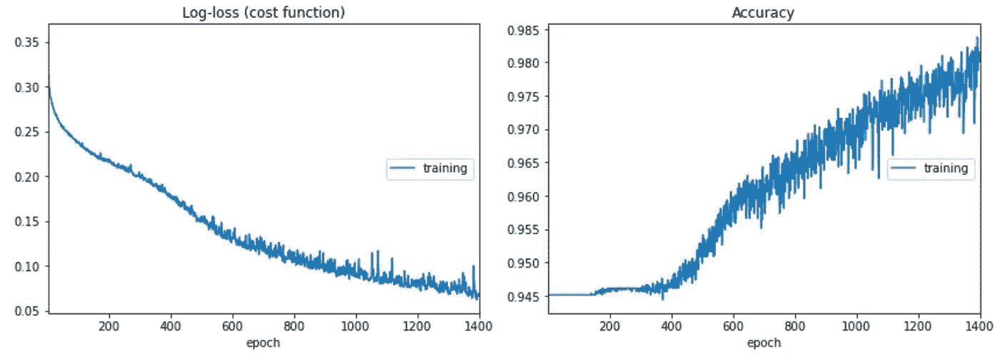
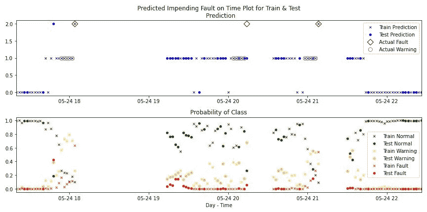
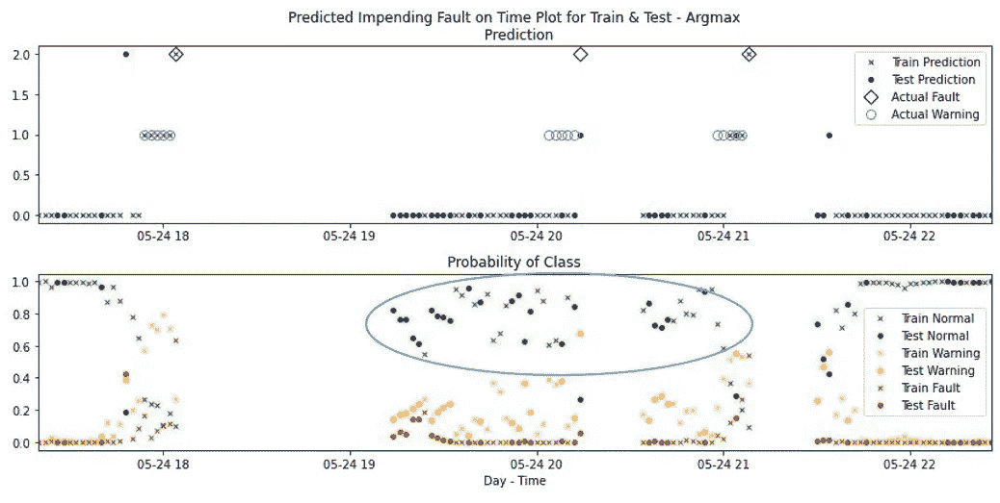
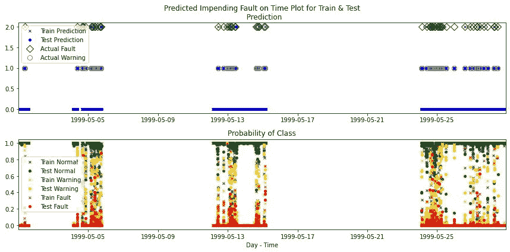
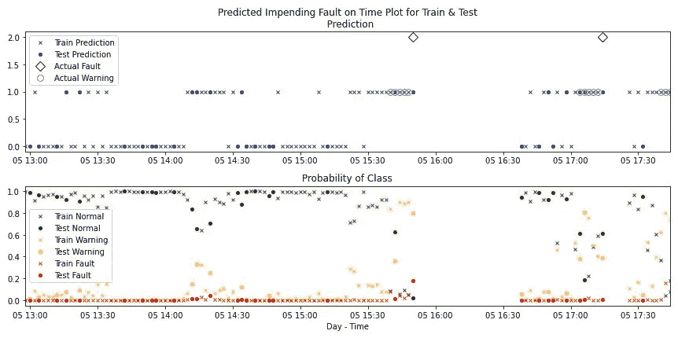
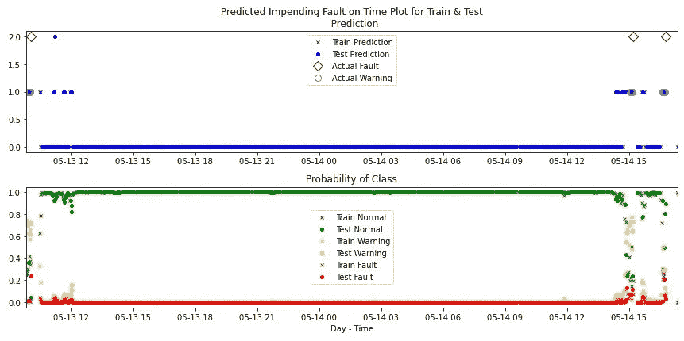
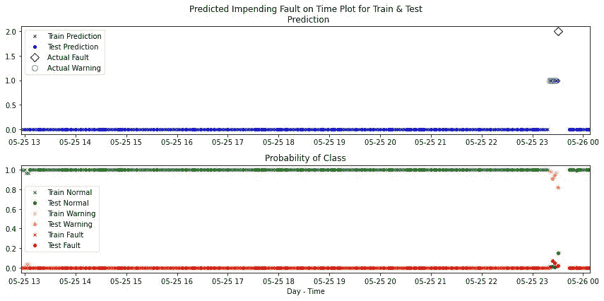
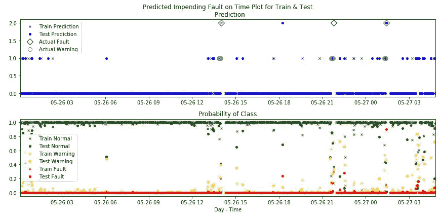

# 使用 CNN 预测造纸机中的纸张断裂

> 原文：<https://towardsdatascience.com/predicting-paper-breaks-in-a-paper-machine-using-cnns-80d9b53e8402>

## **使用图像分类预测即将发生的过程故障**

照片由在 [Unsplash](https://unsplash.com?utm_source=medium&utm_medium=referral) 上拍摄

## 介绍

这篇文章展示了使用 CNN(卷积神经网络)来预测一个即将发生的过程故障在造纸机使用一个现实世界的数据集。

这是通过将表示几个连续时间片的数据样本排列成图像来实现的，该图像是过去和当前状态的快照。如果故障前的条件不同于正常操作，则该条件的图像可以警告即将发生的故障。目的不是将故障与正常操作进行分类，而是将运行状态分类为正常或即将发生故障的警告。

通过几个跨越一个月过程数据的图表，讨论了图像构造、模型性能和见解。

## 为什么要这么做？

工业系统依靠过程控制运行。这些使系统在参数范围内运行。然而，系统关闭了。排除其他因素，如手动关闭或设备故障，扰乱仍会发生。识别即将发生的故障可以给操作人员时间来防止故障。此外，以这种方式分析过程可以提供对为什么或什么事件组合导致异常的洞察，并提供调整控制系统的机会。

## 资料组

本文中使用的数据来自 ProcessMiner Inc .，可以通过链接找到论文“[多元时间序列中的罕见事件分类](https://arxiv.org/abs/1809.10717v4)”[1]中的下载申请表，经许可使用。

该数据集覆盖了造纸机大约一个月的操作，每两分钟记录一次样本。这些特征没有用具体的过程变量名来标识，并且数据可能已经为 IP 目的进行了调整。有一个分类特征似乎将数据分成八个离散的操作场景，这可能与纸张的类型或重量或一些其他参数有关。我从该特征中选择了构成 36%数据的最频繁子集(其中特征 X28 是 96)，并通过数据分析和使用特征和排列重要性减少了特征的数量。了解具体特征可以改进这一步。本文中的图表来自性能最好的模型和特性子集，并对其他版本的结果进行了一些比较。

下面显示了碎纸和特性 X28。分页符是时间上的垂直线。蓝线是特征 X28。值 96 出现在月初、月中和月末，如箭头所示。

作者图片

更多的数据和对每个特征背后含义的了解可能会产生一个更好的模型，这个模型也可以用每个月的新数据来改进。其他 X28 值的单独模型可以用更多的数据来构建，或者这些样本可以通过具有专家过程知识的特征转换来包含。

该数据集只有每两分钟记录的过程值。原始原始数据在时间上大概更详细。不同或多个时间间隔可用于其他数据集，以获得洞察力或提供短期或长期预测。

需要六个样本来制作一幅图像，因此在中断之间少于六个样本的任何数据都被剔除。

## 将数据转换为图像

数据被重新标记，从 0 和 1 表示正常和缺纸，到 0 表示正常，1 表示警告，2 表示缺纸。在每次纸张断裂之前的五个样本被设置为标签 1。

从过程测量值中提取两个时间导数，并作为新的数据表保存在内存中。这给出了过程测量的变化率，即相对于位置的“速度”和相对于速度的“加速度”。我的想法是，即使特征值在设定点范围内，当变化率很高时，这些衍生样本可能表示纸张断裂。

然后将三个数据表在 0 到 1 的范围内进行缩放，并将 6 个时间段的数据分配给覆盖 12 分钟时间段的图像。每个连续的图像与前一个图像重叠 5 个时间段。每个图像都由对应于该图像中最后一个时间片的标签进行分类:正常、警告或断纸。

图像分为 3 层，第一层为过程变量值或“位置”。过程值的导数或“速度”是第二层，第三层是“加速度”值。

一旦故障时间片位于图像的最后一行，该过程就重复进行，即从上一个故障时间片之后的下 6 个时间段开始构建下一个图像。

下图显示了从导致纸张断裂的数据集构建的十二幅连续图像，最后一幅图像代表重启机器后的情况。控制点或测量点值(位置)、“速度”和“加速度”带在每个图像中都是可见的。图像顺序是按行从左到右，左上角是第一个图像，右下角是最后一个图像。左边的数字是对应于每个图像中最后一个时间样本的原始正常(0)和断纸(1)标签。右边的数字是调整后的标签，包括正常(0)、警告(1)和纸张断裂(2)。前五幅图像是正常操作(00)。接下来的五个是实际纸张断裂之前的五个样本的警告条件(01)。接下来是纸张断裂(12)，随后是正常重启(00)。所有 6168 个样本都是以这种方式创建的。

5 个正常图像，然后是 5 个警告图像、纸张断裂图像和作者的重启图像

**模型**
我用三组不同的图像训练了三个不同的模型。这些模型在为图像构造选择的特征上有所不同。EDA /位置特征重要性模型在随机森林模型上使用特征重要性，该模型仅包含离散样本上的原始位置值(不使用具有堆叠样本的图像)。这是我使用的第一个模型/特性列表。特征重要性和排列重要性模型使用从 RF 模型中高度分级的特征，该 RF 模型是根据离散样本上组合的位置、速度和加速度构建的。我保留了相同的图像构造基础，因此位置、速度和加速度值将保留给任何排名较高的特征，无论它是原始位置还是派生的速度或加速度特征。这是 5 小时内最佳模型的样本图表。关于最佳型号性能的更多图表将在后面列出。(上轨道:正常 0，警告 1，断纸 2)

样本性能(如下图 3)-作者图片

## 培养

训练类似于原型 CNN 模型。我使用了一个顺序 CNN 模型，其中有两个 *Conv2D* ，两个 *MaxPooling* ，一个 *Flatten layer* 馈入一个带有 *Dropout* 的*三层*128–64–3 网络。我没有对正常类进行欠采样，以保持正常条件“看起来”的可变性。因此，初始精度高。详情可以在 Github [*这里*](https://github.com/dvbckle/Process-Fault-Identification-with-CNN/blob/main/Paper_Machine_Sheet_Break_Subset96-3Class_w_Dates_Adamax_Update_Feature_Importance.ipynb) 找到。

特征重要性模型训练，按作者分类的图像

## 结果

由于数据集中的不平衡，我将自定义分类器应用于模型概率预测(predict_proba ),而不是使用标准的 argmax 预测。大多数图像(约 94%)来自正常类，警告和断纸图像分别约占 5%和 1%。如果预测的类概率低于该类在数据集中的出现频率，则自定义分类器会删除该类。例如，如果警告和断纸概率分别为 8%和 3%，则正常概率为 89%，然后被排除。该预测是剩余两个概率的 argmax，并且将是一个警告。自定义分类器混淆矩阵在左侧，标准 argmax 预测在右侧。显示了三种不同模型的结果。

作者图片

与 Argmax 相比，自定义分类器对警告状态的真阳性率更高，但假阳性率更高，根据模型的不同，预测正常状态条件警告的频率要高 4 到 9 倍。

目标是在纸张断裂发生之前预测它，以便有时间进行干预。因此，在这个阶段，定制分类器(调整后的预测)的更高的真阳性性能是有吸引力的，即使是以更高的假阳性警告状态为代价。尽管我们希望减少生产模型中的误报(有害警报)数量，但这并不在那个状态。在这种情况下，与简单地向前跳跃并采用具有标准 Argmax 分类的要素重要性模型的低错误警告相比，可以从错误警告中学到很多东西。使用相同的模型参考下面的两个图表。第一个使用自定义分类器，第二个使用标准 Argmax 选择。Argmax 忽略了流程看起来不稳定并最终出现纸张断裂(用圆圈突出显示)的时间，避免了“错误警告”并错过了许多指定的警告，而定制分类器显示了几乎所有的警告。这些样品与长时间稳定运行后纸张断裂前的样品之间的真正区别是什么？

可能的不稳定操作自定义分类器显示警告-图片作者

操作可能不稳定，Argmax 分类器显示少量警告-图片由作者提供

查看混淆矩阵的结果和下面的图表，我发现这些模型和数据集可能会发生三种情况。

首先，模型可能表现得不是很好。

其次，记住原始数据只有正常类和断纸类。我在纸张断裂之前任意选择了五个样本作为警告类。可能有许多“正常”的样本，其中过程状态类似于故障前的条件，并且一些警告的误报实际上是系统接近纸张断裂但恢复到正常操作水平而没有导致断裂的时候。这将是有见地的，可能是获得最高价值的地方。例如，利用操作来探索实际故障前样本和其他“正常”样本的相似性，或者理解即使特征值在设定点限制内，特征的变化率是否更能指示问题。数据集特征是匿名的，在不了解这些特征并且不是造纸机专家的情况下，对我的结果的解释是有限的。通过良好的迭代实践和与领域专家(即，造纸机专家)的审查，对实际特征的了解将确认洞察力或识别建模问题。

具有假阳性的初始模型对于理解过程或过程控制系统中的细微差别是有价值的。换句话说，即使样品被标记为正常，也不意味着它没有接近或趋向于纸张断裂(或其他系统中的过程故障)。

第三，我标记警告状态的方式可能存在偏见，导致更高的误报率。我选择了实际休息前的 5 个时间段(10 分钟)作为警告，为时间干预过程提供一些实用性。造纸机中的条件可能发展到更快的纸断裂，因此在一些或所有断裂之前的 2 或 3 个警告状态可能不代表过程偏差。因此，当数据完全正常时，将数据标记为警告状态可能导致模型预测小的过程偏差作为即将发生纸张断裂的证据和/或降低测试集中预测警告的性能。在纸张断裂之前减少警告状态的数量可以改进模型，但是也可以减少干预以防止断裂的时间。

## 图表

我提供了几个图表，概述了模型的运行情况，以及不同时期的数据如何显示为平稳运行的机器或有点不稳定的机器，有时是在启动后。图表来自使用调整后的预测值(基于样本集中类的概率和类的频率进行分类)对具有位置和两个导数的样本运行的特征重要性所生成的模型。更多图表在我 Github 上的 Jupyter 笔记本里。

图表显示了按样本日期和时间一起绘制的测试和训练结果(通过最终模型运行训练集)。我以这种方式呈现它们，是因为按样本连续排序的训练集和测试集的图并没有显示出一个月内的性能变化，因为样本被打乱了。此外，按时间划分的测试集和训练集的单独图与测试集或训练集中的缺失数据有差距。

这些地块有两条轨迹。上面的轨迹具有来自模型的预测类别、正常(0)、警告(1)和断纸(2)。这条轨道也有实际的警告标签，如圆圈，纸张破裂，如钻石。测试预测是蓝点，训练预测是蓝 X。时间间隔越短，就越容易看出预测值和实际值的一致性。

下面的轨迹具有为测试和训练预测绘制的类概率(0 到 1)。这里测试结果是点，训练结果是 X。分类概率绿色表示正常，黄色表示警告，红色表示纸张断裂(也称为故障)。

图表 1 显示了样本子集的分布，该数据子集中有 58 篇论文。

图表 1 —作者图片

图表 2 是 5 月 5 日从 13:00 到 17:30 的 4 个半小时的运行周期。这显示了正常概率低于 94%的小幅度下降是如何伴随着高于其在数据中出现频率的警告概率的，因此是警告预测。有几个“假”警告可能是由于不规则的操作条件造成的。这些高“假”警告期往往在临近纸张断裂时或从启动到纸张断裂运行时间较短时发生。图表中的两个断点被预测为警告对断点。

图表 2 —作者提供的图片

图表 3 有一个缺口，其中缺少 68 分钟的数据。看起来机器一直在运转，直到 23:00 纸张断裂。这个时间间隔的错误警告比上面的图表 2 要少得多。

图表 3 —作者提供的图片

图表 4 显示了大约 28 小时的平稳运行时间。在机器重启后(左侧)和每月 14 日 15:00 左右纸张断裂前，错误警告更加频繁。

图表 4 —作者图片

图表 5 显示了图表 6 之前的 11 个小时的干净运行时间。

图表 5 —作者图片

图 6 在时间上跟随上面的图 5，并且显示了在纸张断裂之前持续预测警告的模型。

图表 6 —作者图片

图表 6a 是来自基础模型(EDA /位置特征重要性模型)的相应结果。该模型使用了不同的特征，比上面的特征重要性模型(在特征选择中使用位置、速度和加速度)有更多的“错误警告”。这些具有不同特征的错误警告可能有价值，但是需要特征的知识来确定洞察力和差的模型性能之间的差异。

图表 6a —作者图片

## 概述

目标不是将纸张断裂与正常运行条件进行分类，因为在纸张断裂发生后识别纸张断裂没有任何运行益处。识别可能导致纸张断裂的操作条件变化，对于操作人员干预、改进过程控制逻辑或理解多个过程测量中的二阶或复合效应具有潜在价值。

这项工作表明，CNN 模型可以用来预测或警告现实世界数据集上即将发生的过程故障。该模型可以用更多的数据和关于产生该数据的实际造纸机的知识来改进。这种方法可以用于其他过程，不一定作为控制系统，但探索扰乱和微调系统。

这不是一个生产级模型，在生产级模型中，最大限度地减少错误警告非常重要。挖掘假阳性是恢复的偏差情况的可能性(如上所述)是开发生产模型所需的迭代方法的一部分，包括在过程设计和操作中咨询主题专家。模型的训练和部署不是一步到位的。在多学科方法中可以获得洞察力，以了解模型是否不好，或者模型是否告诉你一些东西，并利用这些来改进模型或理解工业过程。

欢迎大家的评论。

**特别感谢**

特别感谢 ProcessMiner Inc .的科学主管 Chitta Ranjan，感谢他慷慨地允许我发表这篇文章并分享我的方法和结果。

**相关文章**

这是一篇原型文章的扩展，在这篇文章中，我创建了一个合成数据集，并在表示正常情况和故障前时间片作为警告状态的图像上训练了一个 CNN 图像分类模型。

</cnns-to-predict-process-failures-28c17e5fd6c2>  

**参考**

[1]Chitta Ranjan，Markku Mustonen，Kamran Paynabar，Karim Pourak，《多元时间序列中的[罕见事件分类](https://arxiv.org/abs/1809.10717v4)，2018，arXiv:1809.10717，数据集使用权限。