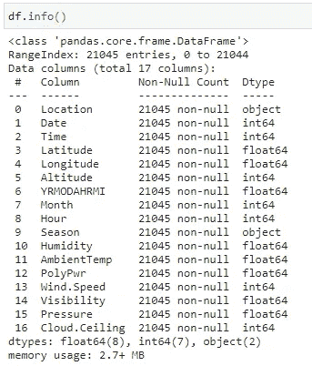
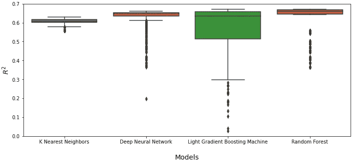
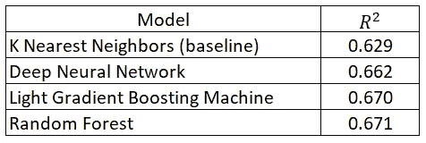
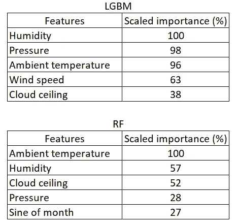

# 使用机器学习技术预测太阳能输出

> 原文：<https://towardsdatascience.com/predicting-solar-power-output-using-machine-learning-techniques-56e7959acb1f>

## 应用数据科学解决方案应对可再生能源挑战。


安德烈亚斯·古尔霍恩在 [Unsplash](https://unsplash.com?utm_source=medium&utm_medium=referral) 上拍摄的照片

## 介绍

太阳能是世界上领先的可再生能源之一，并且还在继续增长。然而，它依赖于阳光，阳光是一种间歇性的自然资源。这使得电力输出的可预测性对于将太阳能光伏并入传统电网系统至关重要。

在当前的分析中，预测了安装在北半球 12 个位置的水平光伏的功率输出。只有位置和天气数据被使用，没有关于辐照度的信息。虽然辐照度是太阳能输出的一个强有力的预测指标，但是收集关于一个位置的这种信息通常是乏味的，并且它的估计可能具有显著的误差。因此，需要进一步探索在没有辐照度数据的情况下预测功率输出的能力，以节省时间、精力和成本，同时不显著损失精度。

这些数据在 [Kaggle](https://www.kaggle.com/saurabhshahane/northern-hemisphere-horizontal-photovoltaic) 上公开，包括 14 个月的电力输出、位置和天气数据。此外，用于该分析的笔记本可在 [Github](https://github.com/abbey2017/solar-energy-analytics) 上获得。本文的其余部分将涵盖数据处理、建模、结果和结论。

## 数据处理

在传递给机器学习算法之前，对数据中的可用变量进行探索、可视化和预处理。

*数据探索*

数据集由 21，045 行和 17 列组成。让我们使用 pandas- Python 数据分析库中的函数来研究数据集中可用的列。



作者图片

如上图，数据集中没有缺失值(耶！！).此外，删除了“YRMODAHRMI”列，因为它不直观，也没有提供描述。目标变量是 PolyPwr(功率输出)。

此外，数据集的前五行如下所示:


作者图片

接下来，让我们检查目标变量的分布。尽管 30 W 以上的功率输出表示有限，但下面的直方图并未显示出明显的偏斜。因此，由于目标变量在可用数据集中的分布，预计在预测目标变量时不会有额外的困难。


整个数据集中功率输出变量的直方图。(图片由作者提供)

到目前为止一切都很好。现在，让我们想象一下可用功能和功率输出之间的关系。


可用功能和功率输出之间的相关性。(图片由作者提供)

从相关图来看，环境温度、云顶和湿度是与太阳能输出最相关的三大特征。还应该注意的是，纬度与功率输出具有显著的相关性，而经度没有显示出相同的行为。因此，经度被从建模过程中删除。海拔也下降了，因为它与气压有很好的相关性，但不会因给定位置而变化。

*特色工程*

在这里，让我们从现有的特征中创建新的特征，以使分类变量在我们的机器学习算法中可用，并在数据中捕捉更多的模式。

首先，我们使用一次性编码方法对分类变量(即位置和季节)进行编码。

```
# Encode location data
df_with_location_en = pd.get_dummies(df, columns=['Location'], drop_first=True)# Encode season data
df_with_loc_season_en = pd.get_dummies(df_with_location_en, columns=['Season'], drop_first=True)
```

其次，让我们使用月和小时数据创建循环特征。应该注意的是，只有上午 10 点到下午 3 点之间的数据是可用的，这排除了系统不预期发电的时段。

```
# Define time bounds in data
min_hour_of_interest = 10
max_hour_of_interest = 15# Calculate time lapse since onset of power generation
df_with_loc_season_en['delta_hr']= df_with_loc_season_en.Hour -
                                   min_hour_of_interest# Create cyclic month features
df_with_loc_season_en['sine_mon']=
                  np.sin((df_with_loc_season_en.Month - 1)*np.pi/11)
df_with_loc_season_en['cos_mon']= 
                  np.cos((df_with_loc_season_en.Month - 1)*np.pi/11)# Create cyclic hour features
df_with_loc_season_en['sine_hr']= 
  np.sin((df_with_loc_season_en.delta_hr*np.pi/(max_hour_of_interest
  - min_hour_of_interest)))
df_with_loc_season_en['cos_hr']= 
  np.cos((df_with_loc_season_en.delta_hr*np.pi/(max_hour_of_interest
  - min_hour_of_interest)))
```

包括新创建的特征在内的附加相关性分析显示了日期特征的余弦与其实际值(月和小时)之间的完美相关性。因此，月和小时特征在建模过程中被丢弃。

用于建模的最终特征列表如下所示:

```
selected_columns = ['Latitude', 'Humidity', 'AmbientTemp',  
                    'PolyPwr', 'Wind.Speed', 'Visibility', 
                    'Pressure', 'Cloud.Ceiling', 'Location_Grissom', 
                    'Location_Hill Weber', 'Location_JDMT', 
                    'Location_Kahului', 'Location_MNANG', 
                    'Location_Malmstrom', 'Location_March AFB', 
                    'Location_Offutt', 'Location_Peterson', 
                    'Location_Travis', 
                    'Location_USAFA','Season_Spring', 
                    'Season_Summer', 'Season_Winter', 'sine_mon', 
                    'cos_mon', 'sine_hr', 'cos_hr']
```

*数据拆分*

整个数据集分为 80%的训练数据和 20%的测试数据。在不同模型的超参数调整和训练过程中，测试数据一直存在且不可见。

## 建模

开发了三个模型(随机森林-RF、光梯度推进机 LGBM 和深度神经网络-DNN)和一个堆叠集成，并与基线(K 最近邻-KNN)模型进行了比较。

*指标*

在此分析中，R 平方度量是选择性能最佳模型的最终度量。用于评估所选模型性能的其他指标包括均方根误差(RMSE)和平均绝对误差(MAE)。

r 平方


作者图片

均方根误差


作者图片

平均绝对误差


作者图片

R 平方的值从 0 到 1，越高越好，而 RMSE 和 MAE 的值与功率输出(W)的单位相同，越小越好。

*超参数调谐*

每个模型都使用[随机搜索交叉验证](https://scikit-learn.org/stable/modules/generated/sklearn.model_selection.RandomizedSearchCV.html)方法进行了调整，该方法能够根据模型在多次分割训练数据时的性能选择最佳超参数组合。

特别地，超参数的 1000 个排列被选择并应用于训练数据的 4 个分裂。测试数据仍然不可见，并将用于对不同算法选择的模型进行最终评估。


四重交叉验证(作者图片)

*模型堆叠*

使用 Scikit-learn- python 机器学习库中的[堆叠回归器模块](https://scikit-learn.org/stable/modules/generated/sklearn.ensemble.StackingRegressor.html)将四个不同的模型(KNN、DNN、RF 和 LGBM)组合在一起。一个简单的线性回归模型被用作元学习器，并根据基本模型以及原始输入特征的 4 倍交叉验证预测对其进行训练。

堆叠回归器使用 cross_val_predict 函数，该函数为定型数据中的每个示例返回该示例位于验证集中时获得的预测。这些跨不同基础模型的预测被用作元学习者的输入(参见 Sklearn【3.1.1.2 用户指南】了解详情)。这种方法降低了过度拟合的风险。


模型堆叠(图片由作者提供)

## 结果

*交叉验证分数*

不同算法的 1000 个超参数随机排列的交叉验证(CV) R 平方得分显示在下面的箱线图中:



不同算法 1000 次迭代的 CV 分数。(图片由作者提供)

如箱线图所示，LGBM 模型对超参数选择最敏感，而 KNN 最不敏感。

接下来，每种算法类型的最佳 CV 分数显示如下:



四重 CV 最佳成绩。(图片由作者提供)

结果显示，最佳 RF 模型在所有研究的算法中具有最高的 CV 分数。

*测试数据得分*

使用占整个数据集 20%的保留集来评估每个模型的性能。结果总结如下:


根据看不见的测试数据建立性能模型。(图片由作者提供)

与 KNN(基线)模型相比，堆叠模型的整体性能最佳，提高了 10%。此外，LGBM 模型是基于所有考虑指标的最佳基础模型。

应该注意的是，所有模型都可以很好地推广到未知的测试集，CV 和测试分数之间的性能相当。

*特征重要性*

使用能够计算特征重要性的 LGBM 和 RF 模型，下表显示了用于预测太阳能输出的前 5 个特征的重要程度。



使用树方法的前 5 个分级特征重要性。(图片由作者提供)

环境温度、湿度、云顶和压力出现在 LGBM 和 RF 模型的前 5 个特征中。使用 RF 模型获得的特征重要性排序与 Pasion 等人报道的前 5 个结果一致。艾尔。, 2020.

## 结论

标准数据科学技术已被应用于预测 12 个不同地点的太阳能输出。结果表明，LGBM 是最好的基础模型，而堆叠模型的整体性能最好。

最佳模型可能会针对个别位置进行进一步训练，以获得更好的分数，但这不在本分析范围内。

最后，本文所采用的方法可以作为解决可再生能源领域预测分析问题的标准程序。

什么更有趣？你可以通过我下面的推荐链接订阅 Medium 来获得更多我和其他作者的启发性文章，这也支持我的写作。

[](https://aolaoye.medium.com/membership)  

## 参考

帕西恩角；t .瓦格纳；科斯尼克，c；舒尔特公司；使用天气和位置数据对水平光伏电池进行机器学习建模。能量 2020，13，2570；doi:10.3390/en13102570。

[Scikit-learn 1.0.2 用户指南](https://scikit-learn.org/stable/user_guide.html)