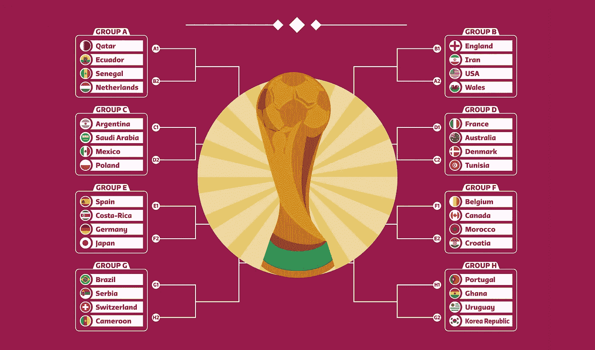
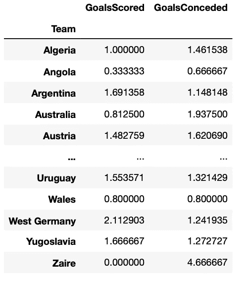
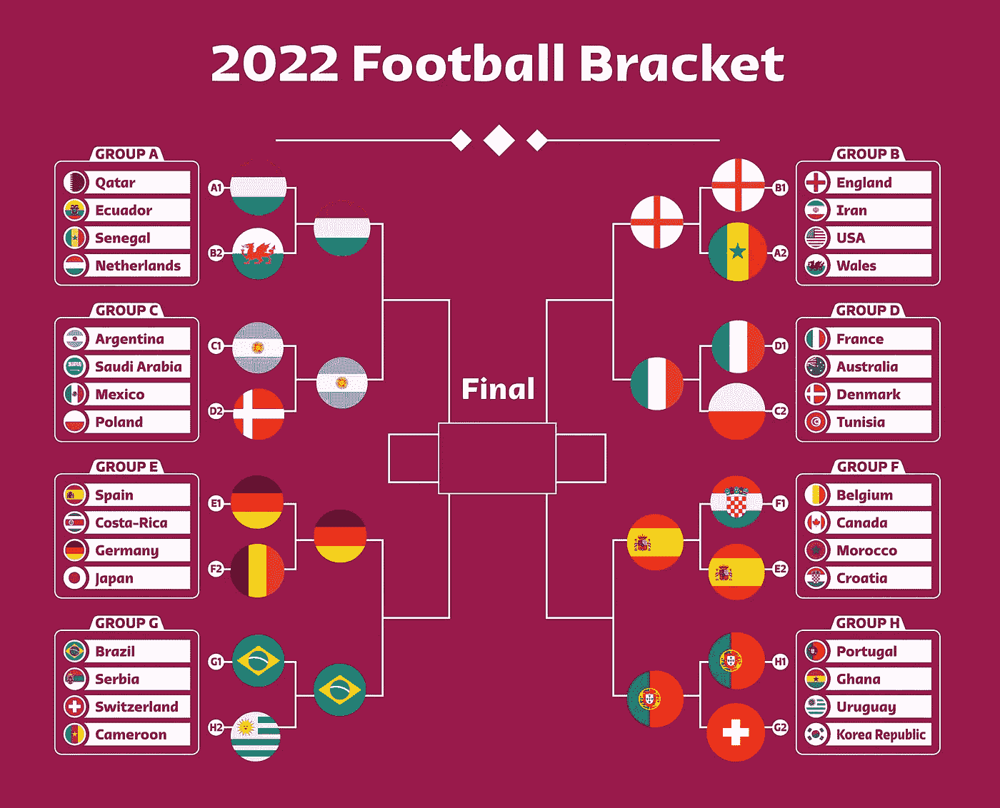

# 用一个简单的 Python 模型预测 2022 年世界杯

> 原文：<https://towardsdatascience.com/predicting-the-fifa-world-cup-2022-with-a-simple-model-using-python-6b34bdd4f2a5>

## 获胜者是…



图片来自 Shutterstock，授权给 Frank Andrade(由 Canva 编辑)

很多人(包括我)称足球为“不可预测的比赛”，因为一场足球比赛有不同的因素可以改变最终的比分。

那是真的…在某种程度上。

很难预测一场比赛的最终比分或获胜者，但在预测一场比赛的获胜者时就不是这样了。在过去的 5 年里，拜仁慕尼黑赢得了所有德甲冠军，而曼城赢得了 4 个英超联赛冠军。

巧合吗？我不这么认为。

事实上，在 20-21 赛季中期，[我创建了一个模型来预测英超、西甲、意甲和德甲的冠军](https://medium.datadriveninvestor.com/can-we-beat-the-bookies-predicting-football-games-with-a-simple-model-43fe020fb384)，它成功地预测了所有冠军。

这个预测并不难做出，因为那时已经打了 19 场比赛。现在我运行同样的模型来预测 2022 年世界杯。

以下是我如何使用 Python 预测世界杯的(关于代码的更多细节[查看我的 1 小时视频教程](https://youtu.be/anEoBZkZRHA)

## 我们如何预测比赛？

做预测有不同的方法。我可以建立一个奇特的机器学习模型，并输入多个变量，但在阅读了一些论文后，我决定给泊松分布一个机会。

为什么？让我们来看看泊松分布的定义。

> 泊松分布是一种离散的概率分布，描述在固定的时间间隔或机会区域内发生的事件数量。

如果我们把一个进球想象成一场足球比赛 90 分钟内可能发生的事件，我们可以计算出 A 队和 b 队在一场比赛中可能进球的概率。

但这还不够。我们仍然需要满足泊松分布的假设。

1.  可以计算比赛项目的数量(一场比赛可以有 1、2、3 个或更多目标)
2.  事件的发生是独立的(一个目标的发生不应影响另一个目标的概率)
3.  事件发生的速率是恒定的(在某个时间间隔内目标发生的概率应该与相同长度的其他时间间隔完全相同)
4.  两件事不可能在同一时刻发生(两个目标不可能同时发生)

毫无疑问，假设 1 和 4 得到满足，但假设 2 和 3 部分成立。也就是说，让我们假设假设 2 和 3 总是正确的。

当我预测欧洲顶级联赛的冠军时，我绘制了过去 5 年中 4 大联赛每场比赛进球数的直方图。


4 个联赛的进球数直方图

如果你看看任何联盟的拟合曲线，它看起来像泊松分布。

现在我们可以说，可以使用泊松分布来计算一场比赛中可能进球的概率。

这是泊松分布的公式。


为了做出预测，我考虑了:

**lambda**:90 分钟进球数中值(A 队和 B 队)
**x**:A 队和 B 队在一场比赛中可以进的球数

为了计算 lambda，我们需要每个国家队的平均进球/失球数。这就引出了下一点。

## 每个国家队的进球/失球

在收集了从 1930 年到 2018 年所有世界杯比赛的数据后，我可以计算出每个国家队的平均进球和失球。



在我对欧洲四大联赛的预测中，我考虑了主客场因素，但由于世界杯几乎所有球队都在中立的球场比赛，所以我在这次分析中没有考虑这个因素。

一旦我有了每个国家队的得分/失球，我就创建了一个函数来预测每个队在小组赛中的得分。

# 预测小组赛阶段

下面是我用来预测每个国家队在小组赛中能拿到多少分的代码。它看起来令人生畏，但它只有我提到的许多东西，直到这一点转化为代码。

```
def predict_points(home, away):
    if home in df_team_strength.index and away in df_team_strength.index:
        lamb_home = df_team_strength.at[home,'GoalsScored'] * df_team_strength.at[away,'GoalsConceded']
        lamb_away = df_team_strength.at[away,'GoalsScored'] * df_team_strength.at[home,'GoalsConceded']
        prob_home, prob_away, prob_draw = 0, 0, 0
        for x in range(0,11): #number of goals home team
            for y in range(0, 11): #number of goals away team
                p = poisson.pmf(x, lamb_home) * poisson.pmf(y, lamb_away)
                if x == y:
                    prob_draw += p
                elif x > y:
                    prob_home += p
                else:
                    prob_away += p

        points_home = 3 * prob_home + prob_draw
        points_away = 3 * prob_away + prob_draw
        return (points_home, points_away)
    else:
        return (0, 0)
```

简单地说，`predict_points`计算主队和客队能得多少分。为此，我使用公式`average_goals_scored * average_goals_conceded`计算了每个团队的 lambda。

然后，我模拟了一场比赛从 0–0 到 10–10 的所有可能得分(最后一个得分只是我目标范围的极限)。一旦我有了λ和 x，我就用泊松分布的公式来计算`p`。

比方说，如果比赛分别以 1-0(主场获胜)、1-1(平局)或 0-1(客场获胜)结束，`prob_home`、`prob_draw`和`prob_away`累加`p`的值。最后，用下面的公式计算分数。

```
points_home = 3 * prob_home + prob_draw
points_away = 3 * prob_away + prob_draw
```

如果我们用`predict_points`来预测英格兰对美国的比赛，我们会得到这个。

```
>>> predict_points('England', 'United States')
(2.2356147635326007, 0.5922397535606193)
```

这意味着英国将得到 2.23 分，而美国将得到 0.59 分。我得到小数是因为我在用概率。

如果我们将此`predict_points`函数应用于小组赛的所有比赛，我们将获得每个小组的第一和第二名，从而获得接下来的淘汰赛。


图片由作者用 Canva 编辑

# 预测击倒

对于淘汰赛，我不需要预测积分，而是每个括号中的获胜者。这就是为什么我在之前的`predict_points`函数的基础上创建了一个新的`get_winner`函数。

```
def get_winner(df_fixture_updated):
    for index, row in df_fixture_updated.iterrows():
        home, away = row['home'], row['away']
        points_home, points_away = predict_points(home, away)
        if points_home > points_away:
            winner = home
        else:
            winner = away
        df_fixture_updated.loc[index, 'winner'] = winner
    return df_fixture_updated
```

简单来说，如果`points_home`大于`points_away`则胜者为主队，否则，胜者为客队。

感谢`get_winner`函数，我可以得到前面括号中的结果。



图片由作者用 Canva 编辑

# 预测四分之一决赛、半决赛和决赛

如果我再用一次`get_winner`，我就能预测出世界杯的冠军。下面是最终结果！！


图片由作者用 Canva 编辑

通过再次运行这个函数，我得到获胜者是…

> 巴西！

就是这样！我就是这样用 Python 和泊松分布预测 2022 年世界杯的。要查看完整的代码，请查看我的 [GitHub](https://github.com/ifrankandrade?tab=repositories) 。你也可以查看我的[介质列表](https://frank-andrade.medium.com/list/python-project-fifa-world-cup-2022-prediction-85426e7c421c)，查看与这个 Python 项目相关的所有文章。

用 Python 学习数据科学？ [**通过加入我的 20k+人电子邮件列表，获得我的免费 Python for Data Science 备忘单。**](https://frankandrade.ck.page/26b76e9130)

如果你喜欢阅读这样的故事，并想支持我成为一名作家，可以考虑报名成为一名媒体成员。每月 5 美元，让您可以无限制地访问数以千计的 Python 指南和数据科学文章。如果你用[我的链接](https://frank-andrade.medium.com/membership)注册，我会赚一小笔佣金，不需要你额外付费。

[](https://frank-andrade.medium.com/membership) [## 通过我的推荐链接加入媒体——弗兰克·安德拉德

### 作为一个媒体会员，你的会员费的一部分会给你阅读的作家，你可以完全接触到每一个故事…

frank-andrade.medium.com](https://frank-andrade.medium.com/membership)