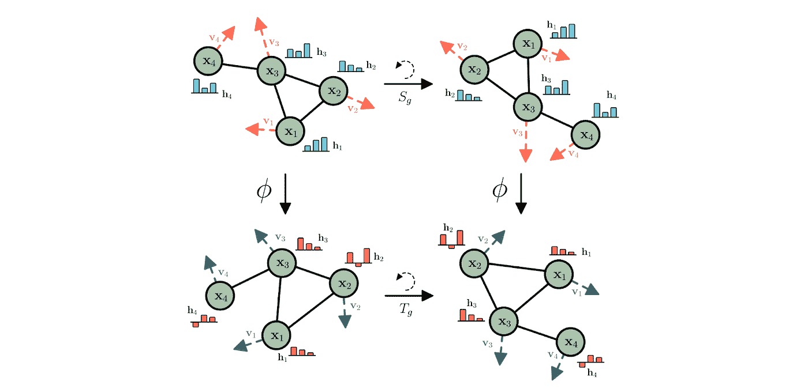
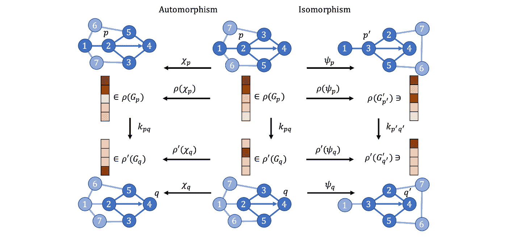
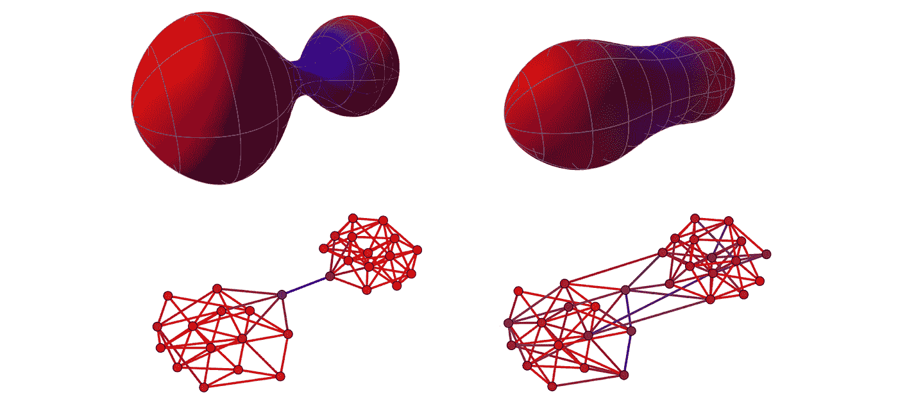
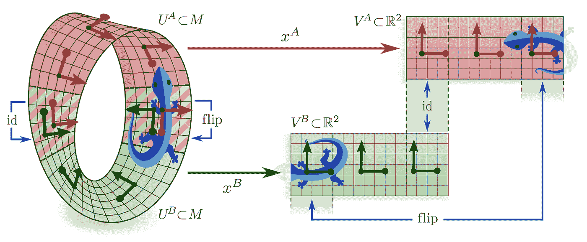
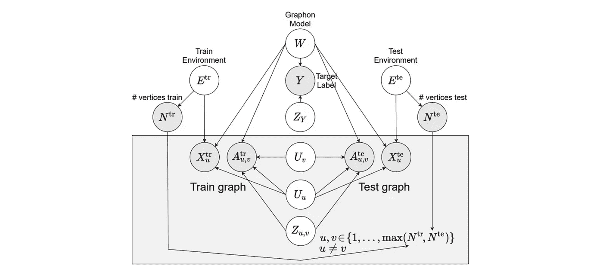
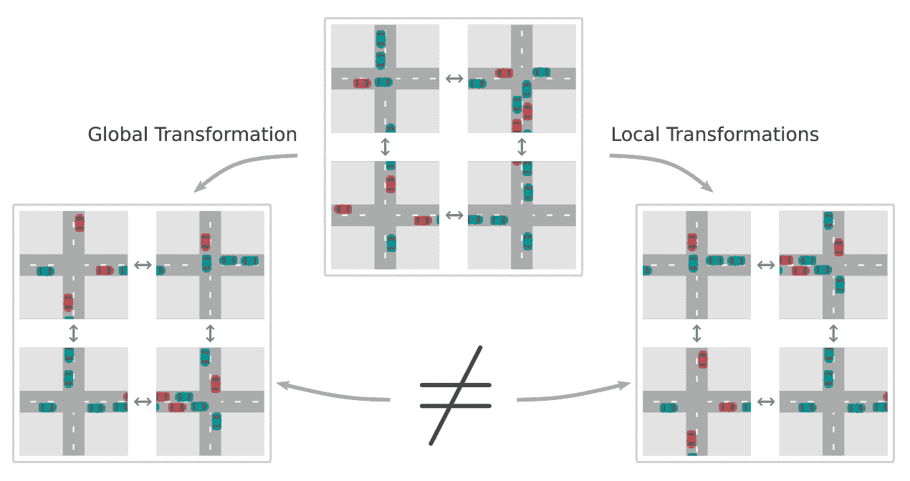
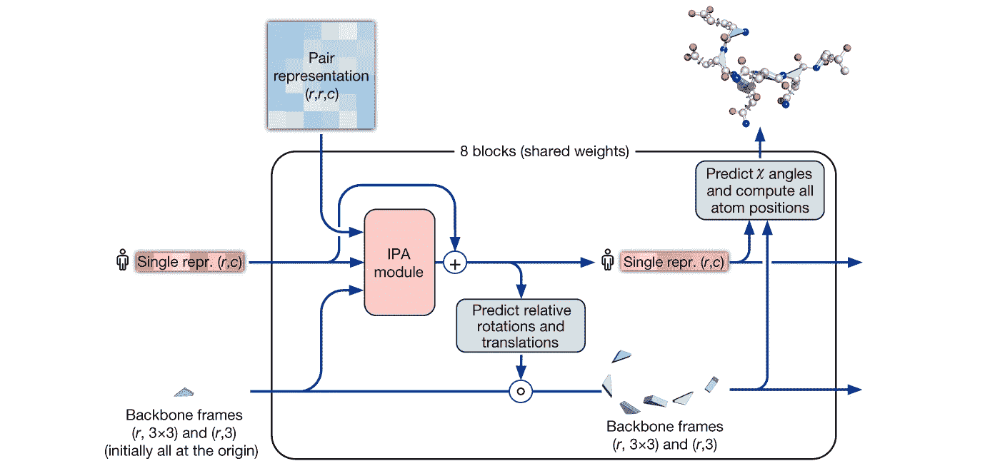
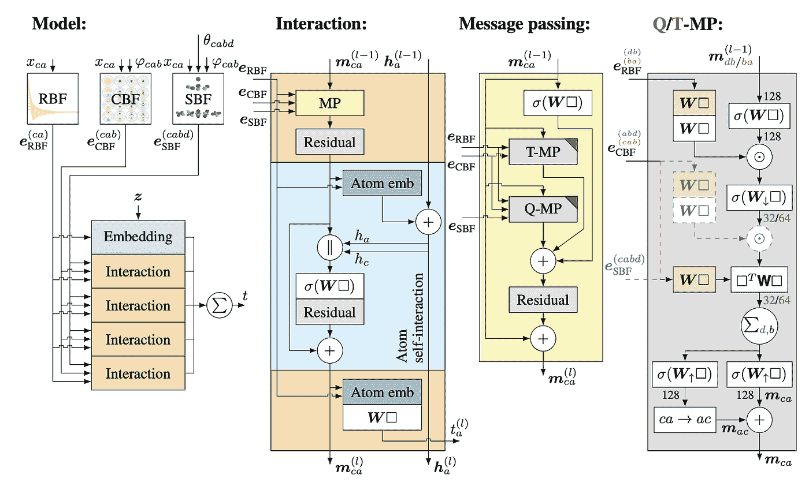
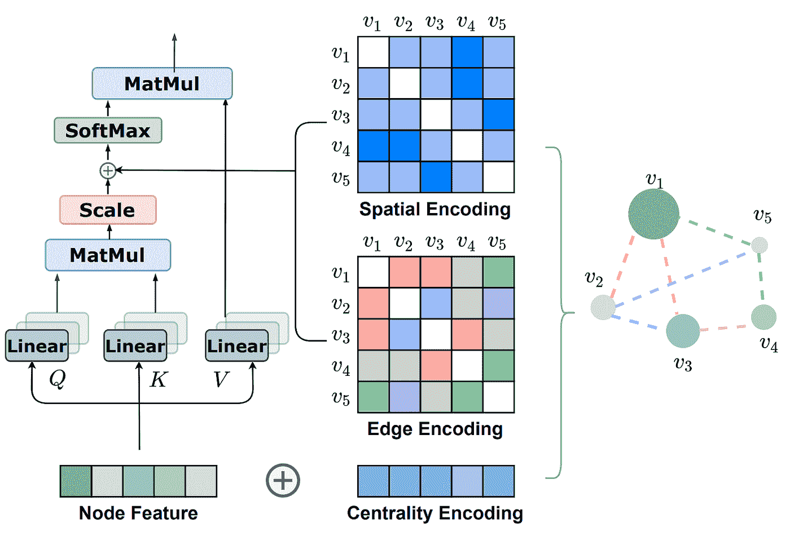
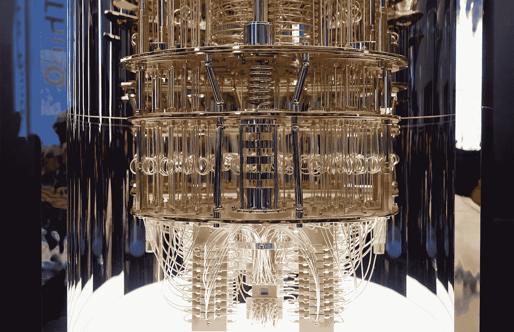

# 2022 年对于几何和图形 ML 来说意味着什么？

> 原文：<https://towardsdatascience.com/predictions-and-hopes-for-geometric-graph-ml-in-2022-aa3b8b79f5cc>

## 2021 年回顾与 2022 年预测

# 2022 年对于几何和图形 ML 来说意味着什么？

## 去年，我征求了 Graph ML 领先研究人员的意见，以预测该领域的未来发展。今年，我们与 Petar Velič ković合作，采访了一批杰出和多产的专家，试图总结过去一年的亮点，并预测 2022 年的情况。

图片:Shutterstock

本文作者是 Petar Velič ković。另请参阅我的 [*去年的预测*](/predictions-and-hopes-for-graph-ml-in-2021-6af2121c3e3d?sk=e2dfa5d2f63dab879a2d097382a3cf66) *、迈克尔·高尔金的精彩帖子《图 ML 中的* [*时事*](/graph-ml-in-2022-where-are-we-now-f7f8242599e0) *、更深入的探究* [*子图 GNNs*](/using-subgraphs-for-more-expressive-gnns-8d06418d5ab?sk=8806ffcd9ecf74c440d40df53528c1c7) *、技法启发*[*PDEs*](/graph-neural-networks-as-neural-diffusion-pdes-8571b8c0c774?sk=cf541fa43f94587bfa81454a98533e00)*和* [*微分几何和*](/graph-neural-networks-through-the-lens-of-differential-geometry-and-algebraic-topology-3a7c3c22d5f?sk=791d11adb17b2e0a01f5089e4d460072)

在领先领域专家的帮助下，总结对 2021 年的印象并预测未来一年是一项值得进行的有益尝试，因为它提供了一系列不同的见解和观点供学习。用我们一位密切关注整个机器学习领域的[顶级新兴趋势](https://www.stateof.ai/)的受访者的话说:

> *“随着几何和基于图形的最大似然方法从利基市场发展成为当今人工智能研究的最热门领域之一，想象未来 12 个月将会发生什么令人兴奋。”*——内森·贝奈希(Nathan Benaich)，航空街资本的普通合伙人，也是《人工智能现状报告[的合著者](https://www.stateof.ai/)

回想起来，这一努力并不像我们最初认为的那样容易，因为该领域在过去一年中有了巨大的发展——这可以从这篇文章的长度中看出来，这是我们迄今为止写得最长的一篇。

# 快速带回家的信息(如果你懒得看剩下的)

1.  [**几何在 ML**](https://medium.com/p/aa3b8b79f5cc#0b34) **中变得日益重要。**微分几何和同源领域带来了新的想法，包括新的等变 GNN 架构，该架构利用了对称性和曲率的图形类似物，以及理解和利用深度学习模型中的不确定性。
2.  [**消息传递仍然是 GNNs**](https://medium.com/p/aa3b8b79f5cc#95d2) **中的主导范式。**2020 年，社区接受了消息传递 GNNs 的局限性，并超越这一范式寻找更具表现力的架构。2021 年，很明显消息传递仍然有几个王牌，因为几个作品显示了将 GNNs 应用于子图来获得更好的表达能力的可能性。
3.  [**微分方程催生新 GNN 架构**](https://medium.com/p/aa3b8b79f5cc#cddc) **。**从 NeuralODEs 开始的趋势扩展到了图形。一些工作显示了如何将 GNN 模型公式化为连续微分方程的离散化。在短期内，这将导致新的架构，避免 gnn 的常见困境，如过度平滑和过度抑制。从长远来看，我们可能会更好地理解 gnn 是如何工作的，以及如何使它们更具表现力和可解释性。
4.  [**旧的观念从信号处理、神经科学和物理学中获得新的生命**](https://medium.com/p/aa3b8b79f5cc#5c16) **。许多人认为图形信号处理重新点燃了最近对图形 ML 的兴趣，并提供了第一套工具，如广义傅立叶变换和图形卷积。经典信号处理和物理学所依赖的其他基本技术，如表示理论，已经在 2021 年取得了一些重要进展，并且仍有许多东西有待开发。**
5.  [**建模复杂系统需要超越图形**](https://medium.com/p/aa3b8b79f5cc#5f9f) **。2021 年诺贝尔物理学奖授予乔治·帕里西，以表彰他对复杂系统的研究。虽然在基本的抽象层次上，这样的系统通常可以被描述为图形，但是人们必须考虑更复杂的结构，例如非成对关系和动态行为。2021 年的多项工作致力于动态关系系统，并展示了如何将 GNNs 扩展到更高阶的结构，如传统上在代数拓扑领域处理的单元和单纯复形。我们很可能会在 ML 中看到来自这个领域的其他更奇特的对象。**
6.  [**推理、公理化、泛化在 Graph ML**](https://medium.com/p/aa3b8b79f5cc#ecb7) **中仍然是大的开放题。**在过去的一年中，我们看到了受算法推理启发的 GNN 架构的持续进步，以及针对图结构任务的更强大的非分布概括。我们现在有知识图推理机，它们明确地与广义的贝尔曼-福特算法一致，还有图分类器，它们利用分布变化的明确因果模型。可以说，这样的方向为更健壮和更通用的 gnn 揭示了未来方向的金矿；很有可能在 2022 年对其中的许多进行彻底的探索。
7.  [**图在强化学习中越来越受欢迎，但大概还有一段路要走**](https://medium.com/p/aa3b8b79f5cc#85a5) **。**也许毫不奇怪，强化学习充满了图形和对称:通常要么在 RL 代理的结构中，要么在环境的表示中。2021 年出现了几个试图利用这种结构的研究方向，取得了不同程度的成功。我们现在对如何利用 RL 中的这些对称性有了更好的理解，包括在多代理系统中；然而，将代理建模为图似乎并不要求严格使用图结构。尽管有这种复杂的感觉，我们相信 2022 年是图形和几何驱动的 RL 充满希望的一年。
8.  [**AlphaFold 2 是几何 ML 的一次胜利，也是结构生物学的一次范式转变**](https://medium.com/p/aa3b8b79f5cc#777e) **。**预测蛋白质三维折叠结构的可能性是由诺贝尔化学奖获得者克里斯蒂安·安芬森在 20 世纪 70 年代提出的。这是一个非常困难的计算任务，是结构生物学的圣杯。2021 年，DeepMind 的 AlphaFold 2 打破了上一版本的记录，实现了令领域专家信服的准确性，并刺激了广泛的采用。其核心，AlphaFold 2 是一个基于等变注意力的几何架构。
9.  [**药物发现和设计得益于 GNNs 及其与变形金刚**](https://medium.com/p/aa3b8b79f5cc#692c) **的合流。**ML 社区中很少有人不知道 GNNs 的起源可以追溯到 20 世纪 90 年代的计算化学工作。因此，毫不奇怪，分子图的分析是 GNNs 最受欢迎的应用之一。2021 年，这一领域取得了持续的重大进展，出现了数十种新架构和几项超越基准的成果。获胜者之一是将 Transformers 改编为 graphs，这有望模仿 NLP 中这些架构成功的关键:能够跨任务概括的大型预训练模型。
10.  [**AI-首次药物发现越来越多地使用几何和图 ML**](https://medium.com/p/aa3b8b79f5cc#77d0) 。AlphaFold 2 和分子 GNNs 的成功使人工智能设计的新药物的梦想更近了一步。Alphabet 的新公司同构实验室表明了行业对这项技术的押注。然而，为了实现这些希望，模拟分子间的相互作用是必须跨越的重要前沿。
11.  [**Quantum ML 得益于基于图的方法**](https://medium.com/p/aa3b8b79f5cc#d904) **。**对于该领域的大多数专家来说，量子 ML 仍然是一个奇特的利基，但随着量子计算硬件的出现，它正在迅速成为现实。Alphabet X 最近的工作显示了量子 ML 架构中图形结构归纳偏差的优势，结合了这些显然不相关的领域。从长远来看，几何可能会扮演更重要的角色，因为量子物理系统通常拥有丰富而深奥的群对称，可以用于量子架构设计。

2021 年，基于几何和图形的 ML 方法在高规格应用中大放异彩。图片:自然/科学。

# 几何学在 ML 中变得越来越重要

如果我们必须选择一个在 2021 年持续渗透到图形表示学习的几乎每个领域的词，毫无疑问*几何*将是主要候选词[1]。我们[去年写了关于这个](/geometric-foundations-of-deep-learning-94cdd45b451d?sk=184532175cb936d7b25d9adebd512629)的文章，我们的受访者似乎完全同意——超过一半的人以这样或那样的方式喊出了这个关键词。

> *“在过去的一年里，我们看到了许多经典几何思想在 Graph ML 中以新的方式使用。”* —梅勒妮·韦伯，牛津大学数学研究所胡克研究员

Melanie 补充说:“值得注意的例子包括利用对称性更有效地学习模型，应用最佳运输的思想，或者在表示学习中使用微分几何的曲率概念。

最近，人们对理解关系数据的几何以及利用这些见解来学习好的(欧几里德或非欧几里德)表示的兴趣激增[1]。这就产生了许多编码特定几何图形的 GNN 体系结构。值得注意的例子是双曲 GNN 模型[2]，该模型于 2019 年底首次推出，作为学习分层数据有效表示的工具。在过去的一年里，我们看到了新模型和架构的激增，这些模型和架构能够更有效地学习双曲线表示，或者能够捕捉更复杂的几何特征[3–4]。另一项工作是利用等变和对称形式的几何信息[5]。"

*今年，在图形神经网络的背景下，我们看到了几何技术的激增，例如等变信息传递，这证明了它在从小分子性质预测到蛋白质折叠的生物化学应用中至关重要。图片来自 Satorras 等人[5]。*

elanie 在微分几何上加倍努力，表明了它在 2022 年的许多潜在应用:“离散微分几何，研究像图或单纯复形这样的离散结构的几何，已经被用来深入了解 GNNs。曲率的离散概念是描述离散结构的局部和整体几何性质的重要工具。最近在[6]中提出了曲率在图 ML 中的一个值得注意的应用，其中在图重新布线的背景下研究了离散 Ricci 曲率，提出了一种减轻 GNNs 中过度挤压效应的新方法。在未来，离散曲率很可能会与图 ML 中的其他结构和拓扑问题联系起来。

我预计这些主题将在 2022 年继续影响该领域，并进入 Graph ML 的更多应用领域。这可以推动计算方面的进步，目的是减轻与使用传统上根据欧几里德数据设计的工具实现非欧几里德算法相关的计算挑战。此外，离散曲率等几何工具的计算成本可能很高，因此很难将其集成到大规模应用中。计算机技术的进步或专业图书馆的发展可能会让从业者更容易理解这些几何概念。"

我们还听到了近年来 GNNs 通过这种几何透镜获得的许多新超能力的简要介绍:

> *“图形神经网络设计者越来越认识到图形丰富的对称结构。”* —皮姆·德·汉，阿姆斯特丹大学博士生

GNNs 传统上执行置换不变消息传递，后来使用群和表示理论来构建节点置换群的表示之间的等变映射[7]。最近，与流形的局部对称性(称为“规范对称性”[8])非常相似，我们开始研究由同构子图产生的图中的局部对称性。我们发现这些形成的不是一个组，而是一类对称[9]，将这些整合到神经网络架构中可以提高图形 ML 任务的性能，如分子预测[10]”，Pim 概述道。

*Graph ML 的研究人员开发了更丰富的图的对称结构。图片来自 de Haan 等人[9]。*

受这些重要发现的启发，皮姆提出了他对 2022 年的预测:“在新的一年里，我希望看到范畴理论作为神经网络的设计语言得到广泛传播。这将给我们一种正式的语言来讨论和利用比以前更复杂的对称性。特别是，我很高兴看到它被用来处理图的局部和近似对称性，结合点云的几何和组合结构，并帮助我们研究因果图中的对称性。”

到现在，应该很清楚，如果 gnn 接受大多数图起源于或者可以被解释为一些连续流形的离散化的事实，它们将获得很多。我们就此征求了一位从微分几何学家转向机器学习者的专家意见——他是这么说的:

> 虽然图是不可微的，但是许多已经成功应用于流形分析的想法现在正在 GNN 领域浮出水面 Twitter 的 ML 研究员弗朗西斯科·迪·乔瓦尼

Francesco 叙述并预测了该领域的一些关键工作:“我对 PDE 方法特别感兴趣，这些方法最初是从表面研究中借用来处理图像的[11–12])。后者还探索了图形重新布线的想法——这个术语指的是底层邻接关系的修改——这属于几何流方法的更大范围，其中给定的对象被适当地修改以帮助分类。这一原则也指导了我们最近的工作 [6]，其中我们利用了基于边的曲率的新概念来研究 GNNs 中的过度挤压问题(首先由 Uri Alon [13]观察到)，并提出了一种旨在消除导致此类问题的瓶颈的图重布线方法。几何在对称性保持和破坏形式中的作用现在也被认为是将 GNNs 应用于分子的一个关键因素，例如在[14]中。

我相信我们只是朝着这个新方向迈出了第一步。如上所述的图重连技术将潜在地在解决消息传递的一些主要限制方面发挥作用，这表现在嗜异性数据集上的性能和处理长距离依赖性。我也希望我们将很快在图上的卷积和流形上的卷积之间架起一座概念上的桥梁，这将导致下一代的 GNNs。最后，我很高兴看到几何变分方法进一步揭示了 GNNs 的内在动力学，并有望产生更具原则性的方法来设计新的 GNNs 架构并比较现有架构。"

*微分几何中的概念，如 Ricci 曲率和几何流，被用于图 ML 上下文中，以改善 GNNs 中的信息流。图片来自 J. Topping 等人[6]。*

在机器学习的更广泛背景下，微分几何不仅仅是改进 gnn:

> *“微分几何和它的数学兄弟经常被使用，希望为那些精确的公式产生非线性几何的问题提供有根据的解决方案。”* — Aasa Feragen，哥本哈根大学助理教授

Aasa 特别概述了她对微分几何在估计不确定性方面的热情:“2021 年的一个教训是，微分几何在理解和利用深度学习模型中的不确定性方面发挥着重要作用。一个很好的例子是使用模型不确定性来产生数据的几何表示，揭示在标准欧几里得表示中仍然模糊的生物信息[15]。另一个例子是利用由局部方向数据编码的黎曼几何，允许对估计的大脑结构连通性的不确定性进行自然量化[16]。”

最终，Aasa 希望这一领域在 2022 年增长:“我原本预计 2021 年将更广泛地解决几何机器学习中的不确定性量化。几何模型通常应用于经过大量预处理以揭示其几何结构的数据。换句话说，我们的数据往往是从原始数据中估计出来的，这就带来了误差和不确定性。我认为是时候开始评估这些原始数据不确定性对我们视为数据的对象的影响，以及这种不确定性应该如何传播到我们的模型中。这是我对 2022 年的主要希望，我们转而将测量误差恰当地纳入我们对非欧几里德数据的分析。如果我们——作为科学家和我们自己科学学科的代表——努力打破统计和深度学习之间的社区鸿沟，这可能会获得更多的关注。”

# 消息传递仍然是 GNNs 中的主导范式

由于与 Weisfeiler-Lehman 同构测试等价，Graph ML 领域开始接受“消息传递范式的基本限制”(引用 Will Hamilton 的话)，Michael 在 2021 年的帖子中预测，“进步将需要打破 2020 年及之前主导该领域的消息传递模式。”这一预测只是部分具体化了:虽然 2021 年带来了更多关于更具表现力的 GNN 建筑的作品，但它们中的大多数仍然在很大程度上属于消息传递范式的职权范围。

一个这样的例子是最近一系列关于使用子图来提高 GNNs 表达能力的并行工作。Haggai Maron 也在去年的帖子中提供了他的意见，他解释道:

“子图 GNNs”背后的思想是将图表示为其子结构的集合，这一主题可以在 Kelly 和 Ulam 在 20 世纪 60 年代关于图重构猜想的著名著作中找到[17]。如今，同样的想法被用于构建表达性 GNNs，这反过来又提出了新的、更精确的重构猜想。”

> *“我期望子图 GNNs 和相应的重构猜想在未来几年是一个卓有成效的研究方向。”* — Haggai Maron，Nvidia 研究科学家

# 微分方程产生了新的 GNN 架构

*2021 年展示了从离散扩散型偏微分方程导出图形神经网络的几种方法。图片由 James Rowbottom 根据[12]绘制。*

2021 年的另一个趋势是通过物理系统的动力学来重新定义对图形的学习，用微分方程来表示。与常微分方程作为理解残差神经网络的强大工具的方式相同([“神经微分方程”](https://arxiv.org/pdf/1806.07366.pdf)在 NeurIPS 2019 上被评为最佳论文)，偏微分方程可以在图上模拟信息传播，[允许恢复许多标准 GNN 架构](/graph-neural-networks-as-neural-diffusion-pdes-8571b8c0c774?sk=cf541fa43f94587bfa81454a98533e00)作为求解此类偏微分方程的迭代数值方案【18】。在这个公式中，图形被认为仅仅是一个连续物体的*离散化*，用我们记者的话说:

> *“这为 GNNs 如何用于提取下游 ML 任务的有意义信息带来了一种替代和令人耳目一新的观点，并将焦点从支持信息的领域转移到使用图形作为信号计算的支持”——EPFL 大学教授 Pierre Vandergheynst*

Pierre 认为这是未来一年的一个更广泛的方向:“2022 年，我预计这将成为一种新的趋势:使用图形作为一种机制来执行局部一致性计算，在数据集上交换关于所述计算的信息，并使用它作为一种机制来关注数据的整体属性。这将是一个令人兴奋的无监督或零射击学习的途径。”

# 来自信号处理、神经科学和物理学的旧思想获得了新生

许多现代 gnn 都源于最初在信号处理领域开发的方法。Pierre Vandergheynst，图形信号处理(GSP)的创始人之一[19]，从这个角度提供了一个关于图形 ML 方法进展的有趣观点:

“图形信号处理从两个方向开始，以丰富数字信号处理。第一个是将支持信息的域一般化，从低维欧几里得空间的传统设置中移出，并允许在更复杂但结构化的对象上定义信号，这些对象可以用图形(网络、网格表面等)来表示。).GSP 的第二个动机是远离结构化领域，直接在一些数据集上工作，使用一个图(某种最近邻)来表示样本之间的相似性。潜在的想法是标签字段继承一些规则，这些规则可以在图形上定义，并通过适当的转换来捕获。从这个意义上说，该图成为整个数据集的局部计算的支持。GNNs 中一些有趣的想法植根于这些早期的动机，有趣的是，2021 产生了延续这一趋势的亮点。”

> *“经典线性变换(例如傅立叶或小波)的吸引力之一是它们提供了一个带有数学属性的通用“潜在”空间:例如平滑信号具有低频傅立叶系数，而分段平滑信号具有稀疏和局部化的小波系数”**—EPFL 大学教授 Pierre Vandergheynst*

Pierre 进一步回忆道:“过去有一整套通过构造线性变换来揭示信号特性的传统。物理学家在基于群作用为不同对称性设计等变变换方面尤其领先，例如仿射群(或高维相似群)的连续小波变换、 [Weyl-Heisenberg 群](https://en.wikipedia.org/wiki/Heisenberg_group)的线性时频分析等等。数学物理中[相干态(有些神秘)领域的文献](https://en.wikipedia.org/wiki/Coherent_states_in_mathematical_physics)提供了一个通用的方法:通过用群表示参数化一个函数系统来构造一个线性变换。添加一个非线性和可学习的参数函数，你会接近 2021 年的一些最好的论文，赋予 gnn 对称性，使它们对物理或化学问题非常有用[20]。”

*分组表示是一种在信号处理和物理学中传统使用的工具，允许推导出可应用于流形的无坐标深度学习架构。图片来自魏勒等人。*

Pierre 预计，构建结构化潜在空间的趋势将在 2022 年继续，“部分受应用需求的驱动，但也受交易适应性和可解释性的愿望的驱动:结构化变换域不是自适应的，但非常可读，GNNs 可能有助于实现良好的平衡。”

传统上与信号处理密切相关的一个科学领域是神经科学；事实上，我们对动物如何感知周围世界的大部分了解都是通过分析大脑传递的电信号来实现的。我们采访了一位在机器学习和神经科学交叉领域的杰出研究人员，她欣然陈述了图表在这一特定领域的重要性:

> “我的背景是计算神经科学，我最初接触图形是因为我想表现人类和动物如何学习结构。”—金·斯坦菲尔德，DeepMind 的研究科学家

“图表是方便的数学对象，用于捕捉人类和动物如何表示通过孤立的经验片段获得的相关概念，并将其缝合成全球一致的综合知识体。”，金解释道。

Kim 分享了其他人对几何的兴奋，同时也强调了图形信号处理和相关神经科学研究之间的联系:

“我真正感到兴奋的一个研究领域是将神经网络中的局部操作与底层或内在几何图形的表示相结合的工作，这一领域今年取得了很大进展。突出的例子包括 GNNs [9，5]中今年关于等方差的一些新工作，这些工作允许 GNN 模型利用图形结构外部的几何和对称性。

这方面的另一项工作使用图形拉普拉斯特征向量作为图形转换器的位置编码，允许 GNN 访问关于固有的低维几何形状的信息，而不受其过度约束【21】。除了有深厚的数学渊源和长期以来一直是 GNN 文学的一部分[22–23]之外，他们还与几何、关系推理的神经科学研究有联系[24–26]。"

除此之外，金对 2021 年基因神经网络的各种应用公开表示兴奋，无论是在神经科学领域还是更广泛的领域:

“我对 GNNs 越来越多的不同应用感到非常兴奋，特别是对非常大规模的真实世界数据。示例包括使用 GNNs 来预测交通结果[27]，模拟复杂的物理动态[28]，以及解决特别大规模的图形问题[29]。我也很高兴看到人们对将 GNNs 应用于神经数据分析越来越感兴趣[30–32]。这些问题具有现实世界的影响，它们挑战我们的模型有效地扩展和概括，同时仍然捕捉真正复杂的动态——这正是 GNNs 优化的结构和表达能力的平衡。”

# 复杂系统的建模需要超越图表

> *“2021 年诺贝尔物理学奖的主题是复杂系统的研究。在最基本的层面上，复杂系统由实体及其交互组成。复杂系统通常被表示为复杂网络，这推动了图形 ML 的工作。* — Tina Eliassi-Rad，东北大学教授

“随着 graph ML 的成熟，我们需要仔细检查可以以不同风格(子集、时间和空间)表现出来的系统依赖性，共同的数学表示(图、单纯复形和超图)，它们的潜在假设，以及它们编码的依赖性[33]。数学表示法的选择很重要，因为当我们将数据从一种表示法转换为另一种表示法时，信息可能会丢失(或被估算)。

没有完美的方法来表示一个复杂的系统，并且在检查来自一个系统的数据集时做出的建模决策不一定可以转移到另一个系统，或者甚至转移到来自同一系统的另一个数据集。然而，当我们考虑与我们选择的数学表示相关的系统依赖性时，激动人心的研究机会为图 ML 打开了大门[33–36]。"

ierre Vandergheynst 强调，图并不总是提供复杂系统的适当模型，人们可能必须超越图:“一些漂亮的论文带来了新的结构化信息领域，这些领域可以通过图的概括来捕捉。一个突出的例子是使用单纯复形和代数拓扑的其他思想来构建新的神经网络，该网络在实验上和可证明地改进了 GNNs [37]。这种趋势肯定会在 2022 年继续下去，因为我们学会了挖掘代数拓扑或微分几何提供的大量结构化数学对象。”

*将图提升到细胞或单纯复合体允许更复杂的拓扑信息传递，产生超越 Weisfeiler-Lehman 测试表达能力的 GNN 架构。图片来自博德纳尔等人。*

C 里斯蒂安·博德纳尔对代数拓扑和图 ML 之间的联系同样充满热情:“在过去的一年里，单纯和细胞复合体上的卷积[39–41]和消息传递[37–38，42–43]模型解决了 gnn 的许多限制，如检测某些子结构，捕捉长程和高阶相互作用，处理高阶特征和逃离 WL 层级。在实践中，他们在分子问题[38]和轨迹预测和分类[37，41]任务中获得最先进的经验结果。2022 年，我预计这些方法将扩展到令人兴奋的新应用，如计算代数拓扑中的难题[44]、链接预测[45]和计算机图形学[46]。”

像 Pierre 一样，他认为代数拓扑仍然可以为机器学习提供更多的东西:

> *“我们可能会看到更多奇特的数学对象被采用，这些对象迄今为止相对来说还没有被探索过，比如细胞束[47–48]和颤动[49]。同时，我相信这些拓扑方法将为分析和理解 GNNs 提供一套新颖的数学工具。”*–克里斯蒂安·博德纳尔，剑桥大学博士生

复杂网络系统的另一个非常重要的例子是时空图，它的结构随着时间而演变。我们征求了该领域一位多产研究人员的意见，了解她对 2022 年的想法和希望:

> “我对 Graph ML 在学习时空动力学中的作用感到非常兴奋。”— Rose Yu，加州大学圣地亚哥分校助理教授

Rose 阐述道:“预测[50-Wu 等，2021]、交通预测[51-尚等，2021]和轨迹建模[52-Walters 等，2021]中的应用需要捕捉高度结构化的时间序列数据的复杂动态。图 ML 提供了捕捉空间依赖性、时间序列之间的相互作用以及动态中的相关性的能力。

2022 年，我会很高兴看到时间序列和动力系统的思想与 Graph ML 的融合。这些想法有望产生新的模型设计、训练算法，以及对复杂动力系统内部机制的严格理解。"

此外，Rose 认为对称性发现是图表示学习中一个被忽视的重要公开问题:

“图形神经网络包含置换对称(不变性或等方差)。但这种全球对称性可能会产生根本性的限制。有许多优秀的论文将图神经网络推广到置换以外的对称群和局部对称(例如[9，5，52])。

在 2022 年，我将有兴趣看到更多关于图形神经网络对称性的研究。例如，包括自动对称发现[53]在内的等变网络的新发展可以转化为图 ML。"

# 推理、公理化和一般化仍然是图形 ML 中的大问题

近年来，随着越来越多的标准 GNN 基准变得饱和，针对 GNN 层的全新感应偏置的发展普遍放缓。事实上，甚至 Open Graph Benchmark 提供的一些任务现在似乎也依赖于非架构技巧(如外部数据或输出后处理)来推进。

上述情况的一个显著例外来自推理问题；在这里，边不仅仅是聚合的简单指南，而是如何在图中传递数据的诀窍。此外，对于真正的推理能力，我们通常还需要一定程度的概括，这在图形任务中很少需要，尤其是直推式任务。显然，现成的消息传递模型将在这里挣扎；因此，推理和它的近亲模拟都是 2021 年 GNN 更新的一些最有趣的小说的元凶。

B 因为这个领域是如此的新生，有许多方法可以鼓励推广；尤其是不发行的。我们与 2021 年提出的一个非常令人兴奋的方向的支持者之一取得了联系。他的回答首先让我们回到过去:

> *“我窥视未来(2022 年)的尝试必须从探究遥远的过去及其与 2021 年论文的联系开始。”* —布鲁诺·里贝罗，美国普渡大学助理教授

“卡尔·皮尔逊、R. A .费舍尔和查尔斯·斯皮尔曼(现代统计学的一些创始人)有两个证据充分的盲点:(一)因果关系(皮尔逊有句名言，因果关系只需要一些类似相关性的东西)；以及(ii)公理概率(由俄罗斯的 Kolmogorov 并行开发)。他们的盲点在今天的 Graph ML 中有着有趣的分支。”

在 2021 年，因果关系已经成为一种令人兴奋的观点，被 GNNs 推广。布鲁诺解释道:“因果关系是最大似然法和图形最大似然法的盲点。2021 年，这个领域出现了几个 Graph ML 作品。因果关系的一个最简单的应用是处理分布外(OOD)任务。在 ML 部署中，可以看到不同分布的测试和训练数据。在不访问测试分布数据的情况下，对这些分布变化的鲁棒性要求分类器对变化保持不变。这种不变性现在被称为反事实不变性。例如，[56，59]表明，虽然 GNNs 可以创建任何大小的图的表示，但专门在小(大)图上训练的图分类通常在大(小)测试图上表现不佳(OOD 任务)。专注于反事实不变性，[56]使用 Lovász & Szegedy 图极限结果[60]来表明，对于一族图(graphons)，可以使用诱导子图表示来获得上述 OOD 任务的大小不变的全图表示。在不同的路线中，[61]提出基于任务相关子图来学习图表示，该任务相关子图对于虚假(任务无关)子图是不变的，这允许图分类器在这种任务中经受住虚假 OOD 子图分布变化。我预计 2022 年将在图形 ML 和因果关系之间带来新的令人兴奋的联系。”

*Bevilacqua 等人【56】的工作已经证明了如何通过使用一个显式因果模型(此处描述)来模拟这种分布变化，从而为图形分类任务实现大小不变的 OOD 一般化。*

除了因果关系及其对面向对象设计的影响，Bruno 还强调了通过仔细的公理化在支撑 GNN 架构方面取得的进展:“公理化概率通过陈述产生数据的分布的属性而不是给它一个函数形式来工作。例如，我们可以说随机变量序列的分布是置换不变的(可交换的),这就是我们对数据的全部了解。皮尔森、费舍尔和斯皮尔曼可能会感到困惑，人们可以创建一个只假设排列不变性(或等方差)的预测模型。

“事实上，在 2013 年至 2020 年期间，Graph ML 社区学会了部分填补这一盲点，这为 Graph ML 在 ML 内部的快速增长铺平了道路。实际上，这种几何公理化尚未完成。最先进的结果仍然需要构建神经架构，其设计尚未完全由已知的数据属性(公理)驱动，因此毫不奇怪，SOTA 现在部分由数据后处理驱动(以使数据符合架构)。但是 2021 年在进一步的几何公理化方面取得了一些进展:图表示体系结构被证明得到了额外公理的帮助(例如，与诱导子图和重构猜想[62–66])并且现在可以学习使用图的拓扑曲率来避免信息瓶颈[6]。

2022 年，我们将有望看到图形 ML 架构公理化的进一步发展。一个有趣的方向是链接预测的公理化，以填补 Spearman 留下的空白，如 2020 年由[67]基本描述为联合结构表示，2021 年由[68–69]和其他人进一步描述了方法，这些方法在 2022 年可能在寻求因果链接预测方法(例如，推荐系统[70])中发挥作用。"

从推理和归纳中获益良多的机器学习的另一个领域是知识图推理。KGs 在人工智能的早期就已经存在了，鉴于其巨大的工业影响，它们肯定会继续存在。在最近的工作中，汤集安利用寻路算法的直接知识构建了一种最先进的 KG 推理方法。简在给我们的回复中讲述了这个项目:

“我们在 2021 年观察到知识图推理的重大进展。现有的知识图推理算法通常只适用于直推式环境，而不适用于归纳式环境。在去年的 NeurIPS 中，我们提出了一个基于 GNNs 的通用和灵活的框架，用于图形上的链接预测，称为神经贝尔曼-福特网络(NBFNet) [71]。NBFNet 非常通用，涵盖了许多传统的基于路径的方法，并且可以应用于直推和归纳设置中的同构图和多关系图(例如，知识图)。在直推式和感应式设置中，它都大大优于现有的方法，实现了新的最先进的结果。我相信 NBFNet 将来会成为图上链接预测的标准框架。”

# 图形在强化学习中变得越来越流行，但可能还有一段路要走

强化学习仍然是当今人工智能研究中最突出和最活跃的领域之一。方便的是，也许并不令人惊讶的是，它充满了图形和对称:通常要么是在 RL 代理的结构中，要么是在环境的表示中。但是，即使是 RL 中的中心数学对象——马尔可夫决策过程(MDP ),也是状态和动作的有效图形。去年，Petar 预测，2021 年我们将看到 GNNs 在 RL 中的全面表现。这个预测变成现实了吗？

令人惊讶的是，我们在 RL 的几何方法的两个通讯从业者对此有截然相反的结论:

> *“2021 年，图形成为 RL 的正式玩家。”* —维塔利·库林，牛津大学博士生
> 
> *“图形神经网络已经对机器学习的许多领域产生了巨大影响。一个明显的例外是强化学习，在 2021 年，香草图神经网络仍然没有引起巨大的轰动，尽管几年前开始乐观[72-74]。”* —埃莉斯·范德波尔，阿姆斯特丹大学博士生

尽管结论不同，但两者所强调的工作大体上是相似的。

维塔利强调:“2021 年，图表通过两个值得注意的组出现在 RL 中。第一种使用图形表示(包括基于注意力的模型)来建立 RL 基准，以提高概括/转移能力。例子包括我们在连续控制[75–76]、多智能体 RL 研究[77–78]和机器人协同适应[79–80]方面的工作。第二组让我非常兴奋，它将 RL 应用领域扩展到了具有基于图的状态和动作空间的环境。这个组包括电网管理[81]，组合优化[82]，在图论中寻找反例打开猜想[83]。”

Elise 评论说:“Kurin 等人[75]的工作提出了经验结果，表明即使在底层环境是图结构的情况下，普通图网络在强化学习方面的表现也不如基于转换器的方法。虽然图网络还没有成为强化学习的一个更重要的组成部分，但 2021 年的几部作品强调了强化学习可以受益于图网络的特定场景。亮点包括隐式规划与自我监督学习的结合[84]，使用 GNNs 包括归纳偏差[85]，以及网络规划[86]和编译器优化[87]等应用。此外，在 2021 年，我们还看到了一些对 Transformer [8]方法的初步研究，这些方法利用了强化学习任务的顺序结构[89–90]。在多智能体强化学习[92–93]中也有关于使用变压器和 GAT [91]方法的工作。此外，我们看到更多的 GNNs 与更多类型的等变集成，例如在我们的等变多代理协调工作中[94]。”

*2021 年见证了几何深度学习在多智能体强化学习系统中令人兴奋的应用。它支持与任务的全局对称性等价的策略功能，同时仍然支持分布式执行。图片来自 van der Pol 等人[94]。*

D 尽管他们在总结 2021 年时存在分歧，但他们都对图形机器学习将如何在未来一年塑造 RL 持乐观态度！

维塔利声称:“对我来说，图表是将 RL 带到现实世界的关键，因为它们在工业(芯片设计、代码建模、药物发现)和科学应用(物理、化学、生物、经济学)中无处不在。我相信 2022 年将见证新 RL 基准的寒武纪大爆发，这将把 RL 研究引向更实用的方向，并激励基础研究，同时揭示我们对 RL 的想法的不一致性。”

“我对 2022 年的预期是，基于变形金刚和类似 GAT 的方法将在强化学习中变得更加突出，因为它们在普通图形网络上取得了初步成功。图形网络、等方差和强化学习的组合优化也有很大的潜力，例如在分子设计、网络规划和芯片设计中。最后，在互模拟和 MDP 同态以及基于 GNN 的模型之间还有更多相互作用的空间，特别是在发现潜在(分解的)强化学习问题的抽象图，以及学习以有原则的方式划分 MDP 的时候。2022 年将成为图形网络成为强化学习中必不可少的组成部分的一年吗？”，问题伊莉斯。

# AlphaFold 2 是几何 ML 的一次胜利，也是结构生物学的一次范式转变

正如几何深度学习可能是过去一年的定义性趋势之一(我们借此机会无耻地宣传我们自己在这一方向的努力，最终导致我们与琼·布鲁纳和塔科·科恩一起写的同名[原型书](https://geometricdeeplearning.com/))，2021 年 GDL 的一个特别的开创性实例几乎没有疑问。当然，我们谈论的是 AlphaFold 2 [95]:一种蛋白质结构预测的架构，它主导了蛋白质结构预测的关键评估(CASP14)竞赛，这是结构生物学家的一种“ImageNet moment”。AlphaFold 2 模块的核心是*不变点注意力*，它明确考虑了蛋白质的几何形状。我们采访了 AlphaFold 2 的联合第一作者之一，以获得这项成就和后续工作的第一手资料。

> *“在过去的几年里，深度学习已经成为蛋白质结构预测的核心工具。”* — Alexander Pritzel，DeepMind 的研究科学家。

“2021 年，我们发布了我们的模型 AlphaFold 2 [95]以及源代码和大量模型生物的预测数据库，我们计划将这些模型生物扩展到大部分已知蛋白质。通过允许研究人员使用预测的结构来解释他们的数据，这加快了实验蛋白质结构测定的进展[96]。在绘制蛋白质之间的相互作用网络方面也有了初步进展，例如应用 AlphaFold 2 来理解真核生物的相互作用以及人类蛋白质的相互作用[97–98]。在 2022 年，我预计非常精确的蛋白质结构预测的非常大的数据集的可用性将刺激使用蛋白质结构预测蛋白质功能属性的新研究。

我希望看到进步的另一个领域是图形推理。对于许多现实世界的问题，潜在的图形是未知的*先验的*或者像分子图这样的自然图形不是用于消息传递的正确图形，所以图形是预测的一部分。通过使用模糊的传递性概念来推断图形的想法是 AlphaFold 的核心架构组件之一的动机。

总之，在过去的一年里，我们已经看到 ML 成为生物学中的核心工具，我希望在这个领域看到更多的工作，希望通过采用机器学习和实验方法的结合，为细胞生物学的原子理解铺平道路。我也希望看到 ML 成为许多其他科学研究领域的核心工具。"

*AlphaFold 2 带来了蛋白质折叠结构预测的突破。该架构的核心是实现几何等变的“不变点注意”模块。图片来自 Jumper 等人[95]。*

Talpha fold 2 的成功引起了许多从业者——事实上，我们的许多受访者——反思并重新评估他们对几何深度学习的一些假设。Aasa Feragen 对这一突破对受微分几何启发的方法的影响进行了某种程度上的哲学思考:

“2021 已经看到了一些微分几何问题如何被提供成功解决方案的例子。一个引人注目的例子是 AlphaFold 2 [95]及其不变点注意。在其他情况下，没有明确使用微分几何:例如，拓扑感知损失函数[99]和配准模型[100]，它们在没有实际量化拓扑的情况下惩罚保留拓扑的失败；或者在不明确使用几何的情况下学习几何不变性[101]。

我发现这是一个有趣的教训:虽然微分几何对于理解和表达一个问题可能是基本的和有用的，但没有它也能经常找到有效的和广泛可用的解决方案。这是否表明复杂的数学模型在解决问题时比最终解决问题时发挥了更大的作用？或者这是一个信号，表明我们因为允许实践和理论社区之间的持续分裂而错过了更好的模型？"

虽然 AlphaFold 2 可能是 2021 年讨论最多的 ML 模型之一，但这篇博客的作者指出，2021 年大卫·贝克的实验室也有一项令人印象深刻的工作，名为 RosettaFold [102]。它受 AlphaFold 的思想和成果启发，也是基于 SE(3)-equivariance [103]的几何深度学习架构。

# 药物发现和设计受益于 GNNs 及其与变压器的融合

AlphaFold 2 的预测非常准确，被誉为蛋白质折叠问题的“解决方案”。这样，模拟大分子的基础就被动摇了。对于仍然是药物治疗的战马的小分子，我们能说些什么呢？

G 神经网络在应用于小分子时产生了一些最初的显著影响:推断它们的溶解度或毒性[104]，它们的量子化学性质[105]，或它们作为候选药物的效力[106]。正如我们的一位撰稿人简明扼要地总结的那样，这一浪潮将持续到 2021 年:

> *“graph ml 不断推进分子建模领域，在药物和材料发现方面都有应用。”* —汤集安，Mila 助理教授

“特别是，我对 GemNet 算法[107]感到非常兴奋，它为 3D 分子结构建模提供了一个通用的表达框架，并在包括分子动力学模拟和开放式催化剂发现竞赛在内的许多任务中实现了最先进的性能。在 2022 年，我相信我们会在这个方向上看到更多令人兴奋的进展，例如蛋白质建模，”Jian 总结道。

*GemNet 架构是 2021 年图形神经网络分子建模热门领域的亮点之一。图片来自克利茨佩拉等人。*

用于模拟小分子的 gnn 研究背后的关键驱动力之一是它对药物研发管道的直接适用性。我们联系了这一特定交叉点的专家进行评论，重申了这一立场:

> *“药物发现是 GNN 研究的最热门话题之一，因为分子显示出图形结构，知识图形在研究蛋白质功能和疾病中无处不在。”* — Dominique Beaini，Valence Discovery 首席深度学习研究员

“在药物研发中，理解化学最具挑战性的方面之一是从分子图预测量子相互作用和 3D 结构。尽管在这个问题上已经有了大量的工作[108–109]，但是这些模型通常过于具体，因为它们仅仅是为了解决这个问题而设计的，并且不清楚 3D 知识可以在多大程度上转移到不相关的任务[110]。相反，一个能够学习量子力学的通用 GNN 将能够将学到的嵌入转移到任何新的任务中，但这只有在完全连接的变压器能够捕捉分子图之外的相互作用的情况下才有可能。”

2021 年，一系列并行研究成功地将变形金刚归纳为图形。多米尼克阐述道:

“在 NeurIPS 2021 上，我们已经看到了前两个在图形数据上表现良好的转换器，即 SAN [111]和 graph former[112]。后者表明，通过赢得 OGB·LSC 竞赛[29]和脸书的催化剂竞赛[113]，变形金刚可以更好地捕捉量子力学，并且当它们在 OGB-莫尔斯巴[112]的排行榜上占据主导地位时，学到的嵌入可以转移到无关的生物任务中。”

小分子建模似乎是图形转换器作为一种最先进的方法出现的领域——无论是理论上还是经验上。我们联系了竞赛获奖产品 Graphormer architecture 的作者之一，以获得进一步的见解:

> *“在 2021 年，已经取得了令人兴奋的进展，通过采用不同的方法合并图形结构信息，使变压器架构适应图形 ML 域[111–112，114–115]。”* —蔡天乐，普林斯顿大学博士生

天乐概述了 2022 年我们可以进一步推进图形转换器的几个方向。其中之一是解决科学问题的 GNN:

“Graphormer [112]在量子化学(KDD 杯-OGB-LSC)和分子动力学任务(开放催化剂挑战)方面的成功显示了 GNNs 在科学计算方面的能力和潜力。此外，GNNs 可以固有地被设计[5]以享受几个对称属性，这将使模型从物理学的角度来看起来更好。

Transformer 架构在自然语言处理中的流行在很大程度上归功于模型的可用性，如 BERT、GPT、ViT 或对大型数据集进行预处理的 CLIP，这些模型似乎可以很好地概括。Graph Transformer 架构具有强大的表达能力，但它的泛化能力应该由足够多的数据来保证。"

全图注意力的计算复杂性是另一个问题:“变压器具有相对于节点数量的二次时间和空间复杂性，这使得它在大型图中难以处理。应该开发降低这种复杂性的技术，以便能够在更大的图形上使用图形转换器。”

Graphormer 拥有熟悉的 Transformer 主干，同时充满了特定于图形的创新，是 2021 年最成功的 gnn 之一，尤其是在计算化学大规模挑战方面。图来自 Ying 等人[112]。

天乐很高兴看到图形转换器的进一步发展，特别是在科学领域:“我认为从数据角度(通过对更大的数据集进行预训练或使用 Sim2Real 的思想来生成更多数据)和模型角度(通过设计更有效的架构，如线性图形转换器，或引入图形粗化或采样技术)进一步扩大当前方法是很重要的。”

D ominique 肯定了围绕图形转换器的更多根本性挑战将在 2022 年得到解决的预期:

“尽管早期的图形转换器取得了成功，但它们在表达能力、对图形的结构理解以及对更大图形的可扩展性方面仍然有限，但我们希望在 2022 年解决这些问题。变形金刚将改变我们捕捉量子和 3D 信息的方式，我们生成分子的方式，以及我们在化学任务中传递知识的方式。”

# 人工智能-首次药物发现越来越多地使用几何和图形 ML

虽然小分子建模方面的进步已经为虚拟药物筛选管道[106]带来了突破，但将它们与 AlphaFold 的结构生物学结果相结合，可以打开整个药物发现管道中大量重要应用的大门。药物发现领域的许多新兴创业公司都认识到了这一点，并表示“人工智能优先”的药物发现方法是可以实现的。专注于人工智能优先公司的 Air Street Capital 公司的计算生物学家兼风险投资人内森·贝纳奇(Nathan Benaich)从企业家的角度阐述了这一点:

“我们已经看到几何和图形 ML 方法在诸如基于网格的模拟[38]和 mrna[117]和蛋白质[95]的结构预测等问题上颠覆并取代了经典方法。展望未来，我期待几何和图形 ML 能够解决自然科学和物理科学领域越来越多的问题，帮助我们破解它们的复杂性。实际上，这可能意味着人工智能优先的药物和材料设计活动的有效性发生了重大变化，特别是在多参数优化、性质预测和结合方面。

更重要的是，我希望进步集中在克服大型几何和图形 ML 的内存瓶颈，以及解决深度对模型性能的影响和对更好架构的需求。"

Dominique Beaini 反映了他的观点，他在一家人工智能优先的药物开发初创公司领导着一个应用研究团队:

“AlphaFold 最近成功预测了蛋白质折叠，这给社区带来了希望，即机器学习将极大地影响生物学研究[95]，Valence Discovery 等众多公司正在构建强大的药物发现平台，这些平台由 GNNs 的最新进展提供支持。”

融合这些进展的一个最直接的方法是提供更精确的模型，来描述大小分子如何相互作用。到目前为止，大多数新兴技术都集中在分析分子，就好像它们在真空中一样。打破这种假设可能会导致图形表示学习的一些最令人兴奋的应用，正如去年最活跃的 GNN 社区成员之一所强调的那样:

> *“Graph ML 已经改变了单个蛋白质，尤其是小分子的分析。但是如何模拟他们的互动呢？”* —汉尼斯·斯塔克，慕尼黑工业大学理学硕士。

汉尼斯首先详细叙述并放大了我们的其他通讯记者强调的许多进展:“图形 ML 在分子预测方面的能力已经得到很好的证实[26，117–118]，GNNs 在抗生素发现等有影响力的领域取得了令人印象深刻的成功[106]。利用分子的 3D 几何结构，Graph ML 还通过 3D GNNs(如 GemNet [107]或 NequIP 的分子动力学[119])推进了量子化学。e(3)-等变 GNNs [5]和几何深度学习已经成为在分子上学习的重要组成部分[120]。

类似地，3D GNNs 显示了蛋白质表达学习的强大结果，其方法使得它们的使用对于这些大分子在计算上是可行的[121]。关于蛋白质的图 ML，我当然也对 AlphaFold2 [95]感到高兴，它极大地推进了蛋白质结构预测，因此也推进了整个分子生物学领域。"

在这些基础上，汉尼斯继续概述了围绕分子相互作用的激动人心的事情，以及它们对药物发现的意义:“考虑到图 ML 现在对预测单个分子的重要作用，我认为在模拟分子相互作用方面即将取得突破。虽然预测分子的内在属性很有趣，但我认为了解蛋白质如何与我们体内的其他蛋白质相互作用，或者分子如何与病毒相互作用以抑制其功能，往往会有更大的现实意义。该研究方向已经在 2021 年开始成型，采用几何深度学习方法来预测蛋白质与小分子[122]或其他蛋白质[14]相互作用的原子构型。

我对图形 ML 的潜力感到兴奋，例如，几何意识结合预测或预测多个分子的原子将如何移动以及当它们相互作用时它们的构象将如何改变。这些对不止一个分子进行建模的应用为以有原则的方式包括 3D 信息带来了额外的困难。因此，对于创造性的想法来说，有许多开放的途径来捕捉对称性和关于特定分子相互作用的先验几何知识。我认为 2022 年完全有可能发现其中一些，并且该领域具有巨大的积极影响潜力，我迫不及待地想看看 Graph ML 如何推进分子相互作用预测。"

# Quantum ML 受益于基于图形的方法

我们以一个对大多数 ML 人来说仍然有点陌生的领域结束，但很快变得不那么陌生了，整个行业都在打赌看到更多的是“何时”而不是“如果”的问题。这当然是量子计算，以及它在机器学习方面的最新应用。这和图表有什么关系？从事这两个领域交叉研究的 Guillaume Verdon 解释道:

“量子机器学习(QML) [123]，是 ML 和量子计算交叉的新兴研究领域，近年来学术界和工业界的兴趣激增，特别是随着经典不可模拟量子计算机的出现[124]。QML 的主要吸引力之一是它能够从量子数据中学习量子模型和表示。由于自然本身是量子力学的，学习数据的量子表示可以帮助我们扩展经典 ML 的范围，以在基础水平上模拟自然。2021 年，谷歌在 Sycamore 处理器[125]上通过实验证明了 Quantum ML 量子数据的指数级扩展优势，这是该领域一个充满希望的里程碑。”

在这个早期的演示中，QML 仍然面临几个挑战，一个主要的障碍是可扩展、可训练和提供强泛化能力的量子神经网络架构的设计[126]。受经典 GNN 的启发，量子神经架构最近出现[127]来解决这个问题，并在过去的一年中成功地在量子硬件中实现[128]。

量子系统的演化通常由所谓的哈密顿量控制，对于大多数系统来说，哈密顿量具有对应于图的子系统之间的耦合局域性。因此，将图结构归纳偏差添加到我们的量子架构中对于模拟量子系统的动力学[127]和平衡性质[129–130]是非常自然的。"

因此，我们以乐观和雄心勃勃的口吻总结:

> *“2022 年扩展这种图形量子 ML 研究的一个令人兴奋的方向将是探索图形之外的几何深度学习理论的量子版本，因为量子物理系统通常拥有丰富而深奥的群对称性，这可以用于量子架构设计，从而进一步提高我们使用量子计算机生成性地模拟这种系统的能力*。”— Guillaume Verdon，Quantum ML Lead，字母表 X

量子计算机会是几何 ML 的下一个前沿吗？图片:Shutterstock。

[1] M .博古等，[网络几何](https://arxiv.org/abs/2001.03241) (2021)自然评论物理学 3:114–135。

[2] Q. Liu，M. Nickel，D. Kiela，双曲图神经网络(2019) NeurIPS。

[3]法学硕士。超双曲神经网络。

[4] Y .张等，洛仑兹图卷积网络(2021)WWW .*。*

[5] V. G. Satorras，E. Hoogeboom，M. Welling，E(n)等变图神经网络(2021) ICML *。*

[6] J. Topping 等人，[通过 curvatur 理解图的过度挤压和瓶颈](https://arxiv.org/abs/2111.14522) e (2022) ICLR。另见附带的[博客文章](/over-squashing-bottlenecks-and-graph-ricci-curvature-c238b7169e16?sk=f5cf01cbd57b4fee8fb3a89d447e56a9)。

[7] H. Maron 等人，[不变和等变图网络](https://arxiv.org/abs/1812.09902) (2019) ICLR。

[8] T. Cohen 等人，[规范等变卷积网络和二十面体 CNN](https://arxiv.org/pdf/1902.04615.pdf) (2019) ICML。

[9] P. de Haan、T. Cohen 和 M. Welling,《自然图网络》( 2020 年)。

[10] E. H .、w .周和 R. Kondor,《高速公路:基于自同构的图形神经网络》( 2021 年)。

[11] E. Moshe 等人，PDE-GCN:由偏微分方程激发的图形神经网络的新架构(2021)。

[12] B. P. Chamberlain 等人，Beltrami 流和图形上的神经扩散(2021)，NeurIPS。

[13] U. Alon 和 E. Yahav，[关于图神经网络的瓶颈及其实际意义](https://arxiv.org/pdf/2006.05205.pdf) (2021) ICLR。

[14] O.-E .加内亚等人，端到端刚性蛋白质对接的独立 SE(3)-等变模型(2022) ICLR。

[15] N. S. Detlefsen，S. Hauberg 和 W. Boomsma，什么是蛋白质序列的有意义的表示？(2021) arXiv:2012.02679。

[16] R. Sengers，L. Florack 和 A. Fuster 扩散磁共振成像(2021) IPMI 不确定性量化的测地线管。

[17] P. J .凯利，关于等距变换(1942 年)的博士论文。

[18] B. Chamberlain 等人， [GRAND: Graph 神经扩散](https://arxiv.org/abs/2106.10934) (2021) ICML。另见一篇附带的[博文](/graph-neural-networks-as-neural-diffusion-pdes-8571b8c0c774?sk=cf541fa43f94587bfa81454a98533e00)。

[19] D. I .舒曼等人，图形信号处理的新兴领域(2013)，IEEE 信号处理杂志 30(3):83–98。

[20] M .魏勒等人，坐标独立卷积网络-黎曼流形上的等距和规范等变卷积(2021)，arXiv:2106.06020。

[21] D. Kreutzer 等人，重新思考具有光谱注意力的图形转换器(2021)，NeurIPS。

[22] M. M .布朗斯坦等，[几何深度学习:超越欧几里德数据](https://arxiv.org/abs/1611.08097) (2017)，IEEE 信号处理杂志 34(4):18–42。

[23] J .布鲁纳等人，[图的谱网络和局部连通网络](https://arxiv.org/abs/1312.6203) (2014) ICLR。

[24] D. C. McNamee 等人，[内嗅-海马系统中序列生成的灵活调节](https://www.nature.com/articles/s41593-021-00831-7) (2021)《自然神经科学》24:851–862。

[25] P. Piray 和 N. D. Daw，[规划、网格领域和认知控制中的线性强化学习](https://www.nature.com/articles/s41467-021-25123-3) (2021)《自然通讯》12。

[26] K. L. Stachenfeld，M. M. Botvinick 和 S. J. Gershman，[海马作为预测图](https://www.nature.com/articles/nn.4650) (2017)《自然神经科学》20:1643–1653。

[27] A .德罗-皮农等人，谷歌地图中用图形神经网络进行 ETA 预测(2021) arXiv:2108.11482。另请参见随附的[博文](https://deepmind.com/blog/article/traffic-prediction-with-advanced-graph-neural-networks)。

[28] T .普法夫等人，用图形网络学习基于网格的模拟(2020) NeurIPS。

[29] W. Hu 等，图机器学习面临的大规模挑战(2021) arXiv:2103.09430。

[30] J. Wang 等， [scGNN 是一种用于单细胞 RNA-Seq 分析的新型图神经网络框架](https://www.nature.com/articles/s41467-021-22197-x)(2021)Nature communication s 12。

[31] A. Bessadok，M. A. Mahjoub 和 I. Rekik，使用拓扑感知对抗图神经网络的大脑多图预测(2021) arXiv:2105.02565。

[32] X .李等，BrainGNN:用于 fMRI 分析的可解释脑图神经网络(2021)，医学图像分析 74。

[33] L. Torres 等人，复杂系统表示的原因、方式和时间(2021)，SIAM Review 63(3):435–485。

[34] F .巴蒂斯顿等人，超越成对相互作用的网络:结构和动力学(2020)物理学报告 874:1–92。

[35] A. R. Benson、D. F. Gleich 和 D. J. Higham:高阶网络分析在经典思想和新数据的推动下起飞(2021 年)，《暹罗新闻》(另见[扩展版](https://arxiv.org/abs/2103.05031))。

[36] T. Eliassi-Rad 等人，[高阶图模型:从理论基础到机器学习](https://drops.dagstuhl.de/opus/volltexte/2021/15592/pdf/dagrep_v011_i007_p139_21352.pdf)(2021)Dagstuhl 研讨会 21352 的报告。

[37] C .博德纳尔，f .弗拉斯卡等，[魏斯费勒和雷曼 go 拓扑:消息传递单纯网络](http://proceedings.mlr.press/v139/bodnar21a/bodnar21a.pdf) (2021) ICML。

[38] C .博德纳尔、f .弗拉斯卡等人，[魏斯费勒和雷曼 go cellular:CW Networks](https://arxiv.org/pdf/2106.12575.pdf)(2021)neur IPS。

[39] S. Ebli、M. Defferrard 和 G. Spreemann,《单纯神经网络》( 2020 年), NeurIPS 拓扑数据分析研讨会及其他。

[40] E. Bunch 等人，Simplicial 2-Complex 卷积神经网络(2020 年)，NeurIPS 拓扑数据分析研讨会及其他。

[41] T. M. Roddenberry、N. Glaze 和 Santiago Segarra,《用于轨迹预测的简单神经网络原理》( 2021 年), ICML。

[42] M. Hajij、K. Istvan 和 G. Zamzmi，细胞复合神经网络(2020) NeurIPS 拓扑数据分析及其他研讨会。

[43] M. Hajij，G. Zamzmi 和 X. Cai，单纯复表示学习(2021) arXiv:2103.04046。

[44] A. D. Keros，V. Nanda 和 K. Subr，Dist2Cycle:用于同源定位的单纯神经网络(2021 年)AAAI。

[45] Y. Chen，Y. R. Gel 和 H. V. Poor，BScNets:块单纯复杂神经网络(2022).

[46] J. G. Lambourne 等人，BRepNet:用于实体模型的拓扑信息传递系统(2021 年)，CVPR。

[47] J. M. Curry，绳轮、共沉和应用 *(* 2014)博士论文。

[48] J. Hansen 和 T. Gebhart，Sheaf neuro Networks(2020)neur IPS 拓扑数据分析及其他研讨会。

[49] A. Parada-Mayorga 等人，颤动信号处理(2020 年)arXiv:2010.11525。

[50]吴等，深层时空预测中的不确定性量化(2021).

[51] C .尚，j .陈，和 j .毕，用于预测多个时间序列的离散图结构学习(2020).

[52] R. Walters，J. Li，，利用等变连续卷积进行轨迹预测(2021).

[53] N. Dehmami 等人，利用李代数卷积网络的自动对称性发现(2021)，NeurIPS。

[54] A. D'Amour 等人，欠指定对现代机器学习中的可信度提出了挑战(2020) arXiv:2011.03395。

[55] W. Hu 等人，开放图基准:关于图的机器学习的数据集(2021) NeurIPS。

[56] B. Bevilacqua、Y. Zhou 和 B. Ribeiro,《图分类外推的尺寸不变图表示法》( 2021 年)。

[57] S. C. Mouli 和 B. Ribeiro,《从单一环境中学习反事实 G 不变性的神经网络》( 2021 年), ICLR。

[58] V. Veitch 等人,《文本分类中虚假相关性的反事实不变性》( 2021 年)。

[59] G. Yehudai 等人，从图形神经网络中的局部结构到尺寸泛化(2021 年)，ICML。

[60] L. Lovasz 和 B. Szegedy,《密集图序列的极限》( 2006 年)组合理论杂志，系列 b

[61]匿名，发现图形神经网络的不变推理(2021)，[https://openreview.net/forum?id=hGXij5rfiHw](https://openreview.net/forum?id=hGXij5rfiHw)

[62] L. Cotta、C. Morris 和 B. Ribeiro,《强大图形表示的重建》( 2021 年)。

[63] B. Bevilacqua 等人，等变子图聚合网络(2022 年)，ICLR。

[64] P. A. Papp 等人， [DropGNN:随机丢失增加了图神经网络的表达能力](https://arxiv.org/pdf/2111.06283.pdf) (2021) arXiv:2111.06283。

[65] G. Bouritsas 等，[通过子图同构计数提高图神经网络表达能力](https://arxiv.org/abs/2006.09252)(2020)arXiv:2006.09252；参见随附的[帖子](/beyond-weisfeiler-lehman-using-substructures-for-provably-expressive-graph-neural-networks-d476ad665fa3?sk=bc0d14c28a380b4d51debc4935345b73)。

[66] L .赵等，[从星到子图:用局部结构意识提升任何一个 GNN](https://arxiv.org/pdf/2110.03753.pdf)(2021)arXiv:2110.03753。

[67] B. Srinivasan 和 B. Ribeiro，关于位置节点嵌入和结构图表示之间的等价性(2020 年)ICLR 2020 年。

[68] M. Zhang 等，标记技巧:使用图神经网络进行多节点表征学习的理论(2021) NeurIPS。

[69] V. P. Dwivedi 等人，具有可学习的结构和位置表示的图形神经网络(2021) arXiv:2110.07875。

[70] T. Joachims 等人，作为治疗的建议(2021 年)AI 杂志，42(3):19-30。

[71] Z. Zhu 等，神经贝尔曼-福特网络:用于链路预测的一般图神经网络框架(2021) NeurIPS。

[72] A. Tamar 等人，价值迭代网络(2016 年)。

[73] G. Farquhar 等人，TreeQN 和 ATreeC:深度强化学习的可微分树形结构模型(2018) ICLR。

[74] T. Wang 等，Nervenet:用图神经网络学习结构化政策(2018).

[75]: V. Kurin 等人，我的身体是一个笼子:形态学在基于图的不相容控制中的作用(2021) ICLR。

[76] C. Blake 等人,“雪花:通过参数冻结将 GNNs 扩展到高维连续控制”( 2021 年)。

[77] W .尚等，多智能体强化学习的智能体中心表示(2021) arXiv:2104.09402 .

[78] S. Li 等，多智能体强化学习的深度隐式协调图(2021) AAMAS。

[79] K. S .勒克，r .卡兰德拉和 m .密斯特里，我需要什么机器人？使用图形神经网络的形态学和控制的快速共同适应。

[80] D. J. Hejna III，P. Abbeel 和 L. Pinto:任务不可知的形态学进化(2021) ICLR。

[81] D. Yoon 等人，赢得 L2RPN 挑战:通过半马尔可夫后状态行动者-评论家进行电网管理(2020)，ICLR。

[82] Q. Cappart 等人，用图形神经网络进行组合优化和推理(2021) arXiv:2102.09544。

[83] A. Z. Wagner，通过神经网络的组合学构造(2021) arXiv:2104.14516。

[84] A. I. Deac 等人，神经算法推理器是隐式规划器(2021) NeurIPS。

[85] Z. Jiang 等，网格到图形:用于强化学习的灵活空间关系归纳偏差(2021) AAMAS。

[86] H. Zhu 等，具有深度强化学习的网络规划(2021) SIGCOMM。

[87] C. Cummins 等人，编译器体育馆:用于人工智能研究的健壮、高性能编译器优化环境(2021) arXiv:2109.08267。

[88] A. Vaswani 等人，[注意力是你所需要的一切](https://papers.nips.cc/paper/2017/file/3f5ee243547dee91fbd053c1c4a845aa-Paper.pdf) (2017) NIPS。

[89] L. Chen 等，决策转换器:通过序列建模进行强化学习(2021) arXiv:2106.01345 .

[90] M. Janner、Q. Li 和 S. Levine，将离线强化学习作为一个大序列建模问题(2021) NeurIPS。

[91]p . veli kovi 等人，图形注意力网络(2018 年)，ICLR。

[92] S. Hu 等，UPDeT:通过政策与变压器解耦实现通用多智能体 RL(2021).

[93] Y. Niu，R. Paleja 和 M. Gombolay，多主体图形-注意力交流和团队合作(2021 年)。

[94] E. van der Pol 等人，多智能体 MDP 同态网络(2022 年)，ICLR。

[95] J. Jumper 等人，用 AlphaFold 进行高度精确的蛋白质结构预测，Nature 596:583–589，2021。

[96] G. Masrati 等，精确结构预测时代的整合结构生物学(2021)《分子生物学杂志》433(20)。

[97] I. R. Humpreys 等人，[核心真核蛋白质复合物的计算结构](https://www.science.org/doi/10.1126/science.abm4805) (2021)科学 374(6573)。

[98] D. F. Burke 等人，[建立结构解析的人类蛋白质相互作用网络](https://www.biorxiv.org/content/10.1101/2021.11.08.467664v1)(2021)bioarXiv:2021 . 11 . 08 . 467664。

[99] S. Shit 等人，cl dice-一种用于管状结构分割的新型拓扑保持损失函数(2021)，CVPR。

[100] P. S. Czolbe、A. Feragen 和 O. Krause 指出了差异:通过几何排列检测拓扑变化(2021)。

[101]p . e . Schw bel 等人，不变性学习的最后一层边际似然性(2021) arXiv:2106.07512。

[102] M. Baek 等人，使用三轨道神经网络准确预测蛋白质结构和相互作用，科学 373:871–876，2021。

[103] F. B. Fuchs 等人，SE(3)-变形金刚:3D 旋转翻译等变注意力网络(2020 年)。

[104] D. Duvenaud 等人，用于学习分子指纹图的卷积网络(2015) NeurIPS。

[105] J. Gilmer 等人，量子化学的神经信息传递(2017) ICML

[106] J. M. Stokes 等人，[抗生素发现的深度学习方法](https://www.cell.com/cell/fulltext/S0092-8674(20)30102-1?_returnURL=https%3A%2F%2Flinkinghub.elsevier.com%2Fretrieve%2Fpii%2FS0092867420301021%3Fshowall%3Dtrue)(2020)Cell 180(4):688–702。

[107] J .克利茨佩拉，f .贝克尔和 s .居内曼， [GemNet:分子的通用方向图神经网络](https://arxiv.org/abs/2106.08903) (2021) arXiv:2106.08903。

[108] S. Luo 等人，通过动态图形得分匹配预测分子构象(2021) NeurIPS。

[109] C .施 C 等，用于分子构象生成的学习梯度场(2021).

[110]h . strk 等人，3D Infomax 改进用于分子性质预测的 GNNs(2021)arXiv:2110.04126。

[111] D .克罗伊泽 D .等人,《用光谱注意力重新思考图形转换器》( 2021 年)。

[112] C. Ying C 等，变形金刚对图形表示真的表现不好吗？(2021) NeurIPS。

[113] L. Chanussot 等人，开放催化剂 2020 (OC20)数据集和社区挑战(2021) ACS 目录 11:6059–6072。

[114] V. P. Dwivedi 和 X. Bresson 将变压器网络推广到图(2021)关于图的深度学习的研讨会:方法和应用。

[115] G. Mialon 等人，Graphit:在变压器中编码图形结构(2021) arXiv:2106.05667。

[116] T .普法夫等人,《用图形网络学习基于网格的模拟》( 2021 年)ICLR。

[117] J. Pan，深度学习助推 RNA 预测(2021)《自然计算科学》1(564)。

[117] K. Yang 等人，分析用于性质预测的习得性分子表征(2019) J. Chem。Inf。型号 59(8):3370–3388。

[118] O.-E .加内亚等人，GeoMol:分子 3D 构象异构体系综的扭转几何生成(2021) NeurIPS。

[119] S. Batzner 等人，E(3)-用于数据高效和精确的原子间势的等变图神经网络(2021) arXiv:2101.03164。

[120] K. Atz 等人，关于分子表示的几何深度学习(2021)《自然机器智能》3:1023–1032。

[121] V. R. Somnath 等人，蛋白质的多尺度表征学习(2021) NeurIPS。

[122] O. Méndez-Lucio 等人，预测生物活性分子结合构象的几何深度学习方法(2021)Nature Machine Intelligence 3:1033–1039。

[123] M .布劳顿等，张量流量子:量子机器学习的软件框架(202) arXiv:2003.02989。

[124] F. Arute 等人，使用可编程超导处理器的量子优势(2019)，《自然》574(7779):505–510。

[125]黄等.从实验中学习的量子优势(2021). arXiv:2112.00778 .

[126] J. R. McClean 等人，量子神经网络训练景观中的贫瘠高原(2018 年)，《自然通讯》9:1–6。

[127] G. Verdon 等人，量子图神经网络(2019) arXiv:1909.12264。

[128] L.-P. Henry 等人，量子进化核:具有可编程量子位阵列的图上的机器学习(2021)《物理评论》A 104(3)。

[129] G. Verdon 等人，基于量子哈密顿量的模型和变分量子热化器算法(2019) arXiv:1910.02071。

[130] C. Zoufal，A. Lucchi 和 S. Woerner，变分量子玻尔兹曼机器(2021)量子机器智能 3(1):1–15。

本文与 Petar Velič ković共同撰写，基于 Dominique Beaini(Valence Discovery)、Nathan Benaich (Air Street Capital)、Cristian(剑桥大学)、Tianle Cai(普林斯顿大学)、Tina Eliassi-Rad(东北大学)、Aasa Feragen(哥本哈根大学)、Pim de Haan(阿姆斯特丹大学)、Francesco Di Giovanni(推特)、Vitaly Kurin(牛津大学)、Haggai Maron (Nvidia)、Alexander Pritzel (DeepMind)、Bruno Ribeiro(pur Elise van der Pol(阿姆斯特丹大学)、Pierre Vandergheynst (EPFL)、Guillaume Verdon(字母表 X)、Rose Yu(加州大学圣地亚哥分校)和 Melanie Weber(牛津大学)。 不用说，所有的荣誉都属于前面提到的人，而任何批评都应该是作者的唯一责任。我们也非常感谢本·张伯伦、费比诺·弗拉斯卡、玛利亚·戈里诺瓦和伊曼纽·罗西校对了这篇文章。

*关于图形深度学习的其他文章，请参见 Michael 的* [*其他帖子*](https://towardsdatascience.com/graph-deep-learning/home) *在《走向数据科学》中，* [*订阅*](https://michael-bronstein.medium.com/subscribe) *到他的帖子和* [*YouTube 频道*](https://www.youtube.com/c/MichaelBronsteinGDL) *，获取* [*中等会员资格*](https://michael-bronstein.medium.com/membership) *，或者关注* [*Michael*](https://twitter.com/mmbronstein)