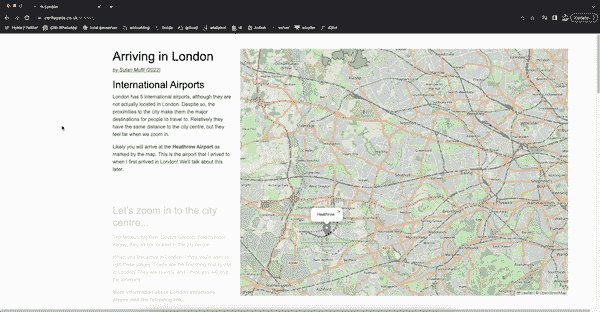
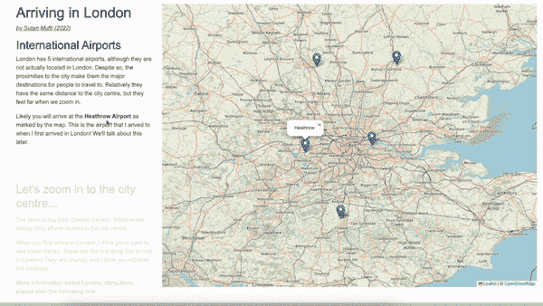
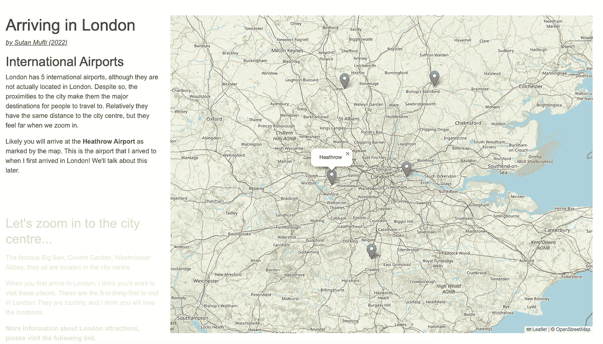
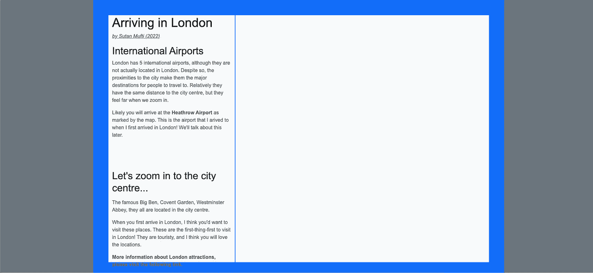

# 通过滚动交互式显示空间数据

> 原文：<https://towardsdatascience.com/presenting-spatial-data-interactively-by-scrolling-502df345dea6>



来源:作者，2022

## 通过交互式地图讲述故事和见解

# 关于这篇文章

这篇文章是关于我制作的一个故事地图:

*   [现场演示](https://ceritapeta.co.uk/london/)
*   [github 回购](https://github.com/sutanmufti/London-Arrival)

…这篇文章讲述了我是如何构建它的。



演示(来源:作者，2022)

# 介绍

制图员的产品是地图。我们使用 shapefiles(这是空间数据存储的遗产)、地理数据库、geojsons 和许多形式的空间数据，并使用 GIS 根据它们制作地图。然而，这些地图通常是 JPEGs、PNG 或 PDF 文档，不具有交互性。在大多数情况下，是的，这是可行的，但是我喜欢在不需要做太多工作的情况下讲述和被讲述故事。事半功倍，怎么才能被讲故事？

然后遇到了[库斯伯特·周](https://medium.com/u/bff07afa23c2?source=post_page-----502df345dea6--------------------------------)关于 D3.js 的文章，D3.js 是一个 javascript 库，用来操作 DOM(文档对象模型)中的元素和 svg。人们使用 D3.js 来呈现数据，其中 Chow 做了精彩的演示，扩展了 Jim Vallandingham 的文章。看他下面的文章。

[](/how-i-created-an-interactive-scrolling-visualisation-with-d3-js-and-how-you-can-too-e116372e2c73) [## 我如何用 D3.js 创建了一个交互式的滚动可视化，你也可以

### 通过交互式和可滚动的可视化，让您的数据故事栩栩如生，这一切都因出色的 D3…而成为可能

towardsdatascience.com](/how-i-created-an-interactive-scrolling-visualisation-with-d3-js-and-how-you-can-too-e116372e2c73) 

然后我想到:我们也可以用地图来制作这个！使用 javascript 可以实现滚动和交互显示数据的想法。这篇文章讲述了我是如何做到的。

您可以在此处找到现场演示:

 [## 在伦敦

### 伦敦有 5 个国际机场，尽管它们实际上不在伦敦。尽管如此，接近…

ceritapeta.co.uk](https://ceritapeta.co.uk/london/) 

该项目(作者，2022)

## 大量

所有数据和地图资源都是开源的(openstreetmap)。以下是我用过的堆栈

*   jquery 和 d3.js:文档操作
*   fleet . js:交互式网络地图

# 一般想法

我写的是空间数据科学，在接下来的文章中我写了一篇关于表示空间数据的文章。本文就是论证。

[](/spatial-data-science-javascript-python-60464cbe908d) [## 空间数据科学:Javascript 和 Python

### 从数据工程到全栈应用，你需要的语言。开始学习和策划学习…

towardsdatascience.com](/spatial-data-science-javascript-python-60464cbe908d) 

基本上它的工作原理是:

*   使用 Python 获取和分析空间数据。
*   用 HTML 来布局文档，用 CSS 来美化事物；呈现内容。
*   使用 Javacript 使事物互动。在这种情况下，当我们滚动时改变地图。

此外(不在本文/项目中)，我们可以做一些关于数据源的事情:

*   在 postgresql + postgis 数据库服务器中存储数据。
*   Apache Airflow 来编排/自动获取数据并填充数据库服务器。
*   使用 geoserver 作为后端地图服务器。

也许是为了将来的项目。

# 它是如何工作的

我就不赘述细节了，不然这篇文章会变得很长。我将解释的是开发人员…开发的高层次想法。

大部分代码来自 Jim 关于 javascript scroller 的文章。基于这段代码的演示是[这里有](http://vallandingham.me/scroll_demo/)。

[](https://vallandingham.me/scroller.html) [## 所以你想建立一个滚动器

### 成功的交互式可视化的一个重要组成部分是将用户导向他们正在看的东西。在…

vallandingham.me](https://vallandingham.me/scroller.html) 

但是在这篇文章中，我讨论的是我的演示。我将根据这些组件对其进行分解:

*   布局
*   节和滚动
*   数据存储

## 布局-修复地图

布局基于 [Bootstrap 5 css 模块](https://getbootstrap.com/docs/5.0/getting-started/introduction/)。这是一个很常见的快速美化 HTML 的模块。它提供了最基本的 UI 组件。

具体来说，我做了两列，如下图所示。灰色是主体的背景，蓝色是边距，白色/浅色是列的背景。



布局(来源:作者，2022)

```
<div class="container">
  <div class="row">
    <div class="col-4">
      the first column, text contents / stories
    </div>
    <div class="col-8">
      the second wider column where the map is going to live
    </div>
  </div>
</div>
```

我希望卷轴与故事/文本交互，而不是与地图交互。这意味着无论我们滚动多少，地图都需要固定。这就是 css 的用武之地。所有忽略滚动的东西都需要固定位置，所以我创建了`stay` css 类。

```
.stay {
    position: fixed;
    height: 100%;
    width: 100%
}
```

然后贴在地图会住的`div`里。

```
<div class="col-8">
      <!-- the second wider column where the map is going to live. -->
      <div class="stay" id="mapcontainer">
          <div id="map" ></div>
      </div>

</div>
```

这样，地图`div`就固定了。

## 地图和 Javascript

随着地图`div`的创建，我们现在可以导入`leaflet` javascript 库来制作我们的地图。`Leaflet`提供我需要的地图交互工具。这是一个绝妙的包装；如此简单却有效！

```
var map = L.map('map').setView([51.505, -0.09], 13);

L.tileLayer('https://tile.openstreetmap.org/{z}/{x}/{y}.png', {
    attribution: '&copy; <a href="https://www.openstreetmap.org/copyright">OpenStreetMap</a> contributors'
}).addTo(map);

L.marker([51.5, -0.09]).addTo(map)
    .bindPopup('A pretty CSS3 popup.<br> Easily customizable.')
    .openPopup();
```

# 节和滚动

就像 Chow 和 Jim 的结构一样，到达伦敦的页面也由 id 为`step`的部分组成。

```
<div class="col-4  full ">
  <section class="step ">
  my first section
  </section>
  <section class="step ">
  the second section 
  </section>
  <section class="step ">
  and so on
  </section>
  <section class="step ">
  ...
  </section>
</div> 
```

## 滚动互动

定义步骤后，文档需要跟踪用户的滚动活动。下面的代码在用户每次滚动时调用`trackPosition`函数。

```
d3.select(window)
    .on("scroll.scroller", trackPosition);
```

`trackPosition`如下:

```
 // sectionsArray are the div step (s) from the HTML that we previously defined
let activeSection;
let previousSection;
const trackPosition = ()=>{
    let pos = window.pageYOffset - 140;
    let sectionIndex = d3.bisect(sectionPositions, pos);
    sectionIndex = Math.min(sections.size() - 1, sectionIndex);
    activeIndex = sectionIndex

    if (sectionsArray[sectionIndex] !== activeSection){
        previousSection = activeSection
        activeSection = sectionsArray[sectionIndex] 

        d3.select(`#${activeSection}`)
            .transition()
            .style("opacity", "1");
        d3.select(`#${previousSection}`)
            .transition()
            .style('opacity', '0.2')
            ;

        positionMap(sectionIndex)
    } 
}
```

请注意`positionMap`功能！这个函数是地图改变的原因。

```
// positionMap: changes the map based on the active step

const positionMap = (sectionIndex) =>{
    if (sectionIndex === 0){
        map.flyTo([51.505404,-0.118658], 9,) // zoom in to coords
        airportLayer.addTo(map) // leaflet layer
        elizaebthLine_st.remove() // leaflet layer
        popupairport() // popup the map
        attractions.remove() // leaflet layer
    }
    if (sectionIndex === 1){

        map.flyTo([51.509687,-0.115464], 13,) // zoom in to coords

        attractions.addTo(map) // leaflet layer
        attractions.eachLayer((l)=>{l.openTooltip()}) // open the tooltips

    // add another if and manually code the interactivity. Read the leaflet documentation.

}
```

# 数据存储

在无模式数据结构中，基本上是一个包含 JSON 对象的数组，我们可以添加任意属性。我在数据结构文章中演示了这一点。

[](/spatial-data-science-data-structures-a00c484b8a00) [## 空间数据科学:数据结构

### 表达空间数据的指南

towardsdatascience.com](/spatial-data-science-data-structures-a00c484b8a00) 

我们可以这样定义一个最小的空间数据:

```
// minimum spatial data
const berlin = {
"city": "berlin", 
"country": "germany",
"location" : {
    "type" : "Point",
    "coordinates": [52.507650, 13.410298]
    }
}
```

但是我局限于 GeoJSON 空间数据规范，所以空间数据看起来像这样:

```
const attractions_geojson = {
    "type": "FeatureCollection",
    "features": [
      {
        // minimum spatial data but with geojson spec
        "type": "Feature",
        "properties": {
          "name": "big ben"
        },
        "geometry": {
          "coordinates": [
            -0.12466064329075266,
            51.50067738052945
          ],
          "type": "Point"
        }
      },
      {
        // minimum spatial data but with geojson spec
        "type": "Feature",
        "properties": {
          "name": "leicester square"
        },
        "geometry": {
          "coordinates": [
            -0.13047682089788282,
            51.51079955591317
          ],
          "type": "Point"
        }
      }
    ]
  }
```

在上面的代码中，包含我们的层的`attractions_geojson.features`由两层组成:大本钟和莱斯特广场。`geojson.features`是所有最小空间数据的列表。

当您在浏览器中加载[演示链接](https://ceritapeta.co.uk/london/)时，您可以在`variable.js`中查看空间数据。


# 结论

使用 Javascript 和 HTML，我们可以使我们的数据具有交互性。作为一名制图员，这意味着我可以使我的地图互动和响应！棘手的是将空间数据存储为 javascript 文件，而不是传统的 shapefile 和 geojson 对象。