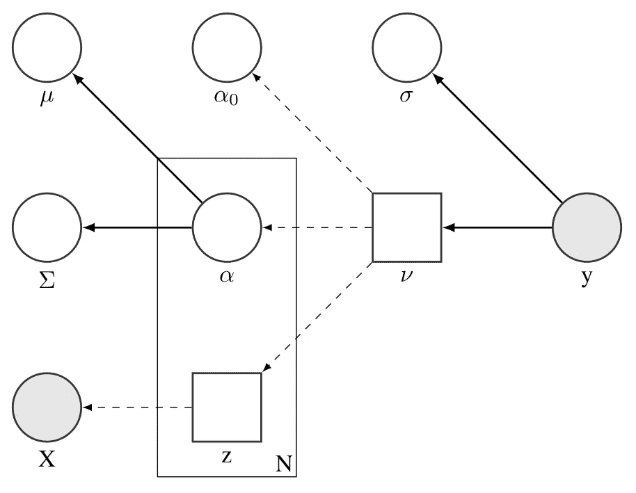
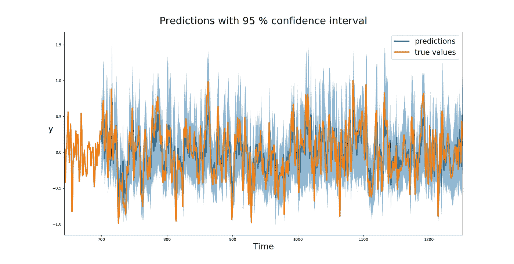

# 概率机器学习系列文章之三:具有相关噪声的权重不确定性

> 原文：<https://towardsdatascience.com/probabilistic-machine-learning-series-post-3-369cbf7ca8d3>

## 使用相关漏失量化神经网络预测的不确定性

来源:[https://www . pexels . com/photo/question-mark-on-chalk-board-356079/](https://www.pexels.com/photo/question-mark-on-chalk-board-356079/)

贝叶斯方法的主要缺点之一是它不可扩展。2015 年，Blundell & al。提出用丢失来量化神经网络中的不确定性。这种方法称为 Bayes by backprop，它使用重新参数化技巧来逼近后验概率的变分界限。在这篇文章中，我们将通过反向传播对贝叶斯方法进行一些调整。主要目标将是看看我们如何能够添加受约束的参数，而不向我们的优化问题添加约束(即，约束参数的可能值)。第一个修改是，我们将通过从正态多元分布而不是独立的正态分布中采样来使不同权重之间的丢失相关。这将说明最后一层中的权重可能是相关的。修改的第二个方面是，我们将只在神经网络的最后一层使用贝叶斯观点。这是为了检查我们是否可以通过添加尽可能少的参数来获得一个概率模型。

# 损失函数的起源

损失函数来自变分近似。重要的是要记住贝叶斯框架的目标是找到后验分布。有很多方法可以做到这一点。在过去的几年中引起注意的一个方法是变分法，它提供了一种以可伸缩的方式近似后验概率的方法。为了实现这一点，我们将寻找后验概率的问题转化为可以应用梯度下降(或类似技术)的连续优化问题。给定一组描述变分分布的参数，它试图找到最接近的解，而不是找到精确的后验概率。我们所说的最接近解是指使变分分布和后验分布之间的 Kullback-Leibler 散度最小的解。在我们的情况下，变分分布将是多元正态分布。

损失函数代表变分分布和后验分布之间的 Kullback-Leibler 散度。

损失函数可以通过根据变分分布生成权重样本来近似。它被分解成三个不同的项:变分项、似然项和先验项。

基于随机生成的样本估算的损失(漏失)。

将根据正态分布对似然性进行建模，其中均值由 LSTM 的最后一层的结果与向量 w 的标量积给出，方差由σ给出。我们可以将模型的参数分成两大类。第一个是确定性参数；LSTM 参数试图通过作为特征提取器来赋予我们的数据以意义。第二类是定义概率分布的，它们是μ向量、σ矩阵(变分分布)和σ参数。因此，我们从以μ和σ为参数的多元正态分布中生成α。产生的权重将与 LSTM 的最后一层相乘(标量积),以给出具有标准偏差σ的单变量正态分布的平均值ν，该正态分布对观察量的固有噪声进行建模。在图形表示中，虚线表示确定性变换，而实线表示随机变量的参数。

模型不同参数之间关系的图形表示。虚线表示确定性变换，而实线表示基于分布参数的随机采样结果。

# 如何得到协方差矩阵

协方差矩阵需要满足一些特定的限制。它必须是对称的，所有的元素都必须是正的。为了能够使用自动微分并满足这些约束，我们使用了两个转换。第一种是使用正定矩阵的 [Cholesky 分解](https://en.wikipedia.org/wiki/Cholesky_decomposition)来分解矩阵，这给出了对称矩阵。第二个转换是采用 [softplus 激活](https://en.wikipedia.org/wiki/Rectifier_(neural_networks)#Softplus)函数来确保所有的元素都是正的。因此，被训练的参数不是将被约束的协方差矩阵的元素，而是矩阵 L 的参数，其值可以在实轴上自由移动。由于矩阵乘积和 softplus 函数都是可微函数，我们可以构造一个计算图。

基于矩阵 L 的协方差矩阵适马的表示。L 的系数被训练。

# 培训阶段

第一个训练阶段是为任务找到好的 LSTM 砝码。如果权重给出了很好的预测精度，并且精度在权重的小扰动下是稳定的，我们将认为权重是好的。如果是第一阶段，损失函数将是任务的通常损失(这里是均方误差),这将给出最大似然估计。在给定数量的步骤之后，高斯噪声将被添加到权重，以确保所获得的权重是稳定的。添加的噪声相当于将在第二训练阶段使用的协方差矩阵的对角元素。在此阶段训练的参数是 LSTM 权重。第二个训练阶段是寻找后验概率贝叶斯参数的完整解。我们不仅要训练 LSTM 权重，还要训练协方差矩阵。在这两个阶段，都使用了早期停止。

# 预测和校准

在下图中，我们可以看到真实值(橙色)大多在置信区间内(蓝色阴影区域)。

与真实值(橙色)相比，具有 95 %置信区间(蓝色阴影)的预测值(蓝色)。

但愿这个论点没有说服力。因此，我们将着眼于概率预测的校准。通过校准，我们直观地表示 90 %的预测值应该低于针对 90%概率给出的逆累积分布函数。有许多方法可以测量校准，但我们暂时只看这一种。我们将通过绘制落在逆累积分布函数下的数据的比率作为参考概率 p 的函数来直观地表示校准，参考概率 p 将在 0 和 1 之间。正如我们将看到的，对于相同的训练参数，不同的随机种子有很大的差异。这种现象经常发生，因为我们陷入局部最小值，无法摆脱它们。最简单的策略是从新运行或现有运行重新启动。在第一种情况下，我们希望算法能在不同的初始条件下找到一个好的局部极小值。在后一种情况下，目标是通过将学习率重置为更高的值来避免局部最小值，因为它在之前的每次迭代中都有所下降。

模型训练不同重启的校准曲线(即不同的种子)。

# 末日之语

我们使用了对神经网络方法中[权重不确定性的简单修改，以了解如何在不丧失自动微分优势的情况下解除分布参数的约束。主要思想是使可训练参数在轴上自由移动，但是用可微分函数对它们进行变换，这将给出满足期望属性的新参数。](https://arxiv.org/pdf/1505.05424.pdf)

# 参考文献和推荐读物

[1] C .布伦德尔。Cornebise，K. Kavukcuoglu 和 D. Wierstra，[神经网络中的权重不确定性](https://arxiv.org/pdf/1505.05424.pdf) (2015) ICML

*除非另有说明，所有图片均为作者所有。