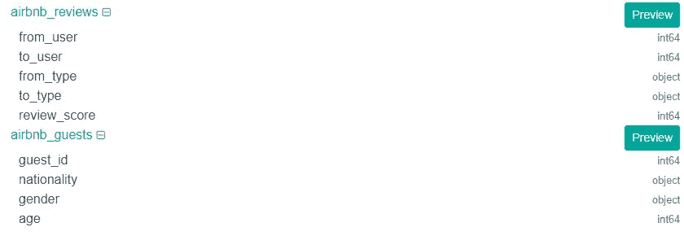
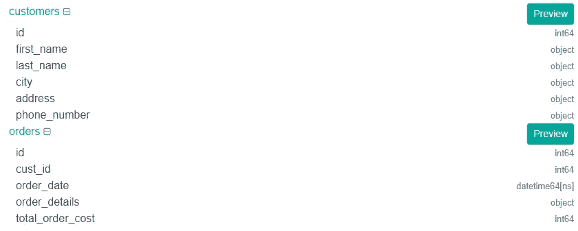

# 产品分析数据科学家面试问题

> 原文：<https://towardsdatascience.com/product-analytics-data-scientist-interview-questions-eab46ed01338>

## *产品分析面试问题是领先公司在数据科学家和数据分析师的技术面试中最常问的问题*


作者在 [Canva](https://canva.com/) 上创建的图片

大型[数据科学公司](https://www.stratascratch.com/blog/11-best-companies-to-work-for-as-a-data-scientist/?utm_source=blog&utm_medium=click&utm_campaign=medium)经常雇佣数据科学家和数据分析师在负责特定产品的团队中工作。这就是为什么在技术面试中问产品分析问题是一种常见的做法。本文主要关注涉及使用 Python 或 SQL 等编程语言基于数据集计算相关产品指标的问题。

候选人被要求检索或计算的产品指标是不同的，从简单的事件或交互量到更复杂的增长率或保留率。产品分析访谈问题通常需要按用户、用户组或时间范围处理日期、编写条件和汇总数据。

# 产品分析访谈问题#1:按平均会话时间划分的用户


截图来自 [StrataScratch](https://platform.stratascratch.com/coding/10352-users-by-avg-session-time?python=1&utm_source=blog&utm_medium=click&utm_campaign=medium)

问题链接:[https://platform . stratascratch . com/coding/10352-users-by-avg-session-time](https://platform.stratascratch.com/coding/10352-users-by-avg-session-time?python=1&utm_source=blog&utm_medium=click&utm_campaign=medium)

这是一个非常有趣的问题，在元数据科学面试中经常被问到。这个产品分析访谈问题的标题是“按平均会话时间划分的用户”，我们被要求计算每个用户的平均会话时间。据说会话被定义为页面加载和页面退出之间的时间差。为简单起见，我们可以假设用户每天只有一个会话，如果当天有多个相同的事件，则只考虑最近的 page_load 和最早的 page_exit。

这是一个中等水平的问题，因为虽然从事件中获取单个会话的持续时间相当简单，但要识别有效的会话并从时间差中获取平均值却比较困难。

## 理解数据

第一步总是要理解数据。在典型的面试中，你不会看到任何实际的数据，只会看到一个包含列名和数据类型的模式。在这种情况下，情况相当简单。我们只给了一个表，或者数据帧，因为我们是用 Python 写的，叫做 facebook_web_log。它有三列:用户 id、时间戳和动作。


截图来自 [StrataScratch](https://platform.stratascratch.com/coding/10352-users-by-avg-session-time?python=1&utm_source=blog&utm_medium=click&utm_campaign=medium)

根据问题中给出的解释，我们可以猜测“action”属性的两个示例是“page_load”和“page_exit”。但是不能排除这个字段不取任何其他值。也许我们还会跟踪用户在会话期间是向上还是向下滚动。那么“action”列中的其他值可能是“scroll_down”或“scroll _ up”——这种值我们不需要解决问题，但我们仍然需要预测它们可能在那里。

我们还可以看到时间戳属性是一个日期时间。这很重要，因为它决定了我们可以用什么函数来操作这些值。总而言之，我们可以推断出这个数据集中的每一行都代表了某个用户在某个时间点执行的一个操作。

## 制定方法

接下来，我们可以制定编写代码时将遵循的方法或几个一般步骤:

1.第一步可以是从数据集中只提取我们实际需要的这些行。特别是，我们感兴趣的是这些行中的动作是‘page _ load’或‘page _ exit’。我们这样做是因为我们预计数据集中可能会存储其他操作。

2.在下一步中，明智的做法是创建一个包含所有单独会话的表。这个表有 3 列:一列是 user_id，一列是 page_load 动作的时间戳，一列是 page_exit 动作的时间戳。我们可以通过合并一个用户的所有 page_load 时间戳和同一个用户的所有 page_exit 时间戳来实现。

合并时间戳的问题是，我们最终会得到一些不真实的会话。因为，如果一个用户有多个会话，并且我们在合并时考虑了他们的 page_load 和 page_exit 操作的所有可能的组合，我们将不可避免地得到一些 page_load 来自一个会话而 page_exit 来自另一个会话的行。

3.为了检测和消除这些情况，我们可以从添加一个条件开始，即 page_exit 应该总是在 page_load 之后发生。

这将涵盖一种情况，但是当 page_exit 发生在 page_load 之后，但仅仅是几天之后的情况呢？或者如果一个用户在一天内有几个 page_load 操作，而只有一个 page_exit 操作呢？这个问题实际上在这里给了我们一个提示，如果当天有多个相同的事件，我们应该只考虑最晚的 page_load 和最早的 page_exit。因此，在选择最新的 page_load 和最早的 page_exit 时间戳时聚合数据应该涵盖这两种情况。

但是我们应该用什么来汇总数据呢？如果我们只按 user_id 进行聚合，那么我们最终将为每个用户提供一个会话，而不一定是有效的会话。但是问题中还有一个提示可以帮助我们。它说一个用户每天只有一次会话。这意味着每个有效的会话都可以由一个 user_id-date 元组唯一地标识，因此我们可以按 user_id 和 date 聚集结果。

4.因此，作为第四步，让我们添加一个包含每个会话日期的列，我们可以从 page_load 时间戳中提取它，然后聚合数据并选择 latest page_load 和 earliest page_exit。

5.此时，我们将看到每个用户的有效会话，以及它们各自的 page_load 和 page_exit 时间戳。从这里开始，得到最终的解决方案是相当简单的。我们可以从计算两个时间戳之间的差异开始，这是会话的持续时间。

6.但是让我们记住，我们感兴趣的是每个用户的平均会话持续时间，每个用户仍然可以在不同的日子进行多个会话。为了得到解决方案，我们可以再次聚合数据，这次只使用 user_id，并获得属于每个用户的平均持续时间。

## 编写代码

现在，我们可以按照这些步骤，使用 Python 编写这个产品分析面试问题的实际解决方案。让我们从导入一些有用的库开始。Pandas 是流行的用于操作数据集的 Python 库，Numpy 提供了数学函数，我们特别需要它在最后一步计算会话持续时间的平均值。

```
import pandas as pd
import numpy as np
```

第一步是从数据集中提取 page_load 和 page_exit 操作。我们可以创建原始数据集的两个副本，每个动作一个。要获得 page_load 操作的时间戳列表，让我们使用 Pandas loc 属性。我们可以从原始数据集 facebook_web_log 开始，并对其应用 loc 属性。然后，让我们指定条件或应该返回哪些行。我们需要原始数据集的“action”列中的值等于“page_load”的这些行。一旦我们定义了输出哪些行，我们也可以决定返回哪些列。我们只需要 user_id 和时间戳，因为“action”对于数据集副本中的所有行都是相同的。

```
import pandas as pd
import numpy as np

*# Extract page_load and page_exit actions from the dataset*
loads = facebook_web_log.loc[facebook_web_log['action'] == 'page_load', ['user_id', 'timestamp']]
```

当您运行这段代码时，您可以看到只剩下 2 列。这些实际上是 action 列等于 page_load 的所有行。接下来，通过使用相同的 loc 属性，我们可以为 page_exit 操作获得一个类似的表，只需更改条件中的值。

```
exits = facebook_web_log.loc[facebook_web_log['action'] == 'page_exit', ['user_id', 'timestamp']]
```

您可以添加这一行代码，一旦运行它，您将看到原始数据集中的一组行，其中的操作等于“page_exit”。

下一步是识别每个用户可能的会话，正如已经提到的，我们可以通过合并只有 page_loads 和 page_exits 的两个表来实现。我们可以调用这个新的数据集会话，并使用 Pandas merge()函数。在这个函数中，我们首先指定哪两个数据帧应该合并在一起，在这个例子中，它将是 loads 和 exits。接下来，我们需要决定我们想要执行哪种合并。你可能记得在 SQL 中，我们有不同种类的连接:左连接，右连接，内连接等等。这里也一样，我们可以用左合并。最后，我们还需要指定要连接哪个或哪些列。这与 SQL 中的 ON 关键字相同，Pandas 中的参数也被调用。

```
import pandas as pd
import numpy as np

*# Extract page_load and page_exit actions from the dataset*
loads = facebook_web_log.loc[facebook_web_log['action'] == 'page_load', ['user_id', 'timestamp']]
exits = facebook_web_log.loc[facebook_web_log['action'] == 'page_exit', ['user_id', 'timestamp']]

*# Identify possible sessions of each user*
sessions = pd.merge(loads, exits, how='left', on='user_id')
```

运行这段代码时，您可以看到我们有一个 user_id，然后是 page_load 操作的时间戳和 page_exit 操作的时间戳。然而，这里有两个问题。首先，我们可以看到 user 2 有一个 page_load，但是没有与之匹配的 page_exit。这可能只是数据集中的一个错误，我们不知道，但我们仍然需要处理它。面试问题没有具体说明在这种情况下应该做什么，但是因为我们现在有 page_exit，所以不可能计算这样一个会话的持续时间，所以我建议我们跳过这个会话。为了避免这种情况，我们可以从左合并切换到内合并。后者将只返回两个时间戳都存在的行。在上面的代码中，将 how='left '改为 how='inner ',看看结果会如何变化。

第二个问题是，这些列名 timestamp_x 和 timestamp_y 很容易混淆。为了更清楚地说明哪个对应于 page_load，哪个对应于 page_exit 操作，我们可以在 merge 函数中再添加一个参数。它被称为后缀，允许用其他名称替换这些 x 和 y。这些名称的顺序必须与我们合并表的顺序一致，这一点很重要。在上面的代码中，添加一个新的参数 suffixes=['_load '，' _exit']，看看列名将如何变化。

现在很明显，我们正在处理用户会话。但是正如你所看到的，并不是所有这些会话都是真实的或可能的，因为我们合并了所有可能的 page_load 时间戳和所有可能的 page_exit 时间戳。这就是为什么我们有以下几个步骤来过滤有效的会话。

这里我们可以做的第一件事是确保 page_exit 发生在 page_load 之后。要在 Python 中添加条件，我们需要选择“sessions”表的一部分，其中“sessions”表的“timestamp_load”列中的值小于或早于“sessions”表的“timestamp_exit”列中的值。

```
import pandas as pd
import numpy as np

*# Extract page_load and page_exit actions from the dataset*
loads = facebook_web_log.loc[facebook_web_log['action'] == 'page_load', ['user_id', 'timestamp']]
exits = facebook_web_log.loc[facebook_web_log['action'] == 'page_exit', ['user_id', 'timestamp']]

*# Identify possible sessions of each user*
sessions = pd.merge(loads, exits, how='inner', on='user_id', suffixes=['_load', '_exit'])

*# Filter valid sessions:*
*## page_load before page_exit*
sessions = sessions[sessions['timestamp_load'] < sessions['timestamp_exit']]
```

现在，表中剩下的所有会话都有可能已经发生，但是我们仍然可以看到一些跨越几天的会话，或者同一个用户在一天内的几个会话，这显然是不正确的。要删除它们，让我们按照我们定义的步骤，从添加一个带有 page_load 时间戳日期的列开始。为此，我们可以定义一个新列，让我们称之为“date_load ”,它将几乎等于“timestamp_load”列中的值，但我们只想提取日期并跳过时间。我们可以使用 dt.date 函数。多亏了这个“dt”，我们可以将这个函数专门应用于“timestamp_load”列中的日期时间值。

```
sessions['date_load'] = sessions['timestamp_load'].dt.date
```

您可以添加这行代码来查看新列是如何添加到结果中的。完成这些后，我们现在可以使用每个 user_id-date_load 对来惟一地标识每个会话。因此，如果同一个用户有几个会话，并且日期相同，我们知道其中只有一个是有效的。而问题告诉我们，这将是最短的一个。为了选择这些会话，我们可以通过使用 Pandas groupby()函数来聚集数据，特别是通过每个会话的唯一标识符来分组，因此是通过 user_id-date_load 对——这样我们每个会话只剩下一行。然后，我们应该定义聚合函数，因为我们希望同时应用两个函数，所以我们将使用 Pandas agg()函数，并说我们希望在每一行中有最新或最大的时间戳 _load 和最早或最小的时间戳 _exit。我们还可以添加 Pandas reset_index()函数——在聚合时添加它是一个很好的做法，因为如果没有它，Pandas 会将 user_id 和 date_load 列视为索引，并且我们不会显示它们——您可以尝试从下面的代码中删除它，以查看区别。

```
import pandas as pd
import numpy as np

*# Extract page_load and page_exit actions from the dataset*
loads = facebook_web_log.loc[facebook_web_log['action'] == 'page_load', ['user_id', 'timestamp']]
exits = facebook_web_log.loc[facebook_web_log['action'] == 'page_exit', ['user_id', 'timestamp']]

*# Identify possible sessions of each user*
sessions = pd.merge(loads, exits, how='inner', on='user_id', suffixes=['_load', '_exit'])

*# Filter valid sessions:*
*## page_load before page_exit*
sessions = sessions[sessions['timestamp_load'] < sessions['timestamp_exit']]

*## Add a column with the date of a page_load timestamp*
sessions['date_load'] = sessions['timestamp_load'].dt.date

*## aggregate data and select latest page_load and earliest page_exit*
sessions = sessions.groupby(['user_id', 'date_load']).agg({'timestamp_load': 'max', 'timestamp_exit': 'min'}).reset_index()
```

现在，我们只剩下每个用户的有效会话，我们可以继续计算每个会话的持续时间。这相当简单，因为从 timestamp_exit 列中减去 timestamp_load 就足够了。让我们将结果存储在一个名为 duration 的新列中。

```
sessions['duration'] = sessions['timestamp_exit'] - sessions['timestamp_load']
```

您可以添加这行代码来查看新列是如何添加到结果中的。最后一步是计算每个用户的平均会话持续时间。因此，我们只想获得每个用户的两个持续时间，并返回它们的平均值。乍一看，我们应该能够按 user_id 列聚合数据，因为我们希望每个用户有一行，并取 duration 列的平均值。

```
result = sessions.groupby('user_id').mean()['duration']
```

但很遗憾，这是行不通的。那是因为我们只能对数字使用 mean()函数。但是即使 duration 列对我们来说看起来像一个数字列，对 Python 来说，它是一种叫做 time delta 的数据类型——它是一种特殊的类型，用于存储两个时间戳之间的差异。这种数据类型使我们能够使用一些特定于时间的函数，例如将持续时间转换为小时甚至天，但是对我们来说，这并不那么有用，因为取平均值并不那么简单。

解决这个问题的方法是使用 NumPy 库中的 mean()函数——它更高级，支持取时间增量的平均值。为了能够在 Pandas 中使用自定义聚合函数，我们可以再次使用 agg()函数。

```
result = sessions.groupby('user_id')['duration'].agg(np.mean())
```

然而，这还不行。这是因为，根据定义，NumPy 库中的 mean()函数必须将平均值作为参数。那么如何才能把每个用户的所有时长分别作为参数传递呢？我们可以使用熊猫λ关键字。通常，lambda 允许遍历所有行，同时对每一行分别应用一些函数。

在这种情况下，有点棘手，因为我们已经过了聚合步骤，但是在应用聚合函数之前。这意味着 lambda 函数将首先立即返回一个用户的所有持续时间，然后立即返回下一个用户的所有持续时间，依此类推。这就是为什么我们可以用它向 mean()函数传递正确的参数。mean()函数将知道一次从一个用户的所有持续时间中取平均值。不要忘记像上次一样的 reset_index()函数，这应该会产生预期的结果！

```
import pandas as pd
import numpy as np

*# Extract page_load and page_exit actions from the dataset*
loads = facebook_web_log.loc[facebook_web_log['action'] == 'page_load', ['user_id', 'timestamp']]
exits = facebook_web_log.loc[facebook_web_log['action'] == 'page_exit', ['user_id', 'timestamp']]

*# Identify possible sessions of each user*
sessions = pd.merge(loads, exits, how='inner', on='user_id', suffixes=['_load', '_exit'])

*# Filter valid sessions:*
*## page_load before page_exit*
sessions = sessions[sessions['timestamp_load'] < sessions['timestamp_exit']]

*## Add a column with the date of a page_load timestamp*
sessions['date_load'] = sessions['timestamp_load'].dt.date

*## aggregate data and select latest page_load and earliest page_exit*
sessions = sessions.groupby(['user_id', 'date_load']).agg({'timestamp_load': 'max', 'timestamp_exit': 'min'}).reset_index()

*# Calculate the duration of the session*
sessions['duration'] = sessions['timestamp_exit'] - sessions['timestamp_load']

*# Aggregate to get average duration by user*
result = sessions.groupby('user_id')['duration'].agg(lambda x: np.mean(x)).reset_index()
```

运行这段代码时，只有 2 行，每个用户一行，第二列实际上包含平均会话持续时间，取自该用户的所有会话。这是产品分析面试问题的答案。

# 产品分析面试问题#2:慷慨评论的性别


作者在 [Canva](https://canva.com/) 上创建的图像

这是一个在 Airbnb 的数据科学面试中被问到的简单问题。这与第一个问题类似，因为我们也被要求找出每个人的平均值。这一次，没有涉及日期，所以过程容易得多。


截图来自 [StrataScratch](https://platform.stratascratch.com/coding/10149-gender-with-generous-reviews?python=1&utm_source=blog&utm_medium=click&utm_campaign=medium)

问题链接:[https://platform . strata scratch . com/coding/10149-gender-with-慷慨-reviews](https://platform.stratascratch.com/coding/10149-gender-with-generous-reviews?python=1&utm_source=blog&utm_medium=click&utm_campaign=medium)

我们被要求写一个查询，以找出作为客人写评论时，哪种性别给出的平均评论分数更高。这里的提示是使用“from_type”列来标识客人评论。问题还指示我们输出性别和他们的平均复习分数。



截图来自 [StrataScratch](https://platform.stratascratch.com/coding/10149-gender-with-generous-reviews?python=1&utm_source=blog&utm_medium=click&utm_campaign=medium)

这个产品分析访谈问题可以通过以下一般步骤来解决:

1.  使用 pd.merge(dataframe1，dataframe2，on = common key)执行内部连接；
2.  使用[column_name]从 dataframe 中筛选特定的列，然后选择值等于“= =”guest 的行；
3.  使用。groupby(column_name) on gender 对指定列的数据帧进行分组，并使用 mean()获得每组的平均值；使用 to_frame('column_name ')将结果对象转换为 dataframe
4.  使用 max()和['column_name']选择平均分数最高的性别，以便只返回性别列。

# 产品分析面试问题#3:最低价格订单

下一个问题来自 Amazon，也涉及到按用户聚合数据集，这次使用另一个聚合函数，因为我们不再对平均值感兴趣，而是对最低数量感兴趣。


截图来自 [StrataScratch](https://platform.stratascratch.com/coding/9912-lowest-priced-orders?python=1&utm_source=blog&utm_medium=click&utm_campaign=medium)

问题链接:[https://platform . stratascratch . com/coding/9912-最低价-订单](https://platform.stratascratch.com/coding/9912-lowest-priced-orders?python=1&utm_source=blog&utm_medium=click&utm_campaign=medium)

我们被要求找出每个客户的最低订单成本，并输出客户 id 以及名字和最低订单价格。



截图来自 [StrataScratch](https://platform.stratascratch.com/coding/9912-lowest-priced-orders?python=1&utm_source=blog&utm_medium=click&utm_campaign=medium)

在这种情况下，只需要完成两个主要步骤:

1.  使用 pd.merge(dataframe1，dataframe2，on = common_table_keys)对订单和客户执行内部联接；
2.  使用。groupby(column_name)根据指定的列对数据帧进行分组，然后使用 min()获得每组的最小值。

# 产品分析面试问题 Messenger 上最活跃的用户


作者在 [Canva](https://canva.com/) 上创建的图像

这是一个更难的问题，Meta 在对数据科学家和数据分析师的采访中也问过这个问题。在这种情况下，汇总每个用户的数据和统计事件是不够的，还需要额外的步骤来查找前 10 个结果。


截图来自 [StrataScratch](https://platform.stratascratch.com/coding/10295-most-active-users-on-messenger?python=1&utm_source=blog&utm_medium=click&utm_campaign=medium)

问题链接:[https://platform . stratascratch . com/coding/10295-messenger 上最活跃的用户](https://platform.stratascratch.com/coding/10295-most-active-users-on-messenger?python=1&utm_source=blog&utm_medium=click&utm_campaign=medium)

我们被告知，Messenger 将用户之间的消息数量存储在一个名为“fb_messages”的表中。在该表中，“用户 1”是发送方，“用户 2”是接收方，“消息计数”是他们之间交换的消息数量。然后，我们被要求通过计算 Facebook Messenger 上最活跃的 10 个用户发送和接收的消息总数来找出他们。该解决方案应该输出用户名和他们发送或接收的消息总数。


截图来自 [StrataScratch](https://platform.stratascratch.com/coding/10295-most-active-users-on-messenger?python=1&utm_source=blog&utm_medium=click&utm_campaign=medium)

在这个产品分析访谈问题中，需要遵循的步骤如下:

1.  连接数据帧的两个片段；
2.  使用 group by 函数的所有用户的聚合邮件计数；
3.  按邮件总数对用户进行降序排序。

# 产品分析面试问题 5:用户增长率

这个产品分析问题来自 Salesforce，涉及用户增长率。解决这个问题更加困难，因为每个月的数据需要单独汇总，然后合并在一起计算比率。


截图来自 [StrataScratch](https://platform.stratascratch.com/coding/2052-user-growth-rate?utm_source=blog&utm_medium=click&utm_campaign=medium)

问题链接:[https://platform . stratascratch . com/coding/2052-user-growth-rate](https://platform.stratascratch.com/coding/2052-user-growth-rate?utm_source=blog&utm_medium=click&utm_campaign=medium)

我们被要求找出每个账户从 2020 年 12 月到 2021 年 1 月的活跃用户增长率。规定增长率定义为 2021 年 1 月的用户数除以 2020 年 12 月的用户数。我们应该输出 account_id 和增长率。


截图来自 [StrataScratch](https://platform.stratascratch.com/coding/2052-user-growth-rate?utm_source=blog&utm_medium=click&utm_campaign=medium)

如上所述，这个问题可以通过以下两个主要步骤来解决，然后将输出调整为问题所需的格式:

1.  计算 2021 年 1 月和 2020 年 12 月的不同用户总数。按 account_id 对数据进行分组；
2.  除以用户总数得到增长率；
3.  输出 account_id 和计算的增长率。

# 结论

在本文中，我们详细解释了 Meta 的一个产品分析面试问题的解决方案，随后是 4 个不同难度的其他类似问题的示例。这应该让你对在[数据科学面试](https://www.stratascratch.com/blog/data-science-interview-guide-questions-from-80-different-companies/?utm_source=blog&utm_medium=click&utm_campaign=medium)中提出的产品分析面试问题的类型有所了解，并了解如何处理和解决此类问题。

请随意浏览 StrataScratch 平台上的其他产品分析面试问题。使用“方法提示”功能来显示解决问题的一般步骤，并与其他用户讨论您的代码，以获得更多的见解和反馈。练习使用真题后，你应该准备好在面试时面对产品分析问题！

【https://www.stratascratch.com】最初发表于<https://www.stratascratch.com/blog/product-analytics-data-scientist-interview-questions/?utm_source=blog&utm_medium=click&utm_campaign=medium>**。**