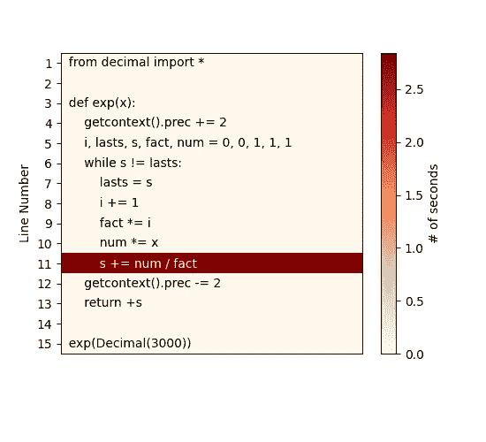

# 剖析和分析 Python 程序的性能

> 原文：<https://towardsdatascience.com/profiling-and-analyzing-performance-of-python-programs-3bf3b41acd16>

## 快速找到 Python 程序中的所有瓶颈并修复它们的工具和技术

由 [Unsplash](https://unsplash.com/?utm_source=unsplash&utm_medium=referral&utm_content=creditCopyText) 上的 [Alexas_Fotos](https://unsplash.com/@alexas_fotos?utm_source=unsplash&utm_medium=referral&utm_content=creditCopyText) 拍摄的照片

分析对于任何代码和性能优化都是不可或缺的。如果不知道在哪里应用，您可能已经拥有的任何性能优化经验和技能都不会非常有用。因此，找到应用程序中的瓶颈可以帮助您快速解决性能问题，而不需要花费太多精力。

在本文中，我们将探讨一些工具和技术，它们可以帮助我们缩小关注范围，找到 CPU 和内存消耗的瓶颈，以及如何在即使目标明确的代码更改也无济于事的情况下，实现简单(几乎不费力气)的性能问题解决方案。

# 识别瓶颈

性能优化的时候偷懒是好事。我们不需要试图找出代码库的哪一部分使应用程序变慢，我们可以使用分析工具来找到需要注意或进一步挖掘的地方。

Python 开发人员最常用的工具是`cProfile`。它是一个内置模块，可以测量代码中每个函数的执行时间。

让我们考虑下面这个(缓慢地)计算`e`的`X`次方的函数:

现在，让我们针对上面缓慢的代码运行`cProfile`:

在这里，我们使用`-s cumulative`按照每个函数的累积时间对输出进行排序，这样更容易找到输出中有问题的代码区域。我们可以看到，在单次调用期间，几乎所有的时间(~2.764 秒)都花在了`exp`函数上。

这种剖析可能是有用的，但不幸的是可能并不总是足够的。`cProfile`只给出关于函数调用的信息，而不是关于单个代码行的信息——如果你在不同的地方调用某个特定的函数，比如`append`,那么它将在`cProfile`输出中全部聚集成一行。我们上面使用的脚本也是一样——它包含一个只被调用一次的函数，所以没有什么需要`cProfile`报告的。

有时，我们没有能力在本地分析这些麻烦的代码，或者当生产环境中出现性能问题时，我们可能需要即时分析。在这些情况下，我们可以利用`py-spy`,它是一个分析器，可以检查已经运行的程序，例如生产环境或任何远程系统中的应用程序:

在上面的代码片段中，我们首先安装`py-spy`，然后在后台运行我们长期运行的 Python 程序。这将自动显示 PID 号，但是如果我们不知道，那么我们可以使用`ps`命令来查找。最后，我们在 PID 中传递的`top`模式下运行`py-spy`。这将产生终端视图，模拟 Linux `top`实用程序的自动更新输出，类似于下面的截图。

py-间谍上衣

这实际上并没有给我们提供太多的信息，因为这个脚本只有一个长期运行的函数，但是在真实的场景中，您很可能会看到许多函数共享 CPU 时间，这可能有助于了解程序正在发生的性能问题。

# 深入挖掘

上面的分析器应该可以帮助您找到导致性能问题的函数，但是如果这还不足以缩小关注范围，让您知道应该修复什么，那么我们可以转向在更细粒度级别上运行的分析器。

第一个是`line_profiler`,顾名思义，它可以用来深入了解每一行代码所花费的时间:

`line_profiler`库与`kernprof` CLI(以 Robert Kern 命名)一起发布，用于有效地分析测试运行的结果。通过对我们的代码运行这个实用程序，我们产生一个带有代码分析的`.lprof`文件以及上面的输出(当使用`-v`时)。这个输出清楚地显示了我们在函数中花费时间最多的地方，这对于发现和修复性能问题非常有帮助。在输出中，您还会注意到`@profile`装饰器被添加到了`exp`函数中——这是必要的，以便`line_profiler`知道我们想要分析文件中的哪个函数。

即使在逐行运行分析时，也可能不清楚性能问题的罪魁祸首是什么。这样的例子可以是由多个表达式组成的`while`或`if`条件。在这种情况下，将特定行重写为多行以获得更全面的分析结果是有意义的。

如果你真的是一个懒惰的开发者(像我一样)，并且阅读 CLI 文本输出太难了，那么另一个选择是使用`pyheat`。这是一个基于`pprofile`的分析器——另一个受`line_profiler`启发的逐行分析器——它生成一个占用最多时间的代码行/区域的热图:

pyheat 热图

考虑到我们使用的示例代码的简单性，前面的`kernprof`的 CLI 输出已经很清楚了，但是上面的热图使得函数中的瓶颈更加明显。

到目前为止，我们已经讨论了 CPU 概要，但是 CPU 的使用可能并不总是我们所关心的。RAM 很便宜，所以我们通常不会考虑它的用途，至少在用完之前不会。

即使您没有耗尽 RAM，分析您的应用程序的内存使用情况仍然是有意义的，这样可以发现您是否可以优化代码以节省内存，或者您是否可以添加更多的内存来提高代码的性能。为了分析内存使用情况，我们可以使用名为`memory_profiler`的工具，它模拟了前面显示的`line_profiler`的行为:

对于这个测试，我们选择了一段稍微不同的代码。`memory_intensive`函数创建和删除大型 Python 列表，以清楚地展示`memory_profiler`如何有助于分析内存使用。与`kernprof`分析一样，这里我们也必须添加`@profile`在文本下运行，以便`memory_profiler`识别我们想要分析的代码部分。

这表明，仅仅为了一个简单的`None`值列表，就分配了 100 多 MB。但是请记住，这个输出并没有显示内存的真实使用情况，而是显示了每行上的函数调用分配了多少内存。在这种情况下，这意味着列表变量实际上并没有存储那么多内存，只是 Python `list`可能会过度分配内存来适应变量的预期增长。

正如我们从上面看到的，Python 列表经常会消耗数百兆甚至数千兆字节的内存，一个快速的优化方法是切换到普通的`array`对象，这样可以更有效地存储原始数据类型，比如`int`或`float`。此外，您还可以通过使用`typecode`参数选择较低精度类型来限制内存使用，使用`help(array)`查看有效选项及其大小的表格。

如果这些更具体、更细粒度的工具还不足以找到代码中的瓶颈，那么您可以尝试反汇编它，看看 Python 解释器使用的实际字节码。即使反汇编不能帮助您解决手头的问题，它仍然有助于您更好地了解和理解每次调用某个特定函数时 Python 在后台执行了哪些操作。记住这些事实可能有助于您将来编写更高性能的代码。

通过将函数/代码/模块传递给`dis.dis(...)`，可以使用内置的`dis`模块生成代码反汇编。这将生成并打印该函数执行的字节码指令列表。

在整篇文章中，我们一直在使用非常慢的`e`到`X`的幂的实现，所以我们在上面定义了快速实现的平凡函数，这样我们就可以比较它们的反汇编。试图把它们都拆开，会产生完全不同的输出，这就更加明显地说明了为什么一个要比另一个慢得多。

最快的一个:

旧的，缓慢的版本:

为了更好地理解上面的输出中实际发生了什么，我推荐阅读 [this StackOverflow answer](https://stackoverflow.com/a/47529318) ，它解释了输出中的所有列。

# 解决方案

在某种程度上，对你的代码和算法做额外的调整将开始提供递减的回报。此时，将注意力转向外部工具来提供一些额外的性能提升是一个好主意。

提高代码速度的一个可靠方法是将其编译成 c 语言，这可以使用各种工具来完成，例如 PyPy 或 Cython。前者是一个 JIT(实时)编译器，可以用来替代 CPython。它可以不费吹灰之力提供显著的性能提升，让您轻松、快速地赢得胜利。您需要做的就是下载归档文件，解压并运行您的代码:

为了向您证明我们不费吹灰之力就能获得立竿见影的性能提升，让我们用 CPython 和 PyPy 快速检查一下脚本的运行时间:

除了上面提到的好处，PyPy 还不需要对代码做任何修改，并且支持所有内置模块和函数。

这听起来很神奇，但是使用 PyPy 也有一些利弊。它支持需要 C 绑定的项目，比如`numpy`，但是这会产生很大的开销，使得库明显变慢，实际上抵消了任何其他的性能提升。在使用外部库或与数据库交互的情况下，它也不能解决性能问题。同样，你也不能指望 I/O 相关的程序有很大的性能提升。

如果 PyPy 没有成功，那么您可以尝试使用 cy thon——一种使用类似 C 的类型注释(*而不是* Python 类型提示)来创建编译后的 Python 扩展模块的编译器。Cython 还使用 AOT(提前)编译，这可以通过避免应用程序*冷启动*来带来更大的性能增益。然而，使用它需要您重写代码以使用 Cython 语法，这反过来增加了代码的复杂性。

如果你不介意切换到 Python 稍微不同的语法，那么你可能也想看看[prometeo](https://github.com/zanellia/prometeo)——一种基于 Python 的嵌入式领域特定语言，专门针对科学计算。Prometeo 程序可转换为纯 C 代码，其性能可与手写 C 代码相媲美。

如果上述解决方案都不能满足性能要求，那么您可能需要用 C 或 Fortran 编写优化的代码，并使用外部函数接口(FFI)从 Python 中调用代码。可以帮助你的库的例子是 C 代码的`ctypes`或`cffi`和 Fortran 的`f2py`。

# 结束语

优化的第一条规则是*不做*。如果你真的必须这么做，那么就在适当的地方进行优化。使用上面的分析工具来寻找瓶颈，这样你就不会浪费时间去优化一些无关紧要的代码。为您试图优化的代码创建一个*可重复的*基准也是有用的，这样您就可以测量实际的改进。

本文将帮助您找到性能问题的根源。然而，解决这个问题是完全不同的话题，在我以前的文章[让 Python 程序快得惊人](/making-python-programs-blazingly-fast-c1cd79bd1b32)中可以找到一些让你的 Python 代码明显更快的简单方法。

*本文最初发布于*[*martinheinz . dev*](https://martinheinz.dev/blog/64?utm_source=medium&utm_medium=referral&utm_campaign=blog_post_64)

     