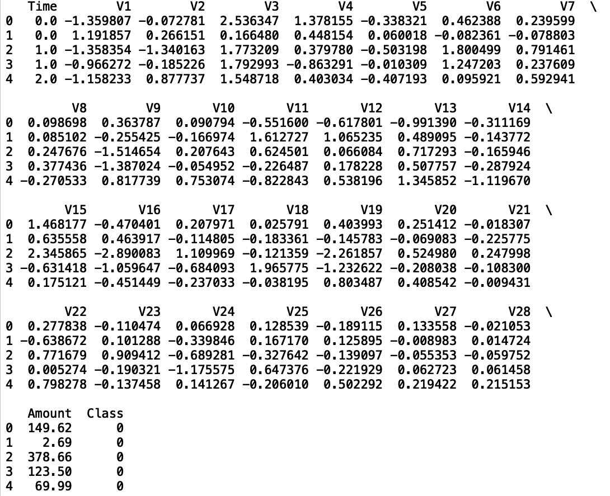

# 用 Python 描述机器学习算法

> 原文：<https://towardsdatascience.com/profiling-machine-learning-algorithms-in-python-7d12e0d740f6>

## 用于分析机器学习任务的有用工具


图片由 [cottonbro](https://www.pexels.com/photo/a-woman-typing-on-keyboard-5473337/) 在[像素](https://www.pexels.com/photo/a-woman-typing-on-keyboard-5473337/)上拍摄

概要分析是一项软件工程任务，其中软件瓶颈是通过编程来分析的。这个过程包括分析内存使用情况、函数调用的数量以及这些调用的运行时间。这种分析很重要，因为它提供了一种严格的方法来检测软件程序中可能很慢或资源效率低的部分，最终允许优化软件程序。

剖析在几乎每种类型的软件程序中都有用例，包括那些用于数据科学和机器学习任务的程序。这包括提取、转换和加载(ETL)以及机器学习模型开发。您可以使用 Python 中的 Pandas 库对 ETL 进行分析，包括分析 Pandas 操作，如读入数据、合并数据帧、执行 groupby 操作、类型转换和缺失值插补。

识别机器学习软件中的瓶颈是我们作为数据科学家工作的重要部分。例如，考虑一个 Python 脚本，它读入数据并对数据执行若干操作，以进行模型训练和预测。假设机器学习管道中的步骤是读入数据、执行分组、拆分数据以进行训练和测试、拟合三种类型的机器模型、对测试数据的每种模型类型进行预测以及评估模型性能。对于第一个部署的版本，运行时间可能是几分钟。

然而，在数据刷新之后，想象一下脚本的运行时间增加到几个小时。我们如何知道 ML 管道中的哪一步导致了问题？软件概要分析允许我们检测哪部分代码是负责任的，这样我们就可以修复它。

另一个例子与记忆有关。考虑已部署的机器学习流水线的第一个版本的存储器使用。该脚本可能每月运行一小时，并使用 100 GB 的内存。未来，在更大的数据集上训练的模型的更新版本，可能每个月运行五个小时，需要 500 GB 的内存。随着数据集大小的增加，预计资源使用量也会增加。检测这样的增加可能有助于数据科学家和机器学习工程师决定他们是否希望以某种方式优化代码的内存使用。优化有助于防止公司在不必要的内存资源上浪费金钱。

Python 在运行时和内存方面为分析软件提供了有用的工具。其中最基本和最广泛使用的是 timeit 方法，它提供了一种简单的方法来测量软件程序的执行时间。Python memory_profile 模块允许您测量 Python 脚本中代码行的内存使用情况。您可以用几行代码轻松实现这两种方法。

我们将使用[信用卡欺诈数据集](https://www.kaggle.com/datasets/mlg-ulb/creditcardfraud)并建立一个预测交易是否欺诈的机器学习模型。我们将构建一个简单的机器学习管道，并使用 Python 分析工具来测量运行时和内存使用情况。这些数据拥有[开放数据库许可证](https://opendatacommons.org/licenses/dbcl/1-0/)，可以自由共享、修改和使用。

**准备数据**

首先，让我们导入 Pandas 库并将我们的数据读入 Pandas 数据框:

```
df = pd.read_csv("creditcard.csv")
```

接下来，让我们使用 Pandas 方法 set_option()放宽列和行的显示限制:

```
pd.set_option('display.max_columns', None)pd.set_option('display.max_rows', None)
```

接下来，让我们使用 head()方法显示前五行数据:

```
print(df.head())
```



作者图片

接下来，为了了解这个数据集有多大，我们可以使用 len 方法来查看有多少行:

```
print("Number of rows: ", len(df))
```


作者图片

我们可以做类似的事情来计算列数。我们可以评估 Pandas 数据框对象的 columns 属性，并使用 len()方法计算列数:

```
print("Number of columns: ", len(df.columns))
```


作者图片

我们可以看到这个数据集比较大:284，807 行 31 列。此外，它占用 150 MB 的空间。为了展示 Python 中概要分析的好处，我们将从这个数据的一个小的子样本开始，在这个子样本上我们将执行 ETL 并训练一个分类模型。

让我们从生成一个小的子样本数据集开始。让我们从我们的数据中随机抽取 10，000 条记录。我们还将为 random_state 传递一个值，这将保证我们每次运行脚本时都选择相同的记录集。我们可以在 Pandas 数据框上使用 sample()方法来实现这一点:

```
df = df.sample(10000, random_state=42)
```

接下来，我们可以将数据的子样本写入一个新的 csv 文件:

```
df.to_csv("creditcard_subsample10000.csv", index=False)
```

**定义我们的 ML 管道**

现在，我们可以开始构建数据准备和模型训练的逻辑了。让我们定义一个方法，读入我们的 csv 文件，将它存储在数据帧中并返回它:

```
def read_data(filename):
    df = pd.read_csv(filename)
    return df
```

接下来，让我们定义一个选择数据中列的子集的函数。该函数将数据框和列列表作为输入，并返回包含所选列的新数据框:

```
def data_prep(dataframe, columns):
    df_select = dataframe[columns]
    return df_select
```

接下来，让我们定义一个方法，该方法本身定义模型输入和输出，并返回这些值:

```
def feature_engineering(dataframe, inputs, output):
    X = dataframe[inputs]
    y = dataframe[output]
    return X, y
```

然后，我们可以定义一种方法，用于为训练和测试拆分数据。首先，在脚本的顶部，让我们从 Scikit-learn 中的 model_selection 模块导入 train_test_split 方法:

```
from sklearn.model_selection import train_test_split
```

现在，我们可以定义拆分数据的方法:

```
def split_data(X, y):
    X_train, X_test, y_train, y_test = train_test_split(X, y, random_state=42, test_size = 0.33)
    return X_train, X_test, y_train, y_test
```

接下来，我们可以定义一种方法，使我们选择的模型适合我们的训练数据。让我们从一个简单的逻辑回归模型开始。我们可以从 Scikit-learn 中的线性模型模块导入逻辑回归类:

```
from sklearn.linear_models import logistic_regression
```

然后，我们将定义一个方法，该方法接受我们的训练数据和一个指定模型类型的输入。稍后我们将用于定义和训练更复杂模型的模型类型参数:

```
def model_training(X_train, y_train, model_type):
    if model_type == 'Logistic Regression':
        model = LogisticRegression()
        model.fit(X_train, y_train)
    elif model_type == 'CatBoost':
        model = CatBoostClassifier()
        model.fit(X_train, y_train)        
    return model
```

接下来，我们可以定义一种方法，将我们训练好的模型和测试数据作为输入，并返回预测:

```
def predict(model, X_test):
    y_pred = model.predict(X_test)
    return y_pred
```

最后，让我们定义一个评估我们预测的方法。我们将使用平均精度，这对于不平衡分类问题是一个有用的性能指标。不平衡分类问题是指其中一个目标的实例明显少于其他目标。在这种情况下，大多数交易数据对应于合法交易，而一小部分交易是欺诈性的:

```
def evaluate(y_pred, y_test):
    precision = average_precision_score(y_test, y_pred)
    print("Precision: ", precision)
```

现在我们已经为简单的 ML 管道准备好了所有的逻辑。让我们对数据的小子样执行这个逻辑。首先，让我们定义一个用于执行代码的主函数。在这个主函数中，我们将读入二次抽样数据:

```
def main(): data = read_data('creditcard_subsample10000.csv')
```

接下来，使用数据准备方法选择我们的色谱柱。让我们选择 V1、V2、V3、金额和等级:

```
def main(): … # preceding code left out for clarity columns = ['V1', 'V2', 'V3', 'Amount', 'Class'] df_select = data_prep(data, columns)
```

然后让我们定义输入和输出。我们将使用 V1、V2、V3 和金额作为输入；该类将是输出:

```
def main(): … # preceding code left out for clarity inputs = ['V1', 'V2', 'V3'] output = 'Class' X, y = feature_engineering(df_select, inputs, output)
```

我们将为训练和测试拆分数据:

```
def main(): … # preceding code left out for clarity X_train, X_test, y_train, y_test = split_data(X, y)
```

符合我们的数据:

```
def main(): … # preceding code left out for clarity model_type = ‘Logistic Regression’ model = model_training(X_train, y_train, model_type)
```

进行预测:

```
def main(): … # preceding code left out for clarity y_pred = predict(model, X_test)
```

最后，评估模型预测:

```
def main(): … # preceding code left out for clarity evaluate(y_pred, y_test)
```

然后，我们可以使用以下逻辑执行 main 函数:

```
if __name__ == “__main__”: main()
```

我们得到以下输出:


作者图片

现在，我们可以使用一些分析工具来监控内存使用和运行时。

让我们从监控运行时开始。让我们从 python 中的 timeit 模块导入 default_timer:

```
from timeit import default_timer as timer
```

**剖析运行时**

接下来，让我们先看看将数据读入 Pandas 数据帧需要多长时间。我们定义开始和结束时间变量，并打印差值，以查看已经过去的时间:

```
def main(): #read in data start = timer() data = read_data(‘creditcard_subsample10000.csv’) end = timer() print("Reading in data takes: ", end — start) … # proceeding code left out for clarity
```

如果我们运行我们的脚本，我们看到读取数据需要 0.06 秒:


作者图片

让我们对 ML 管道中的每一步做同样的事情。我们将计算每一步的运行时间，并将结果存储在一个字典中:

```
def main():
    runtime_metrics = dict()
    #read in data
    start = timer()
    data = read_data('creditcard.csv')
    end = timer()
    read_time = end - start
    runtime_metrics['read_time'] = read_time

    #slect relevant columns
    start = timer()
    columns = ['V1', 'V2', 'V3', 'Amount', 'Class']
    df_select = data_prep(data, columns)
    end = timer()
    select_time = end - start
    runtime_metrics['select_time'] = select_time

    #define input and output
    start = timer()
    inputs = ['V1', 'V2', 'V3']
    output = 'Class'
    X, y = feature_engineering(df_select, inputs, output)
    end = timer()
    data_prep_time = end - start
    runtime_metrics['data_prep_time'] = data_prep_time

    #split data for training and testing
    start = timer()
    X_train, X_test, y_train, y_test = split_data(X, y)
    end = timer()
    split_time = end - start
    runtime_metrics['split_time'] = split_time

    #fit model
    start = timer()
    model_type = 'CatBoost'
    model = model_training(X_train, y_train, model_type)
    end = timer()
    fit_time = end - start
    runtime_metrics['fit_time'] = fit_time

    #make predictions
    start = timer()
    y_pred = predict(model, X_test)
    end = timer()
    pred_time = end - start
    runtime_metrics['pred_time'] = pred_time

    #evaluate model predictions
    start = timer()
    evaluate(y_pred, y_test)
    end = timer()
    pred_time = end - start
    runtime_metrics['pred_time'] = pred_time

    print(runtime_metrics)
```

执行后，我们得到以下输出:


作者图片

我们看到读入数据和拟合数据是最耗时的操作。让我们用大数据集重新运行一遍。在 main 函数的顶部，我们将文件名改为:

```
data = read_data('creditcard.csv')
```

现在，让我们返回我们的脚本:


作者图片

我们看到，当我们使用完整数据集时，将数据读入数据帧需要 1.6 秒，相比之下，较小数据集需要 0.07 秒。识别导致运行时间增加的数据读入步骤对于资源管理非常重要。了解这样的瓶颈来源可以防止公司浪费计算时间等资源。

接下来，让我们修改模型训练方法，使 CatBoost 成为模型选项:

```
from catboost import CatBoostClassifierdef model_training(X_train, y_train, model_type): if model_type == ‘Logistic Regression’: model = LogisticRegression()        model.fit(X_train, y_train) elif model_type == ‘CatBoost’: model = CatBoostClassifier() model.fit(X_train, y_train) return model
```

让我们重新运行我们的脚本，但是现在指定一个 CatBoost 模型:

```
def main(): … #fit model start = timer() model_type = 'CatBoost' model = model_training(X_train, y_train, model_type) end = timer() fit_time = end — start runtime_metrics[‘fit_time’] = fit_time
```

我们看到以下结果:


作者图片

我们看到，通过使用 CatBoost 模型而不是逻辑回归，我们将运行时间从大约 2 秒增加到大约 22 秒，这在运行时间上增加了 10 倍以上，因为我们更改了一行代码。想象一下，如果运行时间的增加发生在原本需要 10 个小时的脚本上:仅仅通过切换模型类型，运行时间就会增加到超过 100 个小时。

**分析内存使用情况**

另一个需要跟踪的重要资源是内存。我们可以使用 memory_usage 模块在代码中逐行监控内存使用情况。首先，让我们使用 pip 在终端中安装 memory_usage 模块:

```
pip install memory_profiler
```

然后，我们可以简单地在每个函数定义前添加@profiler。例如:

```
@profile
def read_data(filename):
    df = pd.read_csv(filename)
    return df@profile
def data_prep(dataframe, columns):
    df_select = dataframe[columns]
    return df_select
```

诸如此类。

现在，让我们使用逻辑回归模型类型运行我们的脚本。让我们看看我们拟合模型的步骤。我们看到，用于拟合我们的逻辑回归模型的内存使用量约为 4.4 MB(第 61 行):


作者图片

现在，让我们为 CatBoost 重新运行这个:


作者图片

我们看到拟合逻辑回归模型的内存使用量是 13.3 MB(第 64 行)。这相当于内存使用量增加了三倍。对于我们这个简单的例子，这并不是什么大问题，但是如果一家公司部署了一个新版本的产品，并且它从使用 100 GB 的内存增加到 300 GB，这在资源成本方面可能是很大的。此外，拥有这样的工具可以指出哪里出现了内存使用的增加是非常有用的。

这篇文章中使用的代码可以在 [GitHub](https://github.com/spierre91/builtiin/blob/main/python_profiling_tutorial.py) 上获得。

**结论**

监控资源使用是软件、数据和机器学习工程的重要组成部分。不管应用程序是什么，理解脚本中的运行时依赖性在几乎所有依赖软件开发和维护的行业中都是非常重要的。在新部署的机器学习模型的情况下，运行时间的增加会对业务产生负面影响。生产运行时间的显著增加会导致提供实时机器学习预测的应用程序的用户体验降低。

例如，如果 UX 要求用户不应该为预测结果等待超过几秒钟，而这突然增加到几分钟，这可能会导致客户沮丧，他们最终可能会寻找更好/更快的工具。

了解内存使用情况也很重要，因为可能会出现不必要过度使用内存的情况。这种使用可以转化为在不必要的内存资源上浪费数千美元。考虑我们将逻辑回归模型转换为 CatBoost 模型的例子。导致内存使用增加的主要原因是 CatBoost 包的默认参数。这些默认参数可能会导致包执行不必要的计算。

通过理解这种动态，研究人员可以修改 CatBoost 类的参数。如果做得好，研究人员可以保持模型的准确性，同时减少拟合模型所需的内存。对于构建生产就绪软件的工程师和数据科学家来说，使用这些分析工具快速识别内存和运行时瓶颈是一项基本技能。

如果你有兴趣学习 python 编程的基础知识、Pandas 的数据操作以及 python 中的机器学习，请查看[*Python for Data Science and Machine Learning:Python 编程、Pandas 和 sci kit-初学者学习教程*](https://www.amazon.com/dp/B08N38XW2Q/ref=sr_1_1?dchild=1&keywords=sadrach+python&qid=1604966500&s=books&sr=1-1) *。我希望你觉得这篇文章有用/有趣。*

***本帖原载于*** [***内置博客***](https://builtin.com/data-science/) ***。原片可以在这里找到***<https://builtin.com/data-science/python-profiling-tools-tutorial>****。****